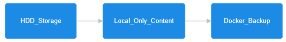
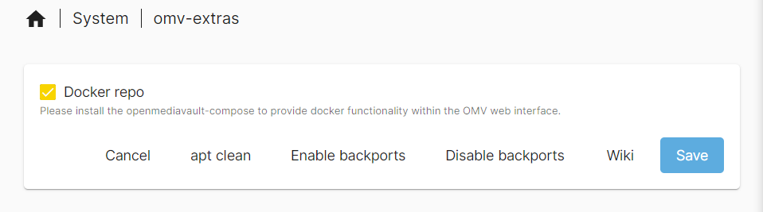
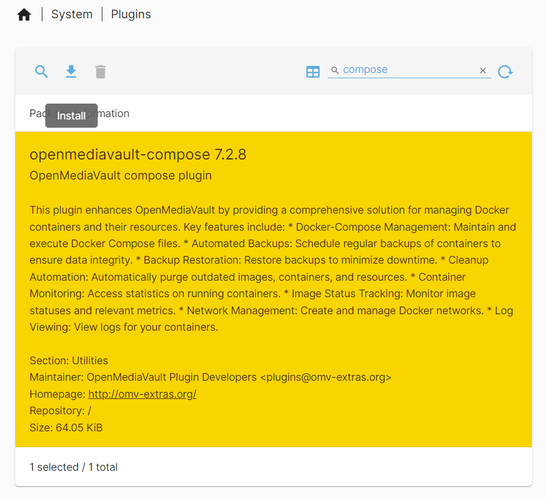
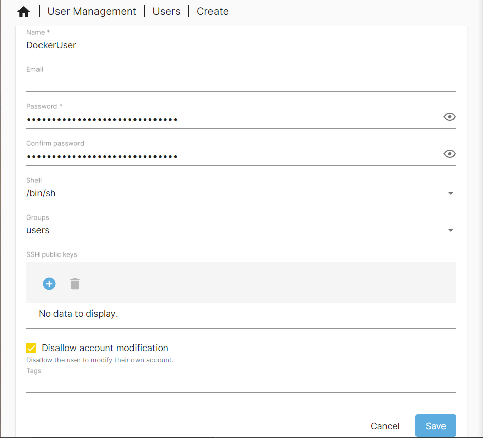
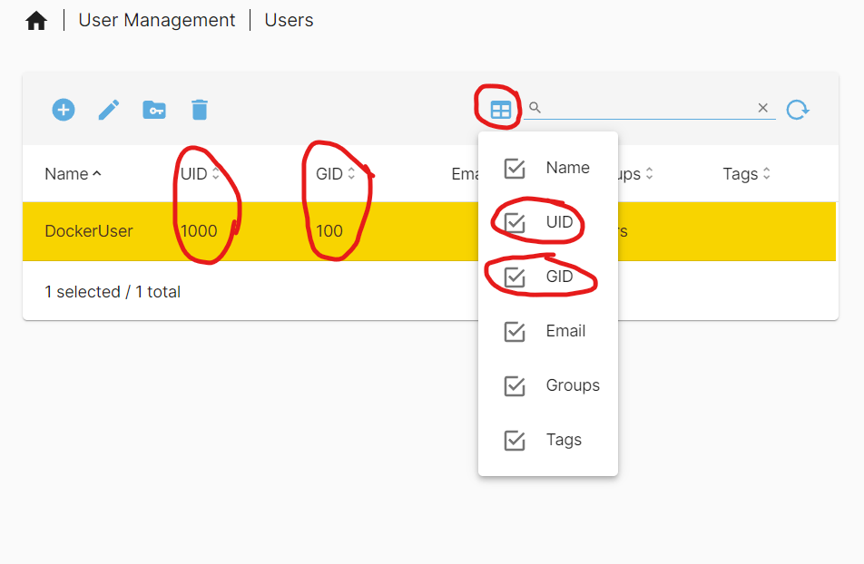

# Docker Install

TODO: Fix linting/formatting in doc 02

TODO: Fix spelling and add to dictionary relevant data in doc 02

_06/10/2024_

Open media vault 7 has a built in [docker management interface](https://wiki.omv-extras.org/doku.php?id=omv7:docker_in_omv). I will personally be using this interface for my use case but you can use another management interface like [portainer](https://www.portainer.io/) which is another popular docker management system or just use the command line. Documentation on this docker plugin can be found [here](https://wiki.omv-extras.org/doku.php?id=omv7:docker_in_omv).

## Folder Setup

The first step in this process is to setup the folders that docker will install/ save to. This is to separate docker data from the operating system data. This helps with backups and helps maintain the life of the OS storage drive.

The following folders will be created:

- Compose_Files - Where the compose files created will be stored. This will be put on the SSD drive so that the OS has faster access to it compared to the HDD array.

- Container_Data - This folder will be where persistent container data will be held. As I want this to be accessed quickly I will keep this on the SSD drive. 

- Docker_Backup - OMV docker management plugin has the option to automatically backup container data. I will use this feature and will make this folder on the HDD array as i do not need fast access to that data.

- Docker_Storage - This folder will be the files that docker uses internally. I will run this on the SSD for fast file access. Note that the Absolute Path is required instead of clicking on the respective folder from a drop down like the rest of the folders.

On the SSD, I will organize the folders like the diagram bellow under the Local_Only_Content folder.

On the HDD array, I will just place the Docker_Backup folder under the `Local_Only_Content` folder on the HDD array.

 

For all the folders created I will have the permissions set to `Administrator: read/write, Users: read/write, Others: no access`. Remember to change the relative folder path and to apply the changes when completed.

## Installing Docker

Now that the folders have been setup, it is time to install docker onto the server. navigate to `System > omv-extras`. One this page tick the docker repo check box and hit save.

Now navigate to `System >Plugins` to install the compose plugin.

Now we can setup the install folders we set up earlier. Navigate to `Services > Compose > Settings`. Fill in the respective folders setup previously in the relevant areas. I left the compose files to be owned and edited only by the root/admin user so that only the admin account can access those files. Remember that the Docker storage path needs to be the absolute one so go into `Storage > Shared Folders` to find what it is. Once you are happy with your selections click save at the bottom, then hit apply changes on the yellow bar.

Once you have applied the changes you will see under docker that it is installed and running. It will also show your docker and docker compose versions.

## Creating a Docker User

I will create a docker user that will be used for only docker containers. In docker there is an important property called [PUID and PGID](https://docs.linuxserver.io/general/understanding-puid-and-pgid/#why-use-these) which is important for access to the file system, process management, etc. As I currently only have 1 user created, that being root, I do not want each of my docker containers to have full access to my system through the root account. I also do not want any folders or files created by the docker containers to be only owned by root. Therefore, by making a new user, I can access files and folders without having to login to root and it will also help reduce the risk of a container compromising my server.

To create a new user, login to the OMV web interface and navigate to `User Management > Users`. In this page click the plus button in the blue circle to create a new user.

I will give the user the following properties:

- Name - Name given to the user. I have used `DockerUser`

- Password - The password to the user account. Make sure this is a strong password and it is saved securely in something like a password manager.

- Confirm password - confirming password put in.

- Groups - This is the group permissions that the user has. By default the `users` group is added and it cannot be removed. For my use case I do no need it to have any other group permissions (_05/06/2025_ After using this server more i have added the `_ssh` group to this user so that it has ssh access which is occasionally needed.). Depending on your use case you may have to add the user to other groups depending on the docker containers you will run.

- Disallow account modification - I have enabled this to avoid the user being able to modify its account helping with security.

- (_05/06/2025_ I would also make sure the home directories are enabled for the users and have it direct to a folder in the SSD space found in `Users > Settings`)

I am creating only 1 user as my system will only be available on my local network and my zero tier network which is only used by myself. If you are using this on a more public network I would recommend reading the [OMV docker documentation](https://wiki.omv-extras.org/doku.php?id=omv7:docker_in_omv) to understand how to make a more secure user for each container.

Once all relevant fields have been filled, save and apply the changes.

I want to restrict this docker users folder access so that it cannot modify the backup snapshots that I have created. To do this click on the docker user and click the folder with the key on it at the top.

You will be taken to a page where you can see all the shared folders created and change it's permissions. By default, the user can read and write to all the folders so I will take the Backup Folders and Set them to read only in case I use a docker container to sync the data. I also Set the compose files folder to read only so that i know they can only be edited by an admin.

Once folder permissions have been adjusted, save and apply the changes.

Now back at the users page make sure that you can see the UID and GID columns. Take note of the numbers for when you need them in docker.

## Overview of Plugin

Docker has now been fully setup on the server. Navigating to `Services>Compose` you can manage docker.

- Settings - Described in the install process above. Allows choosing where different docker elements will be installed/ saved.

- Files - Allows management of docker compose files. Create, Edit and delete compose files. Build from template. Check, Up, Stop, Down, Pull, Ps. Global environment variables, Prune, Tools, docs.

- Services - See what is running, monitor logs, restart, download logs.

- Stats - Like [top](https://www.geeksforgeeks.org/top-command-in-linux-with-examples/) but for all containers that are currently running. Name, CPU, Memory, Net, etc.

- Images - Manage docker images. Delete, Inspect, tag, push.

- Networks - Manage docker networks. Add, Delete, Inspect.

- Volumes - Manage docker volumes. Delete, inspect.

- Containers - See status of currently running containers. Name, Image, State, Status, Ports, Mounts. Restart, logs.

- Dockerfiles - Create and manage docker files. Create, edit, delete. Build, pull and build, tag.

- Schedule - Schedule backups, updates and prune to the docker containers that are installed on the system. Can be set on an automatic schedule.

- Restore - Restore a container from a backup.
