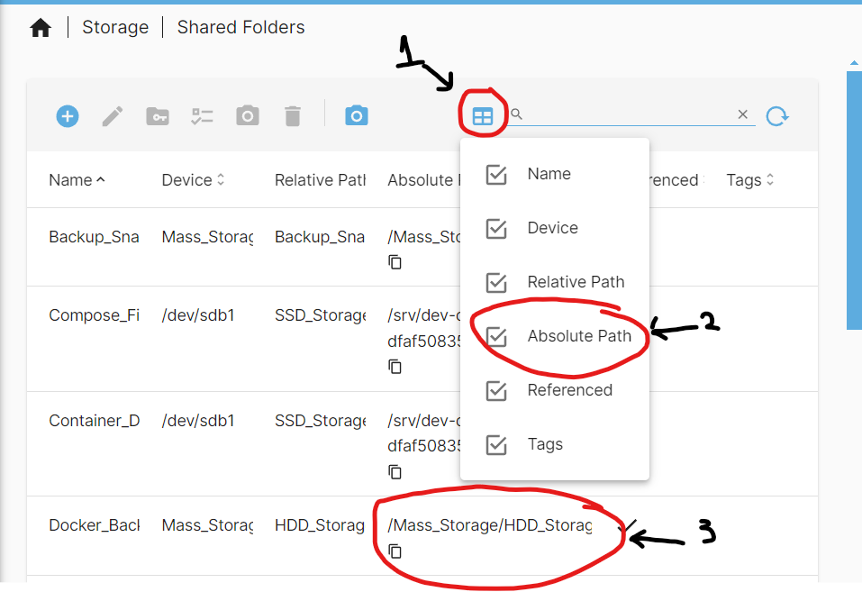
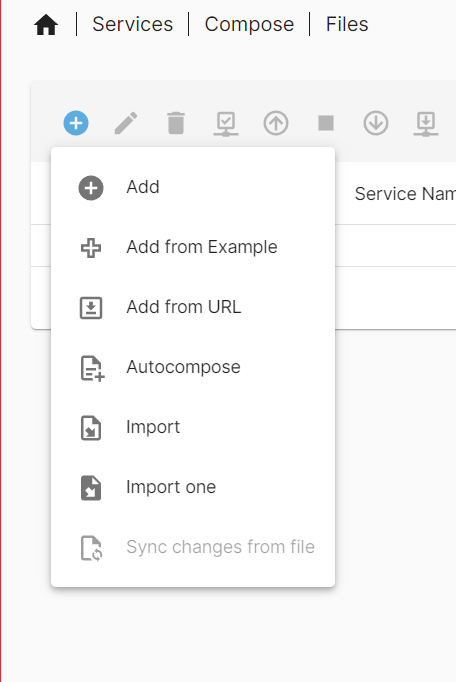
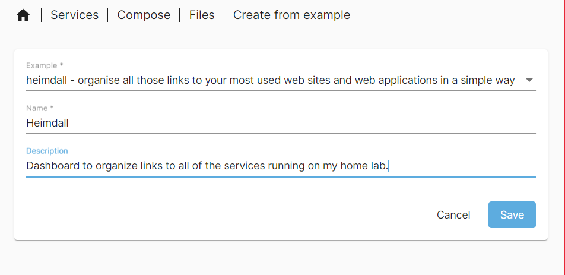
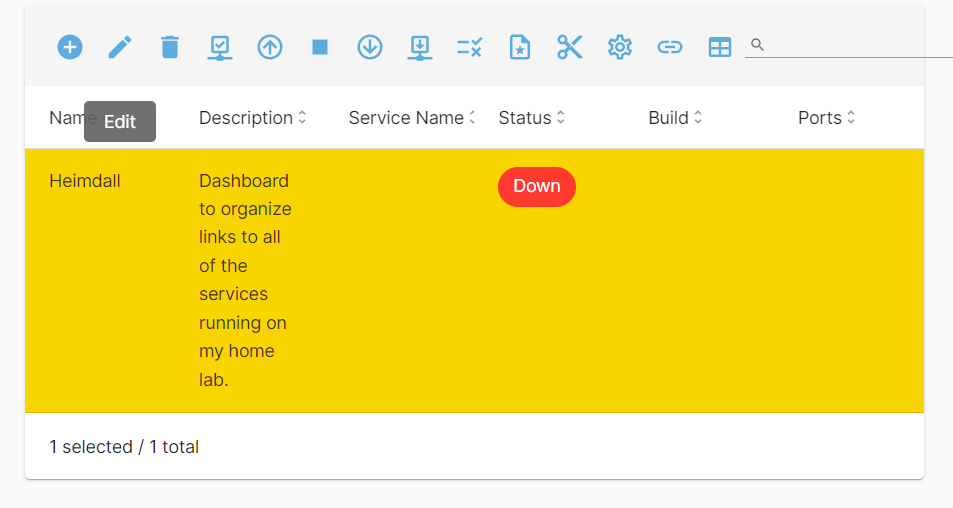
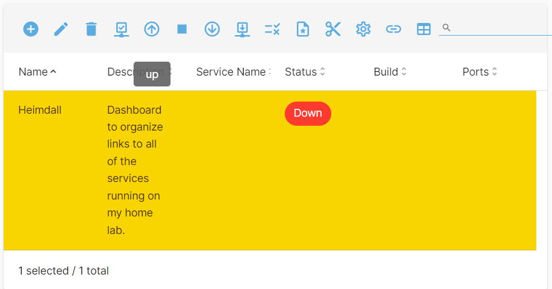
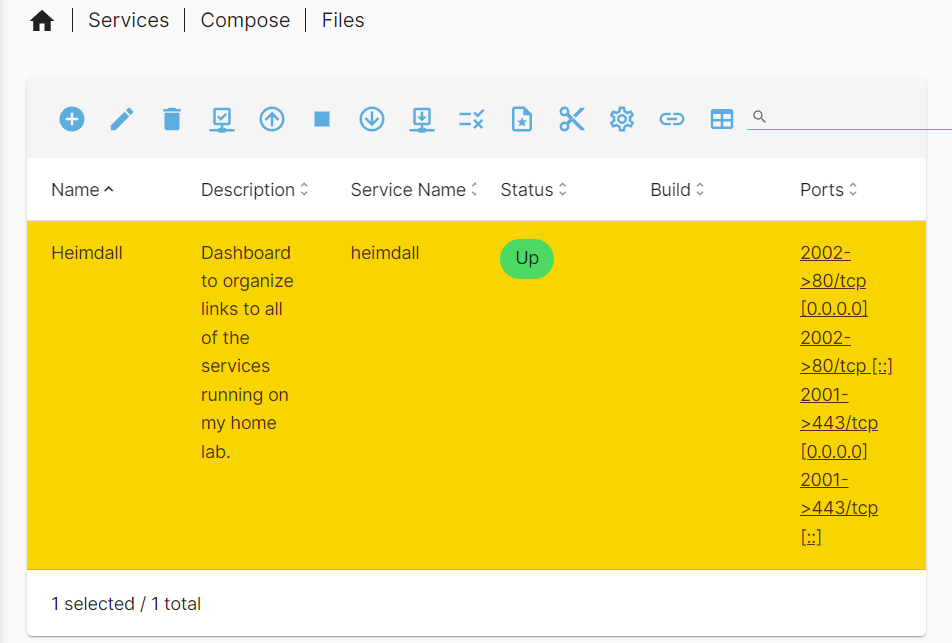
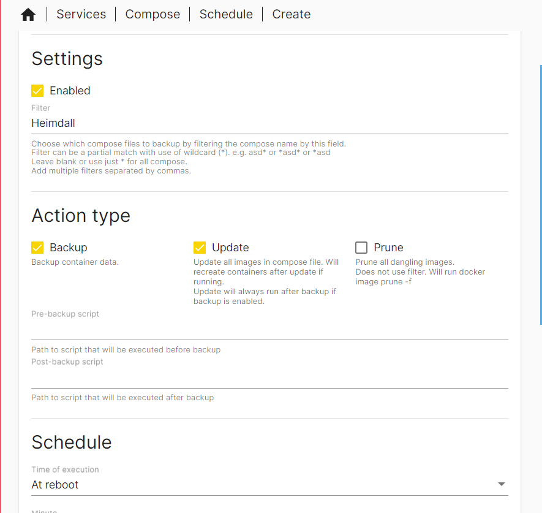

# Dashboard Heimdall

TODO: Fix linting/formatting in doc 04

TODO: Fix spelling and add to dictionary relevant data in doc 04

_13/10/2024_

One of the first docker containers I will setup is [Heimdall](https://heimdall.site/). Heimdall is a very simple and easy to setup start page/ dashboard. I use it to organize/ display links to all the web services I run. There are many other "nicer" looking dashboards for servers out there but I like the simplicity of Heimdall compared to those other options.

It must be noted that I will be using [Heimdalls Linux Server docker image](https://docs.linuxserver.io/images/docker-heimdall/) as it is easier to use in comparison to the normal docker install method.

## File Setup

For the Heimdall image, we need a folder for all of the config files of the container. I will create one on the SSD in the local only content folder so that it has fast access to those files. I will name it `Heimdall` for future reference. My folder setup is the image bellow:


Make sure to apply the change.

Now for the compose file, we will need the Absolute Path of the folder we just created. Navigate to `Storage > Shared Folders` to view the table of all the folders created. Find the Heimdall Folder created and copy the absolute path for later. Mine is `/srv/dev-disk-by-uuid-00337ac1-aca8-4dc6-b5d7-dfaf50835ac5/SSD_Storage/Local_Only_Content/Heimdall` for reference.

Note that you may have to show the Absolute path column if it is not appearing already using the table column option button.



1) Table column options

2) Absolute path column option

3) Absolute Path of the Docker_Backup Folder

## Making compose File

The first step is to know the [PUID and PGID](https://docs.linuxserver.io/general/understanding-puid-and-pgid/#why-use-these) of the docker user we set up when installing docker. We will need these in the compose file. My PUID is 1000 with a PGID of 100. If you go to `User Management > Users` you will see those properties of all users you have created.

To create the compose file we must navigate to `Services > Compose > Files` and click on the white plus in the blue circle. We will get options to:

- add a compose file

- Add from example

- etc



The important ones for us are:

- Add

- Add from Example

There are already tons of examples to use for many different things. Have a look at them for services you may want to run.

For use we can either use `Add` or `Add From Example`. I will be using add from Example. We will be taken to a page where we can select our example `Heimdall` in our case, give it a name. Do not use any spaces, as auto updates and backups will not work if you do. I named mine `Heimdall`. We can also provide a description of the container if we would like.



Click save, we will now see the container in or compose file page. It will show up as down for now as we have not turned it on (up) as we need to make a few edits. Ignore the pending configuration changes for now until we are done.


Click on the container and select the edit button (looks like a pencil).



We will now see our compose file and edit it. I will be making a few edits to this file:

- Firstly adjusting the image name to `lscr.io/linuxserver/heimdall:latest` to match the [Documentation](https://docs.linuxserver.io/images/docker-heimdall/#usage) on the Linux server page.

- Entering my PUID and PGID into the associated environment parameters.

- Enter my time zone based on the [TZ codes](https://en.wikipedia.org/wiki/List_of_tz_database_time_zones). UK is `Europe/London`.

- Enter my absolute path to my Heimdall config folder under volumes before the `:/config` part.

- Change the port `444` to `20001` before the `:443` This will be the https connection.

- Change the port `99:80` to `2002:80`

- Removed anything that was related to network configuration.
  
  - `networks:
     my-net:`
  
  - `networks:
     my-net:
     external: true`

- Everything else I left the same.

My final compose file looked like so:

```yaml
---

services:
  heimdall:
    image: lscr.io/linuxserver/heimdall:latest
    container_name: heimdall
    environment:
      - PUID=1000
      - PGID=100
      - TZ=Europe/London
    volumes:
      - /srv/dev-disk-by-uuid-00337ac1-aca8-4dc6-b5d7-dfaf50835ac5/SSD_Storage/Local_Only_Content/Heimdall:/config
    ports:
      - 2001:443
      - 2002:80 #optional
    restart: unless-stopped
```

Yours should look similar. Click save once you are done. Make sure to apply any changes.

__Note that the part it has as optional in the compose file is not actually optional. You must run it if using the Linux server image__ If using the original image there are different options.

## Launching the Container

To launch the Heimdall container made in the previous chapter, navigate to `Services > Compose > Files`, select the Heimdall container and select the up button. It will be an arrow pointing up in a circle:



When we click that button a screen will appear with all of the log files.


Once it has completed, we will see the status column change to `up`.



We now have Heimdall running.

## Using Heimdall

Now that we have the Heimdall container running, we can connect to it by typing in our search bar in our browser a command similar to `<Host Name/ IP address>:<Network Port of choice>` so for me an example command would be `hpz240nas.local:2002` for an http connection to Heimdall.

When we first connect to Heimdall we will get this interface:


On the bottom right hand panel we will have the following options from top to bottom:

- Reorder and Pin Items - Used to organize the order of all the pins that you create.

- Home dashboard - go to the home page

- Users -  User management (set user passwords, admins, different permissions)

- Application List - List of available pins/ applications that have been added.

- Tag list - List of tags.

- Settings - Configuration Settings

### User Creation

The first thing that I will do is lock out anyone from the admin panels. To do that we go into the Users page. We will then click the edit button under the admin user and set a password. Make sure the password is strong and stored in a password manager.


Save when finished.

We also want to create a user that we normally use. Click the add button on the users page. Give the user :

- a name (eg. Ethan)

- an email address(can be fake)

- A Strong Password

- Set the `Allow public access to front` to off

We have now created an admin user for user creation and control and a general user for myself which I will normally use. In the admin user, I will add applications that pertain to managing my servers like the OMV web interface. In my general user i will add applications that I will use. This will be things like file access from the web interface.

With the current set up, you have to login to either account to access links as there are no publicly accessible ones. I want to keep it like this as I want to control who can use the dashboard. If I want a person to have access to the dashboard with links I will create one for them and add the links.

### Settings Overview

Now that we have created our users, we can adjust the settings for each user to our liking. When we open the settings panel we get the following options:

- System - provides system info
  
  - Version - Heimdall version
  
  - Language - Set language
  
  - Support - Links to support the Heimdall project
  
  - Donate - Donate the the Heimdall project.

- Appearance
  
  - Background Image - Upload a background image to the dashboard.
  
  - Trianglify - Unsure on use.
  
  - Trianglify Random Seed - Unsure on use
  
  - Treat Tags as - Options on how tags are handled. I leave it as folders as I will have a "folder/ tag" for ZeroTier ip address connections and one for local network I{ addresses. Other options include:
    
    - Tags
    
    - Categories

- Miscellaneous
  
  - Homepage Search - Enable search on the home page.
  
  - Default Search Provider - Search Engine that will be used on homepage search.
  
  - Link opens in - Behavior when you click on the application option. Options of:
    
    - Open in the this tab
    
    - Open in same tab
    
    - Open in new tab - this is the one I use.

- Advanced
  
  - Custom CSS - Use a custom CSS for your dashboard
  
  - Custom JavaScript - Use custom JavaScript in your dashboard.

### Tag Addition

Adding tags to the dashboard is very simple. You can use it as a way of categorizing applications (eg. server management, files, finance, etc). I will be using it so that I can distinguish between local IP address links and links over ZeroTier IPs.

I will go into the Tag List page and click the add button.

Here I can give the tag:

- A name

- A colour

- An Icon

- and pin it to the home page.

My ZeroTier tag setup can be seen above. I have also made one for local links.

### Adding Applications

To add applications to the dashboard is very simple. Navigate to the application page and click the add button. I will be adding the open media vault web interface link here for local connections. As this application is supported in Heimdall we can make our lives easier by click the application type button and selecting `openmediavault`. Doing this auto sets up many different properties for our application link.


we can see that may of the properties have been filled in. The only changes I personally made was changing the colour to `#7AE` as it matches OMV better than the black and the tag to be the local tag so it sits under it. I did have to add the URL of `<htttp/https depends on connection type>://<host name/ IP address>:<Port>` which is `http://hpz240nas.local:2000` for my local connection.

A cool feature that i do not use but is available is showing some sort of stat for some services. This is available for OMV. I have it disabled but you could enable it and configure it to display something like CPU stats.

All other properties should be self explanatory. I also made an application link for my ZeroTier IP address.

I would recommend bookmarking the dashboard into your browser so you do not have to remember the IP address and port.

__Important Note -__ If you use host names instead of IP addresses, you can have only one link to your service via `<htttp/https depends on connection type>://<host name>:<Port>`. I personally now just use the host names in my http/https link. I did keep the local and ZeroTier tags for some services which I have on PCs I do not know the host name of.

## Updates and backup

One thing that I want to setup for all docker containers including Heimdall is automatic backups and updates. The OMV plugin allows for this to be the case. To accomplish this, navigate to `Services > Compose > Schedule` and click on the white plus in a blue circle.

You will be taken to a page to create a scheduled task. I will be making the following changes:

- Make sure that the enabled check box is selected

- Select only the Heimdall compose file in the filter box

- Make sure that Backup and Update check boxes are selected

- Schedule is set to `At reboot` as i do not need Heimdall to update quickly after an update. You could set it more frequently and I will do that for some containers but not for Heimdall.

- All other settings I have left as they were.

At the end of the Schedule creation you should see something like the image bellow.



Once completed, save the task and apply the change.

We have now setup automatic backups and updates of the Heimdall container.

# Data Backup

_28/09/2024_

One of the first services I will setup is making sure that the data on my server is backed up. Backing up data is very important incase of server failure or corruption where data on the primary drives has been lost. This allows us to still have access to the data through our backups.

The recommended strategy for building a backup system is to take into account the [3-2-1 backup rule](https://www.seagate.com/gb/en/blog/what-is-a-3-2-1-backup-strategy/). This rule states there must be:

- 3 copies of your data

- 2 Different mediums

- 1 remote/ offsite backup.

The 1 remote/ offsite backup is one many people forget to implement. It is normally only used in disaster scenarios like the building your main and local backup servers are in have burned down. The remote backup will save you here. Your remote backup can be something like a cloud storage service or your own server at a friends house.

For 2 different mediums this can be something like SSDs vs HDDs or even tape storage but, the way I interpret it is to use 2 systems that do not share any components. So I use another completely separate server with a different power supply, motherboard, drives, etc. This is so that if my main server fails. My other server will have all the data backed up onto it.

For 3 different copies if you accomplish the 1 remote and 2 different mediums you should have 3 copies: one on the server running services, one on the local backup server and one remote copy.
