# My server backup Plan

TODO: Fix linting/formatting in doc 05

TODO: Fix spelling and add to dictionary relevant data in doc 05

TODO: Separate out the organisation/ chapters of the backup section due to current length.

My Backup plan for my server involves creating snapshots of all my data on the local server and then syncing these files to my local backup server and my remote one.

I will use the [openmediavault-backup plugin](https://github.com/OpenMediaVault-Plugin-Developers/openmediavault-backup) to backup the Open Media Vault system it's self. I will then backup the data drives using the  [rsnapshot plugin](https://github.com/OpenMediaVault-Plugin-Developers/openmediavault-rsnapshot). All data snapshots will be saved to the 2, 8TB HDD mirrored array in a common folder which is then synced to both the local backup server and the remote backup server through likely something like [Syncthing](https://syncthing.net/). A diagram of how my server backup plan will work is shown bellow.

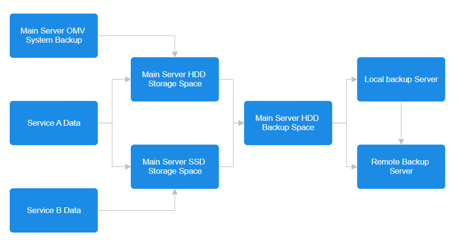

## Main Server OMV System Backup

To backup my OMV system data, I will first install the [openmediavault-backup plugin](https://github.com/OpenMediaVault-Plugin-Developers/openmediavault-backup) through the OMV plugin section.

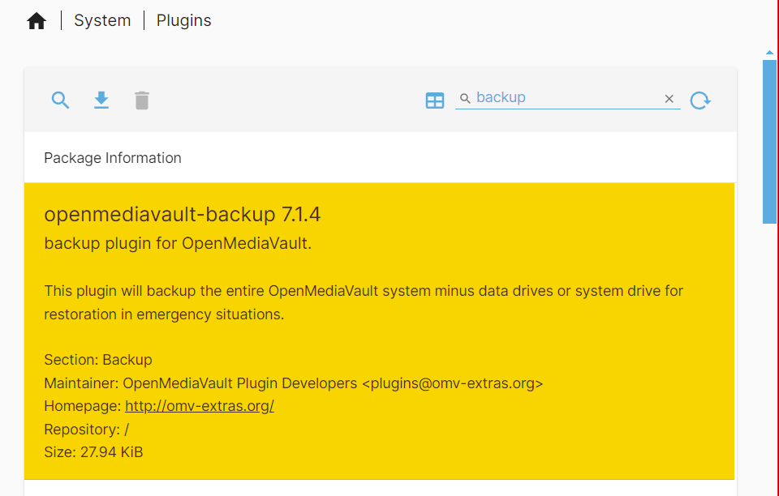

Once installed, you can find the backup settings in `System > Backup` page. Here we can adjust the settings for the OMV system backup. Firstly, I will make a new shared folder in the main HDD_Storage space to locate the backed up disc images.

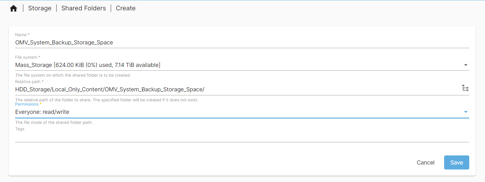

Remember to apply the pending configuration change.

Once that change has been made I will go back to the `System > Backup` page will apply the following settings:

- Settings - Page to adjust OMV system backup settings
  
  - Shared Folder - Target for where backups will be saved.
  
  - Method - I will be using `dd full disk` as it will clone my entire boot drive to a compressed image file which can be used if the boot drive fails. There are other options available like dd, fsachiver, borgbackup and rsync which maybe better for your use case.
  
  - Root device - I will not change this setting
  
  - Keep - Describes the number backup image snapshots it should keep. I will have 4 for my use case.

- Scheduled Backup - Page to adjust when backups will run.
  
  - I will enable Scheduled Backups to run Weekly.
  
  - Remember to apply the pending change.

## SSD and HDD storage Snapshots

I will be creating snapshots of all my data which will then be syncing to my local and remote backup servers. These snapshots will be of the SSD and HDD storage areas and stored on the HDDs. I will first install the rsnapshot plugin.

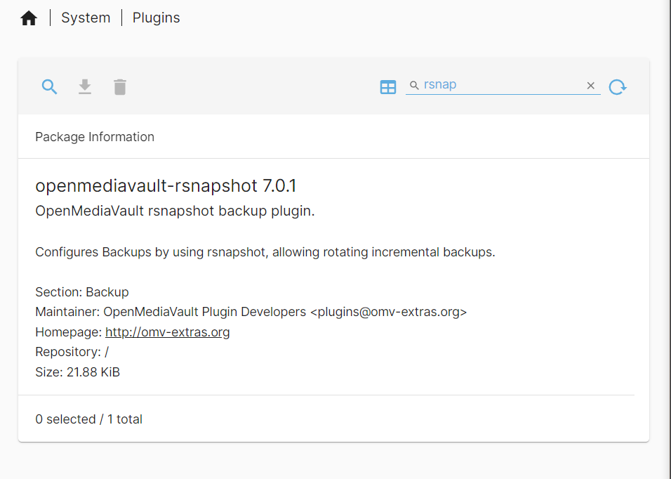

Once Installed I will navigate to the page `Services > Rsnapshot` to add rsnapshot jobs.

The first job will be for anything stored on the HDDs. The data on the HDDs will be more longer term files compared to the SSD based files. Therefore, I will keep 5 monthly snapshots which will translate to approximately one snapshot a week. All other settings I left as their defaults or set to zero.


Next I will create a snapshot job for the SSD data. As this data on the SSDs will update frequently in comparison to the HDDs, I will run 4 weekly snapshots and 3 monthly snapshots. This should give me a snapshot of the data nearly every other day. I will also gain some slightly longer term snapshots just incase i make a mistake in a file and the weekly snapshot gets over written before it is recovered. All other settings I left as their defaults or set to zero.

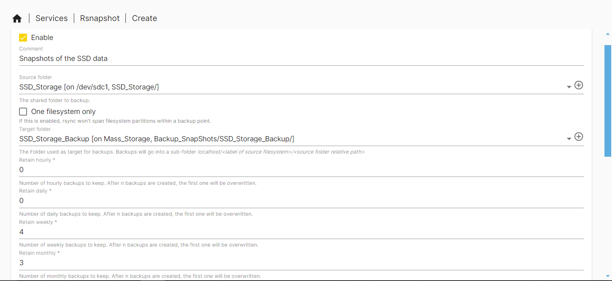

Remember to apply the configuration changes once the jobs have been created.

## Local and Remote snapshot copies

TODO: write up on local and remote snapshot copies.

---

# Windows and Linux Based Backups (UrBackup)

_11/01/2025_

For my windows and Linux based systems I will be running full incremental system backups including all data drives. I do this in case I ever have an issue with my system drives or systems as a whole. This allows me to restore onto all new SSDs or systems (laptops, PCs, VMs) if required. These backups will be needed in a worse case scenario like: the loss of a laptop, hardware failure or a broken install of an OS.

For the backups of Windows and Linux systems I will be using a program called [UrBackup](https://www.urbackup.org/index.html). This program can do full system backups of Linux, MAC and Windows systems. I will use something else for any MACs which I have described in another section. For individual files/ folders I will run [Syncthing](https://syncthing.net/) on all platforms but, you could use UrBackup for this use case as well. I will discuss Syncthing in a different section when I set it up on this server.

## Folder Setup

To setup [UrBackup](https://www.urbackup.org/index.html), there are a few folders I want to set up first.

As I will eventually include an area for my families computers/ phones, I want to setup a folder in the HDD_Storage area for only myself. Due to how UrBackup works this will require me to make a new UrBackup container for my families computers but, as I will use the docker method it should be ok. Some added configuration maybe needed when doing my families PCs.

As this is mass remote data, I will create an Ethan folder in the `HDD_Storage > Remote_Content` folder (named `Remote_Content_HDD` on my server). When i eventually add my families computers there will be a folder for them as well. The image bellow shows how the folder structure will look for UrBackup for both my family and myself for reference.

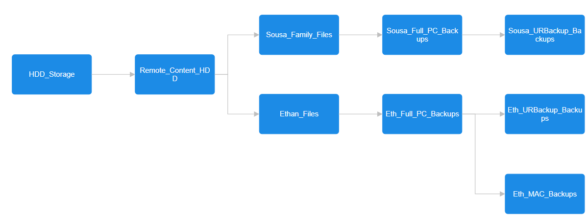

UrBackup also requires a database. In the docker container you specify the folder which this will be contained in. Therefore, I will also create a folder on the SSD for the database for fast access. I will name the folder `Eth_UrBackup` and it will sit under the Local_Only_Content folder. When I setup my families backup content I will do the same.

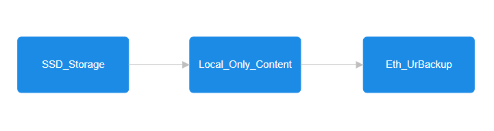

Making folders is that same as previously discussed in this README.md through OMV shared folders. Just remember:

- Typing in the correct Relative path including the `/` at the end.

- Giving it the permissions Admin and Users read/write but others no access.

- Apply the pending configuration changes when completed.

An example of the database folder setup is shown bellow:

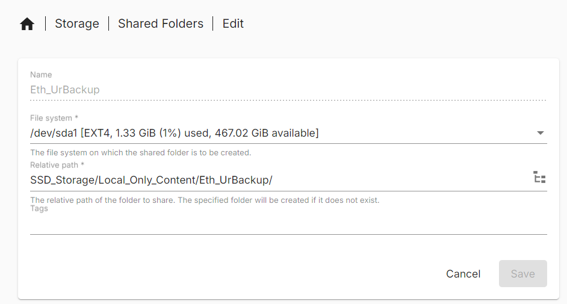

Through hind sight with this in future I would have named this folder something along the lines of `Eth_UrBackup_Database` or something similar to help with names.

Make sure to copy the absolute path of both folders created for the compose file.

Note that you may have to show the Absolute path column if it is not appearing already using the table column option button.

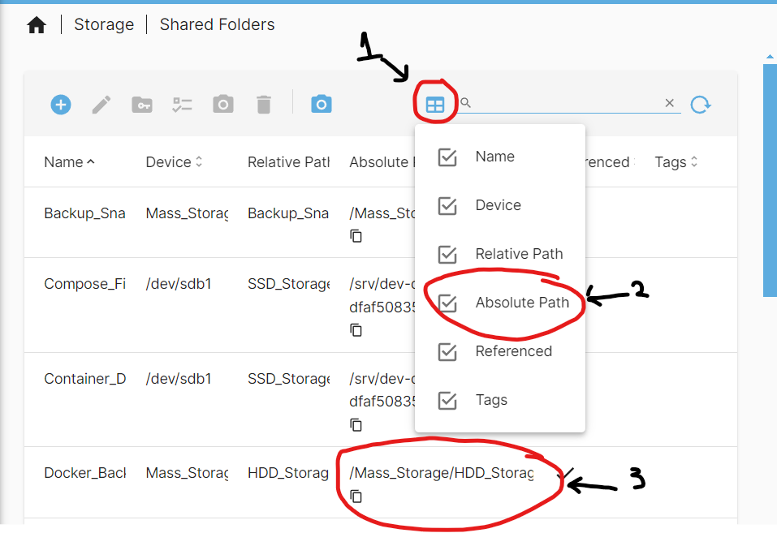

## Making Compose File

For now i will be using the recommended compose file to setup my personal UrBackup target. When I setup my families UrBackup server i will write about the changes made but as of writing I am unsure of the compose file setup.

The [recommend compose file](https://hub.docker.com/r/uroni/urbackup-server) is as of follows:

```yaml
version: '2'

services:
  urbackup:
    image: uroni/urbackup-server:latest
    container_name: urbackup
    restart: unless-stopped
    environment:
      - PUID=1000 # Enter the UID of the user who should own the files here
      - PGID=100  # Enter the GID of the user who should own the files here
      - TZ=Europe/Berlin # Enter your timezone
    volumes:
      - /path/to/your/database/folder:/var/urbackup
      - /path/to/your/backup/folder:/backups
      # Uncomment the next line if you want to bind-mount the www-folder
      #- /path/to/wwwfolder:/usr/share/urbackup
    network_mode: "host"
    # Uncomment the following two lines if you're using BTRFS support
    #cap_add:
    #  - SYS_ADMIN
    # Uncomment the following two lines if you're using ZFS support
    #devices:
    #  - /dev/zfs:/dev/zfs
```

The changes I will make are as of follows:

- Changing the `container_name` to `eth_urbackup`.

- `PUID` to `1000` and `PGID` to `100` for my docker user setup in a separate section.

- Enter my time zone based on the [TZ codes](https://en.wikipedia.org/wiki/List_of_tz_database_time_zones). UK is `Europe/London`.

- Volumes changed to:
  
  - From `/path/to/your/database/folder:/var/urbackup` to the absolute path of the `Eth_Backup` folder setup in the folder set up section. `/srv/dev-disk-by-uuid-00337ac1-aca8-4dc6-b5d7-dfaf50835ac5/SSD_Storage/Local_Only_Content/Eth_UrBackup:/var/urbackup`
  
  - From `/path/to/your/backup/folder:/backups`  to the database folder absolute path. `/Mass_Storage/HDD_Storage/Remote_Content_HDD/Ethan_Files/Eth_Full_PC_Backups/Eth_UrBackup_Backups:/backups`

- I have also changed the port numbers by commenting out the `network_mode: "host"` line and adding the following underneath:
  
  - `ports:` in line with where the network_mode line was
  
  - Tabbed in the following required port numbers based on the [UrBackup manual](https://www.urbackup.org/administration_manual.html#x1-9000010.3). Remember that the one on the left is what is externally seen while the ones on the right are internally seen by the container and are not to be changed.
    
    - `- 2003:55413` for the FastCGI bit for the web interface.
    
    - `- 2004:55414` for the http web UI interface. This is the address you will type in when managing the server side settings (the `2004` number).
    
    - `- 2005:55415` the port that internet clients will connect to. This port `2005` remember it for later as you will need it on your clients.
    
    - `- 2006:35623` the UDP broadcast port for discovery ( i likely have messed up discovery by doing this but it is required if I am to have multiple instances of this container for different use cases.)
  
  - I have only done this to allow me to setup multiple container instances. To do that it involves using different port numbers. This does complicate the setup on the clients however. If you are just having one instance i recommend keeping the port numbers as their default but i thought i would include this incase someone else wants to replicate it.

- I will uncomment the ZFS lines as my Hard drives are a ZFS mirrored array. You can probably not include this and it will be fine.

So the full compose file for me will look like the following:

```yaml
version: '2'

services:
  urbackup:
    image: uroni/urbackup-server:latest
    container_name: eth_urbackup
    restart: unless-stopped
    environment:
      - PUID=1000 # Enter the UID of the user who should own the files here
      - PGID=100  # Enter the GID of the user who should own the files here
      - TZ=Europe/London # Enter your timezone
    volumes:
      - /srv/dev-disk-by-uuid-00337ac1-aca8-4dc6-b5d7-dfaf50835ac5/SSD_Storage/Local_Only_Content/Eth_UrBackup:/var/urbackup
      - /Mass_Storage/HDD_Storage/Remote_Content_HDD/Ethan_Files/Eth_Full_PC_Backups/Eth_UrBackup_Backups:/backups
      # Uncomment the next line if you want to bind-mount the www-folder
      #- /path/to/wwwfolder:/usr/share/urbackup
    #network_mode: "host"
    ports:
      - 2003:55413
      - 2004:55414
      - 2005:55415
      - 2006:35623
    # Uncomment the following two lines if you're using BTRFS support
    #cap_add:
    #  - SYS_ADMIN
    # Uncomment the following two lines if you're using ZFS support
    devices:
      - /dev/zfs:/dev/zfs
```

Modify the compose file as you see fit.

### Launching, auto Backups and auto update container image

To launch the UrBackup container it will be the same as the Heimdall container, navigate to `Services > Compose > Files`, select the UrBackup container and select the up button. It will be an arrow pointing up in a circle:

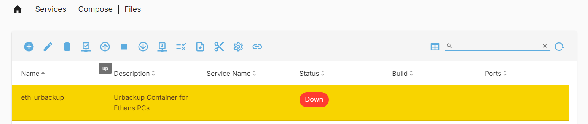

A screen with log commands will appear. Close this when you are done and you will see that the status has changed from `Down` to `Up`. The container is now running.

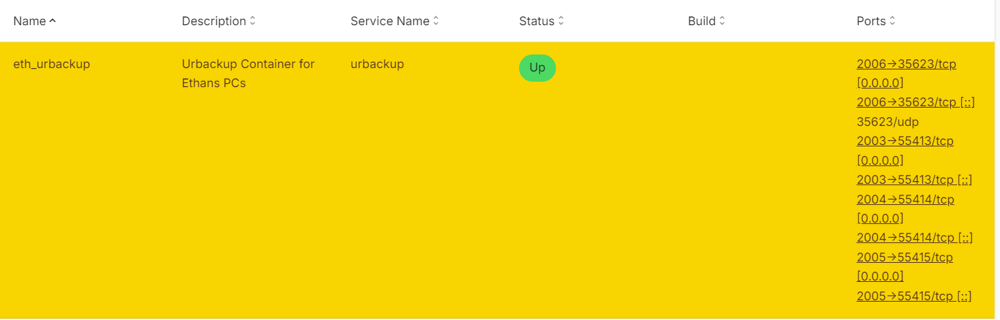

If like me you have set custom ports it will also show the port numbers. If you have not that will not show.

To automatically backup and update this container image, I will include it in the scheduled task i created for Heimdall. I will navigate to `Services > Compose > Schedule` and click on the scheduled task that at reboot updates and backups containers that it is filtered for. I will then click the pen like icon to edit the task.

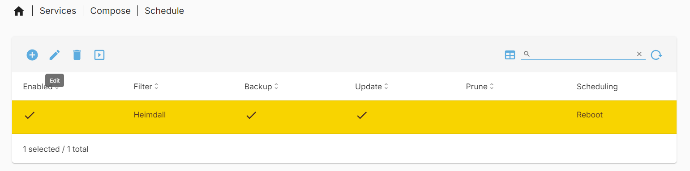

Once in the interface you will manually need to type in the filter as the web UI does not make it easy to select multiple containers. It must be noted that all container names must not include spaces. My filter I have to type `Heimdall,eth_urbackup` using commas (`,`) to separate out each container. You could also use `*` to do all containers but i do not as some later containers I add will update more frequently then only at reboot which happens once a month for me.

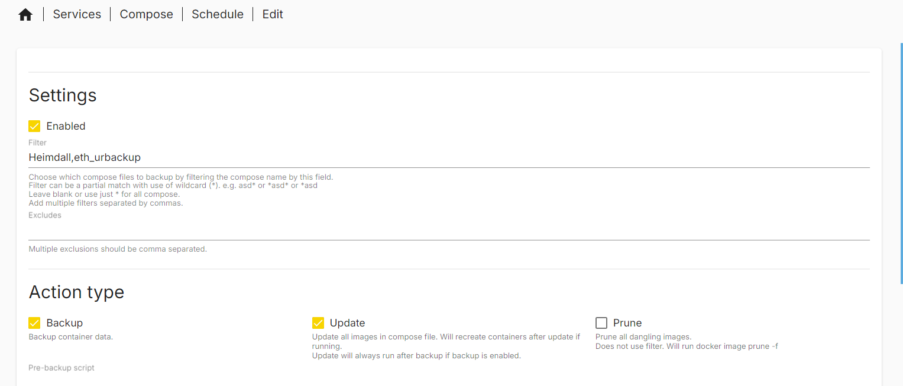

You can check this works by selecting the scheduled task and clicking the run button. A prompt will come up asking you to start the task. Start the task. Log text will appear and at the end will say done.

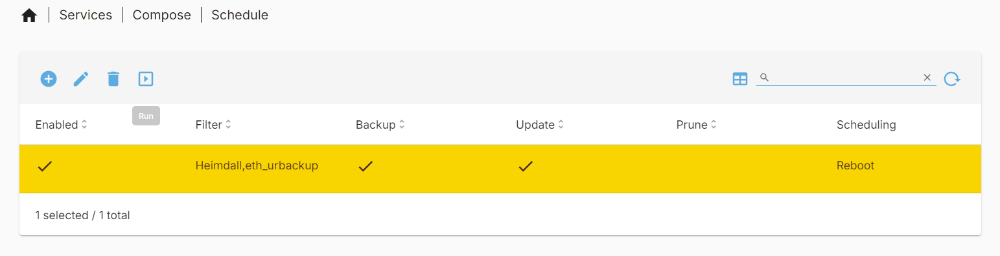

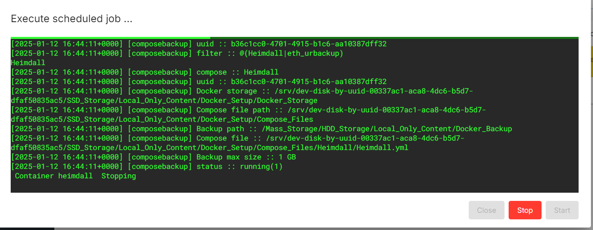

Now if you navigate to `Services > Compose > Restore` you should see all your containers backed up in the page.

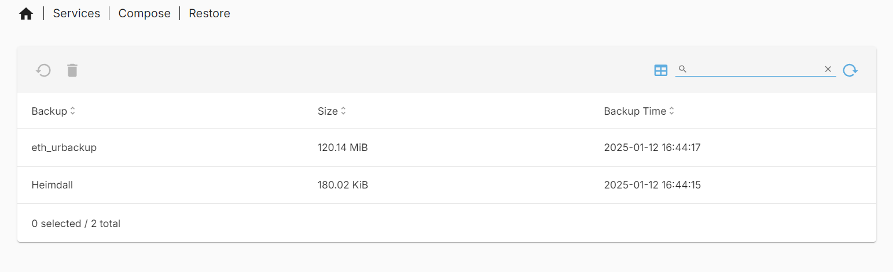

## Server Side Overview

_13/01/2025_

Now that the container is running. We can connect to it via a browser. Type in the following: `http://<host name/ Ip address>:<Port (your custom one or 55414 which is the default)>`. Therefore, for me I type in `http://hpz240nas.local:2004`. You can add this to your dashboard like [Heimdall](https://heimdall.site/) if required.

On the home page we will be greeted by the backup status of all our clients. I have a client setup already but you will likely not have any. Here we are able to add our clients and check up on the status of all the client backups.

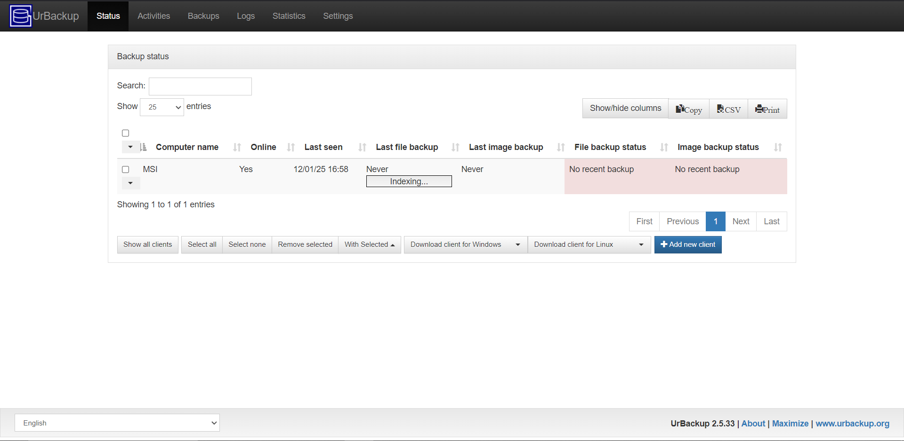

If you have setup with the default ports you will not have to manually add a new client if they are on the same local network. If you have used custom ports like myself you will have to add a new client in the status page and change a setting of the web UI which i will discuss later in this section.

To add a new client, click the add new client button on the Status page.

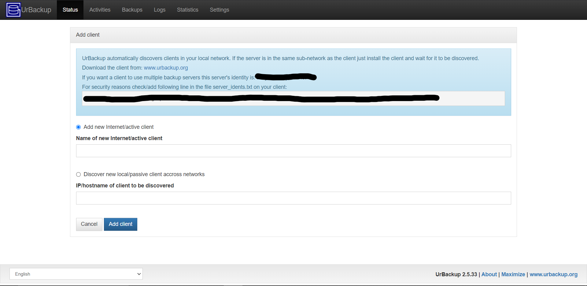

You will be taken to a page where you can add a new internet/active client or discover a client on a new network. Due to me using custom ports I have to select the `Add new internet/active client` option and type in the name i gave to my client then click the `Add client` button for my client to appear.

If you have a client on your local network you could also type in the IP address or host name but, if you have used custom ports like me it may not work.

On the activities page you will see the currently active tasks that UrBackup is running. It will show something like the image bellow. This page can be nice to give an overview of the tasks currently running if you are experiencing issues.

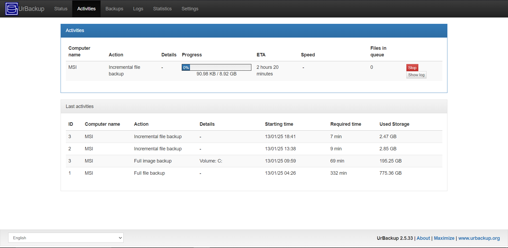

On the backups page you will see an overview of off the clients and when the last backups occurred. This is useful to check if all clients have a semi recent backup. If you click on a client you will see the file and/or image backup history.

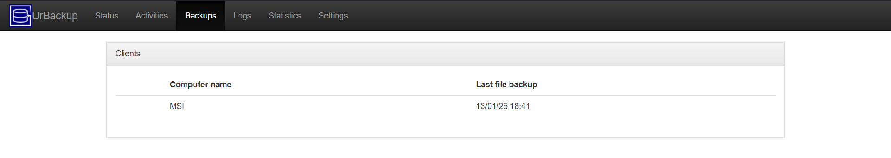

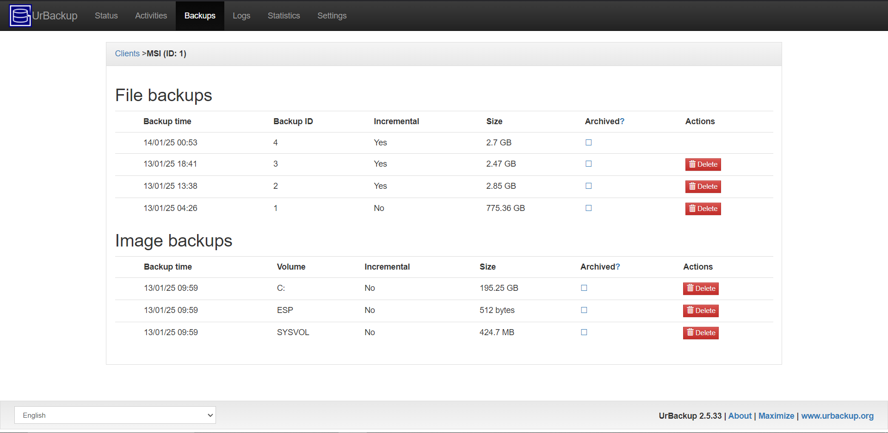

In the logs page you can see the logs from the activities of the UrBackup server with each client. You can filter by warnings or errors, see the live log for a specific client and when a user is created (done later in my write up) create a report to send of all the logs.

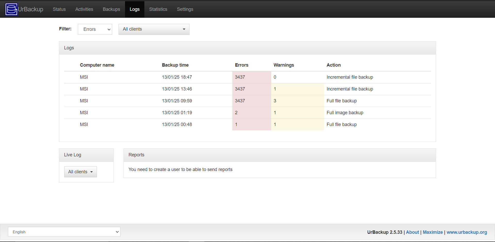

In the statistics page you are able to see how much storage UrBackup as a whole is taking up over time and specific clients. You will also be able to see how much storage each client is taking up for file backups and image backups and the totals of each.

Lastly you can see how much storage each client is taking up compared to each other.

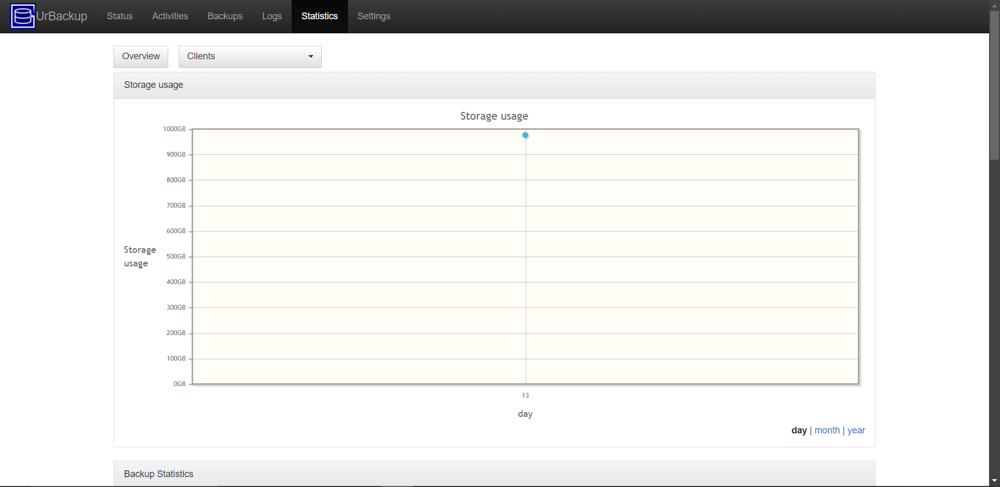

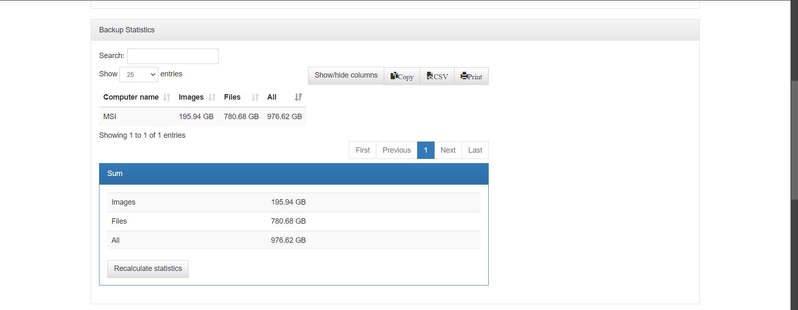

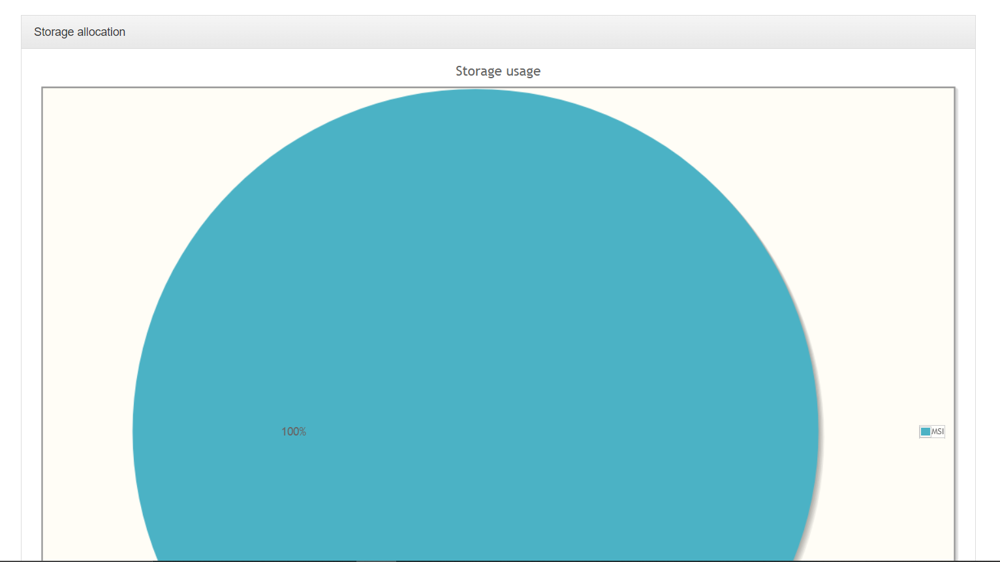

### Settings Page

In the settings page you are able to change may aspects of the UrBackup Server. For all the settings there is a save button at the bottom. Make sure to click it and see the save settings successfully message appear to apply any changes made.

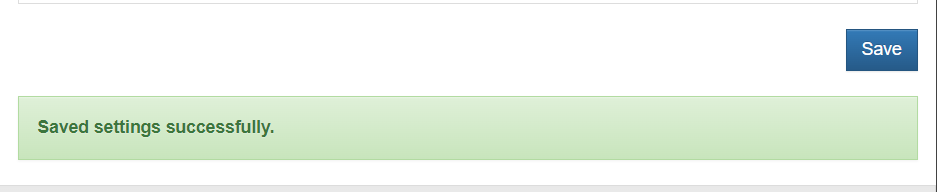

A great thing about the settings pages is that any confusing settings have a question next to them which will take you to an FAQ page on your server describing the setting to you. The [UrBackup admin manual](https://www.urbackup.org/administration_manual.html) also contains great detail about all the [server settings](https://www.urbackup.org/administration_manual.html#x1-410008).

These settings are as follows:

- General
  
  - Server ([Global Server Settings admin Manual](https://www.urbackup.org/administration_manual.html#x1-420008.1)).
    
    - Backup storage path - the default is `/backups` i have left mine as that.
    
    - Server URL for client file/backup access/browsing - This is where if you have used custom port numbers you need to use those. If you have not used custom port numbers like myself use the default http port of 55414. Enter `http://<Host name/ IP address>:<port number of http page (default is 55414)>` for completeness mine is `http://hpz240nas.local:2004`. Make sure you set this up to allow access to restoring backups.
    
    - Do not do image backups - You could out right disable image backups to this specific server if you wanted to i have not as i want to do image backups.
    
    - Do not do file backups  - You could out right disable file backups to this specific server if you wanted to i have not as i want to do file backups.
    
    - Automatically shut down server - You can can let your server automatically shut down if you like. I do not have this enabled as I always want it online running backups of my various systems.
    
    - Download client from update server - Default is on, i just left it.
    
    - Show when a new server version is available - I leave this enabled as it can help me make sure that the container is auto updating.
    
    - Auto update clients - This allows the server to tell the clients to automatically update. I leave this enabled so that my clients are always up to date.
    
    - Max simultaneous backups - Set a maximum number or backups that can be running at one time. Default is 100. To reduce load on my server i have lowered it to 2.
    
    - Max recently active clients - Set a maximum client count. Default is 10000 and I will leave it like that.
    
    - Cleanup time window - Here you are able to set when the server will perform its cleanup operation. By default, it is able to do this every day Monday (1) to Sunday (7) between 3 am and 4am with the input `1-7/3-4`. The syntax description can be found in the [admin manual](https://www.urbackup.org/administration_manual.html#x1-610008.3.1) on the UrBackup webpage or by clicking the question mark on your server. I have left the default setting for myself.
    
    - Automatically backup UrBackup database - I recommend keeping this active just in case you have an issue with the data base or where it is stored. This will help with recovery in the event of a parts failure.
    
    - Total max backup speed for local network - Set a max speed limit for backing up clients on your local network. This maybe needed if you want to reduce the load on your network and your server. I have limited this to 500 MBit/ s. Complex configuration possible please see the [manual section on it](https://www.urbackup.org/administration_manual.html#x1-550008.1.13).
    
    - Global soft file system quota - Determines when UrBackup starts to remove old backups of clients based on the total space used in the drive. I have changed mine to 90%. Read the [manual section](https://www.urbackup.org/administration_manual.html#x1-560008.1.14) for more info/ a better description of how this works.
  
  - File Backups - global settings for file backups to the specific server. Individual clients you can change but this sets the defaults for new clients.
    
    - Interval for incremental file backups - I have set mine to 20 hours up from the default of 5 to reduce load on running these backups frequently.
    - Interval for full backups - I have set mine to 60 days up from the 30 day default to reduce network and server load spike frequency.
    - Maximal number of incremental file backups - Max number of file backups, default of 100 but i have reduced it to 10 to reduce storage space taken up by the client backups. Make sure that the value you set is greater than the Minimal value.
    - Minimal number of incremental file backups - I have set mine to 2 from a default of 40 to reduce storage space taken up.
    - Maximal number of full file backups - I have set mine to 3 from a default to 10 to reduce the storage space taken up by clients.
    - Minimal number of fill file backups - I have left mine as the default of 2 just to avoid possible corruption issues that could occur.
    - Excluded files - I have left blank but if you want to exclude files read the section in the [manual](https://www.urbackup.org/administration_manual.html#x1-630008.3.3) or read the FAQ page that your server can take you to.
    - Included files - I have left blank but if you want to make sure some files are included then click and read the FAQ section on your server.
    - Default directories to backup -  I have changed from a blank setting to `D:\|D_Drive/follow_symlinks,symlinks_optional,share_hashes,optional;C:\|C_Drive/follow_symlinks,symlinks_optional,share_hashes,optional;/|Linux_Root_Drive/follow_symlinks,symlinks_optional,share_hashes,optional`. The directories are separated by `;`. The `C:\` directory is the boot drive for windows. The `D:\` directory is what i typically use when adding a drive to windows. The `|<Name>` is what allows us to name the drive differently and add the directory flags. The `/follow_symlinks,symlinks_optional,share_hashes,optional` is the directory flags to make sure the backup does not fail if the directory does not exist. The `/` before the `|Linux_Root_Drive` is the root directory for Linux. If you want to learn more, click and read the FAQ section on your server and read the [admin manual](https://www.urbackup.org/administration_manual.html#x1-640008.3.4). (06/03/2025) I made a change to my setup where for my main computer, I set the user directory as the folder to file back up as file backing up all of C and D drives took a lot of storage. However, I  have left this as the global default to to make sure everything gets backed up and will make client specific changes where appropriate. the image backups do the full drives with great compression so they should save me in a complete system data loss.(See client specific settings later on in this doc) (end 06/03/2025 adjustment to doc)
    - Directories to backup are optional be default - check box to make the global default directory's optional.
  
  - Image Backups - global settings for image backups to the specific server. Individual clients you can change but this sets the defaults for new clients.
    
    - Interval for incremental image backups - I kept mine at 7 days to keep load on my server low enough while still getting image backups. There is a check box to disable this as well.
    
    - Interval for full image backups - I have increased this to 90 days to reduce load on my network and server. There is a check box to disable this as well.
    
    - Maximal number of incremental image backups - I reduced mine to 5 to reduce storage usage on my server.
    
    - Minimal number of incremental image backups - I have reduced mine at 2 to reduce storage requirements.
    
    - Maximal number of full image backups - I reduced mine to 3 to reduce storage usage on my server.
    
    - Minimal number of full image backups - I kept mine at 2 to keep storage usage low and to make sure I have 2 image backups in case 1 gets corrupted.
    
    - Volumes to backup - I have changed mine to `ALL_NONUSB` to by default backup all volumes on a PC that are not connected via USB. This is slightly different to the default of C drive for the windows boot drive.
    
    - Image backup file format - I have left this as the default of `Compressed VHD (Compressed non-standard Virtual HardDisk)` to save storage space on my server compared to the other main option `VHD (Virtual HardDisk)`. There are V2 versions as well but as they are in beta at the time of writing I have not used them. If V2 is available without beta I will likely use them to get the newest features.
  
  - Permissions - All of these settings are about allowing the client to do various things they are as follows. I have left most enabled but disabled a few. In a business environment you may want to disable certain permissions to stop employees from changing settings.
    
    - Changing of the directories to backup - Disabled as i want all directory's to be backed up and I do not want clients the ability to disable some directories. An admin on the serer side is the only person able to add directories to backup for odd configurations which should be rare in my use case.
    - Starting of
      - full file backups
      - incremental file backups
      - full image backups
      - incremental image backups
    - Viewing of backup logs
    - pausing of backups
    - changing of settings - Disabled as I only want the server side to be able to change settings just in case my client side gets hacked. Any custom settings I will get an admin on the server to change.
    - quit the tray icon
    - start file restores
    - configure components to backup
    - start component restores
  
  - Client
    
    - Delay after system startup - I have increased mine to 5 mins from the default of 0 to allow the client to come fully online before checking backup status.
    
    - Backup window - I have left the default backup window to be 24/7 using the input 1-7/0-24. 1-7 is days of week (Monday = 1 Sunday = 7). Hours are 0-24. You can set custom ones but, I have left as 24/7 for my laptops which are sometimes shutdown. Read the [admin manual](https://www.urbackup.org/administration_manual.html#x1-610008.3.1) for more info.
    
    - Perform auto updates silently - Enabled so that i do not have to manually update UrBackup on my clients and i get the latest security updates.
    
    - Soft client quota - Default is set to none but, you could want to set this to limit the storage space taken up by clients. It is similar to the server Global soft file system quota but client specific. As my clients storage space varies a lot. I have left as blank.
  
  - Archive - This is where you can set Archive rules on your server. I will not use this but here is what the page looks like in case you want to use it.

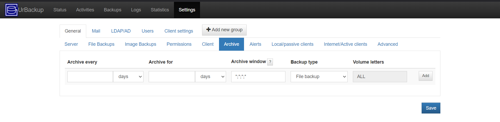

-   General
  
  - Alerts - If you want to setup alerts to send to you about your clients backups. There are 2 types as of writing, email based and pulse way based. As I will not be using this I have not changed anything. You can also edit the alert scripts if you wanted too. The following images are what the pages look like:

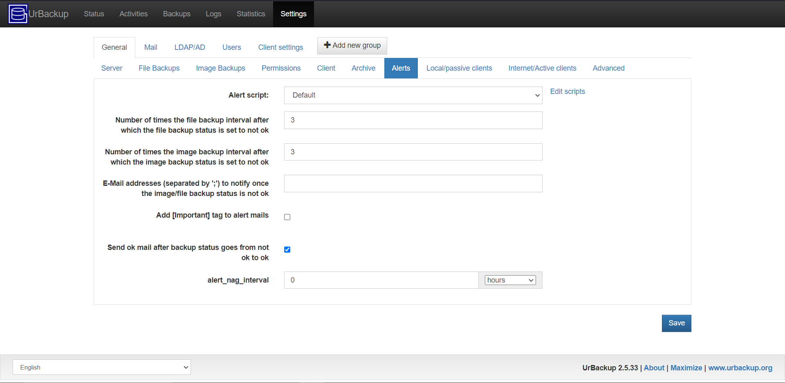

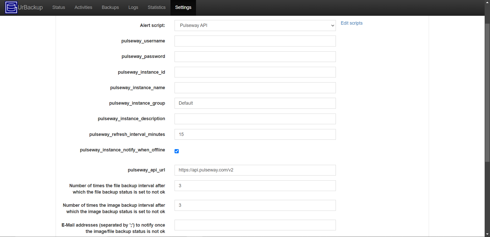

- General
  
  - Local/passive clients
    
    - Max backup speed for Local/passive transfers - I have changed this to 100 MBit/s to reduce network load and allow other clients to backup at the same time if required without reaching the max backup speed for local network.
    
    - Encrypt local/passive transfers - Enabled and should always be so that if your network was compromised the data flowing through it is not encrypted.
    
    - Compress local/ passive transfers - Enabled to reduce network load.
  
  - Internet/Active clients - every setting bellow is as an Internet/active client
    
    - Clients try to connect via Internet - Enabled
    
    - Server URL clients connect to - This is where you have to remember your custom port numbers if used. The default port is `55415` which is the port for internet clients. Here you have to enter `urbackup://<hostname / IP Address>:<port number seen by external computers>` for reference i have typed `urbackup://hpz240nas.local:2005`.
    
    - Connect via HTTP(S) proxy - I have left blank as i do not want to connect via a proxy.
    
    - Do image backups - enabled
    
    - Do full file backups - enabled
    
    - Max backup speed - I have set to 100000 KBit/s as my connection to my server maxes out at apx 100 MBit/s when not on my local network but on my local network it maxes out at 1 GBit/s. Therefore, as my clients will connect via and internet link, this value allows multiple internet clients to backup simultaneously without saturating my local network. As i am unlikely to run continuously at 100 MBit/s away from my server I am not worried about external connections saturating my network.
    
    - Total max backup speed - I have set to 500000 KBit/s as my connection maxes out at 1000 MBit/s (= 1000000 KBit/s) on my local network. As my clients connect via an internet connection due to custom port numbers I have set this equal to my global limit. Although my external network connection maxes out at apx 100 MBit/s (= 100000 KBit/s) I am not worried about fully saturating when running backups as i am unlikely to be able to maintain 100 MBit/s to my server anyway on an external network.
    
    - Encrypted transfer - Enabled to make sure data cannot be seen in transit
    
    - Compressed transfer - Enabled to reduce network load needed.
    
    - Beta: Calculate file hashes on client in parallel - Disabled as is a beta feature. When not in Beta will likely enable.
    
    - Connect as Internet/active client if connected to as local/passive client - Disabled.
    
    - Do not start file backups if current estimated data usage limit per month is smaller than - This is for metered networks which i am not on so i left at the default of 5000 MB.
    
    - Do not start image backups if current estimated data usage limit per month is smaller than - This is for metered networks which i am not on so i left at the default of 20000 MB.
    
    - Update data limit estimation database - I left enabled.
    
    - Restore authentication key - used to help with restoring data. Keep careful note of this.
  
  - Advanced - I have left everything on this page as the default. I do not fully understand it so I leave it to you to read up on it and change the settings if you require.

- Mail - This is where you would setup a mail SMTP server for things like reports and notifications. As i do no have this i will not run it but please read the [Mail section in the manual](https://www.urbackup.org/administration_manual.html#x1-570008.2). The Settings page looks like the bellow:

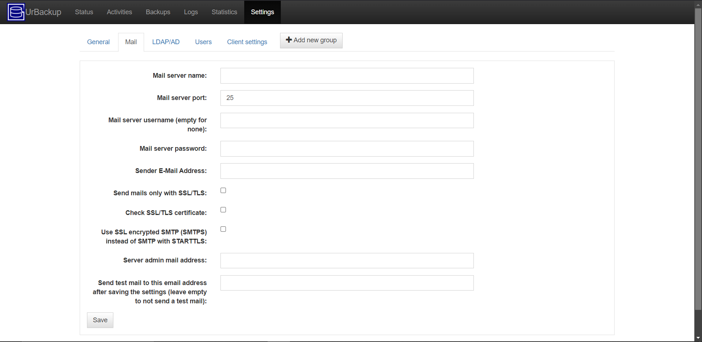

- LDAP/AD - Unsure about these settings but they are under under development and testing so may not work. I do not recommend changing these unless you know what you are doing. I have left these settings alone.

- Users - __This part is very important__. As a default, there are no users setup, meaning that there is no login to manage the server side backup interface. It is very important that you setup an admin user as soon as possible so that only you are able to manage your server side backup settings. This is in case your network gets compromised having a login reduces the chance that a hacker could destroy your backups.  On the page create a new user by clicking the button to `Create User`. For the first user created, it will be a default of an admin user. Set a strong password for this admin user saving it in a password manager. Then hit create to create the user.

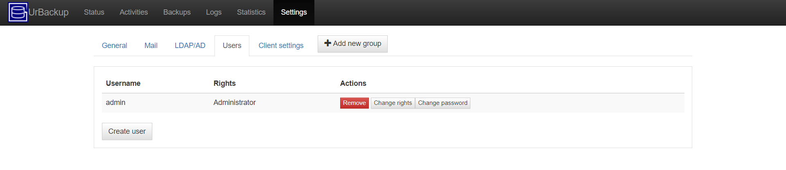

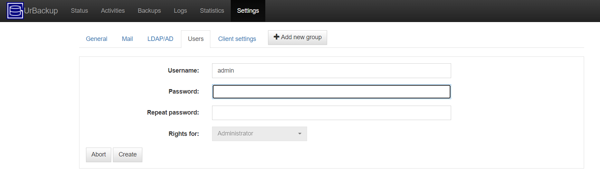

Now that you have setup an admin user, every time you try to connect to your server you will get a login prompt. This makes your UrBackup server much more secure meaning that only someone with an admin password is able to change the settings.

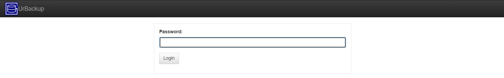

You can create more admin users if you like which can be very useful in a business environment where you have many IT managers who may need to login to the server and make changes.

You can also make users with admin rights to only control the settings of one client. So an admin is able to change settings for all clients which use the server but a client specific admin is only able to change settings with regards to specific clients. This could be useful in a business environment where you may only want limited access from IT managers to manage only certain clients or as a more secure way to manage clients as you will need multiple passwords to change the settings for all clients.

- Client Settings - Lastly, the last page is client settings. Here you are able to change client specific settings for the clients connected to the server. This is useful if you want to make specific settings for a client that may not be the global setting set under the general tab. (Start of 06/03/2025 Edit ) I did make it so that my main computer only file backups the user directory. This PC is windows and the file format to write in the field is `C:\Users\<Your User name>|<Name to give folder>/follow_symlinks,symlinks_optional,share_hashes,optional;` (End of 06/03/2025 edit).

## Windows Client Setup

_11/10/2025_

Now that the server side of the UrBackup system is setup we now need to setup the clients on our systems. There is a windows and Linux Client. Mac does exist but it is in beta and is not recommended due to [Time Machine](https://en.wikipedia.org/wiki/Time_Machine_(macOS)) being built into MACs. See the Section titled "Linux Client Setup" for the Linux setup, this section is windows specific.

To get the windows client installed you have a few options. You can go to the [UrBackup download page](https://www.urbackup.org/download.html) and download the version with the tray icon, and executable without the tray icon and an MSI installer of both as well. You can also use the [chocolatey](https://chocolatey.org/) package manager with the command `choco install urbackup-client`. I personally used [Winget](https://winget.run/pkg/UrBackup/UrBackup.Client) the built in package manager for windows with the command `winget install -e --id UrBackup.UrBackup.Client`. This will be a tray icon version. Install the client with your method of choice. I would recommend using a version with a tray icon as that is how we will interface with everything at the start. 

Once the client is installed with the tray icon you should see a database icon in your tray like the one bellow. It could be red, yellow or white. If you setup yours like me yours is likely red as it does not see the server yet.

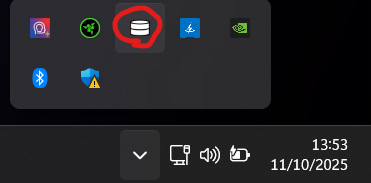

To adjust the settings right click on this icon and the options shown bellow are avaliable.

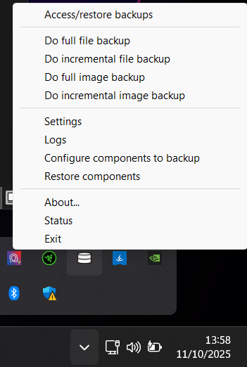

Most of these options are self explanitory like starting full or incremental backups. One main option I change is `Configure components to backup`, I open this settting and select everything to backup. The other main option is `Settings`. In here you can change any setting that you have seen before on the Server management side of things. You do how ever need to configure the client to point to the server first. You can do this by:

1) Go into the settings page and navigate to the Client Settings section. Once there give the client a name.

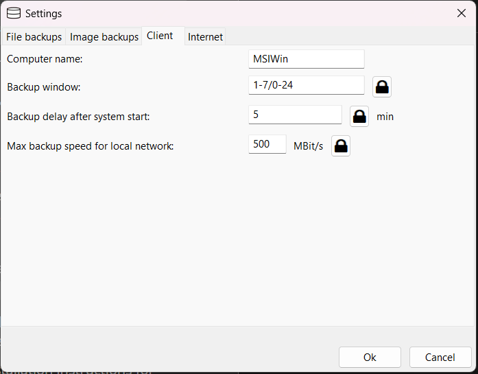

2) Once the name is setup go back to your UrBackup Server page and add a new internet client using the name in step 1 in the client name field.

3) Once you click on add client. You will be given installation instructions for Linux and windows and a `default authentication key`. Take note of this key as we will need it for the client side connection.

4) Now go back to your client settings and go into the `internet` page. In the relevent fields, type your `authentication key` from step 3 into the field `Internet Server Password`. Also make sure the check mark for `Enable backup via internet` is checked. Finally type in your server URL with the correct port number.  

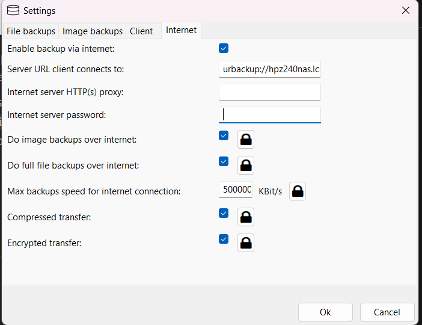

Once you click OK if you have it setup like me and the client cannot adjust their settings this settings option will disappear. It should also show as connected to the server instance soon after. This can either be seen in the tray icon or the on the server web UI.

Make sure you configure your file backups correctly through the client or server interfaces. I do mine through the server interface as I do not allow clients to edit settings. I backed up just the user directory.

### Windows Client Trouble Shooting

One major issue that gets encounted on the windows side is errors with Onedrive. Even if you have Onedrive fully disabled, there are left over files in the folder which cause issues. The best way to handle this is the disable the one drive folder entirly by adding the wildcard `*\OneDrive\*` to the `Exclude from backup` setting under `File backups`. This stops file backups into the one drive folder eliminating warnings and errors commonly seen in the backup logs.

## Linux Client Setup

_02/10/2025_

Unfortunately, unlike the windows client which contains a GUI, the Linux client is command line only. To get the Linux client installed you can either install it from source by compiling it yourself or you can install the binary directly through a command. For this guide the binary command will be used as it automatic update from the UrBackup server compatible. Please see the [UrBackup Downloads page](https://www.urbackup.org/download.html) for the most up to date download instructions.

To download the binary open the terminal on your Linux machine while being logged in with a sudo enabled account and run the following command:

```bash
TF=$(mktemp) && wget "https://hndl.urbackup.org/Client/2.5.26/UrBackup%20Client%20Linux%202.5.26.sh" -O $TF && sudo sh $TF; rm -f $TF
```

This will install the UrBackup Linux binary. You need to select a snapshot mechanism as part of the install. I recommend the LVM option so that you can get image backups. You may have to restart to finish installation.

Now that the UrBackup client is installed we can interface with it through the terminal with a Sudo enabled account through a variety of commands. The first command to type is `urbackupclientctl -help`. If everything is installed correctly the following message should appear in your terminal:

```bash
USAGE:

    urbackupclientctl [--help] [--version] <command> [<args>]

Get specific command help with urbackupclientctl <command> --help

    urbackupclientctl start
        Start an incremental/full image/file backup

    urbackupclientctl status
        Get current backup status

    urbackupclientctl browse
        Browse backups and files/folders in backups

    urbackupclientctl restore-start
        Restore files/folders from backup

    urbackupclientctl set-settings
        Set backup settings

    urbackupclientctl reset-keep
        Reset keeping files during incremental backups

    urbackupclientctl add-backupdir
        Add new directory to backup set

    urbackupclientctl list-backupdirs
        List directories that are being backed up

    urbackupclientctl remove-backupdir
        Remove directory from backup set
```

This shows all the commands available. Running `-help` after any of these commands will detail how to use each to adjust any UrBackup setting you like. I prefer to adjust everything from the main server GUI as I do not allow client PCs to adjust their settings once connected. These commands however allow you to make client specific settings on the client if you wish. Please note you must use `sudo` to adjust any of the settings.

If you installed UrBackup with the normal port configurations then your server has likely detected your client if they are on the same net. If however you are like me and used a unique install setup then you must configure an internet client on the server and point the client towards the server.

1) The first step in this is to set the clients name. We do this using the command: `sudo urbackupclientctl set-settings --name <Desired Client Name>`. 

2) Once the name is setup go back to your UrBackup Server page and add a new internet client using the name in step 1 in the client name field.

3) Once you click on add client. You will be given installation instructions for Linux and windows and a `default authentication key`. Take note of this key as we will need it for the client side connection.

4) Go back to your client terminal and set the UrBackup server address. We do this through the command `sudo urbackupclientctl set-settings --server-url urbackup://<IP address/ DNS name><:Port Number if using custom ports>`. Make sure the correct port number is used.

5) Our UrBackup client is now pointing to our server. We however are not getting any backups to our server. This is because we still have to use the authentication key retrieved in step 3. If you forgot this you can go into your client specific settings to retrieve it. To save this key for usage we must run the command `sudo urbackupclientctl set-settings --authkey <Unique auth key>`.

6) It may take some time to connect but after some time on the Server UI you should see the client connect and you should see the client showing a message saying connected if you run the following command on the client `sudo urbackupclientctl status`.

The client is now connected. Adjust settings as you see fit. I would recommend checking the file backup directories as the difference between windows and Linux is drastic.

### Linux Client Trouble shooting

When setting up the Linux client you may come across issues with the client connecting to the  like myself here are a few things you could try.

1) You could try editing the settings file to make sure the internet server URL is correct. To do this us a text editor with sudo to access the file stored in `/usr/local/var/urbackup/data/settings.cfg`. Set the internet server to the correct IP address/ URL and set the correct port number in the separate field. Full command = `sudo nano /usr/local/var/urbackup/data/settings.cfg`.

2) Put the server ID in the server settings file. When creating a new client the server will show it's ID. Copy the line given on that page. Then using a text editor like sudo place it in the text file located at `/usr/local/var/urbackup/server_idents.txt`. Full command = `sudo nano /usr/local/var/urbackup/server_idents.txt`.

3) Reset the service by running the command `sudo systemctl stop urbackupclientbackend` waiting a few moments then running `sudo systemctl stop urbackupclientbackend`.

This is what fixed my issues so hopefully it fixes yours as well. Any other issues look into the [FAQ](https://www.urbackup.org/faq.html) or [admin manual](https://www.urbackup.org/administration_manual.html#x1-90002.1.5).

## Restoring from image backup (Windows)

TODO: Write up how to restore windows image use a proxmox vm to do it to make things easier instead of raw hardware. Process will be similar.

---

# MAC backups (Time machine)

_30/10/2025_

For my MAC I will use a slightly different approach compared to my other systems as MAC devices have the built in system called "time machine". This built in backup solution will be what I use to backup my MAC.

## User Account Setup

It is recommended to setup a user that only has access to the time machine folder and preferably no other folders. This helps to keep your server secure as if the user that is used for time machine is compromised your whole NAS system is not compromised.

To setup a user navigate to the Users page in OMV `User Management > Users`. In this page, use the blue circle button with a white plus in it to create a new user. GIve the user at least the following details:

- Name - Give the user a recognisable name.

- Password - Make a secure password using a password manager and input this into the password field. This will be important for later when logging in from may MAC.

- Confirm Password - Use the same password as above to confirm it.

- Shell - Could be changed to something else if you are going to SSH into the server using this account. I will not so have ignored it.

- Groups - The user must be added to the `sambashare` group as it will be important for later. You can add other groups as you wish but i have ignored it.

Other details can be added like Email and SSH keys but I have not added it as it is not needed for me.

Make sure you apply the change. Now we have a Mac TIme machine Share User.

## Folder Setup

I want to setup a specific folder to hold my time machine data. As it will be a large portion of data that will not be accessed/ used often, It will sit in the HDD Mass storage space.

Create a shared folder by navigating to the Shared Folders page `Storage > Shared Folders`. Create a new folder giving your desired file path. I have mine in my Mass Storage folder in my computer backups section (Folder path: /Mass_Storage/HDD_Storage/Remote_Content_HDD/Ethan_Files/Eth_Full_PC_Backups/Eth_MAC_Backups). Make sure to set the correct access control list. Block access from certain users if relevant.

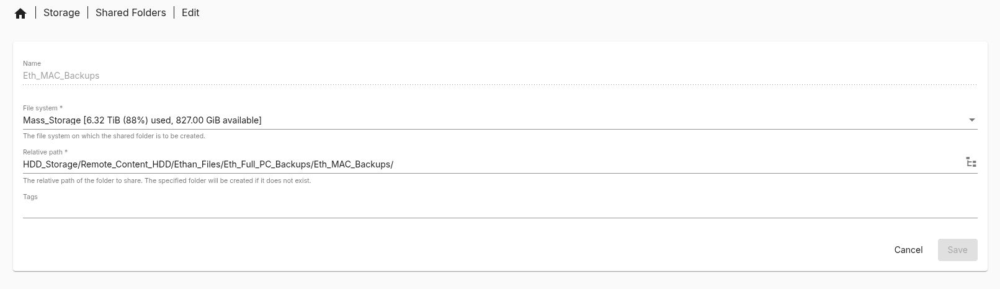

Make sure to apply the change. You now have a dedicated folder for time machine. Remember what you named it because you will need it in the SMB setup section.

### Setting User File System Quota

I want to limit how much data can be allocated to the time machine backup. Therefore, I will be setting a storage quota. My MAC has a 128GB drive in it. Therefore, I will be limiting my Time machine backup to 500GB which is sufficient for my use case. I would recommend adjusting and setting a file system quota for your time machine backups as well to limit how much storage can be used.

#### Non ZFS Method

Normally if you use an EXT4 storage setup or the built in OMV Software raid system you can easily set quotas by navigating to the File Systems page `Storage > File Systems`. Select the Relevant file system of your time machine folder. There is a pie chart looking symbol named quota (Shown bellow), click on that symbol.


Once you are in this page you can see all the users you have setup. Click on a user and click the edit at the top of the page to edit the user quota. You will be taken to a page where you can set a data quota for the specified user. `0` Is an unlimited data quota. You can adjust the units to one of the following:

- KiB

- MiB

- GiB

- TiB

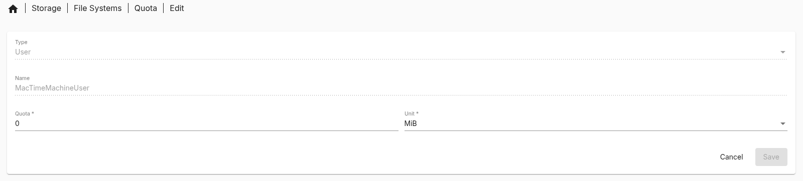

Once you have saved. You have set a file system quota for a user for a non ZFS based file system.

#### ZFS Method

As I am using ZFS for my HDD space which is holding my time machine folder, I must set the quota in a different manner. Big thanks to cabrio_leo on the OMV form for his [guide on setting up a quota for a ZFS file system](https://forum.openmediavault.org/index.php?thread%2F38333-how-to-set-quota-with-a-zfs-pool%2F=).

The first step is to navigate to your ZFS pools page `Storage > zfs > pools`. In this page, select the pool you have added your folder to. Now click on the computer looking Icon (bellow) to adjust the pool properties.


Once in this page, you will see all the pool properties. In this page, click on the white plus in a blue circle. This is where we will add our property. In the Name field, type `userquota@<User Name>` with the Value field containing the storage size allowed for that user. Remember to include the suffix for data (eg. `G` for Gigabyte, `M` for Megabyte, etc). for me I have typed `userquota@MacTimeMachineUser` in the Name field and `500G` for the value field to limit it to 500 GB. More information on quotas and how they could also be done in the command line can be found on the [Oracale ZFS doc pages](https://docs.oracle.com/cd/E19253-01/819-5461/gitfx/index.html).

Make sure to save the properties once you have made your change. You have now added a file system quota to your user.

If you want to verify that the quota has been implemented correctly as if like me it does not show up in the property table. SSH into your server with a sudo enabled account. Type in the command `sudo zfs userspace <Pool name>`. This will show the amount of storage used by each user and the quota they have if relevant. See bellow for what mine looked like:

```bash
TYPE        NAME                 USED  QUOTA  OBJUSED  OBJQUOTA
POSIX User  DockerUser          6.33T   none    20.8M      none
POSIX User  MacTimeMachineUser     0B   500G        -         -
POSIX User  _apt                   2K   none        4      none
POSIX User  _chrony               71K   none       46      none
POSIX User  messagebus          5.50K   none       11      none
POSIX User  root                9.52G   none     119K      none
```

It is clear that my `MacTimeMachineUser` has a quota set unlike the other users.

## SMB Setup

Now to setup the actual time machine share that your MAC will connect to, we have to setup an SMB share and enable the time machine option.

 The first step of this process is to enter the SMB settings page `Services > SMB/CIFS > Settings` of your server. In here we can set the SMB settings. My settings are as follows:

- Enabled - Make sure this is ticked off to enable SMB shares on your server.

- Workgroup - I have left as the default (default is `WORKGROUP)`

- Description - I have left as the default (default is `%h server`)

- Time server - I have left this unchecked but if you wanted your server to act as a time server this is where you would enable it.

- Home Directories - This section gives and overview of all the home directory settings available. If you want to have user home directories accessible via SMB this is where you do it. I have left this disabled as I manage data differently.

- Advanced settings - I made some minor changes to this section to improve security. I left everything as the default besides the minimum protocol version. I set this to `SMB3` over the default `SMB2` to have improved security as every device I have can use `SMB3`. If you have older systems you may have to use `SMB2`.

Make sure to apply the configuration change once you have saved the changes. We are now ready to make a share.

Navigate to the SMB shares page `Services > SMB/CIFS > Shares` and click the white plus in a blue circle icon. You will be presented with a page to create a share. The following changes are the settings I made.:

- Enabled - Ticked to enable the specific folder

- Shared folder - This is the folder we setup in the folder setup section, click the drop down and select the appropriate folder.

- Comment - The name given to the share that you will be able to see when connecting

- Pubic - Make sure this is set to No so that only the user we specified can access the folder. This also means the folder will require a login to use.

- Time Machine support - Make sure to have this ticked off to enable support for time machine.

- Transport Encryption - I have this ticked so that when data is transferred it is encrypted to avoid potential man in the middle attacks.

- Inherit ACLs - I have this checked to make sure the ACLs I set on the server side exits for all files and folders created by time machine during it's backup process.

- Hide dot files - I make sure this is unchecked personally but you do not have to.

There are other options that may be of interest to you. Have a read of them and adjust as necessary. An example of this could be the hosts allow or deny list.

Please read the [Samba OMV documentation](https://docs.openmediavault.org/en/stable/administration/services/samba.html) for more information on settings and shares.

Once you have saved and applied the change you have now created and SMB share that you can connect to.

## Setup on MAC

Now that the share has been setup, we can now go to the MAC to set everything up.

The first step is to navigate to the time machine settings page shown bellow. It can be found in MAC setting in general. Yours will likely look different as I have one setup already which i will be replacing.

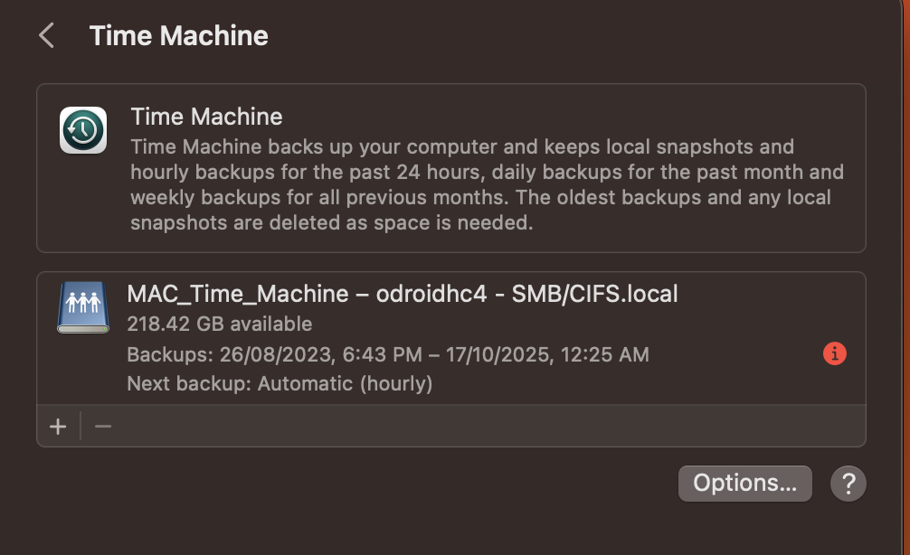

Once in this page we will likely want to adjust the options for backups:

- Backup Frequency - Can adjust to every hour, day, week or set to manual. I would recommend automatically because you are likely to forget and you are always able to manually make backups.

- Backup on Battery - I have this disabled to save battery.

- Folders to exclude - You can exclude folders if you want but I just left it as the default.

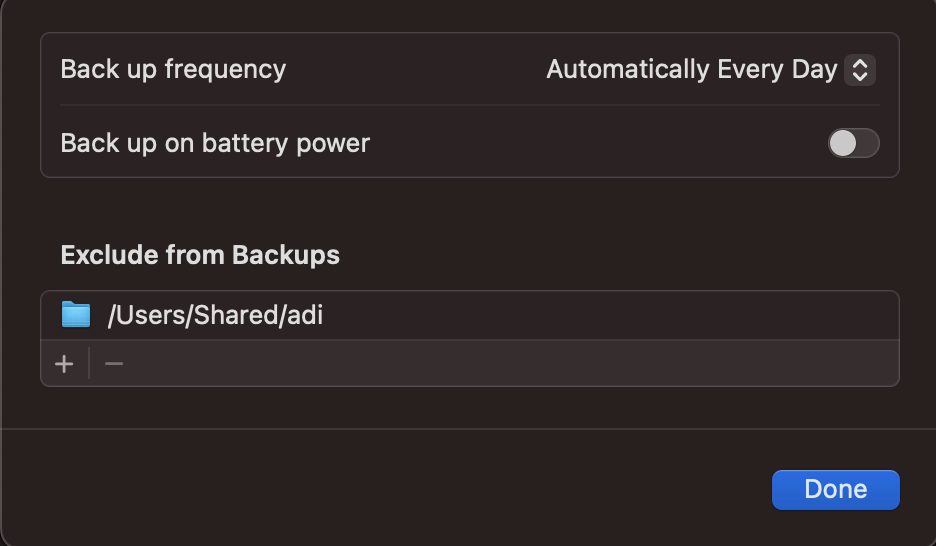

Now we are able to add our SMB share. Click the plus Icon to add a time machine backup. If you are on the same network as your server it will appear in the list with the server name and share name you gave it. Click on it and click setup Disk.


Time machine will start to be setup. You will be prompted to login to the share. Make sure you use the username and password set for the user made in the "user account setup" section. You will then be asked to encrypt your backup. You should do this if you are using a server you do not control remember to use a secure password from something like a password manager. I decided against this as all data stays within my servers. It does become problematic if the data in my server gets hacked however. Decide at your own risk.

Once you have setup the disk. The backup will soon begin. The first one will be long due to it having to get everything for the first time. Once it is done the first time, each following backup is incremental so takes less time. IF you want to manually backup everything, select the disk and right click. You will be presented by an option to backup to the drive instantly.

congratulations. You have now setup a time machine backup. To restore these backups, please follow the  [Apple support page restore guide](https://support.apple.com/en-gb/102551).
