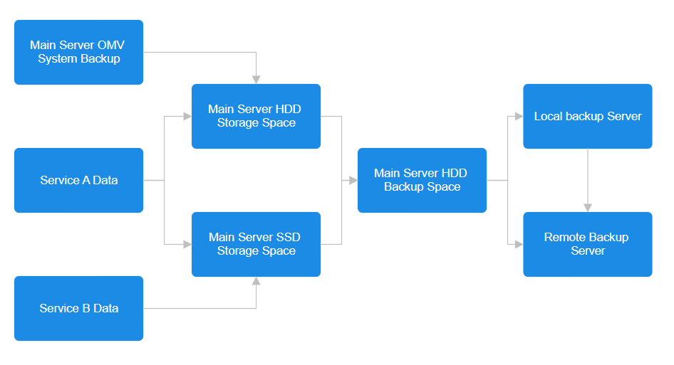
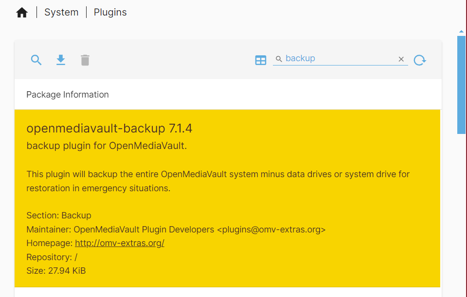
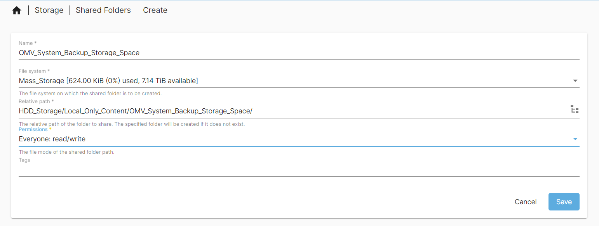
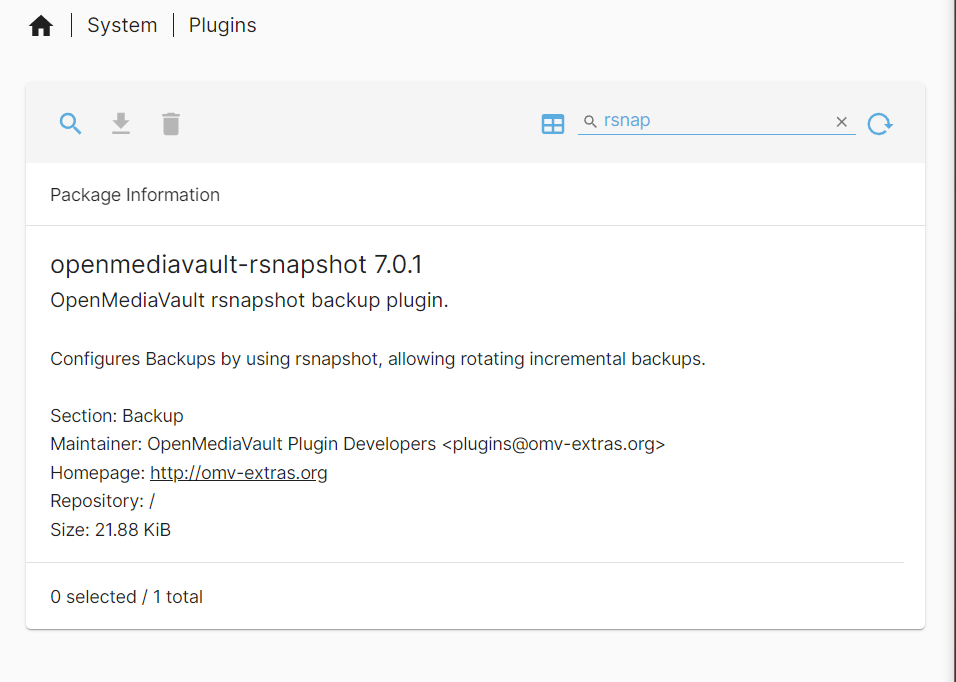
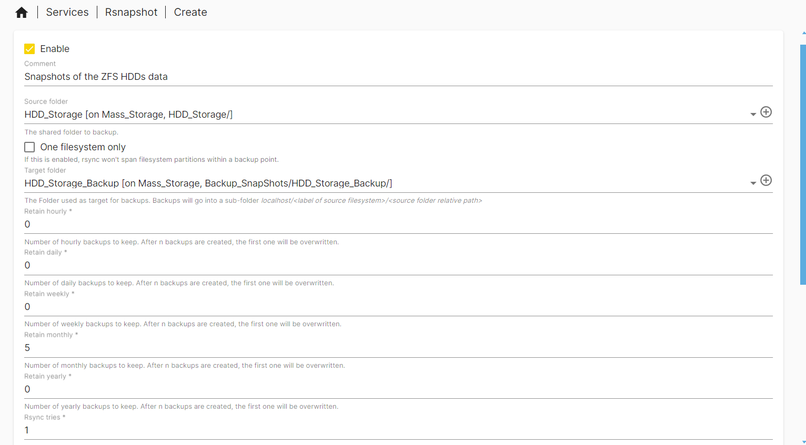
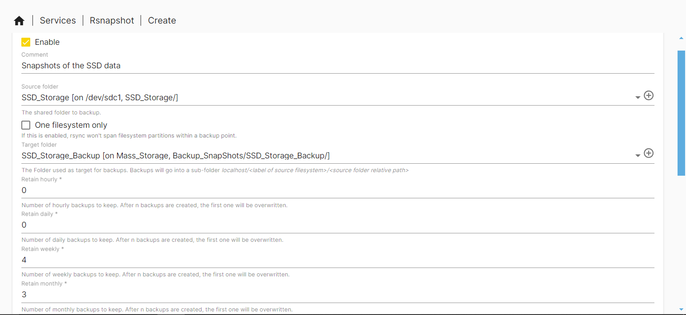

# My server backup Plan

TODO: Redo backup plan section. Make the planning aspect one file and make the windows/ linux backup bit one file and the MAC one one file. This is probably the best way to write it.

TODO: Rewrite the plan as it has changed drastically since this was made. Also, mention the backup server repo as part of this.

TODO: Fix linting/formatting in doc 05

TODO: Fix spelling and add to dictionary relevant data in doc 05

TODO: Separate out the organisation/ chapters of the backup section due to current length.

My Backup plan for my server involves creating snapshots of all my data on the local server and then syncing these files to my local backup server and my remote one.

I will use the [openmediavault-backup plugin](https://github.com/OpenMediaVault-Plugin-Developers/openmediavault-backup) to backup the Open Media Vault system it's self. I will then backup the data drives using the  [rsnapshot plugin](https://github.com/OpenMediaVault-Plugin-Developers/openmediavault-rsnapshot). All data snapshots will be saved to the 2, 8TB HDD mirrored array in a common folder which is then synced to both the local backup server and the remote backup server through likely something like [Syncthing](https://syncthing.net/). A diagram of how my server backup plan will work is shown bellow.

## Main Server OMV System Backup

To backup my OMV system data, I will first install the [openmediavault-backup plugin](https://github.com/OpenMediaVault-Plugin-Developers/openmediavault-backup) through the OMV plugin section.

Once installed, you can find the backup settings in `System > Backup` page. Here we can adjust the settings for the OMV system backup. Firstly, I will make a new shared folder in the main HDD_Storage space to locate the backed up disc images.

Remember to apply the pending configuration change.

Once that change has been made I will go back to the `System > Backup` page will apply the following settings:

- Settings - Page to adjust OMV system backup settings
  
  - Shared Folder - Target for where backups will be saved.
  
  - Method - I will be using `dd full disk` as it will clone my entire boot drive to a compressed image file which can be used if the boot drive fails. There are other options available like dd, fsachiver, borgbackup and rsync which maybe better for your use case.
  
  - Root device - I will not change this setting
  
  - Keep - Describes the number backup image snapshots it should keep. I will have 4 for my use case.

- Scheduled Backup - Page to adjust when backups will run.
  
  - I will enable Scheduled Backups to run Weekly.
  
  - Remember to apply the pending change.

## SSD and HDD storage Snapshots

I will be creating snapshots of all my data which will then be syncing to my local and remote backup servers. These snapshots will be of the SSD and HDD storage areas and stored on the HDDs. I will first install the rsnapshot plugin.

Once Installed I will navigate to the page `Services > Rsnapshot` to add rsnapshot jobs.

The first job will be for anything stored on the HDDs. The data on the HDDs will be more longer term files compared to the SSD based files. Therefore, I will keep 5 monthly snapshots which will translate to approximately one snapshot a week. All other settings I left as their defaults or set to zero.

Next I will create a snapshot job for the SSD data. As this data on the SSDs will update frequently in comparison to the HDDs, I will run 4 weekly snapshots and 3 monthly snapshots. This should give me a snapshot of the data nearly every other day. I will also gain some slightly longer term snapshots just incase i make a mistake in a file and the weekly snapshot gets over written before it is recovered. All other settings I left as their defaults or set to zero.

Remember to apply the configuration changes once the jobs have been created.

## Local and Remote snapshot copies

TODO: write up on local and remote snapshot copies.
TODO: Update and write up this section
---
