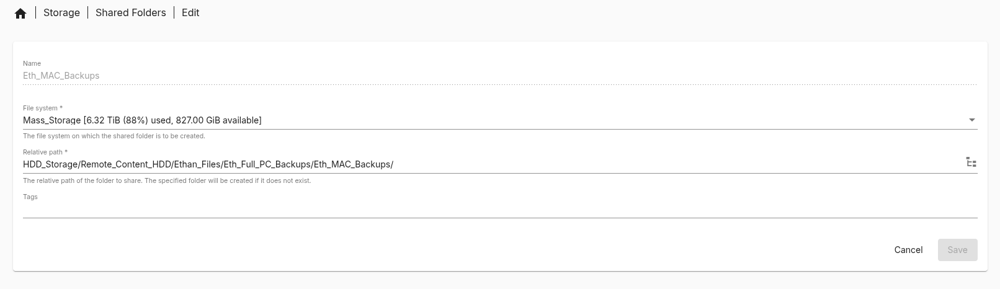
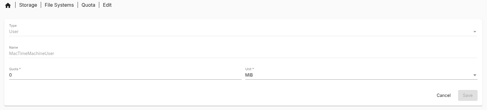
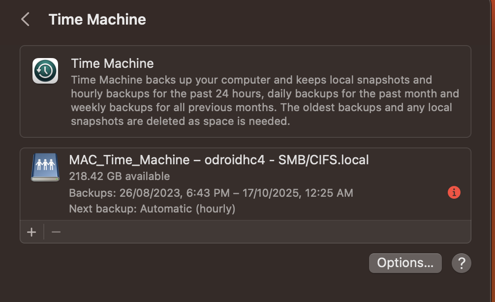
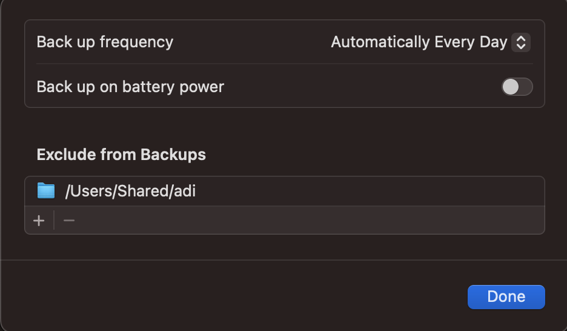
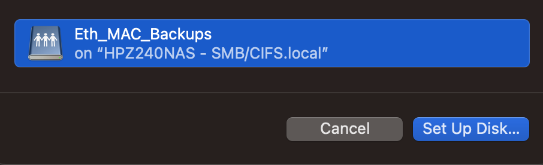

# MAC backups (Time machine)

_30/10/2025_

For my MAC I will use a slightly different approach compared to my other systems as MAC devices have the built in system called "time machine". This built in backup solution will be what I use to backup my MAC.

## User Account Setup

It is recommended to setup a user that only has access to the time machine folder and preferably no other folders. This helps to keep your server secure as if the user that is used for time machine is compromised your whole NAS system is not compromised.

To setup a user navigate to the Users page in OMV `User Management > Users`. In this page, use the blue circle button with a white plus in it to create a new user. GIve the user at least the following details:

- Name - Give the user a recognisable name.

- Password - Make a secure password using a password manager and input this into the password field. This will be important for later when logging in from may MAC.

- Confirm Password - Use the same password as above to confirm it.

- Shell - Could be changed to something else if you are going to SSH into the server using this account. I will not so have ignored it.

- Groups - The user must be added to the `sambashare` group as it will be important for later. You can add other groups as you wish but i have ignored it.

Other details can be added like Email and SSH keys but I have not added it as it is not needed for me.

Make sure you apply the change. Now we have a Mac TIme machine Share User.

## Folder Setup

I want to setup a specific folder to hold my time machine data. As it will be a large portion of data that will not be accessed/ used often, It will sit in the HDD Mass storage space.

Create a shared folder by navigating to the Shared Folders page `Storage > Shared Folders`. Create a new folder giving your desired file path. I have mine in my Mass Storage folder in my computer backups section (Folder path: /Mass_Storage/HDD_Storage/Remote_Content_HDD/Ethan_Files/Eth_Full_PC_Backups/Eth_MAC_Backups). Make sure to set the correct access control list. Block access from certain users if relevant.



Make sure to apply the change. You now have a dedicated folder for time machine. Remember what you named it because you will need it in the SMB setup section.

### Setting User File System Quota

I want to limit how much data can be allocated to the time machine backup. Therefore, I will be setting a storage quota. My MAC has a 128GB drive in it. Therefore, I will be limiting my Time machine backup to 500GB which is sufficient for my use case. I would recommend adjusting and setting a file system quota for your time machine backups as well to limit how much storage can be used.

#### Non ZFS Method

Normally if you use an EXT4 storage setup or the built in OMV Software raid system you can easily set quotas by navigating to the File Systems page `Storage > File Systems`. Select the Relevant file system of your time machine folder. There is a pie chart looking symbol named quota (Shown bellow), click on that symbol.


Once you are in this page you can see all the users you have setup. Click on a user and click the edit at the top of the page to edit the user quota. You will be taken to a page where you can set a data quota for the specified user. `0` Is an unlimited data quota. You can adjust the units to one of the following:

- KiB

- MiB

- GiB

- TiB



Once you have saved. You have set a file system quota for a user for a non ZFS based file system.

#### ZFS Method

As I am using ZFS for my HDD space which is holding my time machine folder, I must set the quota in a different manner. Big thanks to cabrio_leo on the OMV form for his [guide on setting up a quota for a ZFS file system](https://forum.openmediavault.org/index.php?thread%2F38333-how-to-set-quota-with-a-zfs-pool%2F=).

The first step is to navigate to your ZFS pools page `Storage > zfs > pools`. In this page, select the pool you have added your folder to. Now click on the computer looking Icon (bellow) to adjust the pool properties.


Once in this page, you will see all the pool properties. In this page, click on the white plus in a blue circle. This is where we will add our property. In the Name field, type `userquota@<User Name>` with the Value field containing the storage size allowed for that user. Remember to include the suffix for data (eg. `G` for Gigabyte, `M` for Megabyte, etc). for me I have typed `userquota@MacTimeMachineUser` in the Name field and `500G` for the value field to limit it to 500 GB. More information on quotas and how they could also be done in the command line can be found on the [Oracale ZFS doc pages](https://docs.oracle.com/cd/E19253-01/819-5461/gitfx/index.html).

Make sure to save the properties once you have made your change. You have now added a file system quota to your user.

If you want to verify that the quota has been implemented correctly as if like me it does not show up in the property table. SSH into your server with a sudo enabled account. Type in the command `sudo zfs userspace <Pool name>`. This will show the amount of storage used by each user and the quota they have if relevant. See bellow for what mine looked like:

```bash
TYPE        NAME                 USED  QUOTA  OBJUSED  OBJQUOTA
POSIX User  DockerUser          6.33T   none    20.8M      none
POSIX User  MacTimeMachineUser     0B   500G        -         -
POSIX User  _apt                   2K   none        4      none
POSIX User  _chrony               71K   none       46      none
POSIX User  messagebus          5.50K   none       11      none
POSIX User  root                9.52G   none     119K      none
```

It is clear that my `MacTimeMachineUser` has a quota set unlike the other users.

## SMB Setup

Now to setup the actual time machine share that your MAC will connect to, we have to setup an SMB share and enable the time machine option.

 The first step of this process is to enter the SMB settings page `Services > SMB/CIFS > Settings` of your server. In here we can set the SMB settings. My settings are as follows:

- Enabled - Make sure this is ticked off to enable SMB shares on your server.

- Workgroup - I have left as the default (default is `WORKGROUP)`

- Description - I have left as the default (default is `%h server`)

- Time server - I have left this unchecked but if you wanted your server to act as a time server this is where you would enable it.

- Home Directories - This section gives and overview of all the home directory settings available. If you want to have user home directories accessible via SMB this is where you do it. I have left this disabled as I manage data differently.

- Advanced settings - I made some minor changes to this section to improve security. I left everything as the default besides the minimum protocol version. I set this to `SMB3` over the default `SMB2` to have improved security as every device I have can use `SMB3`. If you have older systems you may have to use `SMB2`.

Make sure to apply the configuration change once you have saved the changes. We are now ready to make a share.

Navigate to the SMB shares page `Services > SMB/CIFS > Shares` and click the white plus in a blue circle icon. You will be presented with a page to create a share. The following changes are the settings I made.:

- Enabled - Ticked to enable the specific folder

- Shared folder - This is the folder we setup in the folder setup section, click the drop down and select the appropriate folder.

- Comment - The name given to the share that you will be able to see when connecting

- Pubic - Make sure this is set to No so that only the user we specified can access the folder. This also means the folder will require a login to use.

- Time Machine support - Make sure to have this ticked off to enable support for time machine.

- Transport Encryption - I have this ticked so that when data is transferred it is encrypted to avoid potential man in the middle attacks.

- Inherit ACLs - I have this checked to make sure the ACLs I set on the server side exits for all files and folders created by time machine during it's backup process.

- Hide dot files - I make sure this is unchecked personally but you do not have to.

There are other options that may be of interest to you. Have a read of them and adjust as necessary. An example of this could be the hosts allow or deny list.

Please read the [Samba OMV documentation](https://docs.openmediavault.org/en/stable/administration/services/samba.html) for more information on settings and shares.

Once you have saved and applied the change you have now created and SMB share that you can connect to.

## Setup on MAC

Now that the share has been setup, we can now go to the MAC to set everything up.

The first step is to navigate to the time machine settings page shown bellow. It can be found in MAC setting in general. Yours will likely look different as I have one setup already which i will be replacing.



Once in this page we will likely want to adjust the options for backups:

- Backup Frequency - Can adjust to every hour, day, week or set to manual. I would recommend automatically because you are likely to forget and you are always able to manually make backups.

- Backup on Battery - I have this disabled to save battery.

- Folders to exclude - You can exclude folders if you want but I just left it as the default.



Now we are able to add our SMB share. Click the plus Icon to add a time machine backup. If you are on the same network as your server it will appear in the list with the server name and share name you gave it. Click on it and click setup Disk.



Time machine will start to be setup. You will be prompted to login to the share. Make sure you use the username and password set for the user made in the "user account setup" section. You will then be asked to encrypt your backup. You should do this if you are using a server you do not control remember to use a secure password from something like a password manager. I decided against this as all data stays within my servers. It does become problematic if the data in my server gets hacked however. Decide at your own risk.

Once you have setup the disk. The backup will soon begin. The first one will be long due to it having to get everything for the first time. Once it is done the first time, each following backup is incremental so takes less time. IF you want to manually backup everything, select the disk and right click. You will be presented by an option to backup to the drive instantly.

congratulations. You have now setup a time machine backup. To restore these backups, please follow the  [Apple support page restore guide](https://support.apple.com/en-gb/102551).
