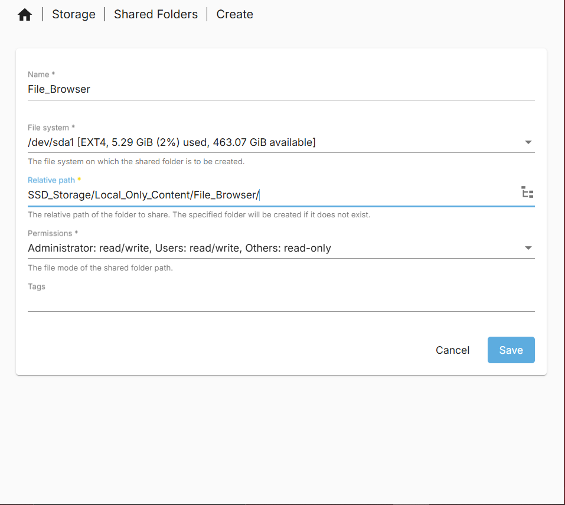
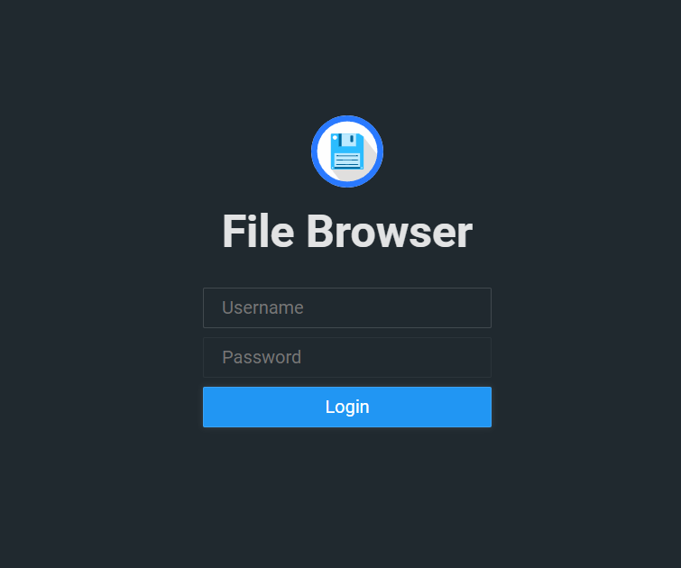
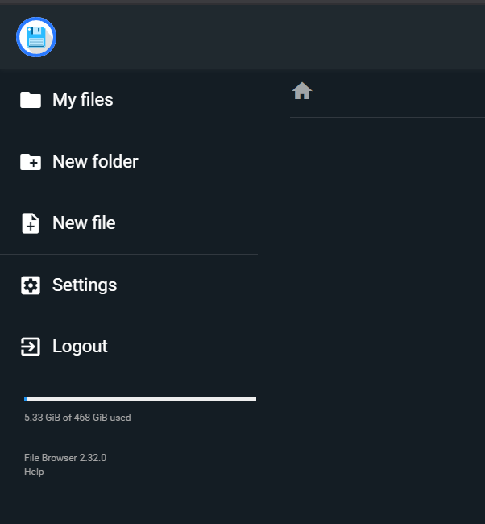
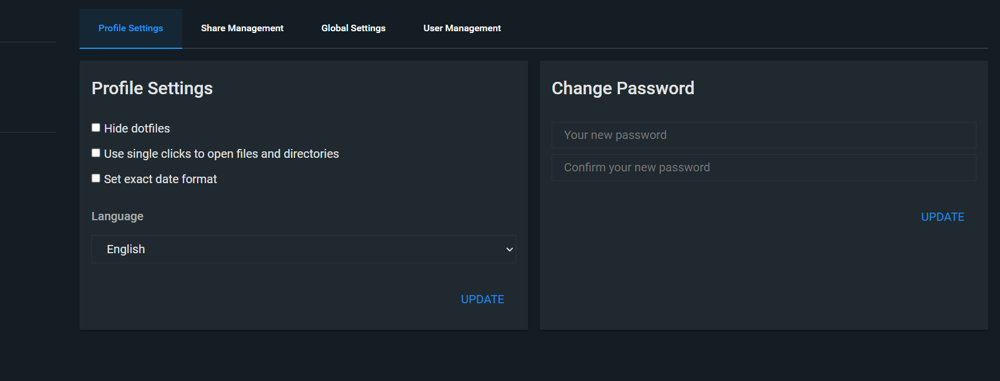
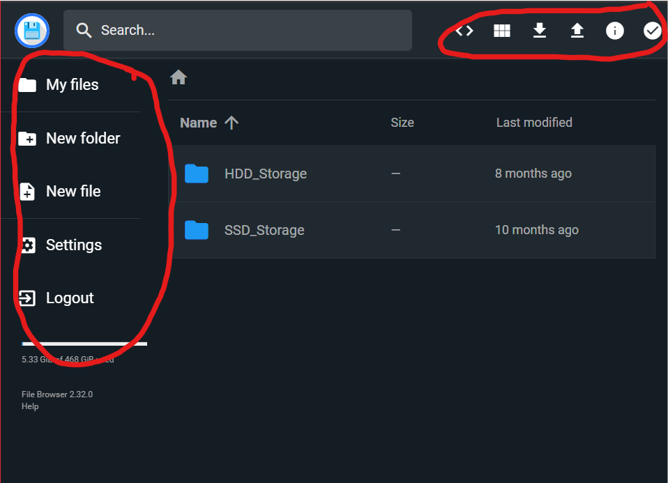
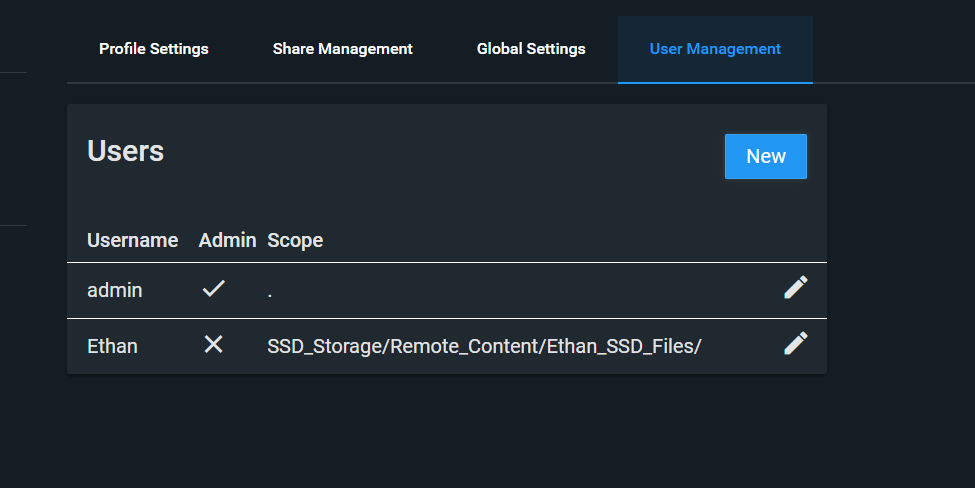

# File browser

_05/06/2025_

Another docker container I will use is [File Browser](https://filebrowser.org/). This docker container will allow me to access the files on my server through a Web UI. Thus, allowing me to access files from any device on my network (local or ZeroTier). This becomes more useful to easily see the folder layout and files on the SSD and HDD storage spaces instead of using SSH. This also becomes more useful when i sync files to my server from my laptops/ desktops in the future.

## File setup

The first stage to getting this docker container installed it to setup the config files and database discussed in [their installation instructions](https://filebrowser.org/installation). My first step is setting up a folder in the `local only content folder` space on the SSD. I will call it `File_Browser` for future reference. My initial file setup is the image bellow:



Make sure to apply the change.

Due to the requirement for a database and a config file i will make specific folders for both of these to more closely follow the installation setup shown in the [File browser install guide](https://filebrowser.org/installation). The process is the same as the one above just inside the folder made.

Make sure to apply the changes.

For the compose file we will need the absolute paths for the database and the config folders/files (we will also need this in a moment for file setup). This can be found by looking at the absolute paths of the shared folders in the web GUI.

For me I have:

- Config Folder = `/srv/dev-disk-by-uuid-00337ac1-aca8-4dc6-b5d7-dfaf50835ac5/SSD_Storage/Local_Only_Content/File_Browser/File_Broswer_Config`

- Database Folder = `/srv/dev-disk-by-uuid-00337ac1-aca8-4dc6-b5d7-dfaf50835ac5/SSD_Storage/Local_Only_Content/File_Browser/File_Broswer_Config_DataBase`

Now we need to SSH into our server and navigate to these folders to add some files(Make sure you are using a user account with SSH access)..

Starting with the config folder, navigate to it then, using the text editor of choice (I will discuss Nano usage) make a file named `settings.json` containing the [baseline config data found on the File Browser GitHub page](https://github.com/filebrowser/filebrowser/blob/master/docker/root/defaults/settings.json). My config is bellow.

```json
{
  "port": 80,
  "baseURL": "",
  "address": "",
  "log": "stdout",
  "database": "/database/filebrowser.db",
  "root": "/srv"
}
```

Commands are as follows:

1) `cd <directory path>`

2) `nano settings.json`

3) Past in config file

4) Save file `CTRL + X`, `Y`, Enter or `CTRL + S`, `CTRL + X`

Now make a plain file named `filebrowser.db` in the database folder using the same technique. Do not type anything into it. Will need to use `CTRL + S` to save the file

Keep note of the absolute paths as you will need it for the compose file

## Making Compose File

The file browser install tutorial does not provide a compose installation method directly but you can convert the docker run command to a compose instruction using a service like [composerize](https://www.composerize.com/) OMV also has an example compose file you can start with. Make sure you have your PUID and PGID numbers of your docker user. You can view these in the page `User Management > Users`.  I have a unique compose file due to how my HDD space and SSD space is separated [this reddit thread](https://www.reddit.com/r/selfhosted/comments/vxo7ga/filebrowser_multiple_directories/) helped me make mine. if you just want one folder remove the extra folder lines in my compose file.

My final compose file can be found bellow:

```yaml
services:
  filebrowser:
    image: filebrowser/filebrowser:latest
    container_name: filebrowser
    environment:
      - PUID=1000
      - PGID=100
    ports:
      - 2007:80
    volumes:
      - /srv/dev-disk-by-uuid-00337ac1-aca8-4dc6-b5d7-dfaf50835ac5/SSD_Storage/Local_Only_Content/File_Browser/srv:/srv # files will be stored here in root folder
      - /srv/dev-disk-by-uuid-00337ac1-aca8-4dc6-b5d7-dfaf50835ac5/SSD_Storage:/srv/SSD_Storage # Extra folder 1 here (SSD space)
      - /Mass_Storage/HDD_Storage:/srv/HDD_Storage # Extra folder 2 here (HDD space)
      - /srv/dev-disk-by-uuid-00337ac1-aca8-4dc6-b5d7-dfaf50835ac5/SSD_Storage/Local_Only_Content/File_Browser/File_Broswer_Config_DataBase/filebrowser.db:/database/filebrowser.db # users info/settings will be stored here
      - /srv/dev-disk-by-uuid-00337ac1-aca8-4dc6-b5d7-dfaf50835ac5/SSD_Storage/Local_Only_Content/File_Browser/File_Broswer_Config/settings.json:/config/settings.json # config file
    restart: unless-stopped
```

The container is ready to launch. Go into the compose files page and click the up button. You should now be able to see the container up and you should be able to navigate the the webpage on the port you have specified.

## Launching, auto Backups and auto update container image

To launch the File Browser container it will be the same as the Heimdall  and UrBackup container, navigate to `Services > Compose > Files`, select the File browser container and select the up button. It will be an arrow pointing up in a circle.

A screen with log commands will appear. Close this when you are done and you will see that the status has changed from `Down` to `Up`. The container is now running.

If like me you have set custom ports it will also show the port numbers. If you have not that will not show.

To automatically backup and update this container image, I will include it in the scheduled task i created for Heimdall. I will navigate to `Services > Compose > Schedule` and click on the scheduled task that at reboot updates and backups containers that it is filtered for. I will then click the pen like icon to edit the task.

Once in the interface you will manually need to type in the filter as the web UI does not make it easy to select multiple containers. It must be noted that all container names must not include spaces. My filter I have to type `Heimdall,eth_urbackup,filebrowser` using commas (`,`) to separate out each container. You could also use `*` to do all containers but i do not as some later containers I add will update more frequently then only at reboot which happens once a month for me.

You can check this works by selecting the scheduled task and clicking the run button. A prompt will come up asking you to start the task. Start the task. Log text will appear and at the end will say done.

Now if you navigate to `Services > Compose > Restore` you should see all your containers backed up in the page.

## Using File Browser

When you first navigate to the file browser web page you will be presented with a login prompt. If you have not already you will need to login with the default admin login of Username = `admin` Password = `admin`.



Please immediately change this password to something strong using a password manager. To do this on the left hand side click the settings icon.



Once in the settings page go into the profile settings page (should already be there).

On this page you should see the area to change your password. Please do this here. You can also see in this profile settings page that you can set:

- to see hidden files (dot files),

- single click to open files and folders,

- set and exact date format,

- set a language.

On the main page you can navigate folders like a normal folder browser. You can add new folders and files on the left hand plane. On the top right options you can:

- enable a shell for shell commands `<>`,

- switch to the different view types,

- Download a file or folder selected (arrow pointing down),

- Upload a file or folder (arrow pointing up),

- get info on a file (i in a circle),

- Toggle multi folder/ file selection
  
  

In the global setting page you can set a few things based on your needs. You can:

- Allow users to signup (I disable this),

- set a user home directory a base path (I disable this),

- Make custom rules,

- Set your preferred theming of the interface,

- adjust chunked upload settings

- user default settings for users

- specific command runner to run after an operation like: copy. delete, etc.

### Creating Normal User

You should not use the admin account when accessing this interface normally. You should make users that access only specific folder spaces depending on what they need. For example, an admin may need access to config files for containers to modify them but, a normal user just trying to access files which sync between their PC/ Laptop and the server only needs access to those files. Therefore, I will make users that can only access certain parts of the SSD or HDD storage spaces.

For now, i will create a folder named `Ethan_SSD_Files` which will eventually contain laptop and PC files. This sits in `SSD_Storage > Remote_Content`. The process to make these users is all the same so my example should apply to any user you may make. Please note however scope can only be applied to one folder so if you were to have an Ethan space in both SSD and HDD then you would have to create two users instead of just one.

Firstly take note of the path to the folder the user should have access to in my case the path is `SSD_Storage/Remote_Content/Ethan_SSD_Files/`. Now from an admin account go into the settings under the User management page. Click on New to add a new user. Here you will set a username and a password. Set a strong password. If you wanted your user to have access to everything then leave scope as a `.`. I prefer to stop a user from being able to change their password requiring admin rights to do so. Therefore, I tick the box to prevent user from changing their password.

I leave everything else the same besides Execute commands i make sure is disabled personally.

The important bit is defining scope. You need to use a file path based on the File Browser setup. So an example which is what i used would be `SSD_Storage/Remote_Content/Ethan_SSD_Files/`. The first folder has no `/` in front of it and the last folder ends with a `/`. Double check everything is spelled correctly in the path and then save the user.

Once this is done you will see your user added to the list with their scope and if they are an admin or not.



Now, if you log out and attempt to login with the user you created, you should see  only the contents of the folder in scope and no other files/ folders.
