# Pi-hole with Unbound

_07/06/2025_

To make my network more secure and to block ads. I will be using [Pi-hole](https://pi-hole.net/) which is a caching [DNS server](https://www.cloudflare.com/en-gb/learning/dns/what-is-a-dns-server/) typically used for making network wide ad blockers. When you type in a web address (eg. Google.com) you actually need the IP address of the server running the service (eg. 8.8.8.8 for googles DNS service). [Pi-hole](https://pi-hole.net/) acts as this DNS server on your network and gives you the ability to block access to certain DNS queries.

[Unbound](unbound.net) is a recursive DNS server in simple terms, it finds the authoritative DNS server (kind of like the master server that tell everyone else) for any particular domain name and gets the IP address from there. The Pi-hole docs have a good [write up](https://docs.pi-hole.net/guides/dns/unbound/) on Unbound.

I will be setting up two containers for this, one for Unbound and one for Pi-hole which will work together to accomplish this goal.

## File Setup

The first step is to setup the config folders and files for unbound and Pi-hole. I will first make two folders in the `local only content folder` space on the SSD. I will call them `Pihole` and `Unbound` for future reference. An example of me setting up the `Pihole` folder can be seen bellow.

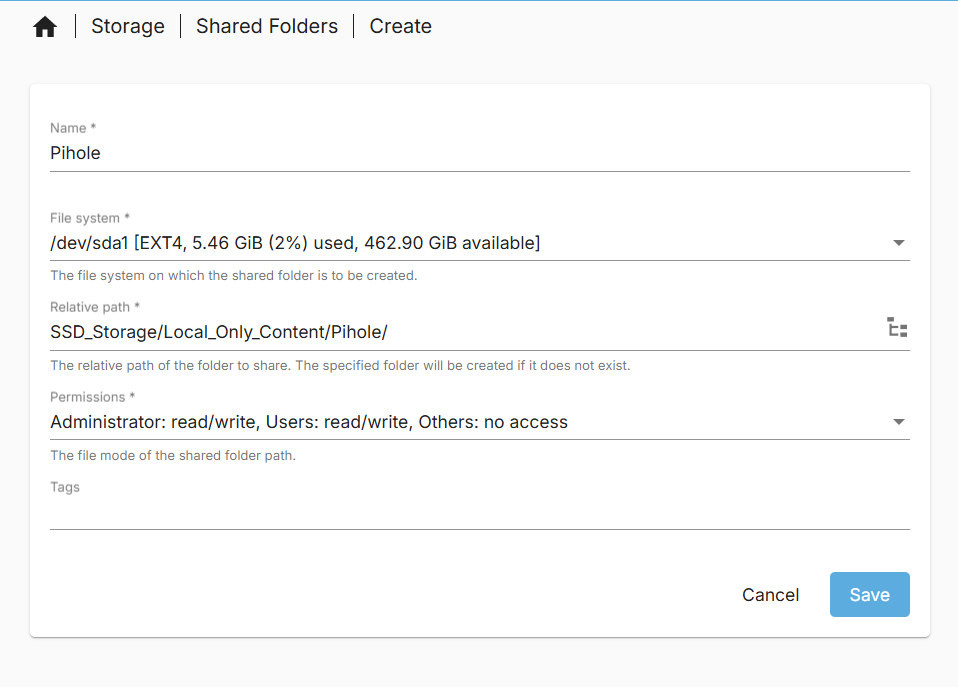

Make sure to apply the changes.

For the compose files we will need the absolute paths for the database and the config folders/files (we will also need this in a moment for unbound config file setup). This can be found by looking at the absolute paths of the shared folders in the web GUI.

For me I have:

- Pi-hole folder = `/srv/dev-disk-by-uuid-00337ac1-aca8-4dc6-b5d7-dfaf50835ac5/SSD_Storage/Local_Only_Content/Pihole`

- Unbound folder = `/srv/dev-disk-by-uuid-00337ac1-aca8-4dc6-b5d7-dfaf50835ac5/SSD_Storage/Local_Only_Content/Unbound`

Unbound requires a config file to be setup in the unbound folder made above before the container is started. This file is called `unbound.conf` which in my case will contain the config data found in the [Pi-Hole Documentation pages](https://docs.pi-hole.net/guides/dns/unbound/) with minor adjustments and some additional config options bellow:

Credit to [JamesTurland](https://github.com/JamesTurland) for his [youtube video](https://www.youtube.com/watch?v=Y3nm519xHfw) and [GitHub file](https://github.com/JamesTurland/JimsGarage/blob/main/Unbound/unbound.conf) for help with this config file and the compose file discussed later.

```yaml
    ### Options to addjust:
    interface: 0.0.0.0@5335
    port: 53

    ### Additional options to add
    # Logging options 0 is minium logs but if encountering issues increase to find potenial isses
    logfile: /var/log/unbound/unbound.log
    verbosity: 0
    directory: "/opt/unbound/etc/unbound"

    username: "_unbound"

    # Access control options. Allows the pihole instance to connect to the Unbound instance
    # If not used Pihole will not be able to use Unbound as upstream server. 
    access-control: 127.0.0.1/32 allow
    access-control: 192.168.0.0/16 allow
    access-control: 172.16.0.0/12 allow
    access-control: 10.0.0.0/8 allow
    access-control: fc00::/7 allow
    access-control: ::1/128 allow
```

To do this we need to:

1) SSH into the server

2) Navigate to the directory we created (absolute path found above)

3) Create a file named `unbound.conf` with the info from the [Pi-Hole Documentation pages](https://docs.pi-hole.net/guides/dns/unbound/). (eg. `nano unbound.conf`)

4) Save the file (eg. `CTRL + S` then `CTRL + X`)

Please note the absolute paths as you will need them for the compose file.

## Making Compose file

I will be combining my docker compose files into one file as both containers are intended to be used together. We will have to configure the docker network so that the pihole container knows where the unbound container is located.

I will be using the [Matthew Vance unbound docker Image](https://hub.docker.com/r/mvance/unbound). In the [README.md](https://github.com/MatthewVance/unbound-docker) there is an example compose file i have slightly modified as i do not need the `forward-records.conf` and `a-record.conf` files. You may want them so have a read of them. My unbound compose file is as follows, note my changes to the port numbers and volumes. This is mainly due to pi hole using the port 53 therefore unbound will be using 5335 which we defined in the config file.

```yaml
version: '3'
services:
  unbound:
    container_name: unbound
    image: "mvance/unbound:latest"
    ports:
      - "5335:53/tcp"
      - "5335:53/udp"
    volumes:
      - "/srv/dev-disk-by-uuid-00337ac1-aca8-4dc6-b5d7-dfaf50835ac5/SSD_Storage/Local_Only_Content/Unbound:/opt/unbound/etc/unbound/"
    restart: unless-stopped
```

Pi-hole provides a compose file that you can use in their [documentation](https://docs.pi-hole.net/docker/) with further information provided in their [Pi-hole docker README.md](https://github.com/pi-hole/docker-pi-hole). Using this information i have modified their default compose file to work for me. I have not put my actual password for security reasons. You should use a strong password as well I have just left an example in. Have a read of their documentation to add anything you may need. Note my addition of the `FTLCONF_dns_upstreams` environment variable. My compose file is bellow:

```yaml
# More info at https://github.com/pi-hole/docker-pi-hole/ and https://docs.pi-hole.net/
services:
  pihole:
    container_name: pihole
    image: pihole/pihole:latest
    ports:
      # DNS Ports
      - "53:53/tcp"
      - "53:53/udp"
      # Default HTTP Port
      - "2008:80/tcp"
      # Default HTTPs Port. FTL will generate a self-signed certificate
      #- "443:443/tcp"
      # Uncomment the below if using Pi-hole as your DHCP Server
      #- "67:67/udp"
      # Uncomment the line below if you are using Pi-hole as your NTP server
      #- "123:123/udp"
    environment:
      # Set the appropriate timezone for your location from
      # https://en.wikipedia.org/wiki/List_of_tz_database_time_zones, e.g:
      TZ: 'Europe/London'
      # Set a password to access the web interface. Not setting one will result in a random password being assigned
      FTLCONF_webserver_api_password: 'correct horse battery staple'
      # If using Docker's default `bridge` network setting the dns listening mode should be set to 'all'
      FTLCONF_dns_listeningMode: 'all'
      # For linking to unbound dns container as dns upstream.
      FTLCONF_dns_upstreams: "127.0.0.1#5335"
    # Volumes store your data between container upgrades
    volumes:
      # For persisting Pi-hole's databases and common configuration file
      - '/srv/dev-disk-by-uuid-00337ac1-aca8-4dc6-b5d7-dfaf50835ac5/SSD_Storage/Local_Only_Content/Pihole:/etc/pihole'
      # Uncomment the below if you have custom dnsmasq config files that you want to persist. Not needed for most starting fresh with Pi-hole v6. If you're upgrading from v5 you and have used this directory before, you should keep it enabled for the first v6 container start to allow for a complete migration. It can be removed afterwards. Needs environment variable FTLCONF_misc_etc_dnsmasq_d: 'true'
      #- './etc-dnsmasq.d:/etc/dnsmasq.d'
    #cap_add:
      # See https://github.com/pi-hole/docker-pi-hole#note-on-capabilities
      # Required if you are using Pi-hole as your DHCP server, else not needed
      #- NET_ADMIN
      # Required if you are using Pi-hole as your NTP client to be able to set the host's system time
      #- SYS_TIME
      # Optional, if Pi-hole should get some more processing time
      #- SYS_NICE
    restart: unless-stopped
```

Now that we have both compose files I will combine them. We must make a few edits to them so that they have a consistant internal docker network and Pihole is able to reach Unbound.

Credit to [JamesTurland](https://github.com/JamesTurland) for his [youtube video](https://www.youtube.com/watch?v=Y3nm519xHfw) and [GitHub file](https://github.com/JamesTurland/JimsGarage/blob/main/Unbound/docker-compose.yaml) for help with this compose file.

The following parameters need to be added to the respective compose files to make it all work:

```yaml
## For creating a docker bridge network to be used by containers
networks:
  dns_net:
    driver: bridge
    ipam:
      config:
      - subnet: 172.27.0.0/16 # Subnet number (specifically the 27) may need to change depending on already running containers. Just increase untill no errors are present.

## In the unbound Service:
# Used to set a consitant internal network for pihole mainly.
    networks:
      dns_net:
        ipv4_address: 172.27.0.8

## In the Pihole service:
# Used to set a consistant pi_hole network address
    networks:
      dns_net:
        ipv4_address: 172.27.0.7

# Adjusted from the default in the environment section to get pihole connected to unbound consistantly.
        FTLCONF_dns_upstreams: "172.27.0.8#5335"
```

Once all the adjustmnets have been made, the compose file should look something like:

```yaml
networks:
  dns_net:
    driver: bridge
    ipam:
      config:
      - subnet: 172.27.0.0/16

services:
  unbound:
    container_name: unbound
    image: "mvance/unbound:latest"
    networks:
      dns_net:
        ipv4_address: 172.27.0.8
    ports:
      - "5335:53/tcp"
      - "5335:53/udp"
    volumes:
      - "/srv/dev-disk-by-uuid-00337ac1-aca8-4dc6-b5d7-dfaf50835ac5/SSD_Storage/Local_Only_Content/Unbound:/opt/unbound/etc/unbound/"
    restart: unless-stopped
  pihole:
    container_name: pihole
    image: pihole/pihole:latest
    networks:
      dns_net:
        ipv4_address: 172.27.0.7
    ports:
      # DNS Ports
      - "53:53/tcp"
      - "53:53/udp"
      # Default HTTP Port
      - "2008:80/tcp"
      # Default HTTPs Port. FTL will generate a self-signed certificate
      #- "443:443/tcp"
      # Uncomment the below if using Pi-hole as your DHCP Server
      #- "67:67/udp"
      # Uncomment the line below if you are using Pi-hole as your NTP server
      #- "123:123/udp"
    environment:
      # Set the appropriate timezone for your location from
      # https://en.wikipedia.org/wiki/List_of_tz_database_time_zones, e.g:
      TZ: 'Europe/London'
      # Set a password to access the web interface. Not setting one will result in a random password being assigned
      FTLCONF_webserver_api_password: 'correct horse battery staple'
      # If using Docker's default `bridge` network setting the dns listening mode should be set to 'all'
      FTLCONF_dns_listeningMode: 'all'
      # For linking to unbound dns container as dns upstream.
      FTLCONF_dns_upstreams: "172.27.0.8#5335"
    # Volumes store your data between container upgrades
    volumes:
      # For persisting Pi-hole's databases and common configuration file
      - '/srv/dev-disk-by-uuid-00337ac1-aca8-4dc6-b5d7-dfaf50835ac5/SSD_Storage/Local_Only_Content/Pihole:/etc/pihole'
      # Uncomment the below if you have custom dnsmasq config files that you want to persist. Not needed for most starting fresh with Pi-hole v6. If you're upgrading from v5 you and have used this directory before, you should keep it enabled for the first v6 container start to allow for a complete migration. It can be removed afterwards. Needs environment variable FTLCONF_misc_etc_dnsmasq_d: 'true'
      #- './etc-dnsmasq.d:/etc/dnsmasq.d'
    #cap_add:
      # See https://github.com/pi-hole/docker-pi-hole#note-on-capabilities
      # Required if you are using Pi-hole as your DHCP server, else not needed
      #- NET_ADMIN
      # Required if you are using Pi-hole as your NTP client to be able to set the host's system time
      #- SYS_TIME
      # Optional, if Pi-hole should get some more processing time
      #- SYS_NICE
    restart: unless-stopped
```

## Launching, auto Backups and auto update container image

Before we can launch our containers we will encounter an issue with Pi-hole starting as port 53 is used by our OS. Normally by a service called `systemd-resolved`. I found a fix for this from Zopyrus on the [Pi-hole forum](https://discourse.pi-hole.net/t/update-what-to-do-if-port-53-is-already-in-use/52033). To fix this:

1) SSH into your server from a sudo enabled account

2) Stop the service with the command `sudo systemctl stop systemd-resolved` as we make adjustments.

3) edit the file `/etc/systemd/resolved.conf` uncommenting the DNSStubListener line and setting it to no `DNSStubListener=no`.

4) Restart the service using the command `sudo service systemd-resolved restart`

5) Make sure when you restart the server the Pi-hole and unbound container launch correctly as it may not due to this issue.

To launch the Pi-hole and Unbound containers, it will be the same as the previous containers in this guide. Navigate to `Services > Compose > Files`, select the container and select the up button. It will be an arrow pointing up in a circle.

A screen with log commands will appear. Close this when you are done and you will see that the status has changed from `Down` to `Up`. The container is now running.

If like me you have set custom ports it will also show the port numbers.

To automatically backup and update this container image, I will include it in the scheduled task i created for updating containers on reboot. I will navigate to `Services > Compose > Schedule` and click on the scheduled task that at reboot, updates and backups containers that it is filtered for. I will then click the pen like icon to edit the task.

Once in the interface you will manually need to type in the filter as the web UI does not make it easy to select multiple containers. It must be noted that all container names must not include spaces. My filter I have to type `Heimdall,Pi_Hole_Unbound,eth_urbackup,filebrowser` using commas (`,`) to separate out each container. You could also use `*` to do all containers but i do not as some later containers I add will update more frequently then only at reboot which happens once a month for me.

You can check this works by selecting the scheduled task and clicking the run button. A prompt will come up asking you to start the task. Start the task. Log text will appear and at the end will say done.

Now if you navigate to `Services > Compose > Restore` you should see all your containers backed up in the page.

## Using/ Setting up Pi hole

Unbound has been configured already thus we only need to go over Pi-holes settings and configuration in it's web GUI. When you first attempt to login to Pi-hole you must type in `/admin` after the host name and port fields. If not you will not see the admin panel. So my http link is `http://hpz240nas.local:2008/admin`. Login with the password you set for Pi-hole in the compose file. You should now see the Pi-hole home page.

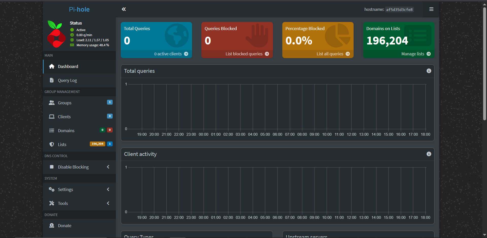

So far we do not see anything going though pi hole. To get our whole network to use this Pi-hole instance we will need to change some router settings. You could also do it on a per device basis but this guide will not go over that.

All routers are different so I would recommend looking up how to change the DNS server on your router. However, the process i will take is likely to be similar to what you would have to do.

Find your router IP address or access method (likely 192.168.1.1) a helpful guide can be found at [Security.org](https://www.security.org/vpn/find-router-ip-address/). I know some routers do not have web interfaces directly accessible. If your router is one where you need an app to connect to it use that. Login to the router using the password you have set, the default one (normally `password`) or the one written on it.

Once in the interface, navigate to your DHCP settings/ DNS settings for me it's under the DHCP settings. Once there type in the IP address for your server (my case 192.168.1.112) running Pi-hole as the primary/ first DNS server. I would highly recommend adding a secondary DNS as a fail over that you are not hosting incase something goes wrong with your Pi-hole/ servers (ie if router can not connect to pihole it fails over to another DNS server). I have set mine to the cloud flare `1.1.1.1` DNS servers but there are others like googles `8.8.8.8` and many more. I would hesitate against google personally as they are an ad company but i leave what you use up to you. I Noticed my router does not have fail over when it does not see pihole and will fail over if it does not get a DNS query response. Thus, I have elected to only use Pihole as my DNS server option and leave the secondary option blank. This does create an issue where if Pihole is down, there is no DNS resolution for your network which can take the network effectivly offline.

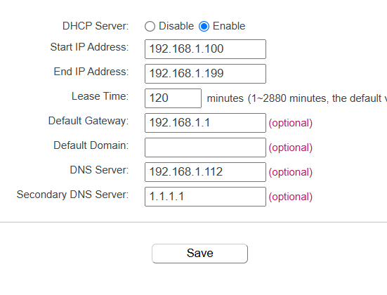

Please note that if you used to have another DNS service running on your router before changing it to your Pi-hole instance you will not see any queries for a while until the device reconnects (At least that is what happened with me).

Once everything is seup there are a few tools you should test your setup with:

1) The first of which is the `nslookup` command in linux, Mac and Windows. This will tell you the IP address of a website name (eg. `google.com`) and the DNS server who answered. The firse bit tells you the server IP address that responded to the DNS query. A similar tool can be found in google chrome but entering ` chrome://net-internals/#dns` the URL bar.

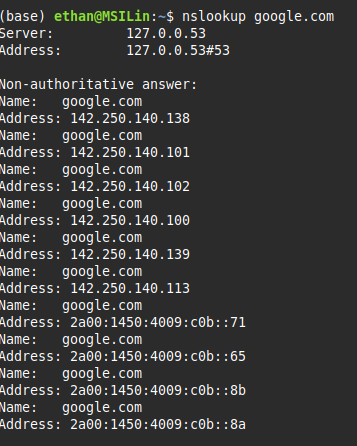

2) The secound is a [DNSSEC Resolver Test](https://wander.science/projects/dns/dnssec-resolver-test/). Just run it in your browser. If it is a sucess then everything is working correctly.

3) Lastly a [DNS leak test](https://www.dnsleaktest.com/) should be run to confirm that the only DNS server being used is the one on your computer. You can do this by running one of the tests in your browser. If the only IP address that appears is your own public IP address then it is likely everything is configured correctly.

An issue i encountered was the Unbound container logging some errors similar to `[1626249031] unbound[110586:0] warning: so-rcvbuf 1048576 was not granted. Got 425984. To fix: start with root permissions(linux) or sysctl bigger net.core.rmem_max(linux) or kern.ipc.maxsockbuf`.

To fix this i found some people discussing it on [Pi-hole github issues](https://github.com/pi-hole/docs/issues/539), and [a raspberry Pi Unbound docker issue](https://github.com/MatthewVance/unbound-docker-rpi/issues/4). The fix appears to be changing a parameter in the `/etc/sysctl.conf` file or running a command to change it temporarily. The fix instructions can be found bellow.

1) Login in to your server via SSH with a sudo enabled account.

2) Using a text editor (Nano in my example) open the file `/etc/sysctl.conf`.

3) Add the line `net.core.rmem_max=1048576`.

4) Save and exit the file (`CTRL+S`then`CTRL+X` for Nano)

5) Reboot the server or run the command `sysctl -w net.core.rmem_max=1048576`.

6) Relaunch the Pi-hole docker compose file (down then up)

That should fix the error message.

Another error that I encountered is a TCP error along the lines of `Connection error (127.0.0.1#5335): TCP connection failed (Connection refused)` in Pi-hole. As of the time of writing, this seems to be an on going issue in [Unbound](https://github.com/NLnetLabs/unbound/issues/1237) and [Pi-hole](https://github.com/pi-hole/pi-hole/issues/6079). It appears to be a Pi-hole issue and I would expect it to maybe, be fixed in a future version of the Unbound config file or Pi-hole version. Just make sure you use the most up to date version of each to try and avoid this issue. From reading the issue discussions it appears to not be a major issue and can be ignored.

### Basic Overview of Pi-hole

Before adding some ad lists we need to do a quick overview of the Pi-hole interface.

- On the home screen/ dashboard you will see:

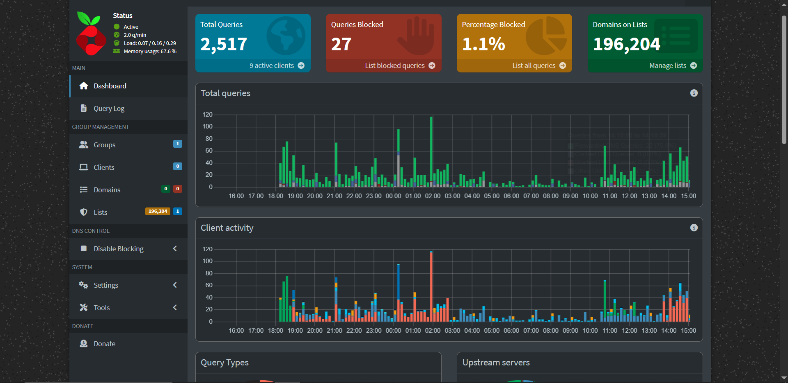

- - The total client queries (clicking on it jumps you to the network tools page)
  
  - The total client queries block (Clicking on it jumps you to the query logs of everything that was blocked)
  
  - The Percentage client queries blocked (Clicking it jumps you to the query log)
  
  - Domains on your lists (Clicking on it jumps you to your lists setting page)
  
  - A chart of all the client queries over 24 hours. Details the amount and the upstream server type (Should mostly be localhost#5335 if you followed my steps.)
  
  - Client activity chart over 24 hours showing the amount of queries by IP address.
  
  - Bellow the charts you have two Pi charts on [Query types](https://en.m.wikipedia.org/wiki/List_of_DNS_record_types) and Upstream server usage.
  
  - Under the pi charts you have Lists of the:
    
    - Top permitted domains
    
    - Top Blocked domains
    
    - Top clients (total)
    
    - Top clients (Blocked only)

- The Next main page is the __Query log__. This page shows all the network queries that have been made to the Pi-hole instance. There are filtering tools if you are curious with specific things. 

- The next main page is the __Group management__ page. This is where you can make groups where you can assign specific block or allow lists to. For example, you could have a default group where you have all your block lists and a personal group with a reduced number of block lists. I will discuss this further in the Section Adding Lists (Block and White).

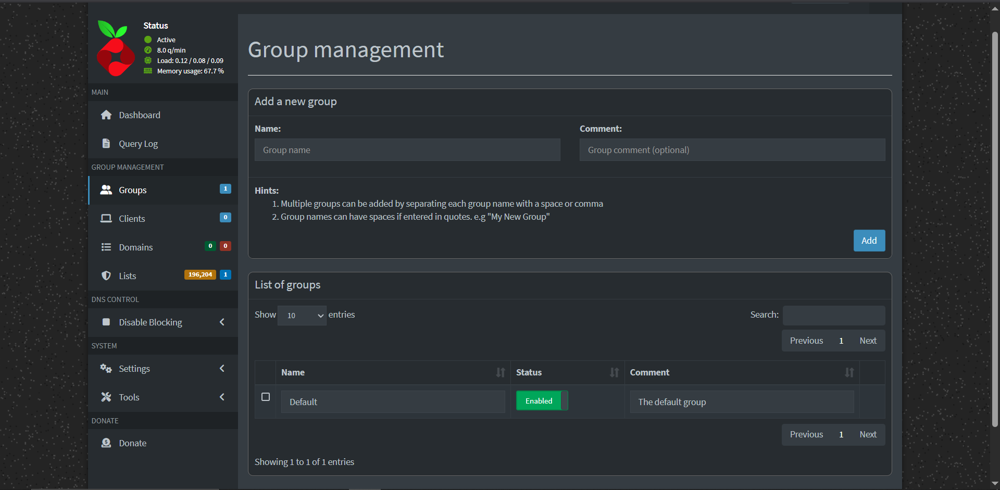

- __Client management__. This is where you can basically assign an IP address a name/ description and change the groups it is assigned to instead of that specific IP address assigned to the default group. This allows you to tailor your devices block lists (eg. child computer has more block lists than adult computer)

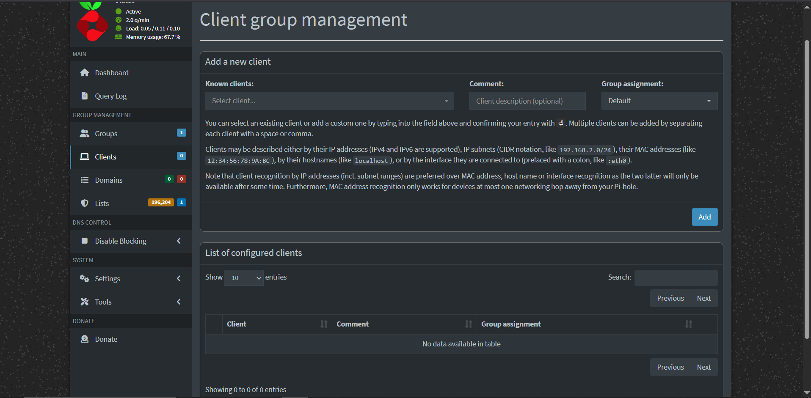

- __Domain Management__. This is where you can set whole domains (eg. google.com) to allow or block. I personally do not use this so i recommend doing your own research on it.

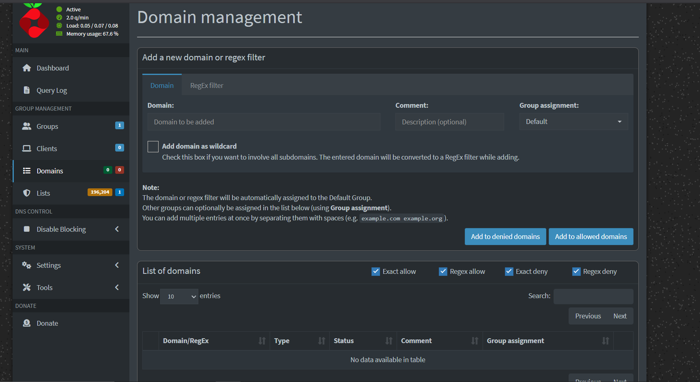

- __Subscribed Lists group Management__. This is where you add in you block/ allow lists and assign them to groups. I will discuss this in the Adding Lists (Block and White Section bellow)

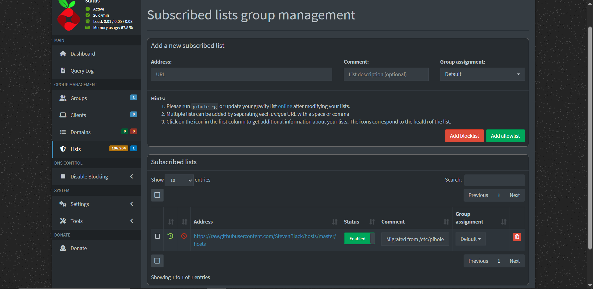

- __Disable blocking__. This option on the left hand panel disables all block lists on your network. This can be very helpful when you are trying to determine if it is the service you are trying to reach with an issue or your Pi-hole instance blocking access for you. Various time lengths available.
- __Settings__. These pages are a collection of setting options. Note you can have Basic or Expert mode on. I do not understand many of these options and recommend you to do your own reasurch
  - System - Shows details on your system running Pi-hole like ip address.
  - DNS Settings - Should be configured in the docker YAML file already, you should see the Unbound 127.0.0.1#5335 field here.
  - DHCP - You can run a DHCP server from Pi-hole, unused in my use case.
  - Web interface/ API settings - Settings related to the web interface of Pi-hole
  - Privacy - Logging options. I log everything cause it helps with bug/ error finding but if you want to be very secure you should not log anything.
  - Teleporter - Import/ export Pi-hole config files to another instance.
  - Local DNS Records - Tell Pi-hole the domain name given to certain IP address. Useful if you want to call a device that only works from IP address by a name. I added my NAS host name as the domain name and attached it's static IP address.
  - All - See all setting above in one page.
- Tools - Some tools available in Pi-hole for updating and testing setup.
  - Pi-hole diagnosis - errors will appear here.
  - Tail log files - A viewer for the log files.
  - Update Gravity - A very important tool used to grab the most up to date date from the block/ allow lists you add. If you ever click the update button do not navigate away from the page until it is finished.
  - Search lists
  - Interfaces - shows the available interfaces on the Pi-hole instance.
  - Network - shows the First and last query made by different IP addresses.
- Donate - A link to the Pi-hole donate page. If you like this software and use it a lot you should consider donating to help fund development on Pi-hole updates and fixes.

### Adding lists (Block and White)

One of the biggest uses of Pi-hole is adding in lists of domains/ IP addresses that are blocked on your network.  I like to use the [Fire bog](https://firebog.net/) block lists.  This website contains links for lists with specific things like Ad lists, Tracking and Telemetry, etc. I will be adding the green lists to my Pi-hole instance under the default group. This lists can sometimes have false positives and block things you actually want. This will require some testing from yourself. There is a thread on Pi-hole about [commonly whitelisted domains](https://discourse.pi-hole.net/t/commonly-whitelisted-domains/212) which i recommend you have a read through.

 To add a list to Pi-hole, get a http link of a list (eg. https://adaway.org/hosts.txt ) go into the lists page from the left hand panel in pi hole. Paste the link into the address field, add a comment so you know what the list is about. And assign it to a specific group/s. Once completed click the add to block list/ add to allow list to add the lists. You have now successfully added a list. A tip is to highlight and copy all the links and paste it into Pi-hole instead of 1 by 1. This will give them all the same comment but that is fine for me at least.

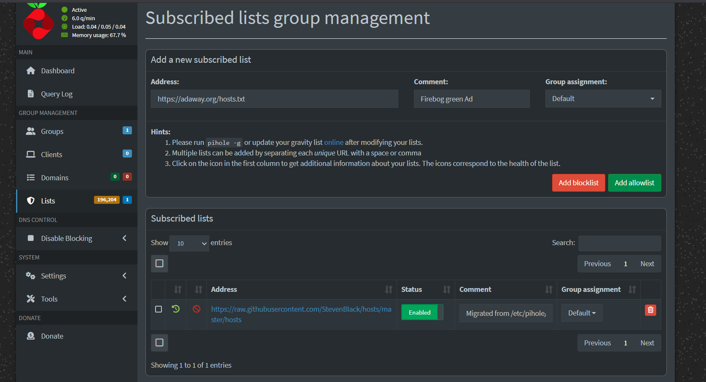

Add as many lists as you see fit.

__Gravity Update:__

Once you have added all the lists you want. Go into `Tools > Update Gravity` and click the update button to pull the lists data into Pi-hole for usage. Once this button is clicked do not navigate away from the page as it will cause issues. Every once in a while you should come back and run and update gravity to be sure your lists are all up to date.

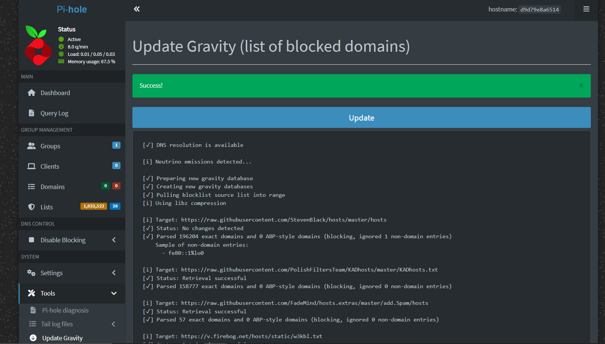

### Adding specific group/s to specific client

Sometimes you may want some device with less lists assigned to them or have certain white lists applied to them. We can accomplish this by adding a client via their IP address and adding specific groups to them.

First we may want to make a group for white listing certain domain for yourself. I have named mine `Eth_White`.

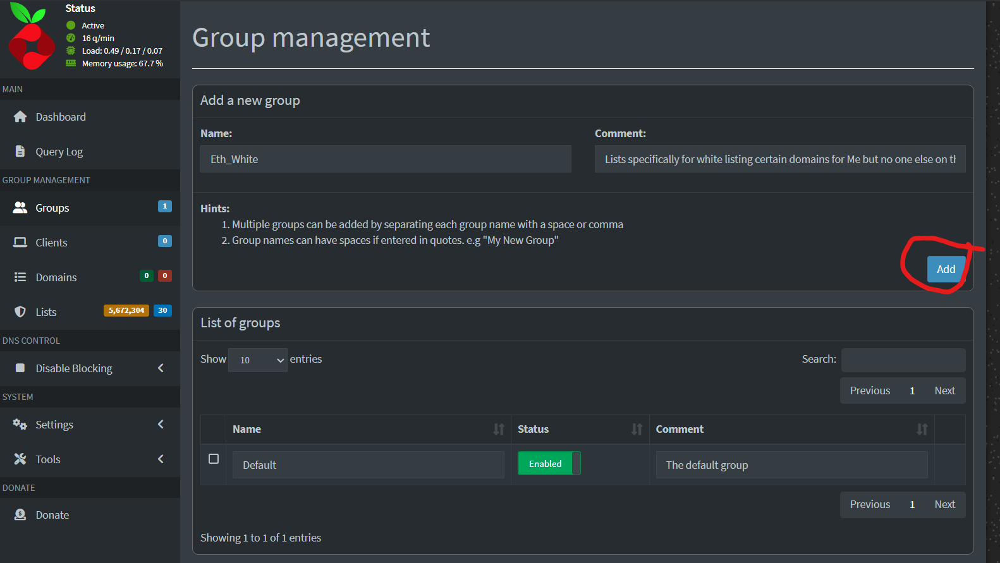

Next we have to add a client (please note the client must have a static IP address How i did it for this NAS can be found under the __Router static IP Address setup__ section under the OMV initial install.) For me I know my phone is `192.168.1.106`. Therefore, I will add that as a client in the client setting menu by selecting the IP address, giving it a name/ comment then assigning the Default group to it and the Eth_Whitelist group.

 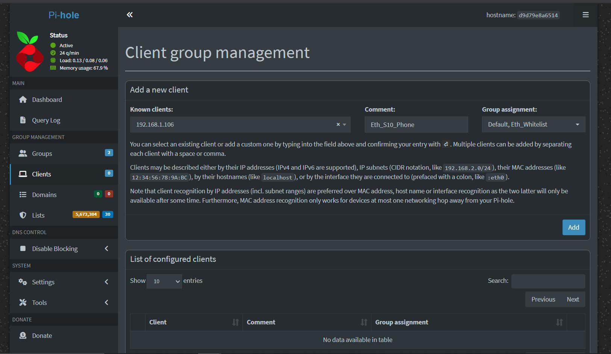

Now, any domains/ lists i add to my White lists will contain addresses that I can access on my phone but no other device will have access.
