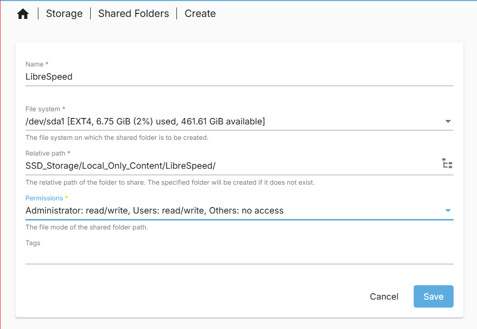
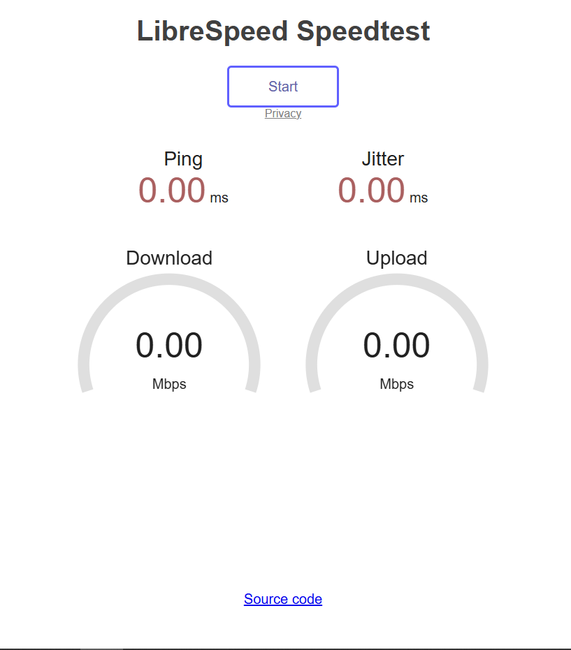
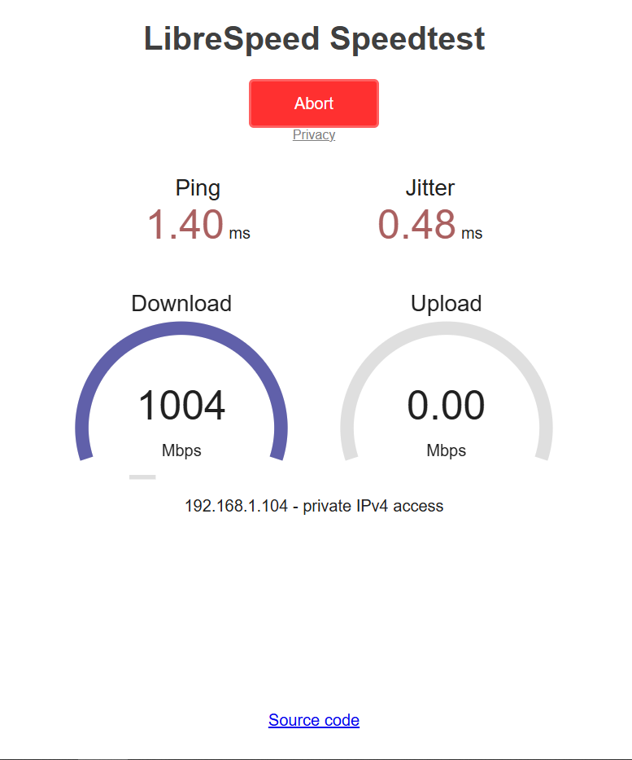
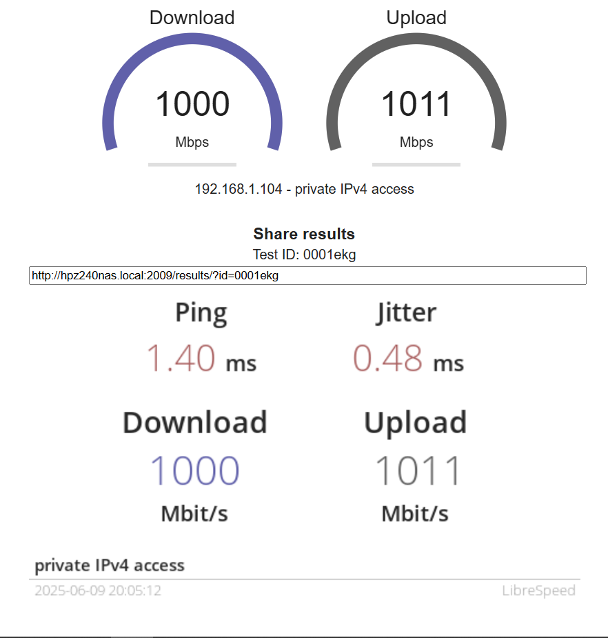
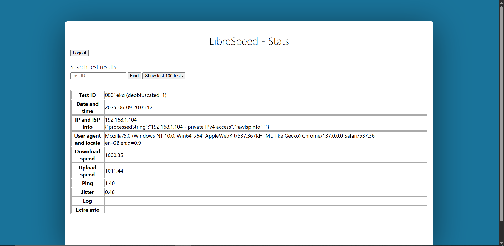

# Libre Speed Test

_09/06/2025_

Sometimes, you want to know the connection speed from your working computer to your server. This can help with debugging server networking issues or predicting roughly how long a file transfer could take. To do this i use a [Libre Speed](https://github.com/librespeed/speedtest), specifically the [Linuxserver.io docker image](https://docs.linuxserver.io/images/docker-librespeed/).

## Folder Creation

The first step is to setup the config folders for the container. I will first make a folder in the `local only content folder` space on the SSD. I will call it `LibreSpeed` for future reference.



Make sure to apply the change.

For the compose files we will need the absolute path. Mine is `/srv/dev-disk-by-uuid-00337ac1-aca8-4dc6-b5d7-dfaf50835ac5/SSD_Storage/Local_Only_Content/LibreSpeed`.

We are now ready to make our compose file.

## Compose file

I will be using the [Librespeed.io image](https://docs.linuxserver.io/images/docker-librespeed/#usage) for my container. In this image there is the option to use a `mysql` or `postgressql` database. I will be using the  default `sqlite` database. There are also custom configuration options which are beyond the scope of this tutorial.

The compose file we need to create requires the following properties.

- PUID and GUID of your docker user. You can find this under in the page `User Management > Users`.
  
  - PUID = 1000 for me
  
  - GUID = 100 for me

- Your time zone code. My is `Europe/London` see [TZ identifier table](https://en.wikipedia.org/wiki/List_of_tz_database_time_zones#List) for yours.

- A strong password (Use a password manager)

- The folder for the config files

My compose file minus the Password can be seen bellow:

```yaml
---
services:
  librespeed:
    image: lscr.io/linuxserver/librespeed:latest
    container_name: librespeed
    environment:
      - PUID=1000
      - PGID=100
      - TZ=Europe/London
      - PASSWORD=PASSWORD
    volumes:
      - /srv/dev-disk-by-uuid-00337ac1-aca8-4dc6-b5d7-dfaf50835ac5/SSD_Storage/Local_Only_Content/LibreSpeed:/config
    ports:
      - 2009:80
    restart: unless-stopped
```

Make sure you have your PUID and PGID numbers of your docker user. You can view these in the page `User Management > Users`.

## Launching, auto Backups and auto update container image

To launch the Libre Speed container, it will be the same as the previous containers in this guide. Navigate to `Services > Compose > Files`, select the container and select the up button. It will be an arrow pointing up in a circle.

A screen with log commands will appear. Close this when it is done and you will see that the status has changed from `Down` to `Up`. The container is now running.

If like me you have set custom ports it will also show the port numbers.

To automatically backup and update this container image, I will include it in the scheduled task i created for updating containers on reboot. I will navigate to `Services > Compose > Schedule` and click on the scheduled task that at reboot, updates and backups containers that it is filtered for. I will then click the pen like icon to edit the task.

Once in the interface you will manually need to type in the filter as the web UI does not make it easy to select multiple containers. It must be noted that all container names must not include spaces. My filter I have to type `Heimdall,Pi_Hole_Unbound,Libre_Speed,eth_urbackup,filebrowser` using commas (`,`) to separate out each container. You could also use `*` to do all containers but i do not as some later containers I add will update more frequently then only at reboot which happens once a month for me.

You can check this works by selecting the scheduled task and clicking the run button. A prompt will come up asking you to start the task. Start the task. Log text will appear and at the end will say done.

Now if you navigate to `Services > Compose > Restore` you should see all your containers backed up in the page.

## Using Libre Speed

Once the container is up and running, we can access the webpage at the address of our server with the port number we configured. For me I have `http://hpz240nas.local:2009/`. This brings us to the testing page, here we can start a test.



Once you hit the start button a network speed test between the device you are on and you server will start. The test will occur in the order:

1) Ping

2) Jitter

3) Download

4) Upload.



Once the test is complete you will be presented with your speed test results. It must be noted that your storage can become a bottle neck. I have mine setup in the SSD storage space. However, if i were to set it up in the HDD storage space i would expect slower speeds due to the HDD not being able to saturate my 1 gigabit link between my computer and the server.



### The speed test logs

Another feature of this container is saving log files of all the speed tests completed. This is where that password in the compose file is used. To access these log files you need to type: `http://<server host name or IP address>:<configured port number>/results/stats.php`. For me i have `http://hpz240nas.local:2009/results/stats.php`. You will first be brought to a login page. Use the password you set in the compose file.

Once login you are able to see the logs of all the speed tests done to your server. This can be useful for debugging network issues.


