# Syncthing

It is important to sync important or working files between devices and to a external server so that files are automatically backed up when created. To sync important files between my computers, phones and servers like iCloud, One Drive, google drive etc. I will be using an open source alternative called [Syncthing](https://syncthing.net/). "Syncthing is a continuous file synchronization program. It synchronizes files between two or more computers in real time, safely protected from prying eyes"([From Syncthing website](https://syncthing.net/)).

I will be using this to primarily sync my password database between all my devices, working files between all my computers, photos from my phone/ computers to the server. There are many more uses of this software but this is my use case. I use this as an instantaneous backup solution as well as my traditional backup solution discussed in the URbackup section.

## Folder Creation

The first step is to setup the config folder for the container. I will first make a folder in the `local only content folder` space on the SSD. I will call it `Syncthing` for future reference.

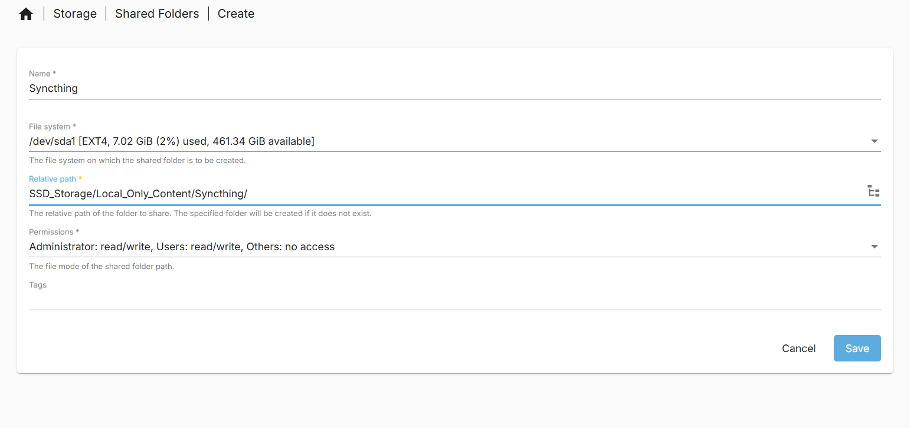

Make sure to apply the change.

For the compose files we will need the absolute path. Mine is `/srv/dev-disk-by-uuid-00337ac1-aca8-4dc6-b5d7-dfaf50835ac5/SSD_Storage/Local_Only_Content/Syncthing`.

We will also need to know the absolute paths to our data folders. This container images allows two folders to be passed to it. There are likely ways to make more available but this guide will not go over it. I will use the data folders:

- `SSD_Storage` to be able to sync any files/folders to any location in the SSD space. Absolute path = `/srv/dev-disk-by-uuid-00337ac1-aca8-4dc6-b5d7-dfaf50835ac5/SSD_Storage`

- `HDD_Storage` to be able to sync any files/ folders to any location in the HDD space. Absolute path = `/Mass_Storage/HDD_Storage`

You can choose any two folders you like. This just makes sense for my use case.

We are now ready to make our compose file.

## Compose file

[Linuxserver.io](https://www.linuxserver.io/) has a [Syncthing docker image](https://docs.linuxserver.io/images/docker-syncthing/) which i will be using on the server.

The compose file we need to create requires the following properties.

- PUID and GUID of your docker user. You can find this under in the page `User Management > Users`.
  
  - PUID = 1000 for me
  
  - GUID = 100 for me

- Your time zone code. My is `Europe/London` see [TZ identifier table](https://en.wikipedia.org/wiki/List_of_tz_database_time_zones#List) for yours.

- The config folder location

- The two data folder locations.

My compose file can be found bellow:

```yaml
---
services:
  syncthing:
    image: lscr.io/linuxserver/syncthing:latest
    container_name: syncthing
    hostname: syncthing #optional
    environment:
      - PUID=1000
      - PGID=100
      - TZ=Europe/London
    volumes:
      - /srv/dev-disk-by-uuid-00337ac1-aca8-4dc6-b5d7-dfaf50835ac5/SSD_Storage/Local_Only_Content/Syncthing:/config
      - /srv/dev-disk-by-uuid-00337ac1-aca8-4dc6-b5d7-dfaf50835ac5/SSD_Storage:/data1
      - /Mass_Storage/HDD_Storage:/data2
    ports:
      - 2010:8384
      - 22000:22000/tcp
      - 22000:22000/udp
      - 21027:21027/udp
    restart: unless-stopped
```

I have changed the `8384` port number for the web UI to be more in line with my other containers. I have left the rest the same to keep the ports constant across all my devices and to leave the discovery functions working.

Take note of what is considered `data1` and `data2` as it will become more important later on.

## Launching, auto Backups and auto update container image

To launch the Syncthing container, it will be the same as the previous containers in this guide. Navigate to `Services > Compose > Files`, select the container and select the up button. It will be an arrow pointing up in a circle.

A screen with log commands will appear. Close this when it is done and you will see that the status has changed from `Down` to `Up`. The container is now running.

If like me you have set custom ports it will also show the port numbers.

To automatically backup and update this container image, I will include it in the scheduled task i created for updating containers on reboot. I will navigate to `Services > Compose > Schedule` and click on the scheduled task that at reboot, updates and backups containers that it is filtered for. I will then click the pen like icon to edit the task.

Once in the interface you will manually need to type in the filter as the web UI does not make it easy to select multiple containers. It must be noted that all container names must not include spaces. My filter I have to type `Heimdall,Pi_Hole_Unbound,Libre_Speed,syncthing,eth_urbackup,filebrowser` using commas (`,`) to separate out each container. You could also use `*` to do all containers but i do not as some later containers I add will update more frequently then only at reboot which happens once a month for me.

You can check this works by selecting the scheduled task and clicking the run button. A prompt will come up asking you to start the task. Start the task. Log text will appear and at the end will say done.

Now if you navigate to `Services > Compose > Restore` you should see all your containers backed up in the page.

## Syncthing Overview

Before we setup our Syncthing on devices like our phone, laptop or computer. Lets have a look at the Server side interface.

When we first access our web interface (mine at `http://hpz240nas.local:2010`) we will see the current status of of Syncthing instance and two prompts urging us to add an admin password to the interface.

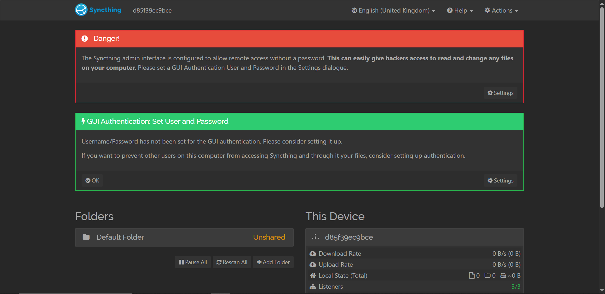

I also urge you to setup a GUI login admin to stop any malicious users on your network.  We can do this through the settings panel.

To access the settings panel click on the actions button (gear like button) on the top right and click on the settings option. You will be taken to the settings panel specifically the general page. In this page you will be able to see:

- Your device a name

- Minimum Free Disk Space - please always have more than zero so that you do not completely fill the drive making you unable to write to log files.

- API key

- Usage reporting setting

- Automatic updates - as using docker can be ignored as you need to update docker image

- Default Configuration settings

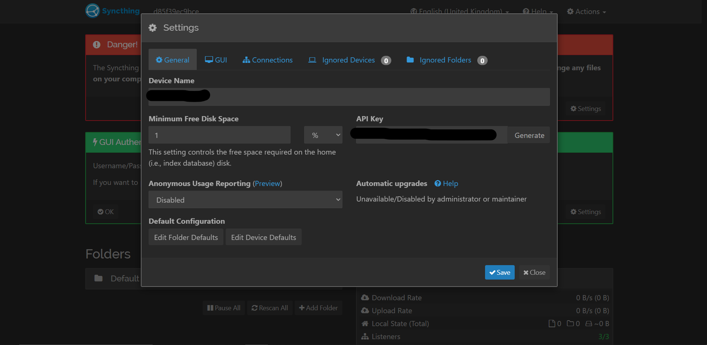

The next page is the GUI settings. This is where you should set a strong admin password and a username of choice. You should not change listening address as this may break the container.

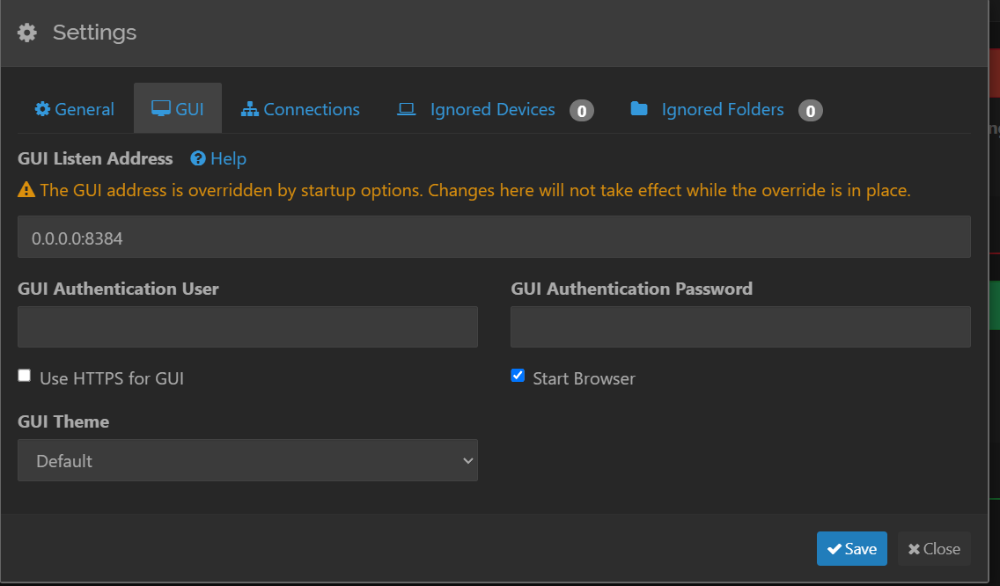

The next page is connections settings. Here you can set an incoming and/or outgoing data rate limit. You can also adjust network discovery settings like NAT traversal, Global discovery, Local Discovery and Relaying. For my use case, I disable all these settings as I give my devices the ZeroTier address or local address of the server/ device. For easier setup of new devices keeping these settings active is ideal as you will not have to tell your devices/ server where to find each other.

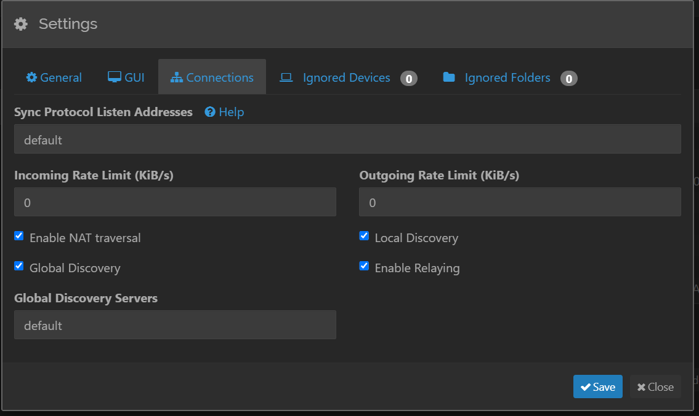

The final two pages are what folders or devices to ignore. I do this on a per client/ folder setup so I leave them blank.

There is an advanced settings panel available but this guide will not go over it. Do not change anything there unless you are an experienced user.

Once we have setup a admin login we can go back to the home page. In the home page we are presented with:

- The Instance Name (top left `HP_Z240_NAS` for me)

- The shared folders under "Folders"

- Language (top right)

- help drop down linking to Syncthing help areas (main page, form, documentation)

- Actions button showing your device ID code and QR code, settings and logs.

- Details on the device the instance is on:
  
  - Current download and upload rate
  
  - Local folders state
  
  - Listeners (the ports where the instance transmits/ receives data)
  
  - Discovery (connections to discovery servers if active)
  
  - Uptime (of instance)
  
  - Identification (device ID use to connect devices)
  
  - version

- Remote devices the the instance can connect to.

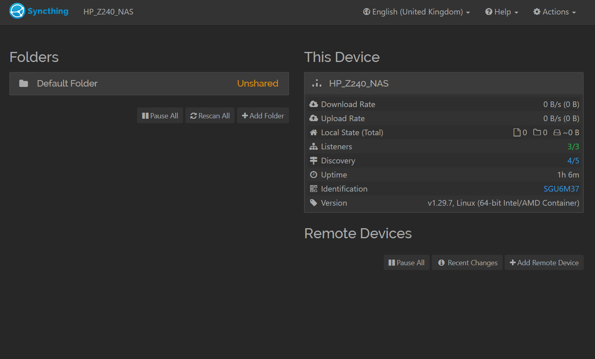

An example of what it may look like populated is bellow from my old server:

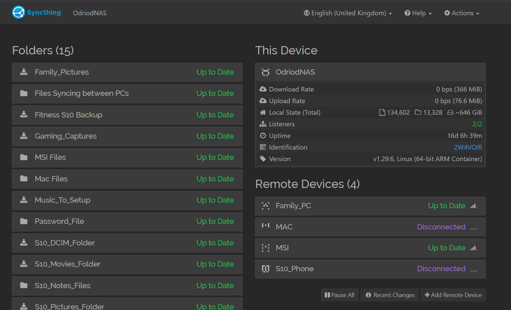

### Connected Remote device

[The Syncthing documentation](https://docs.syncthing.net/v1.29.7/intro/getting-started.html).

To connect a device we first must install Syncthing to an external device. You can find most downloads on the [Syncthing download page](https://syncthing.net/downloads/) note that there are not official android or iPhone apps at the time of writing. There are well made 3rd party apps for interfacing for Syncthing however. You can also use things like [winget](https://winget.run/pkg/SyncTrayzor/SyncTrayzor) for windows and [homebrew](https://formulae.brew.sh/formula/syncthing#default).

Once installed you will need the Device ID. You can find your device ID by clicking on the Identification link under the `This device` section or by clicking the actions button and selecting the show QR code button.

This device ID of you remote device will then be added to your server so remember it.

To add a remote device, click on the `Add Remote Device` button. You will be presented with a variety of settings:

In the General tab:

- Input the device ID

- And give the Remote Device a name. Preferably the one you gave it in the Syncthing GUI on the device.

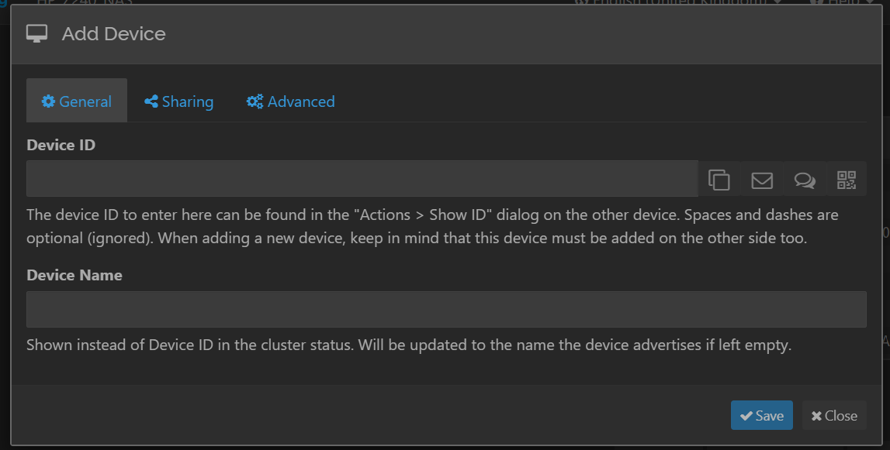

The sharing tab is where you make options related to the shared folder that gets shared with the remote device. You can setup if auto accept if you like but i will not.

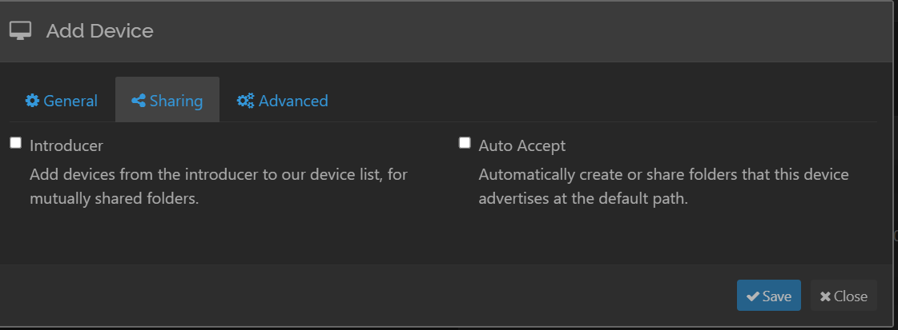

Lastly the advanced tab is where you can:

- Provide the ip address of your device (leave as dynamic if using discovery)

- Adjust connection settings

- Setup untrusted folders

- Adjust compression settings

- Adjust data rates.

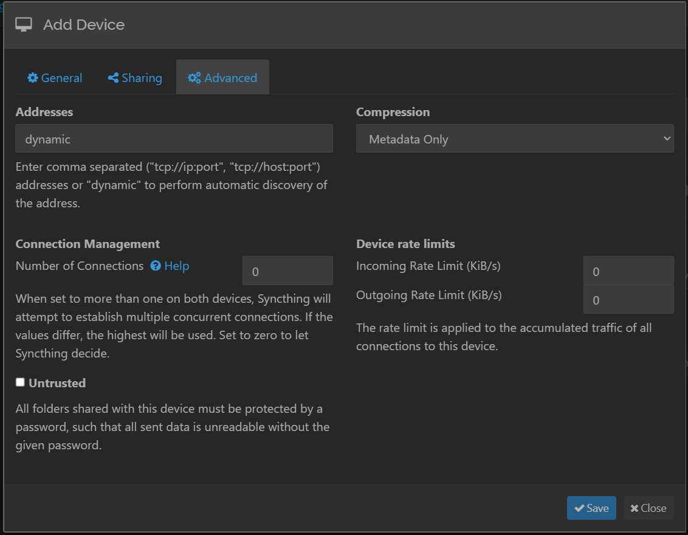

Once a remote device is added we are able to add a folder to our server.

Make sure to accept the remote connection.

### Adding a folder

To add a folder to share to a remote device you first need to add a folder to your instance. Click on the add folder button under the Shared folders section in the GUI. You will be presented with a variety of settings.

In the General tab you will be able to:

- label the folder in the GUI

- Adjust the folder ID

- Adjust the folder path.  For the instance we have setup on our server make sure to start with `/data1` or `/data2` to access the right folder we setup in the compose file.

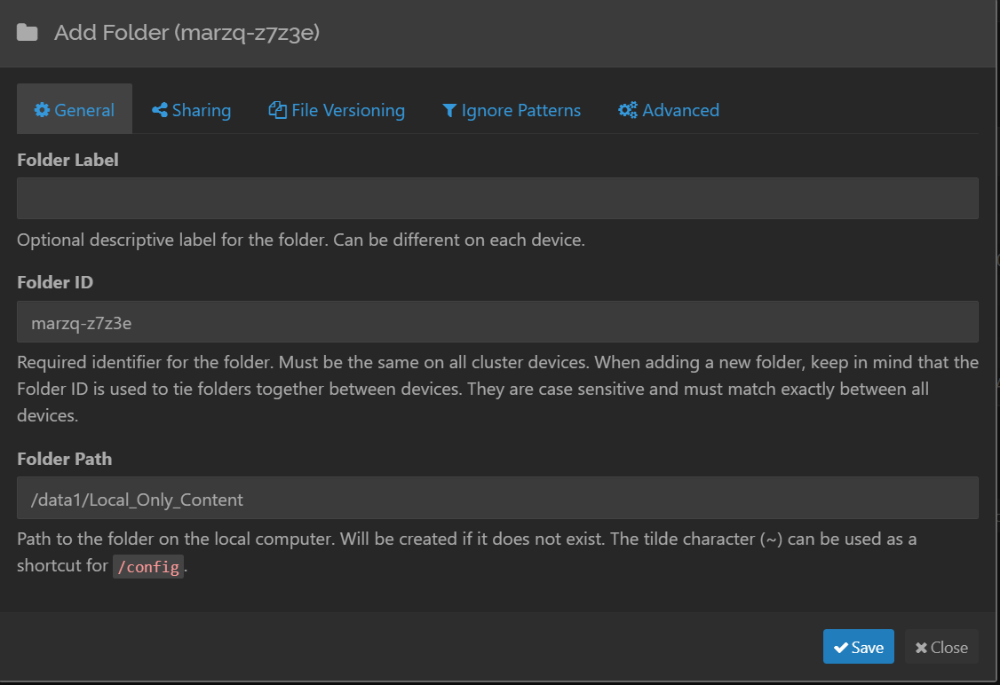

In the sharing tab we are able to adjust which connected devices we are able to share the folder to. We will need to configure this device once it is all confirmed.  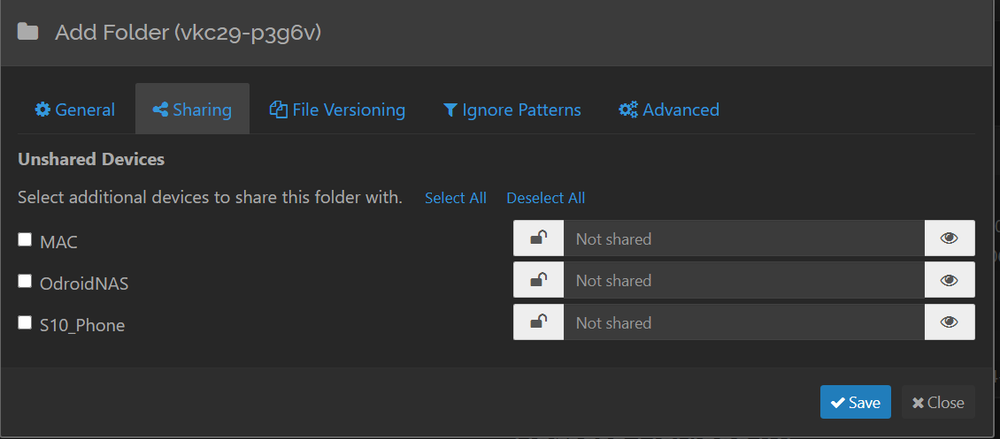

In the File Versioning tab we are able to enable and adjust settings related to the file versioning method. Please read the [Syncthing documentation section](https://docs.syncthing.net/v1.29.7/users/versioning.html) on this to choose what is best for you. The basic overview is:

- Rubbish bin = File is placed in `.stversions` folder when deleted overwriting the file in it if it shares the same name.

- Simple = Same as rubbish bin but you are able to configure how many versions to keep and how often it checks for version count over set cap.

- Staggered = Same as simple but in set time frames instead of in all time.

- External = use of an external command of what to do.

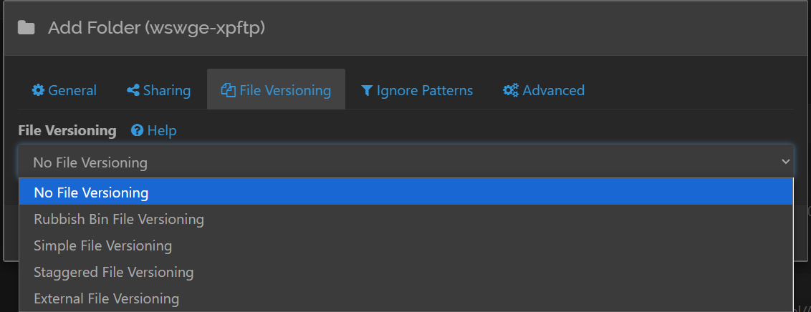

In ignoring patterns, we are able to change what folders/files are ignored in syncing.

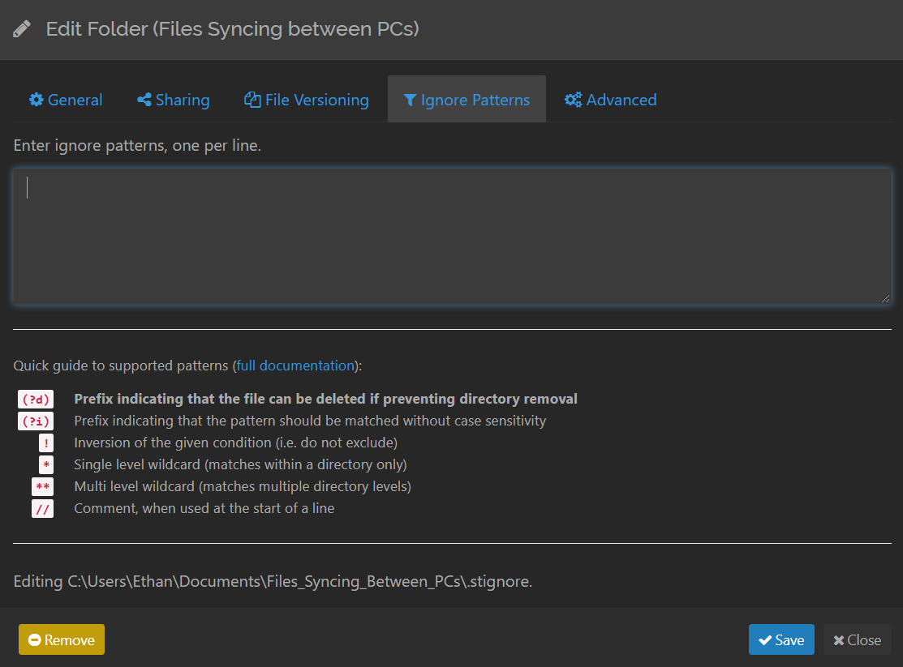

In advanced we are able to:

- Set notifications

- Define the folder type
  
  - Send & Receive - Device and remote are able to send data back and forth
  
  - Send Only - Device is only able to send data it will not receive anything
  
  - Receive Only - Device will only be able to receive data from

- Minimum free disk space (folder specific)

- Full rescan Interval

- File pull order adjustment

- Ignoring permissions possible

- Ownership adjustment settings

- Extended attributes adjustment

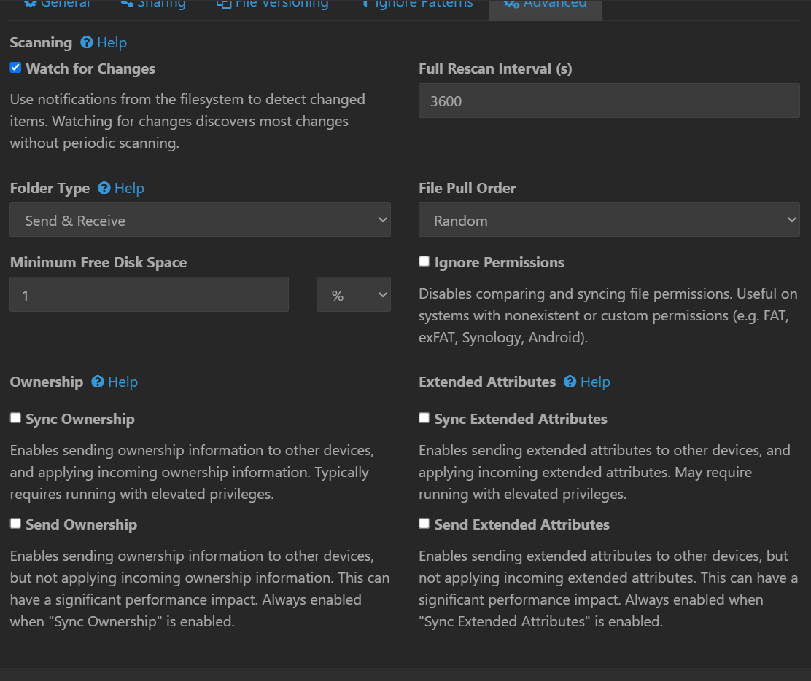

Now that we have created our folder. We are able to add it to the remote device. For a sake of example i have added a shared folder to my Windows PC and have shared it with the NAS.

When we go to the device we have just added a shared folder to (NAS in example case) we must set the folder path for the shared folder to be added.

You have now shared a folder between devices and are using Syncthing. A tip for the HDD space or folders that do not change often is to set the scanning interval very high to reduce on time of the HDDs and compute time of each device.
