# Photo Prism Photos App

All of my pictures from my families computers and phones get synced to this server. To view them i like to use [Photo Prism](https://www.photoprism.app/) a web UI to view and organize your photos. This app does have some limitations which will mean i setup two different instances. One for my family (`photoprism_fam`) and one for myself to help separate personal photos from family ones. This app does use [web dav](https://docs.photoprism.app/user-guide/sync/webdav/) to upload/ sync files from your device to you instance but i just sync all my files to my server using Syncthing instead. There is a downloadable plugin to run Photo Prism on Open Media Vault. I however prefer to manage it through docker.

## Folder Creation

The first step is to setup a few folders for the database and the config files of the container. These should run on fast storage. I will first make two folders in the `local only content folder` space on the SSD. I will call them `Photo_Prism_Eth`  and `Maria_DB_Photo_Eth` for future reference.

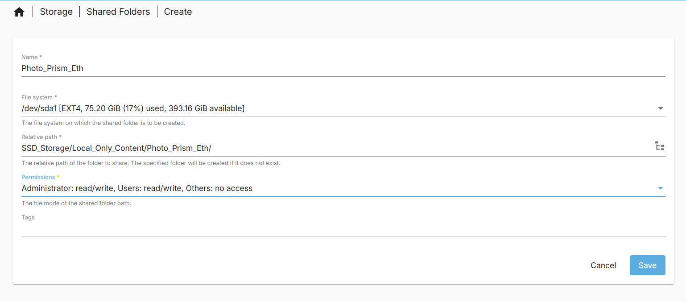

The `Eth` part is due to me wanted to run two instances. The `Photo_Prism` part is for the photo prism container and the `Maria_DB` part is for the Maria data base  container required for photo prism.

The last folder we need to define is the Originals folder. I have previously defined mine when i synced all my photos using Syncthing. I have defined the file path in the bullet points bellow. This is on my HDD space due to not requiring high speed data access or transfer.

For the compose files we will need the absolute paths for the database and the config folders/files. This can be found by looking at the absolute paths of the shared folders in the web GUI.

For me I have:

- `Photo_Prism_Eth` = `/srv/dev-disk-by-uuid-00337ac1-aca8-4dc6-b5d7-dfaf50835ac5/SSD_Storage/Local_Only_Content/Photo_Prism_Eth`

- `Maria_DB_Photo_Eth` = `/srv/dev-disk-by-uuid-00337ac1-aca8-4dc6-b5d7-dfaf50835ac5/SSD_Storage/Local_Only_Content/Maria_DB_Photo_Eth`

- Originals Folder = `/Mass_Storage/HDD_Storage/Remote_Content_HDD/Ethan_Files/Eth_Pics`

We are now ready to start putting together our compose file.

## Compose File

Photo Prism provides a docker compose file and instructions in the [Photo Prism Docker Compose documentation page](https://docs.photoprism.app/getting-started/docker-compose/#__tabbed_1_1) This [compose file](https://dl.photoprism.app/docker/compose.yaml) is the base template that needs to be adjusted depending on your use case. There are a variety of [config options](https://docs.photoprism.app/getting-started/config-options/) that maybe relevant to you so have a read of it.

The most important fields for me will be detailed in the bullet points bellow:

- `restart: unless-stopped` You may want this disabled at first for bug testing purposes and you will want to enable it once all the bugs have been removed.

- `Depends_on: mariadb` this line is very important to tell the server that it needs the Maria DB container being run which is part of the compose file we are writing.

- `Ports:` you may want to change the default port of 2342 that photo prism uses like me but if it is not being used by the host OS you can leave it as is.

- `PHOTOPRISM_ADMIN_USER`/`_PASSWORD` make sure you change this to something secure through something like a password manager.

- `PHOTOPRISM_SITE_URL` Change to match what you want/ have

- `PHOTOPRISM_Originals_LIMIT` May want to change (increase) if you have very large files. default should be good enough for most people however.

- `PHOTOPRISM_READONLY` I have set this to `true` as i do not want the files being modified in the originals folder. This does lead to reduced functionality by not allowing you to use the upload files button in the UI or through the Web Dav functions but, it avoids potential deletion of my files. I also have alternatives to this that i will use.

- `PHOTOPRISM_DISABLE_WEBDAV` I have set this to true as i will not be using any of the web Dav features. You however can change this if you wish to use theses features.

- Disabling features, i do not disable any features beside the web Dav one as i want the face detection and classification to run on my photos.

- `Backup` options. I changed the backup database to weekly as i do not add that many photos on a daily basis. It is in cron format so could be more specific but weekly is frequent enough for me.

- `PHOTOPRISM_INDEX_SCHEDULE` photo prism needs to index all the images before they are visible. By default you have to do this manually. You can however make it run as little or often as you like automatically. I run it weekly so that new photos get indexed by the time i next look through photo prism.

- Database options: 
  
  - You can change the driver to SQL lite which makes the compose file simpler but your instance will not be as performant or scalable to multiple users.  I recommend staying with the recommended MariaDB
  
  - The database server make sure it it the ip/ host name of your system and the port you will specify for your database.
  
  - change the name of your data base if multiple instances will be used.
  
  - Make a secure password that matches the one you gave to the data base portion of the compose file. Use a password manager.

- Using hardware/ software transcoding [doc page](https://docs.photoprism.app/getting-started/advanced/transcoding/).
  
  - there are a few options to use hardware/ software video transcoding. This will reduce network load on your system as the transferred files will be smaller.
  
  - I specifically have an Intel CPU with QSV (Quick Sync video [Intel® Xeon® Processor E3-1245 v5](https://www.intel.com/content/www/us/en/products/sku/88173/intel-xeon-processor-e31245-v5-8m-cache-3-50-ghz/specifications.html)) which means i can use my in built in GPU on the CPU to help encode.
  
  - I would recommend using this if you have a compatible device. As of the time of writing. There appears to be only a few options:
    
    - Intel
    
    - Nvidia
    
    - raspberry pi
    
    - Mac
    
    - software
  
  - There is also a software version available but that puts a lot of load on your CPU which may hard performance of other containers/ tasks on your NAS.
  
  - I recommend having a read of it and make your own decision on it.

- Volumes: This is where you use the absolute paths we found/ setup in the folder setup section. You can add additional original folders instead of just one but i have mine setup in a way where i have it all in one folder. This also applies to the volume set for the MARIA DB container section of the compose file.

- Make sure you change your database name if relevant to you

- Make sure the user and password for the user matches that set in the photo prism environment section.

- Set a strong Maria DB root password using a root password.

- I have removed the watchtower integration for auto updates as i run my own solution but if you want that have a read on it.

My full compose file (ignoring actual passwords) is as follows:

```yaml
services:
  photoprism_eth:
    image: photoprism/photoprism:latest
    restart: unless-stopped
    stop_grace_period: 10s
    depends_on:
      - mariadb_Photo_Eth
    security_opt:
      - seccomp:unconfined
      - apparmor:unconfined
    ports:
      - "2011:2342"
    environment:
      PHOTOPRISM_ADMIN_USER: "admin"                 # admin login username
      PHOTOPRISM_ADMIN_PASSWORD: "insecure"          # initial admin password (8-72 characters)
      PHOTOPRISM_AUTH_MODE: "password"               # authentication mode (public, password)
      PHOTOPRISM_SITE_URL: "http://hpz240nas.local:2011/"  # server URL in the format "http(s)://domain.name(:port)/(path)"
      PHOTOPRISM_DISABLE_TLS: "false"                # disables HTTPS/TLS even if the site URL starts with https:// and a certificate is available
      PHOTOPRISM_DEFAULT_TLS: "true"                 # defaults to a self-signed HTTPS/TLS certificate if no other certificate is available
      PHOTOPRISM_ORIGINALS_LIMIT: 5000               # file size limit for originals in MB (increase for high-res video)
      PHOTOPRISM_HTTP_COMPRESSION: "gzip"            # improves transfer speed and bandwidth utilization (none or gzip)
      PHOTOPRISM_LOG_LEVEL: "info"                   # log level: trace, debug, info, warning, or error
      PHOTOPRISM_READONLY: "true"                   # do not modify originals directory (reduced functionality)
      PHOTOPRISM_EXPERIMENTAL: "false"               # enables experimental features
      PHOTOPRISM_DISABLE_CHOWN: "false"              # disables updating storage permissions via chmod and chown on startup
      PHOTOPRISM_DISABLE_WEBDAV: "true"            # disables built-in WebDAV server
      PHOTOPRISM_DISABLE_SETTINGS: "false"           # disables settings UI and API
      PHOTOPRISM_DISABLE_TENSORFLOW: "false"         # disables all features depending on TensorFlow
      PHOTOPRISM_DISABLE_FACES: "false"              # disables face detection and recognition (requires TensorFlow)
      PHOTOPRISM_DISABLE_CLASSIFICATION: "false"     # disables image classification (requires TensorFlow)
      PHOTOPRISM_DISABLE_VECTORS: "false"            # disables vector graphics support
      PHOTOPRISM_DISABLE_RAW: "false"                # disables indexing and conversion of RAW images
      PHOTOPRISM_RAW_PRESETS: "false"                # enables applying user presets when converting RAW images (reduces performance)
      PHOTOPRISM_SIDECAR_YAML: "true"                # creates YAML sidecar files to back up picture metadata
      PHOTOPRISM_BACKUP_ALBUMS: "true"               # creates YAML files to back up album metadata
      PHOTOPRISM_BACKUP_DATABASE: "true"             # creates regular backups based on the configured schedule
      PHOTOPRISM_BACKUP_SCHEDULE: "weekly"            # backup SCHEDULE in cron format (e.g. "0 12 * * *" for daily at noon) or at a random time (daily, weekly)
      PHOTOPRISM_INDEX_SCHEDULE: "weekly"                  # indexing SCHEDULE in cron format (e.g. "@every 3h" for every 3 hours; "" to disable)
      PHOTOPRISM_AUTO_INDEX: 300                     # delay before automatically indexing files in SECONDS when uploading via WebDAV (-1 to disable)
      PHOTOPRISM_AUTO_IMPORT: -1                     # delay before automatically importing files in SECONDS when uploading via WebDAV (-1 to disable)
      PHOTOPRISM_DETECT_NSFW: "false"                # automatically flags photos as private that MAY be offensive (requires TensorFlow)
      PHOTOPRISM_UPLOAD_NSFW: "true"                 # allows uploads that MAY be offensive (no effect without TensorFlow)
      PHOTOPRISM_UPLOAD_ALLOW: ""                    # restricts uploads to these file types (comma-separated list of EXTENSIONS; leave blank to allow all)
      PHOTOPRISM_UPLOAD_ARCHIVES: "true"             # allows upload of zip archives (will be extracted before import)
      # PHOTOPRISM_DATABASE_DRIVER: "sqlite"         # SQLite is an embedded database that does not require a separate database server
      PHOTOPRISM_DATABASE_DRIVER: "mysql"            # MariaDB 10.5.12+ (MySQL successor) offers significantly better performance compared to SQLite
      PHOTOPRISM_DATABASE_SERVER: "mariadb_Photo_Eth:3306"     # MariaDB database server (hostname:port)
      PHOTOPRISM_DATABASE_NAME: "photoprism_eth"         # MariaDB database, see MARIADB_DATABASE in the mariadb service
      PHOTOPRISM_DATABASE_USER: "photoprism"         # MariaDB database username, must be the same as MARIADB_USER
      PHOTOPRISM_DATABASE_PASSWORD: "insecure"       # MariaDB database password, must be the same as MARIADB_PASSWORD
      PHOTOPRISM_SITE_CAPTION: "AI-Powered Photos App"
      PHOTOPRISM_SITE_DESCRIPTION: ""                # meta site description
      PHOTOPRISM_SITE_AUTHOR: ""                     # meta site author
      PHOTOPRISM_INIT: "intel"            # common options: update https tensorflow tensorflow-gpu intel gpu davfs
      ## Video Transcoding (https://docs.photoprism.app/getting-started/advanced/transcoding/):
      PHOTOPRISM_FFMPEG_ENCODER: "intel"        # H.264/AVC encoder (software, intel, nvidia, apple, raspberry, or vaapi)
      PHOTOPRISM_FFMPEG_SIZE: "3840"               # video size limit in pixels (720-7680) (default: 3840)
      PHOTOPRISM_FFMPEG_BITRATE: "32"              # video bitrate limit in Mbps (default: 60)
      ## Run as a non-root user after initialization (supported: 0, 33, 50-99, 500-600, and 900-1200):
      PHOTOPRISM_UID: 1000
      PHOTOPRISM_GID: 100
      # PHOTOPRISM_UMASK: 0000
    ## Share hardware devices with FFmpeg and TensorFlow (optional):
    devices:
      - "/dev/dri:/dev/dri"                         # Intel QSV
    #  - "/dev/nvidia0:/dev/nvidia0"                 # Nvidia CUDA
    #  - "/dev/nvidiactl:/dev/nvidiactl"
    #  - "/dev/nvidia-modeset:/dev/nvidia-modeset"
    #  - "/dev/nvidia-nvswitchctl:/dev/nvidia-nvswitchctl"
    #  - "/dev/nvidia-uvm:/dev/nvidia-uvm"
    #  - "/dev/nvidia-uvm-tools:/dev/nvidia-uvm-tools"
    #  - "/dev/video11:/dev/video11"                 # Video4Linux Video Encode Device (h264_v4l2m2m)
    working_dir: "/photoprism" # do not change or remove
    ## Storage Folders: "~" is a shortcut for your home directory, "." for the current directory
    volumes:
      # "/host/folder:/photoprism/folder"                # Example
      - "/Mass_Storage/HDD_Storage/Remote_Content_HDD/Ethan_Files/Eth_Pics:/photoprism/originals"               # Original media files (DO NOT REMOVE)
      # - "/example/family:/photoprism/originals/family" # *Additional* media folders can be mounted like this
      # - "~/Import:/photoprism/import"                  # *Optional* base folder from which files can be imported to originals
      - "/srv/dev-disk-by-uuid-00337ac1-aca8-4dc6-b5d7-dfaf50835ac5/SSD_Storage/Local_Only_Content/Photo_Prism_Eth:/photoprism/storage"                  # *Writable* storage folder for cache, database, and sidecar files (DO NOT REMOVE)

  ## MariaDB Database Server (recommended)
  ## see https://docs.photoprism.app/getting-started/faq/#should-i-use-sqlite-mariadb-or-mysql
  mariadb_Photo_Eth:
    image: mariadb:11
    ## If MariaDB gets stuck in a restart loop, this points to a memory or filesystem issue:
    ## https://docs.photoprism.app/getting-started/troubleshooting/#fatal-server-errors
    restart: unless-stopped
    stop_grace_period: 5s
    security_opt: # see https://github.com/MariaDB/mariadb-docker/issues/434#issuecomment-1136151239
      - seccomp:unconfined
      - apparmor:unconfined
    command: --innodb-buffer-pool-size=512M --transaction-isolation=READ-COMMITTED --character-set-server=utf8mb4 --collation-server=utf8mb4_unicode_ci --max-connections=512 --innodb-rollback-on-timeout=OFF --innodb-lock-wait-timeout=120
    ## Never store database files on an unreliable device such as a USB flash drive, an SD card, or a shared network folder:
    volumes:
      - "/srv/dev-disk-by-uuid-00337ac1-aca8-4dc6-b5d7-dfaf50835ac5/SSD_Storage/Local_Only_Content/Maria_DB_Photo_Eth:/var/lib/mysql" # DO NOT REMOVE
    environment:
      MARIADB_AUTO_UPGRADE: "1"
      MARIADB_INITDB_SKIP_TZINFO: "1"
      MARIADB_DATABASE: "photoprism_eth"
      MARIADB_USER: "photoprism"
      MARIADB_PASSWORD: "insecure"
      MARIADB_ROOT_PASSWORD: "insecure"
```

The container is now ready to be deployed.

For a second instance like me make sure you change the folder paths, names and ports of everything to something different/ the target folders. 

## Launching, auto Backups and auto update container image

To launch the Photo Prism container, it will be the same as the previous containers in this guide. Navigate to `Services > Compose > Files`, select the container and select the up button. It will be an arrow pointing up in a circle.

A screen with log commands will appear. Close this when it is done and you will see that the status has changed from `Down` to `Up`. The container is now running.

If like me you have set custom ports it will also show the port numbers.

To automatically backup and update this container image, I will include it in the scheduled task i created for updating containers on reboot. I will navigate to `Services > Compose > Schedule` and click on the scheduled task that at reboot, updates and backups containers that it is filtered for. I will then click the pen like icon to edit the task.

Once in the interface you will manually need to type in the filter as the web UI does not make it easy to select multiple containers. It must be noted that all container names must not include spaces. My filter I have to type `Heimdall,Pi_Hole_Unbound,Libre_Speed,syncthing,PhotoPrism_eth,eth_urbackup,filebrowser` using commas (`,`) to separate out each container. You could also use `*` to do all containers but i do not as some later containers I add will update more frequently then only at reboot which happens once a month for me.

You can check this works by selecting the scheduled task and clicking the run button. A prompt will come up asking you to start the task. Start the task. Log text will appear and at the end will say done.

Now if you navigate to `Services > Compose > Restore` you should see all your containers backed up in the page.

## Photo Prism Overview

When you first login to your Photo Prism instance, you will not see anything in any of the categories.

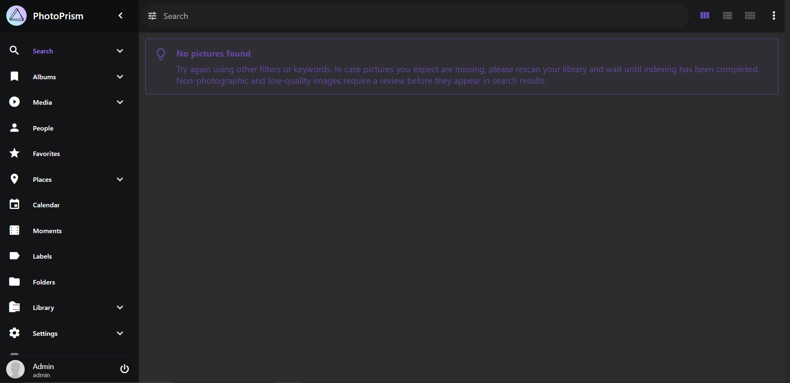

You will need to first index all your photos. This takes up a lot of compute and can take a long time to complete. I recommend running it over night and coming back to it.

To do this, navigate to the Library option on the left hand panel. In here you will see the Index sub panel and the Logs sub panel.  The logs sub panel is as explained and shows all the logs from indexing operations. The first index page is the more important one to look at. In this page you can choose to index all the files in the originals folder set or you could select specific folders. We can also choose to do a complete rescan (useful when cleaning up files) or just new files. Click the start button when ready to index everything.

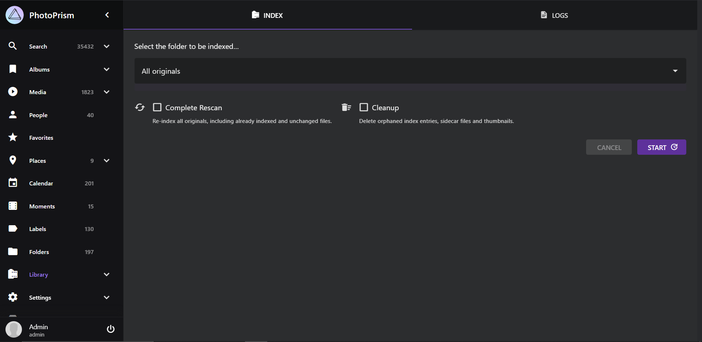

For privacy reasons i will not be using images of my own instance thank you to the Photo Prism team for their [demo page](https://demo.photoprism.app) which these have been taken from. Once everything has been indexed you will see that on the left hand panel there will be all your photos in the search panel like the image bellow. You will also notice in the  left hand panel different categories with different numbers.

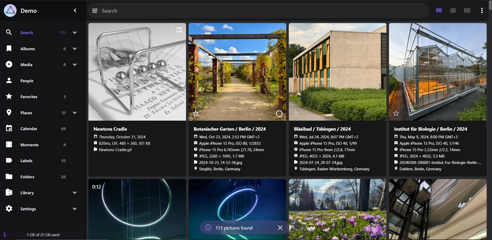

The next page is the album page. You are able to make custom albums comprising or specific folders/ images on your instance. This is useful if you want to collect certain types of images together for example a project.

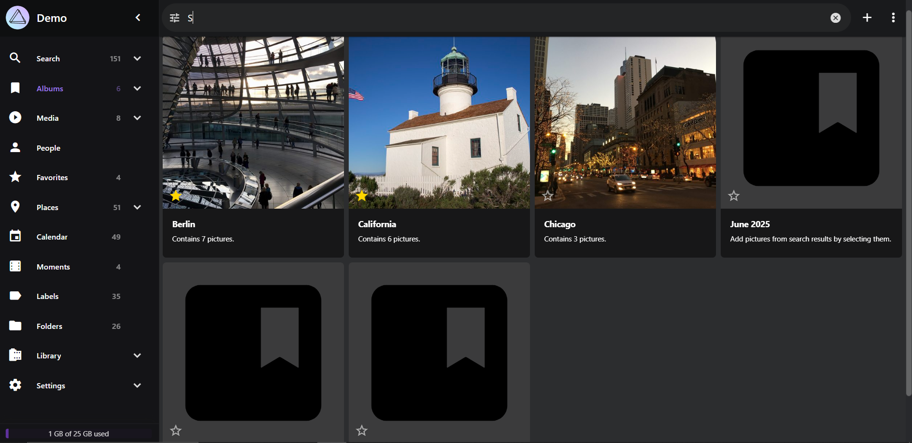

The next page is the media page. This is basically like the search page but for only video like content.

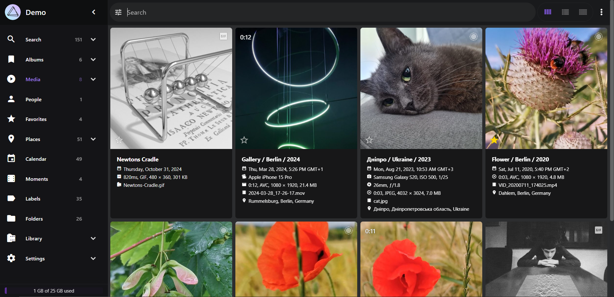

The page after than is the people page. This is the most important page for me. This page is the collection of the all faces detected and the pictures/ videos that contain them. You have two pages. One of named faces that you define and one of faces detected that are not named. This is great if you are looking for pictures of a particular individual.

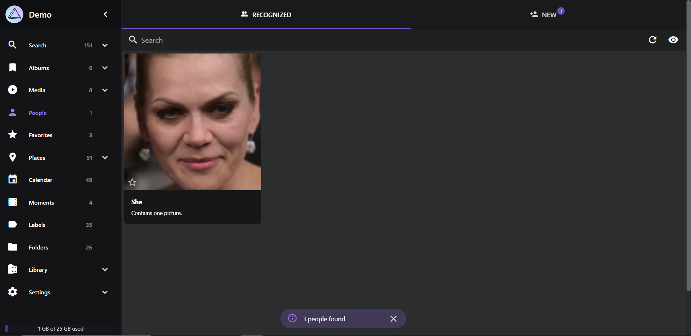

After that you have a page of you favorite media which you have defined using the star next to any piece of media you come across.

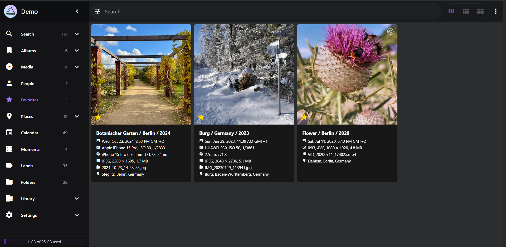

The next page is places. Any geotagged image will be placed on a map which you can navigate and look around in.

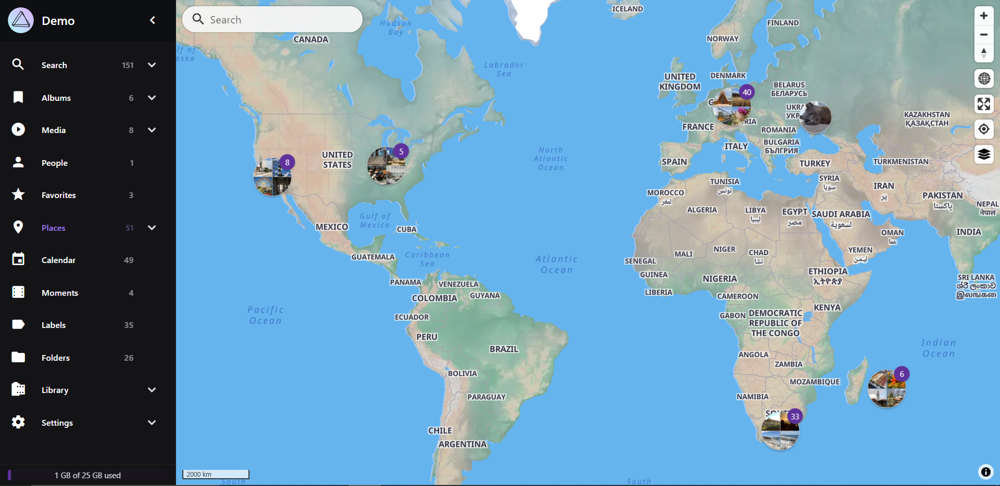

The next page is the calendar page where the date time of the media file is used to organize it by date.

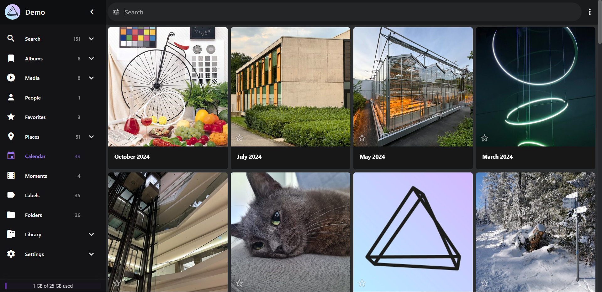

The next two pages named Moments and Labels are very similar. They attempt to group images together with a common theme like. This is things like nature a region in a specific year, etc.

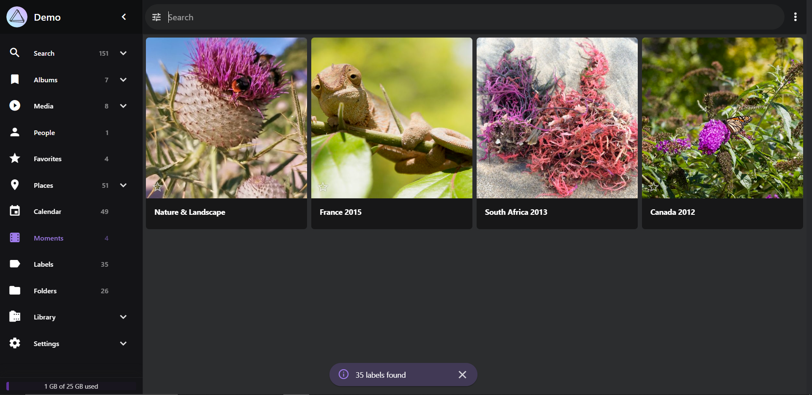

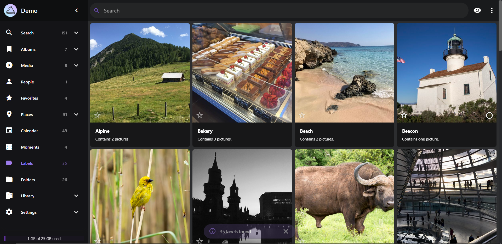

The last important page is the folders page. This page is the folders in your originals folder.

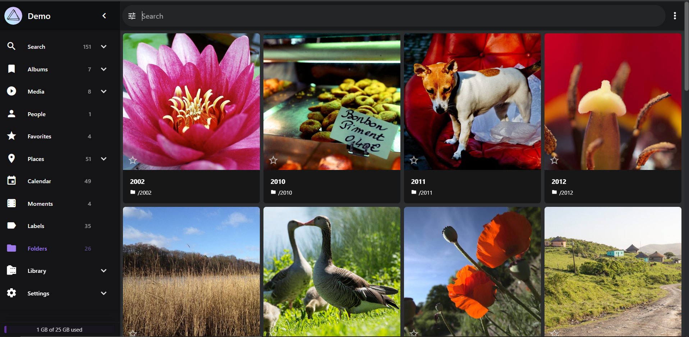
