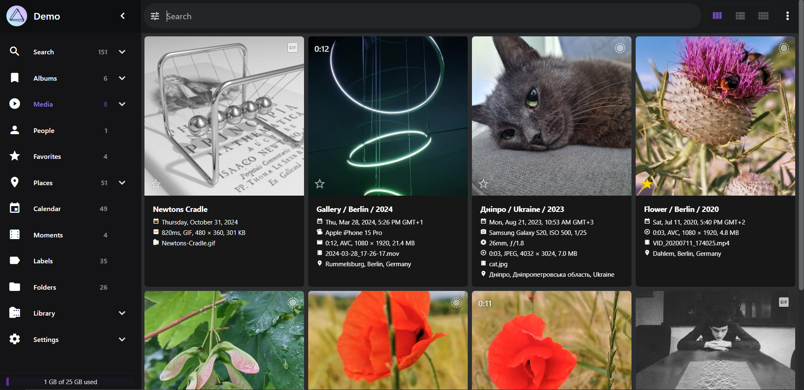

# Who is this guide For

This guide is the path I took to download and install services on my personal Network Attached Server (NAS). This guide is written from the perspective of someone who is somewhat tech literate with Linux and windows but by no means an expert. I am attempting to write these guides so that anyone somewhat tech literate can follow them. I acknowledge that not everyone will be able to follow these guides that i create due to a vast diversity of IT knowledge.

---

TODO: Write on how the repo is organized and link to the other md files with there titles for easy navigation. Slight explaination of each chapter and why it has been made.

TODO: Write on how VS codium is setup for this project.

TODO: Write on the extensions used to manage this repo through vs code/ codium.

TODO: Fix the linting/ formating of all my docs

TODO: Fix all the spelling in my docs and add the dictionary to the workspace so that they can carry over to git.

# The Server

_22/05/2024_


In these guides I am using a HP Z240 server with

- E3-1245 V5 CPU

- 16 GB DDR4 2133 MHz RAM

- 1, 256 GB m.2 NVME SSD

- 1, 512 GB SATA SSD

- 2, 8TB SATA HDDs

# File browser

_05/06/2025_

Another docker container I will use is [File Browser](https://filebrowser.org/). This docker container will allow me to access the files on my server through a Web UI. Thus, allowing me to access files from any device on my network (local or ZeroTier). This becomes more useful to easily see the folder layout and files on the SSD and HDD storage spaces instead of using SSH. This also becomes more useful when i sync files to my server from my laptops/ desktops in the future.

## File setup

The first stage to getting this docker container installed it to setup the config files and database discussed in [their installation instructions](https://filebrowser.org/installation). My first step is setting up a folder in the `local only content folder` space on the SSD. I will call it `File_Browser` for future reference. My initial file setup is the image bellow:


Make sure to apply the change.

Due to the requirement for a database and a config file i will make specific folders for both of these to more closely follow the installation setup shown in the [File browser install guide](https://filebrowser.org/installation). The process is the same as the one above just inside the folder made.

Make sure to apply the changes.

For the compose file we will need the absolute paths for the database and the config folders/files (we will also need this in a moment for file setup). This can be found by looking at the absolute paths of the shared folders in the web GUI.

For me I have:

- Config Folder = `/srv/dev-disk-by-uuid-00337ac1-aca8-4dc6-b5d7-dfaf50835ac5/SSD_Storage/Local_Only_Content/File_Browser/File_Broswer_Config`

- Database Folder = `/srv/dev-disk-by-uuid-00337ac1-aca8-4dc6-b5d7-dfaf50835ac5/SSD_Storage/Local_Only_Content/File_Browser/File_Broswer_Config_DataBase`

Now we need to SSH into our server and navigate to these folders to add some files(Make sure you are using a user account with SSH access)..

Starting with the config folder, navigate to it then, using the text editor of choice (I will discuss Nano usage) make a file named `settings.json` containing the [baseline config data found on the File Browser GitHub page](https://github.com/filebrowser/filebrowser/blob/master/docker/root/defaults/settings.json). My config is bellow.

```json
{
  "port": 80,
  "baseURL": "",
  "address": "",
  "log": "stdout",
  "database": "/database/filebrowser.db",
  "root": "/srv"
}
```

Commands are as follows:

1) `cd <directory path>`

2) `nano settings.json`

3) Past in config file

4) Save file `CTRL + X`, `Y`, Enter or `CTRL + S`, `CTRL + X`

Now make a plain file named `filebrowser.db` in the database folder using the same technique. Do not type anything into it. Will need to use `CTRL + S` to save the file

Keep note of the absolute paths as you will need it for the compose file

## Making Compose File

The file browser install tutorial does not provide a compose installation method directly but you can convert the docker run command to a compose instruction using a service like [composerize](https://www.composerize.com/) OMV also has an example compose file you can start with. Make sure you have your PUID and PGID numbers of your docker user. You can view these in the page `User Management > Users`.  I have a unique compose file due to how my HDD space and SSD space is separated [this reddit thread](https://www.reddit.com/r/selfhosted/comments/vxo7ga/filebrowser_multiple_directories/) helped me make mine. if you just want one folder remove the extra folder lines in my compose file.

My final compose file can be found bellow:

```yaml
services:
  filebrowser:
    image: filebrowser/filebrowser:latest
    container_name: filebrowser
    environment:
      - PUID=1000
      - PGID=100
    ports:
      - 2007:80
    volumes:
      - /srv/dev-disk-by-uuid-00337ac1-aca8-4dc6-b5d7-dfaf50835ac5/SSD_Storage/Local_Only_Content/File_Browser/srv:/srv # files will be stored here in root folder
      - /srv/dev-disk-by-uuid-00337ac1-aca8-4dc6-b5d7-dfaf50835ac5/SSD_Storage:/srv/SSD_Storage # Extra folder 1 here (SSD space)
      - /Mass_Storage/HDD_Storage:/srv/HDD_Storage # Extra folder 2 here (HDD space)
      - /srv/dev-disk-by-uuid-00337ac1-aca8-4dc6-b5d7-dfaf50835ac5/SSD_Storage/Local_Only_Content/File_Browser/File_Broswer_Config_DataBase/filebrowser.db:/database/filebrowser.db # users info/settings will be stored here
      - /srv/dev-disk-by-uuid-00337ac1-aca8-4dc6-b5d7-dfaf50835ac5/SSD_Storage/Local_Only_Content/File_Browser/File_Broswer_Config/settings.json:/config/settings.json # config file
    restart: unless-stopped
```

The container is ready to launch. Go into the compose files page and click the up button. You should now be able to see the container up and you should be able to navigate the the webpage on the port you have specified.

## Launching, auto Backups and auto update container image

To launch the File Browser container it will be the same as the Heimdall  and UrBackup container, navigate to `Services > Compose > Files`, select the File browser container and select the up button. It will be an arrow pointing up in a circle.

A screen with log commands will appear. Close this when you are done and you will see that the status has changed from `Down` to `Up`. The container is now running.

If like me you have set custom ports it will also show the port numbers. If you have not that will not show.

To automatically backup and update this container image, I will include it in the scheduled task i created for Heimdall. I will navigate to `Services > Compose > Schedule` and click on the scheduled task that at reboot updates and backups containers that it is filtered for. I will then click the pen like icon to edit the task.

Once in the interface you will manually need to type in the filter as the web UI does not make it easy to select multiple containers. It must be noted that all container names must not include spaces. My filter I have to type `Heimdall,eth_urbackup,filebrowser` using commas (`,`) to separate out each container. You could also use `*` to do all containers but i do not as some later containers I add will update more frequently then only at reboot which happens once a month for me.

You can check this works by selecting the scheduled task and clicking the run button. A prompt will come up asking you to start the task. Start the task. Log text will appear and at the end will say done.

Now if you navigate to `Services > Compose > Restore` you should see all your containers backed up in the page.

## Using File Browser

When you first navigate to the file browser web page you will be presented with a login prompt. If you have not already you will need to login with the default admin login of Username = `admin` Password = `admin`.


Please immediately change this password to something strong using a password manager. To do this on the left hand side click the settings icon.


Once in the settings page go into the profile settings page (should already be there).

On this page you should see the area to change your password. Please do this here. You can also see in this profile settings page that you can set:

- to see hidden files (dot files),

- single click to open files and folders,

- set and exact date format,

- set a language.

On the main page you can navigate folders like a normal folder browser. You can add new folders and files on the left hand plane. On the top right options you can:

- enable a shell for shell commands `<>`,

- switch to the different view types,

- Download a file or folder selected (arrow pointing down),

- Upload a file or folder (arrow pointing up),

- get info on a file (i in a circle),

- Toggle multi folder/ file selection
  
  

In the global setting page you can set a few things based on your needs. You can:

- Allow users to signup (I disable this),

- set a user home directory a base path (I disable this),

- Make custom rules,

- Set your preferred theming of the interface,

- adjust chunked upload settings

- user default settings for users

- specific command runner to run after an operation like: copy. delete, etc.

### Creating Normal User

You should not use the admin account when accessing this interface normally. You should make users that access only specific folder spaces depending on what they need. For example, an admin may need access to config files for containers to modify them but, a normal user just trying to access files which sync between their PC/ Laptop and the server only needs access to those files. Therefore, I will make users that can only access certain parts of the SSD or HDD storage spaces.

For now, i will create a folder named `Ethan_SSD_Files` which will eventually contain laptop and PC files. This sits in `SSD_Storage > Remote_Content`. The process to make these users is all the same so my example should apply to any user you may make. Please note however scope can only be applied to one folder so if you were to have an Ethan space in both SSD and HDD then you would have to create two users instead of just one.

Firstly take note of the path to the folder the user should have access to in my case the path is `SSD_Storage/Remote_Content/Ethan_SSD_Files/`. Now from an admin account go into the settings under the User management page. Click on New to add a new user. Here you will set a username and a password. Set a strong password. If you wanted your user to have access to everything then leave scope as a `.`. I prefer to stop a user from being able to change their password requiring admin rights to do so. Therefore, I tick the box to prevent user from changing their password.

I leave everything else the same besides Execute commands i make sure is disabled personally.

The important bit is defining scope. You need to use a file path based on the File Browser setup. So an example which is what i used would be `SSD_Storage/Remote_Content/Ethan_SSD_Files/`. The first folder has no `/` in front of it and the last folder ends with a `/`. Double check everything is spelled correctly in the path and then save the user.

Once this is done you will see your user added to the list with their scope and if they are an admin or not.


Now, if you log out and attempt to login with the user you created, you should see  only the contents of the folder in scope and no other files/ folders.

# Pi-hole with Unbound

_07/06/2025_

To make my network more secure and to block ads. I will be using [Pi-hole](https://pi-hole.net/) which is a caching [DNS server](https://www.cloudflare.com/en-gb/learning/dns/what-is-a-dns-server/) typically used for making network wide ad blockers. When you type in a web address (eg. Google.com) you actually need the IP address of the server running the service (eg. 8.8.8.8 for googles DNS service). [Pi-hole](https://pi-hole.net/) acts as this DNS server on your network and gives you the ability to block access to certain DNS queries.

[Unbound](unbound.net) is a recursive DNS server in simple terms, it finds the authoritative DNS server (kind of like the master server that tell everyone else) for any particular domain name and gets the IP address from there. The Pi-hole docs have a good [write up](https://docs.pi-hole.net/guides/dns/unbound/) on Unbound.

I will be setting up two containers for this, one for Unbound and one for Pi-hole which will work together to accomplish this goal.

## File Setup

The first step is to setup the config folders and files for unbound and Pi-hole. I will first make two folders in the `local only content folder` space on the SSD. I will call them `Pihole` and `Unbound` for future reference. An example of me setting up the `Pihole` folder can be seen bellow.


Make sure to apply the changes.

For the compose files we will need the absolute paths for the database and the config folders/files (we will also need this in a moment for unbound config file setup). This can be found by looking at the absolute paths of the shared folders in the web GUI.

For me I have:

- Pi-hole folder = `/srv/dev-disk-by-uuid-00337ac1-aca8-4dc6-b5d7-dfaf50835ac5/SSD_Storage/Local_Only_Content/Pihole`

- Unbound folder = `/srv/dev-disk-by-uuid-00337ac1-aca8-4dc6-b5d7-dfaf50835ac5/SSD_Storage/Local_Only_Content/Unbound`

Unbound requires a config file to be setup in the unbound folder made above before the container is started. This file is called `unbound.conf` which in my case will contain the config data found in the [Pi-Hole Documentation pages](https://docs.pi-hole.net/guides/dns/unbound/) with minor adjustments and some additional config options bellow:

Credit to [JamesTurland](https://github.com/JamesTurland) for his [youtube video](https://www.youtube.com/watch?v=Y3nm519xHfw) and [GitHub file](https://github.com/JamesTurland/JimsGarage/blob/main/Unbound/unbound.conf) for help with this config file and the compose file discussed later.

```yaml
    ### Options to addjust:
    interface: 0.0.0.0@5335
    port: 53

    ### Additional options to add
    # Logging options 0 is minium logs but if encountering issues increase to find potenial isses
    logfile: /var/log/unbound/unbound.log
    verbosity: 0
    directory: "/opt/unbound/etc/unbound"

    username: "_unbound"

    # Access control options. Allows the pihole instance to connect to the Unbound instance
    # If not used Pihole will not be able to use Unbound as upstream server. 
    access-control: 127.0.0.1/32 allow
    access-control: 192.168.0.0/16 allow
    access-control: 172.16.0.0/12 allow
    access-control: 10.0.0.0/8 allow
    access-control: fc00::/7 allow
    access-control: ::1/128 allow
```

To do this we need to:

1) SSH into the server

2) Navigate to the directory we created (absolute path found above)

3) Create a file named `unbound.conf` with the info from the [Pi-Hole Documentation pages](https://docs.pi-hole.net/guides/dns/unbound/). (eg. `nano unbound.conf`)

4) Save the file (eg. `CTRL + S` then `CTRL + X`)

Please note the absolute paths as you will need them for the compose file.

## Making Compose file

I will be combining my docker compose files into one file as both containers are intended to be used together. We will have to configure the docker network so that the pihole container knows where the unbound container is located.

I will be using the [Matthew Vance unbound docker Image](https://hub.docker.com/r/mvance/unbound). In the [README.md](https://github.com/MatthewVance/unbound-docker) there is an example compose file i have slightly modified as i do not need the `forward-records.conf` and `a-record.conf` files. You may want them so have a read of them. My unbound compose file is as follows, note my changes to the port numbers and volumes. This is mainly due to pi hole using the port 53 therefore unbound will be using 5335 which we defined in the config file.

```yaml
version: '3'
services:
  unbound:
    container_name: unbound
    image: "mvance/unbound:latest"
    ports:
      - "5335:53/tcp"
      - "5335:53/udp"
    volumes:
      - "/srv/dev-disk-by-uuid-00337ac1-aca8-4dc6-b5d7-dfaf50835ac5/SSD_Storage/Local_Only_Content/Unbound:/opt/unbound/etc/unbound/"
    restart: unless-stopped
```

Pi-hole provides a compose file that you can use in their [documentation](https://docs.pi-hole.net/docker/) with further information provided in their [Pi-hole docker README.md](https://github.com/pi-hole/docker-pi-hole). Using this information i have modified their default compose file to work for me. I have not put my actual password for security reasons. You should use a strong password as well I have just left an example in. Have a read of their documentation to add anything you may need. Note my addition of the `FTLCONF_dns_upstreams` environment variable. My compose file is bellow:

```yaml
# More info at https://github.com/pi-hole/docker-pi-hole/ and https://docs.pi-hole.net/
services:
  pihole:
    container_name: pihole
    image: pihole/pihole:latest
    ports:
      # DNS Ports
      - "53:53/tcp"
      - "53:53/udp"
      # Default HTTP Port
      - "2008:80/tcp"
      # Default HTTPs Port. FTL will generate a self-signed certificate
      #- "443:443/tcp"
      # Uncomment the below if using Pi-hole as your DHCP Server
      #- "67:67/udp"
      # Uncomment the line below if you are using Pi-hole as your NTP server
      #- "123:123/udp"
    environment:
      # Set the appropriate timezone for your location from
      # https://en.wikipedia.org/wiki/List_of_tz_database_time_zones, e.g:
      TZ: 'Europe/London'
      # Set a password to access the web interface. Not setting one will result in a random password being assigned
      FTLCONF_webserver_api_password: 'correct horse battery staple'
      # If using Docker's default `bridge` network setting the dns listening mode should be set to 'all'
      FTLCONF_dns_listeningMode: 'all'
      # For linking to unbound dns container as dns upstream.
      FTLCONF_dns_upstreams: "127.0.0.1#5335"
    # Volumes store your data between container upgrades
    volumes:
      # For persisting Pi-hole's databases and common configuration file
      - '/srv/dev-disk-by-uuid-00337ac1-aca8-4dc6-b5d7-dfaf50835ac5/SSD_Storage/Local_Only_Content/Pihole:/etc/pihole'
      # Uncomment the below if you have custom dnsmasq config files that you want to persist. Not needed for most starting fresh with Pi-hole v6. If you're upgrading from v5 you and have used this directory before, you should keep it enabled for the first v6 container start to allow for a complete migration. It can be removed afterwards. Needs environment variable FTLCONF_misc_etc_dnsmasq_d: 'true'
      #- './etc-dnsmasq.d:/etc/dnsmasq.d'
    #cap_add:
      # See https://github.com/pi-hole/docker-pi-hole#note-on-capabilities
      # Required if you are using Pi-hole as your DHCP server, else not needed
      #- NET_ADMIN
      # Required if you are using Pi-hole as your NTP client to be able to set the host's system time
      #- SYS_TIME
      # Optional, if Pi-hole should get some more processing time
      #- SYS_NICE
    restart: unless-stopped
```

Now that we have both compose files I will combine them. We must make a few edits to them so that they have a consistant internal docker network and Pihole is able to reach Unbound.

Credit to [JamesTurland](https://github.com/JamesTurland) for his [youtube video](https://www.youtube.com/watch?v=Y3nm519xHfw) and [GitHub file](https://github.com/JamesTurland/JimsGarage/blob/main/Unbound/docker-compose.yaml) for help with this compose file.

The following parameters need to be added to the respective compose files to make it all work:

```yaml
## For creating a docker bridge network to be used by containers
networks:
  dns_net:
    driver: bridge
    ipam:
      config:
      - subnet: 172.27.0.0/16 # Subnet number (specifically the 27) may need to change depending on already running containers. Just increase untill no errors are present.

## In the unbound Service:
# Used to set a consitant internal network for pihole mainly.
    networks:
      dns_net:
        ipv4_address: 172.27.0.8

## In the Pihole service:
# Used to set a consistant pi_hole network address
    networks:
      dns_net:
        ipv4_address: 172.27.0.7

# Adjusted from the default in the environment section to get pihole connected to unbound consistantly.
        FTLCONF_dns_upstreams: "172.27.0.8#5335"
```

Once all the adjustmnets have been made, the compose file should look something like:

```yaml
networks:
  dns_net:
    driver: bridge
    ipam:
      config:
      - subnet: 172.27.0.0/16

services:
  unbound:
    container_name: unbound
    image: "mvance/unbound:latest"
    networks:
      dns_net:
        ipv4_address: 172.27.0.8
    ports:
      - "5335:53/tcp"
      - "5335:53/udp"
    volumes:
      - "/srv/dev-disk-by-uuid-00337ac1-aca8-4dc6-b5d7-dfaf50835ac5/SSD_Storage/Local_Only_Content/Unbound:/opt/unbound/etc/unbound/"
    restart: unless-stopped
  pihole:
    container_name: pihole
    image: pihole/pihole:latest
    networks:
      dns_net:
        ipv4_address: 172.27.0.7
    ports:
      # DNS Ports
      - "53:53/tcp"
      - "53:53/udp"
      # Default HTTP Port
      - "2008:80/tcp"
      # Default HTTPs Port. FTL will generate a self-signed certificate
      #- "443:443/tcp"
      # Uncomment the below if using Pi-hole as your DHCP Server
      #- "67:67/udp"
      # Uncomment the line below if you are using Pi-hole as your NTP server
      #- "123:123/udp"
    environment:
      # Set the appropriate timezone for your location from
      # https://en.wikipedia.org/wiki/List_of_tz_database_time_zones, e.g:
      TZ: 'Europe/London'
      # Set a password to access the web interface. Not setting one will result in a random password being assigned
      FTLCONF_webserver_api_password: 'correct horse battery staple'
      # If using Docker's default `bridge` network setting the dns listening mode should be set to 'all'
      FTLCONF_dns_listeningMode: 'all'
      # For linking to unbound dns container as dns upstream.
      FTLCONF_dns_upstreams: "172.27.0.8#5335"
    # Volumes store your data between container upgrades
    volumes:
      # For persisting Pi-hole's databases and common configuration file
      - '/srv/dev-disk-by-uuid-00337ac1-aca8-4dc6-b5d7-dfaf50835ac5/SSD_Storage/Local_Only_Content/Pihole:/etc/pihole'
      # Uncomment the below if you have custom dnsmasq config files that you want to persist. Not needed for most starting fresh with Pi-hole v6. If you're upgrading from v5 you and have used this directory before, you should keep it enabled for the first v6 container start to allow for a complete migration. It can be removed afterwards. Needs environment variable FTLCONF_misc_etc_dnsmasq_d: 'true'
      #- './etc-dnsmasq.d:/etc/dnsmasq.d'
    #cap_add:
      # See https://github.com/pi-hole/docker-pi-hole#note-on-capabilities
      # Required if you are using Pi-hole as your DHCP server, else not needed
      #- NET_ADMIN
      # Required if you are using Pi-hole as your NTP client to be able to set the host's system time
      #- SYS_TIME
      # Optional, if Pi-hole should get some more processing time
      #- SYS_NICE
    restart: unless-stopped
```

## Launching, auto Backups and auto update container image

Before we can launch our containers we will encounter an issue with Pi-hole starting as port 53 is used by our OS. Normally by a service called `systemd-resolved`. I found a fix for this from Zopyrus on the [Pi-hole forum](https://discourse.pi-hole.net/t/update-what-to-do-if-port-53-is-already-in-use/52033). To fix this:

1) SSH into your server from a sudo enabled account

2) Stop the service with the command `sudo systemctl stop systemd-resolved` as we make adjustments.

3) edit the file `/etc/systemd/resolved.conf` uncommenting the DNSStubListener line and setting it to no `DNSStubListener=no`.

4) Restart the service using the command `sudo service systemd-resolved restart`

5) Make sure when you restart the server the Pi-hole and unbound container launch correctly as it may not due to this issue.

To launch the Pi-hole and Unbound containers, it will be the same as the previous containers in this guide. Navigate to `Services > Compose > Files`, select the container and select the up button. It will be an arrow pointing up in a circle.

A screen with log commands will appear. Close this when you are done and you will see that the status has changed from `Down` to `Up`. The container is now running.

If like me you have set custom ports it will also show the port numbers.

To automatically backup and update this container image, I will include it in the scheduled task i created for updating containers on reboot. I will navigate to `Services > Compose > Schedule` and click on the scheduled task that at reboot, updates and backups containers that it is filtered for. I will then click the pen like icon to edit the task.

Once in the interface you will manually need to type in the filter as the web UI does not make it easy to select multiple containers. It must be noted that all container names must not include spaces. My filter I have to type `Heimdall,Pi_Hole_Unbound,eth_urbackup,filebrowser` using commas (`,`) to separate out each container. You could also use `*` to do all containers but i do not as some later containers I add will update more frequently then only at reboot which happens once a month for me.

You can check this works by selecting the scheduled task and clicking the run button. A prompt will come up asking you to start the task. Start the task. Log text will appear and at the end will say done.

Now if you navigate to `Services > Compose > Restore` you should see all your containers backed up in the page.

## Using/ Setting up Pi hole

Unbound has been configured already thus we only need to go over Pi-holes settings and configuration in it's web GUI. When you first attempt to login to Pi-hole you must type in `/admin` after the host name and port fields. If not you will not see the admin panel. So my http link is `http://hpz240nas.local:2008/admin`. Login with the password you set for Pi-hole in the compose file. You should now see the Pi-hole home page.


So far we do not see anything going though pi hole. To get our whole network to use this Pi-hole instance we will need to change some router settings. You could also do it on a per device basis but this guide will not go over that.

All routers are different so I would recommend looking up how to change the DNS server on your router. However, the process i will take is likely to be similar to what you would have to do.

Find your router IP address or access method (likely 192.168.1.1) a helpful guide can be found at [Security.org](https://www.security.org/vpn/find-router-ip-address/). I know some routers do not have web interfaces directly accessible. If your router is one where you need an app to connect to it use that. Login to the router using the password you have set, the default one (normally `password`) or the one written on it.

Once in the interface, navigate to your DHCP settings/ DNS settings for me it's under the DHCP settings. Once there type in the IP address for your server (my case 192.168.1.112) running Pi-hole as the primary/ first DNS server. I would highly recommend adding a secondary DNS as a fail over that you are not hosting incase something goes wrong with your Pi-hole/ servers (ie if router can not connect to pihole it fails over to another DNS server). I have set mine to the cloud flare `1.1.1.1` DNS servers but there are others like googles `8.8.8.8` and many more. I would hesitate against google personally as they are an ad company but i leave what you use up to you. I Noticed my router does not have fail over when it does not see pihole and will fail over if it does not get a DNS query response. Thus, I have elected to only use Pihole as my DNS server option and leave the secondary option blank. This does create an issue where if Pihole is down, there is no DNS resolution for your network which can take the network effectivly offline.


Please note that if you used to have another DNS service running on your router before changing it to your Pi-hole instance you will not see any queries for a while until the device reconnects (At least that is what happened with me).

Once everything is seup there are a few tools you should test your setup with:

1) The first of which is the `nslookup` command in linux, Mac and Windows. This will tell you the IP address of a website name (eg. `google.com`) and the DNS server who answered. The firse bit tells you the server IP address that responded to the DNS query. A similar tool can be found in google chrome but entering ` chrome://net-internals/#dns` the URL bar.


2) The secound is a [DNSSEC Resolver Test](https://wander.science/projects/dns/dnssec-resolver-test/). Just run it in your browser. If it is a sucess then everything is working correctly.

3) Lastly a [DNS leak test](https://www.dnsleaktest.com/) should be run to confirm that the only DNS server being used is the one on your computer. You can do this by running one of the tests in your browser. If the only IP address that appears is your own public IP address then it is likely everything is configured correctly.

An issue i encountered was the Unbound container logging some errors similar to `[1626249031] unbound[110586:0] warning: so-rcvbuf 1048576 was not granted. Got 425984. To fix: start with root permissions(linux) or sysctl bigger net.core.rmem_max(linux) or kern.ipc.maxsockbuf`.

To fix this i found some people discussing it on [Pi-hole github issues](https://github.com/pi-hole/docs/issues/539), and [a raspberry Pi Unbound docker issue](https://github.com/MatthewVance/unbound-docker-rpi/issues/4). The fix appears to be changing a parameter in the `/etc/sysctl.conf` file or running a command to change it temporarily. The fix instructions can be found bellow.

1) Login in to your server via SSH with a sudo enabled account.

2) Using a text editor (Nano in my example) open the file `/etc/sysctl.conf`.

3) Add the line `net.core.rmem_max=1048576`.

4) Save and exit the file (`CTRL+S`then`CTRL+X` for Nano)

5) Reboot the server or run the command `sysctl -w net.core.rmem_max=1048576`.

6) Relaunch the Pi-hole docker compose file (down then up)

That should fix the error message.

Another error that I encountered is a TCP error along the lines of `Connection error (127.0.0.1#5335): TCP connection failed (Connection refused)` in Pi-hole. As of the time of writing, this seems to be an on going issue in [Unbound](https://github.com/NLnetLabs/unbound/issues/1237) and [Pi-hole](https://github.com/pi-hole/pi-hole/issues/6079). It appears to be a Pi-hole issue and I would expect it to maybe, be fixed in a future version of the Unbound config file or Pi-hole version. Just make sure you use the most up to date version of each to try and avoid this issue. From reading the issue discussions it appears to not be a major issue and can be ignored.

### Basic Overview of Pi-hole

Before adding some ad lists we need to do a quick overview of the Pi-hole interface.

- On the home screen/ dashboard you will see:


- - The total client queries (clicking on it jumps you to the network tools page)
  
  - The total client queries block (Clicking on it jumps you to the query logs of everything that was blocked)
  
  - The Percentage client queries blocked (Clicking it jumps you to the query log)
  
  - Domains on your lists (Clicking on it jumps you to your lists setting page)
  
  - A chart of all the client queries over 24 hours. Details the amount and the upstream server type (Should mostly be localhost#5335 if you followed my steps.)
  
  - Client activity chart over 24 hours showing the amount of queries by IP address.
  
  - Bellow the charts you have two Pi charts on [Query types](https://en.m.wikipedia.org/wiki/List_of_DNS_record_types) and Upstream server usage.
  
  - Under the pi charts you have Lists of the:
    
    - Top permitted domains
    
    - Top Blocked domains
    
    - Top clients (total)
    
    - Top clients (Blocked only)

- The Next main page is the __Query log__. This page shows all the network queries that have been made to the Pi-hole instance. There are filtering tools if you are curious with specific things. 

- The next main page is the __Group management__ page. This is where you can make groups where you can assign specific block or allow lists to. For example, you could have a default group where you have all your block lists and a personal group with a reduced number of block lists. I will discuss this further in the Section Adding Lists (Block and White).


- __Client management__. This is where you can basically assign an IP address a name/ description and change the groups it is assigned to instead of that specific IP address assigned to the default group. This allows you to tailor your devices block lists (eg. child computer has more block lists than adult computer)


- __Domain Management__. This is where you can set whole domains (eg. google.com) to allow or block. I personally do not use this so i recommend doing your own research on it.


- __Subscribed Lists group Management__. This is where you add in you block/ allow lists and assign them to groups. I will discuss this in the Adding Lists (Block and White Section bellow)


- __Disable blocking__. This option on the left hand panel disables all block lists on your network. This can be very helpful when you are trying to determine if it is the service you are trying to reach with an issue or your Pi-hole instance blocking access for you. Various time lengths available.
- __Settings__. These pages are a collection of setting options. Note you can have Basic or Expert mode on. I do not understand many of these options and recommend you to do your own reasurch
  - System - Shows details on your system running Pi-hole like ip address.
  - DNS Settings - Should be configured in the docker YAML file already, you should see the Unbound 127.0.0.1#5335 field here.
  - DHCP - You can run a DHCP server from Pi-hole, unused in my use case.
  - Web interface/ API settings - Settings related to the web interface of Pi-hole
  - Privacy - Logging options. I log everything cause it helps with bug/ error finding but if you want to be very secure you should not log anything.
  - Teleporter - Import/ export Pi-hole config files to another instance.
  - Local DNS Records - Tell Pi-hole the domain name given to certain IP address. Useful if you want to call a device that only works from IP address by a name. I added my NAS host name as the domain name and attached it's static IP address.
  - All - See all setting above in one page.
- Tools - Some tools available in Pi-hole for updating and testing setup.
  - Pi-hole diagnosis - errors will appear here.
  - Tail log files - A viewer for the log files.
  - Update Gravity - A very important tool used to grab the most up to date date from the block/ allow lists you add. If you ever click the update button do not navigate away from the page until it is finished.
  - Search lists
  - Interfaces - shows the available interfaces on the Pi-hole instance.
  - Network - shows the First and last query made by different IP addresses.
- Donate - A link to the Pi-hole donate page. If you like this software and use it a lot you should consider donating to help fund development on Pi-hole updates and fixes.

### Adding lists (Block and White)

One of the biggest uses of Pi-hole is adding in lists of domains/ IP addresses that are blocked on your network.  I like to use the [Fire bog](https://firebog.net/) block lists.  This website contains links for lists with specific things like Ad lists, Tracking and Telemetry, etc. I will be adding the green lists to my Pi-hole instance under the default group. This lists can sometimes have false positives and block things you actually want. This will require some testing from yourself. There is a thread on Pi-hole about [commonly whitelisted domains](https://discourse.pi-hole.net/t/commonly-whitelisted-domains/212) which i recommend you have a read through.

 To add a list to Pi-hole, get a http link of a list (eg. https://adaway.org/hosts.txt ) go into the lists page from the left hand panel in pi hole. Paste the link into the address field, add a comment so you know what the list is about. And assign it to a specific group/s. Once completed click the add to block list/ add to allow list to add the lists. You have now successfully added a list. A tip is to highlight and copy all the links and paste it into Pi-hole instead of 1 by 1. This will give them all the same comment but that is fine for me at least.


Add as many lists as you see fit.

__Gravity Update:__

Once you have added all the lists you want. Go into `Tools > Update Gravity` and click the update button to pull the lists data into Pi-hole for usage. Once this button is clicked do not navigate away from the page as it will cause issues. Every once in a while you should come back and run and update gravity to be sure your lists are all up to date.


### Adding specific group/s to specific client

Sometimes you may want some device with less lists assigned to them or have certain white lists applied to them. We can accomplish this by adding a client via their IP address and adding specific groups to them.

First we may want to make a group for white listing certain domain for yourself. I have named mine `Eth_White`.


Next we have to add a client (please note the client must have a static IP address How i did it for this NAS can be found under the __Router static IP Address setup__ section under the OMV initial install.) For me I know my phone is `192.168.1.106`. Therefore, I will add that as a client in the client setting menu by selecting the IP address, giving it a name/ comment then assigning the Default group to it and the Eth_Whitelist group.

 

Now, any domains/ lists i add to my White lists will contain addresses that I can access on my phone but no other device will have access.

# Libre Speed Test

_09/06/2025_

Sometimes, you want to know the connection speed from your working computer to your server. This can help with debugging server networking issues or predicting roughly how long a file transfer could take. To do this i use a [Libre Speed](https://github.com/librespeed/speedtest), specifically the [Linuxserver.io docker image](https://docs.linuxserver.io/images/docker-librespeed/).

## Folder Creation

The first step is to setup the config folders for the container. I will first make a folder in the `local only content folder` space on the SSD. I will call it `LibreSpeed` for future reference.


Make sure to apply the change.

For the compose files we will need the absolute path. Mine is `/srv/dev-disk-by-uuid-00337ac1-aca8-4dc6-b5d7-dfaf50835ac5/SSD_Storage/Local_Only_Content/LibreSpeed`.

We are now ready to make our compose file.

## Compose file

I will be using the [Librespeed.io image](https://docs.linuxserver.io/images/docker-librespeed/#usage) for my container. In this image there is the option to use a `mysql` or `postgressql` database. I will be using the  default `sqlite` database. There are also custom configuration options which are beyond the scope of this tutorial.

The compose file we need to create requires the following properties.

- PUID and GUID of your docker user. You can find this under in the page `User Management > Users`.
  
  - PUID = 1000 for me
  
  - GUID = 100 for me

- Your time zone code. My is `Europe/London` see [TZ identifier table](https://en.wikipedia.org/wiki/List_of_tz_database_time_zones#List) for yours.

- A strong password (Use a password manager)

- The folder for the config files

My compose file minus the Password can be seen bellow:

```yaml
---
services:
  librespeed:
    image: lscr.io/linuxserver/librespeed:latest
    container_name: librespeed
    environment:
      - PUID=1000
      - PGID=100
      - TZ=Europe/London
      - PASSWORD=PASSWORD
    volumes:
      - /srv/dev-disk-by-uuid-00337ac1-aca8-4dc6-b5d7-dfaf50835ac5/SSD_Storage/Local_Only_Content/LibreSpeed:/config
    ports:
      - 2009:80
    restart: unless-stopped
```

Make sure you have your PUID and PGID numbers of your docker user. You can view these in the page `User Management > Users`.

## Launching, auto Backups and auto update container image

To launch the Libre Speed container, it will be the same as the previous containers in this guide. Navigate to `Services > Compose > Files`, select the container and select the up button. It will be an arrow pointing up in a circle.

A screen with log commands will appear. Close this when it is done and you will see that the status has changed from `Down` to `Up`. The container is now running.

If like me you have set custom ports it will also show the port numbers.

To automatically backup and update this container image, I will include it in the scheduled task i created for updating containers on reboot. I will navigate to `Services > Compose > Schedule` and click on the scheduled task that at reboot, updates and backups containers that it is filtered for. I will then click the pen like icon to edit the task.

Once in the interface you will manually need to type in the filter as the web UI does not make it easy to select multiple containers. It must be noted that all container names must not include spaces. My filter I have to type `Heimdall,Pi_Hole_Unbound,Libre_Speed,eth_urbackup,filebrowser` using commas (`,`) to separate out each container. You could also use `*` to do all containers but i do not as some later containers I add will update more frequently then only at reboot which happens once a month for me.

You can check this works by selecting the scheduled task and clicking the run button. A prompt will come up asking you to start the task. Start the task. Log text will appear and at the end will say done.

Now if you navigate to `Services > Compose > Restore` you should see all your containers backed up in the page.

## Using Libre Speed

Once the container is up and running, we can access the webpage at the address of our server with the port number we configured. For me I have `http://hpz240nas.local:2009/`. This brings us to the testing page, here we can start a test.


Once you hit the start button a network speed test between the device you are on and you server will start. The test will occur in the order:

1) Ping

2) Jitter

3) Download

4) Upload.


Once the test is complete you will be presented with your speed test results. It must be noted that your storage can become a bottle neck. I have mine setup in the SSD storage space. However, if i were to set it up in the HDD storage space i would expect slower speeds due to the HDD not being able to saturate my 1 gigabit link between my computer and the server.


### The speed test logs

Another feature of this container is saving log files of all the speed tests completed. This is where that password in the compose file is used. To access these log files you need to type: `http://<server host name or IP address>:<configured port number>/results/stats.php`. For me i have `http://hpz240nas.local:2009/results/stats.php`. You will first be brought to a login page. Use the password you set in the compose file.

Once login you are able to see the logs of all the speed tests done to your server. This can be useful for debugging network issues.


# Syncthing

It is important to sync important or working files between devices and to a external server so that files are automatically backed up when created. To sync important files between my computers, phones and servers like iCloud, One Drive, google drive etc. I will be using an open source alternative called [Syncthing](https://syncthing.net/). "Syncthing is a continuous file synchronization program. It synchronizes files between two or more computers in real time, safely protected from prying eyes"([From Syncthing website](https://syncthing.net/)).

I will be using this to primarily sync my password database between all my devices, working files between all my computers, photos from my phone/ computers to the server. There are many more uses of this software but this is my use case. I use this as an instantaneous backup solution as well as my traditional backup solution discussed in the URbackup section.

## Folder Creation

The first step is to setup the config folder for the container. I will first make a folder in the `local only content folder` space on the SSD. I will call it `Syncthing` for future reference.


Make sure to apply the change.

For the compose files we will need the absolute path. Mine is `/srv/dev-disk-by-uuid-00337ac1-aca8-4dc6-b5d7-dfaf50835ac5/SSD_Storage/Local_Only_Content/Syncthing`.

We will also need to know the absolute paths to our data folders. This container images allows two folders to be passed to it. There are likely ways to make more available but this guide will not go over it. I will use the data folders:

- `SSD_Storage` to be able to sync any files/folders to any location in the SSD space. Absolute path = `/srv/dev-disk-by-uuid-00337ac1-aca8-4dc6-b5d7-dfaf50835ac5/SSD_Storage`

- `HDD_Storage` to be able to sync any files/ folders to any location in the HDD space. Absolute path = `/Mass_Storage/HDD_Storage`

You can choose any two folders you like. This just makes sense for my use case.

We are now ready to make our compose file.

## Compose file

[Linuxserver.io](https://www.linuxserver.io/) has a [Syncthing docker image](https://docs.linuxserver.io/images/docker-syncthing/) which i will be using on the server.

The compose file we need to create requires the following properties.

- PUID and GUID of your docker user. You can find this under in the page `User Management > Users`.
  
  - PUID = 1000 for me
  
  - GUID = 100 for me

- Your time zone code. My is `Europe/London` see [TZ identifier table](https://en.wikipedia.org/wiki/List_of_tz_database_time_zones#List) for yours.

- The config folder location

- The two data folder locations.

My compose file can be found bellow:

```yaml
---
services:
  syncthing:
    image: lscr.io/linuxserver/syncthing:latest
    container_name: syncthing
    hostname: syncthing #optional
    environment:
      - PUID=1000
      - PGID=100
      - TZ=Europe/London
    volumes:
      - /srv/dev-disk-by-uuid-00337ac1-aca8-4dc6-b5d7-dfaf50835ac5/SSD_Storage/Local_Only_Content/Syncthing:/config
      - /srv/dev-disk-by-uuid-00337ac1-aca8-4dc6-b5d7-dfaf50835ac5/SSD_Storage:/data1
      - /Mass_Storage/HDD_Storage:/data2
    ports:
      - 2010:8384
      - 22000:22000/tcp
      - 22000:22000/udp
      - 21027:21027/udp
    restart: unless-stopped
```

I have changed the `8384` port number for the web UI to be more in line with my other containers. I have left the rest the same to keep the ports constant across all my devices and to leave the discovery functions working.

Take note of what is considered `data1` and `data2` as it will become more important later on.

## Launching, auto Backups and auto update container image

To launch the Syncthing container, it will be the same as the previous containers in this guide. Navigate to `Services > Compose > Files`, select the container and select the up button. It will be an arrow pointing up in a circle.

A screen with log commands will appear. Close this when it is done and you will see that the status has changed from `Down` to `Up`. The container is now running.

If like me you have set custom ports it will also show the port numbers.

To automatically backup and update this container image, I will include it in the scheduled task i created for updating containers on reboot. I will navigate to `Services > Compose > Schedule` and click on the scheduled task that at reboot, updates and backups containers that it is filtered for. I will then click the pen like icon to edit the task.

Once in the interface you will manually need to type in the filter as the web UI does not make it easy to select multiple containers. It must be noted that all container names must not include spaces. My filter I have to type `Heimdall,Pi_Hole_Unbound,Libre_Speed,syncthing,eth_urbackup,filebrowser` using commas (`,`) to separate out each container. You could also use `*` to do all containers but i do not as some later containers I add will update more frequently then only at reboot which happens once a month for me.

You can check this works by selecting the scheduled task and clicking the run button. A prompt will come up asking you to start the task. Start the task. Log text will appear and at the end will say done.

Now if you navigate to `Services > Compose > Restore` you should see all your containers backed up in the page.

## Syncthing Overview

Before we setup our Syncthing on devices like our phone, laptop or computer. Lets have a look at the Server side interface.

When we first access our web interface (mine at `http://hpz240nas.local:2010`) we will see the current status of of Syncthing instance and two prompts urging us to add an admin password to the interface.


I also urge you to setup a GUI login admin to stop any malicious users on your network.  We can do this through the settings panel.

To access the settings panel click on the actions button (gear like button) on the top right and click on the settings option. You will be taken to the settings panel specifically the general page. In this page you will be able to see:

- Your device a name

- Minimum Free Disk Space - please always have more than zero so that you do not completely fill the drive making you unable to write to log files.

- API key

- Usage reporting setting

- Automatic updates - as using docker can be ignored as you need to update docker image

- Default Configuration settings


The next page is the GUI settings. This is where you should set a strong admin password and a username of choice. You should not change listening address as this may break the container.


The next page is connections settings. Here you can set an incoming and/or outgoing data rate limit. You can also adjust network discovery settings like NAT traversal, Global discovery, Local Discovery and Relaying. For my use case, I disable all these settings as I give my devices the ZeroTier address or local address of the server/ device. For easier setup of new devices keeping these settings active is ideal as you will not have to tell your devices/ server where to find each other.


The final two pages are what folders or devices to ignore. I do this on a per client/ folder setup so I leave them blank.

There is an advanced settings panel available but this guide will not go over it. Do not change anything there unless you are an experienced user.

Once we have setup a admin login we can go back to the home page. In the home page we are presented with:

- The Instance Name (top left `HP_Z240_NAS` for me)

- The shared folders under "Folders"

- Language (top right)

- help drop down linking to Syncthing help areas (main page, form, documentation)

- Actions button showing your device ID code and QR code, settings and logs.

- Details on the device the instance is on:
  
  - Current download and upload rate
  
  - Local folders state
  
  - Listeners (the ports where the instance transmits/ receives data)
  
  - Discovery (connections to discovery servers if active)
  
  - Uptime (of instance)
  
  - Identification (device ID use to connect devices)
  
  - version

- Remote devices the the instance can connect to.


An example of what it may look like populated is bellow from my old server:


### Connected Remote device

[The Syncthing documentation](https://docs.syncthing.net/v1.29.7/intro/getting-started.html).

To connect a device we first must install Syncthing to an external device. You can find most downloads on the [Syncthing download page](https://syncthing.net/downloads/) note that there are not official android or iPhone apps at the time of writing. There are well made 3rd party apps for interfacing for Syncthing however. You can also use things like [winget](https://winget.run/pkg/SyncTrayzor/SyncTrayzor) for windows and [homebrew](https://formulae.brew.sh/formula/syncthing#default).

Once installed you will need the Device ID. You can find your device ID by clicking on the Identification link under the `This device` section or by clicking the actions button and selecting the show QR code button.

This device ID of you remote device will then be added to your server so remember it.

To add a remote device, click on the `Add Remote Device` button. You will be presented with a variety of settings:

In the General tab:

- Input the device ID

- And give the Remote Device a name. Preferably the one you gave it in the Syncthing GUI on the device.


The sharing tab is where you make options related to the shared folder that gets shared with the remote device. You can setup if auto accept if you like but i will not.


Lastly the advanced tab is where you can:

- Provide the ip address of your device (leave as dynamic if using discovery)

- Adjust connection settings

- Setup untrusted folders

- Adjust compression settings

- Adjust data rates.


Once a remote device is added we are able to add a folder to our server.

Make sure to accept the remote connection.

### Adding a folder

To add a folder to share to a remote device you first need to add a folder to your instance. Click on the add folder button under the Shared folders section in the GUI. You will be presented with a variety of settings.

In the General tab you will be able to:

- label the folder in the GUI

- Adjust the folder ID

- Adjust the folder path.  For the instance we have setup on our server make sure to start with `/data1` or `/data2` to access the right folder we setup in the compose file.


In the sharing tab we are able to adjust which connected devices we are able to share the folder to. We will need to configure this device once it is all confirmed.  

In the File Versioning tab we are able to enable and adjust settings related to the file versioning method. Please read the [Syncthing documentation section](https://docs.syncthing.net/v1.29.7/users/versioning.html) on this to choose what is best for you. The basic overview is:

- Rubbish bin = File is placed in `.stversions` folder when deleted overwriting the file in it if it shares the same name.

- Simple = Same as rubbish bin but you are able to configure how many versions to keep and how often it checks for version count over set cap.

- Staggered = Same as simple but in set time frames instead of in all time.

- External = use of an external command of what to do.


In ignoring patterns, we are able to change what folders/files are ignored in syncing.


In advanced we are able to:

- Set notifications

- Define the folder type
  
  - Send & Receive - Device and remote are able to send data back and forth
  
  - Send Only - Device is only able to send data it will not receive anything
  
  - Receive Only - Device will only be able to receive data from

- Minimum free disk space (folder specific)

- Full rescan Interval

- File pull order adjustment

- Ignoring permissions possible

- Ownership adjustment settings

- Extended attributes adjustment


Now that we have created our folder. We are able to add it to the remote device. For a sake of example i have added a shared folder to my Windows PC and have shared it with the NAS.

When we go to the device we have just added a shared folder to (NAS in example case) we must set the folder path for the shared folder to be added.

You have now shared a folder between devices and are using Syncthing. A tip for the HDD space or folders that do not change often is to set the scanning interval very high to reduce on time of the HDDs and compute time of each device.

# Photo Prism Photos App

All of my pictures from my families computers and phones get synced to this server. To view them i like to use [Photo Prism](https://www.photoprism.app/) a web UI to view and organize your photos. This app does have some limitations which will mean i setup two different instances. One for my family (`photoprism_fam`) and one for myself to help separate personal photos from family ones. This app does use [web dav](https://docs.photoprism.app/user-guide/sync/webdav/) to upload/ sync files from your device to you instance but i just sync all my files to my server using Syncthing instead. There is a downloadable plugin to run Photo Prism on Open Media Vault. I however prefer to manage it through docker.

## Folder Creation

The first step is to setup a few folders for the database and the config files of the container. These should run on fast storage. I will first make two folders in the `local only content folder` space on the SSD. I will call them `Photo_Prism_Eth`  and `Maria_DB_Photo_Eth` for future reference.


The `Eth` part is due to me wanted to run two instances. The `Photo_Prism` part is for the photo prism container and the `Maria_DB` part is for the Maria data base  container required for photo prism.

The last folder we need to define is the Originals folder. I have previously defined mine when i synced all my photos using Syncthing. I have defined the file path in the bullet points bellow. This is on my HDD space due to not requiring high speed data access or transfer.

For the compose files we will need the absolute paths for the database and the config folders/files. This can be found by looking at the absolute paths of the shared folders in the web GUI.

For me I have:

- `Photo_Prism_Eth` = `/srv/dev-disk-by-uuid-00337ac1-aca8-4dc6-b5d7-dfaf50835ac5/SSD_Storage/Local_Only_Content/Photo_Prism_Eth`

- `Maria_DB_Photo_Eth` = `/srv/dev-disk-by-uuid-00337ac1-aca8-4dc6-b5d7-dfaf50835ac5/SSD_Storage/Local_Only_Content/Maria_DB_Photo_Eth`

- Originals Folder = `/Mass_Storage/HDD_Storage/Remote_Content_HDD/Ethan_Files/Eth_Pics`

We are now ready to start putting together our compose file.

## Compose File

Photo Prism provides a docker compose file and instructions in the [Photo Prism Docker Compose documentation page](https://docs.photoprism.app/getting-started/docker-compose/#__tabbed_1_1) This [compose file](https://dl.photoprism.app/docker/compose.yaml) is the base template that needs to be adjusted depending on your use case. There are a variety of [config options](https://docs.photoprism.app/getting-started/config-options/) that maybe relevant to you so have a read of it.

The most important fields for me will be detailed in the bullet points bellow:

- `restart: unless-stopped` You may want this disabled at first for bug testing purposes and you will want to enable it once all the bugs have been removed.

- `Depends_on: mariadb` this line is very important to tell the server that it needs the Maria DB container being run which is part of the compose file we are writing.

- `Ports:` you may want to change the default port of 2342 that photo prism uses like me but if it is not being used by the host OS you can leave it as is.

- `PHOTOPRISM_ADMIN_USER`/`_PASSWORD` make sure you change this to something secure through something like a password manager.

- `PHOTOPRISM_SITE_URL` Change to match what you want/ have

- `PHOTOPRISM_Originals_LIMIT` May want to change (increase) if you have very large files. default should be good enough for most people however.

- `PHOTOPRISM_READONLY` I have set this to `true` as i do not want the files being modified in the originals folder. This does lead to reduced functionality by not allowing you to use the upload files button in the UI or through the Web Dav functions but, it avoids potential deletion of my files. I also have alternatives to this that i will use.

- `PHOTOPRISM_DISABLE_WEBDAV` I have set this to true as i will not be using any of the web Dav features. You however can change this if you wish to use theses features.

- Disabling features, i do not disable any features beside the web Dav one as i want the face detection and classification to run on my photos.

- `Backup` options. I changed the backup database to weekly as i do not add that many photos on a daily basis. It is in cron format so could be more specific but weekly is frequent enough for me.

- `PHOTOPRISM_INDEX_SCHEDULE` photo prism needs to index all the images before they are visible. By default you have to do this manually. You can however make it run as little or often as you like automatically. I run it weekly so that new photos get indexed by the time i next look through photo prism.

- Database options: 
  
  - You can change the driver to SQL lite which makes the compose file simpler but your instance will not be as performant or scalable to multiple users.  I recommend staying with the recommended MariaDB
  
  - The database server make sure it it the ip/ host name of your system and the port you will specify for your database.
  
  - change the name of your data base if multiple instances will be used.
  
  - Make a secure password that matches the one you gave to the data base portion of the compose file. Use a password manager.

- Using hardware/ software transcoding [doc page](https://docs.photoprism.app/getting-started/advanced/transcoding/).
  
  - there are a few options to use hardware/ software video transcoding. This will reduce network load on your system as the transferred files will be smaller.
  
  - I specifically have an Intel CPU with QSV (Quick Sync video [Intel Xeon Processor E3-1245 v5](https://www.intel.com/content/www/us/en/products/sku/88173/intel-xeon-processor-e31245-v5-8m-cache-3-50-ghz/specifications.html)) which means i can use my in built in GPU on the CPU to help encode.
  
  - I would recommend using this if you have a compatible device. As of the time of writing. There appears to be only a few options:
    
    - Intel
    
    - Nvidia
    
    - raspberry pi
    
    - Mac
    
    - software
  
  - There is also a software version available but that puts a lot of load on your CPU which may hard performance of other containers/ tasks on your NAS.
  
  - I recommend having a read of it and make your own decision on it.

- Volumes: This is where you use the absolute paths we found/ setup in the folder setup section. You can add additional original folders instead of just one but i have mine setup in a way where i have it all in one folder. This also applies to the volume set for the MARIA DB container section of the compose file.

- Make sure you change your database name if relevant to you

- Make sure the user and password for the user matches that set in the photo prism environment section.

- Set a strong Maria DB root password using a root password.

- I have removed the watchtower integration for auto updates as i run my own solution but if you want that have a read on it.

My full compose file (ignoring actual passwords) is as follows:

```yaml
services:
  photoprism_eth:
    image: photoprism/photoprism:latest
    restart: unless-stopped
    stop_grace_period: 10s
    depends_on:
      - mariadb_Photo_Eth
    security_opt:
      - seccomp:unconfined
      - apparmor:unconfined
    ports:
      - "2011:2342"
    environment:
      PHOTOPRISM_ADMIN_USER: "admin"                 # admin login username
      PHOTOPRISM_ADMIN_PASSWORD: "insecure"          # initial admin password (8-72 characters)
      PHOTOPRISM_AUTH_MODE: "password"               # authentication mode (public, password)
      PHOTOPRISM_SITE_URL: "http://hpz240nas.local:2011/"  # server URL in the format "http(s)://domain.name(:port)/(path)"
      PHOTOPRISM_DISABLE_TLS: "false"                # disables HTTPS/TLS even if the site URL starts with https:// and a certificate is available
      PHOTOPRISM_DEFAULT_TLS: "true"                 # defaults to a self-signed HTTPS/TLS certificate if no other certificate is available
      PHOTOPRISM_ORIGINALS_LIMIT: 5000               # file size limit for originals in MB (increase for high-res video)
      PHOTOPRISM_HTTP_COMPRESSION: "gzip"            # improves transfer speed and bandwidth utilization (none or gzip)
      PHOTOPRISM_LOG_LEVEL: "info"                   # log level: trace, debug, info, warning, or error
      PHOTOPRISM_READONLY: "true"                   # do not modify originals directory (reduced functionality)
      PHOTOPRISM_EXPERIMENTAL: "false"               # enables experimental features
      PHOTOPRISM_DISABLE_CHOWN: "false"              # disables updating storage permissions via chmod and chown on startup
      PHOTOPRISM_DISABLE_WEBDAV: "true"            # disables built-in WebDAV server
      PHOTOPRISM_DISABLE_SETTINGS: "false"           # disables settings UI and API
      PHOTOPRISM_DISABLE_TENSORFLOW: "false"         # disables all features depending on TensorFlow
      PHOTOPRISM_DISABLE_FACES: "false"              # disables face detection and recognition (requires TensorFlow)
      PHOTOPRISM_DISABLE_CLASSIFICATION: "false"     # disables image classification (requires TensorFlow)
      PHOTOPRISM_DISABLE_VECTORS: "false"            # disables vector graphics support
      PHOTOPRISM_DISABLE_RAW: "false"                # disables indexing and conversion of RAW images
      PHOTOPRISM_RAW_PRESETS: "false"                # enables applying user presets when converting RAW images (reduces performance)
      PHOTOPRISM_SIDECAR_YAML: "true"                # creates YAML sidecar files to back up picture metadata
      PHOTOPRISM_BACKUP_ALBUMS: "true"               # creates YAML files to back up album metadata
      PHOTOPRISM_BACKUP_DATABASE: "true"             # creates regular backups based on the configured schedule
      PHOTOPRISM_BACKUP_SCHEDULE: "weekly"            # backup SCHEDULE in cron format (e.g. "0 12 * * *" for daily at noon) or at a random time (daily, weekly)
      PHOTOPRISM_INDEX_SCHEDULE: "weekly"                  # indexing SCHEDULE in cron format (e.g. "@every 3h" for every 3 hours; "" to disable)
      PHOTOPRISM_AUTO_INDEX: 300                     # delay before automatically indexing files in SECONDS when uploading via WebDAV (-1 to disable)
      PHOTOPRISM_AUTO_IMPORT: -1                     # delay before automatically importing files in SECONDS when uploading via WebDAV (-1 to disable)
      PHOTOPRISM_DETECT_NSFW: "false"                # automatically flags photos as private that MAY be offensive (requires TensorFlow)
      PHOTOPRISM_UPLOAD_NSFW: "true"                 # allows uploads that MAY be offensive (no effect without TensorFlow)
      PHOTOPRISM_UPLOAD_ALLOW: ""                    # restricts uploads to these file types (comma-separated list of EXTENSIONS; leave blank to allow all)
      PHOTOPRISM_UPLOAD_ARCHIVES: "true"             # allows upload of zip archives (will be extracted before import)
      # PHOTOPRISM_DATABASE_DRIVER: "sqlite"         # SQLite is an embedded database that does not require a separate database server
      PHOTOPRISM_DATABASE_DRIVER: "mysql"            # MariaDB 10.5.12+ (MySQL successor) offers significantly better performance compared to SQLite
      PHOTOPRISM_DATABASE_SERVER: "mariadb_Photo_Eth:3306"     # MariaDB database server (hostname:port)
      PHOTOPRISM_DATABASE_NAME: "photoprism_eth"         # MariaDB database, see MARIADB_DATABASE in the mariadb service
      PHOTOPRISM_DATABASE_USER: "photoprism"         # MariaDB database username, must be the same as MARIADB_USER
      PHOTOPRISM_DATABASE_PASSWORD: "insecure"       # MariaDB database password, must be the same as MARIADB_PASSWORD
      PHOTOPRISM_SITE_CAPTION: "AI-Powered Photos App"
      PHOTOPRISM_SITE_DESCRIPTION: ""                # meta site description
      PHOTOPRISM_SITE_AUTHOR: ""                     # meta site author
      PHOTOPRISM_INIT: "intel"            # common options: update https tensorflow tensorflow-gpu intel gpu davfs
      ## Video Transcoding (https://docs.photoprism.app/getting-started/advanced/transcoding/):
      PHOTOPRISM_FFMPEG_ENCODER: "intel"        # H.264/AVC encoder (software, intel, nvidia, apple, raspberry, or vaapi)
      PHOTOPRISM_FFMPEG_SIZE: "3840"               # video size limit in pixels (720-7680) (default: 3840)
      PHOTOPRISM_FFMPEG_BITRATE: "32"              # video bitrate limit in Mbps (default: 60)
      ## Run as a non-root user after initialization (supported: 0, 33, 50-99, 500-600, and 900-1200):
      PHOTOPRISM_UID: 1000
      PHOTOPRISM_GID: 100
      # PHOTOPRISM_UMASK: 0000
    ## Share hardware devices with FFmpeg and TensorFlow (optional):
    devices:
      - "/dev/dri:/dev/dri"                         # Intel QSV
    #  - "/dev/nvidia0:/dev/nvidia0"                 # Nvidia CUDA
    #  - "/dev/nvidiactl:/dev/nvidiactl"
    #  - "/dev/nvidia-modeset:/dev/nvidia-modeset"
    #  - "/dev/nvidia-nvswitchctl:/dev/nvidia-nvswitchctl"
    #  - "/dev/nvidia-uvm:/dev/nvidia-uvm"
    #  - "/dev/nvidia-uvm-tools:/dev/nvidia-uvm-tools"
    #  - "/dev/video11:/dev/video11"                 # Video4Linux Video Encode Device (h264_v4l2m2m)
    working_dir: "/photoprism" # do not change or remove
    ## Storage Folders: "~" is a shortcut for your home directory, "." for the current directory
    volumes:
      # "/host/folder:/photoprism/folder"                # Example
      - "/Mass_Storage/HDD_Storage/Remote_Content_HDD/Ethan_Files/Eth_Pics:/photoprism/originals"               # Original media files (DO NOT REMOVE)
      # - "/example/family:/photoprism/originals/family" # *Additional* media folders can be mounted like this
      # - "~/Import:/photoprism/import"                  # *Optional* base folder from which files can be imported to originals
      - "/srv/dev-disk-by-uuid-00337ac1-aca8-4dc6-b5d7-dfaf50835ac5/SSD_Storage/Local_Only_Content/Photo_Prism_Eth:/photoprism/storage"                  # *Writable* storage folder for cache, database, and sidecar files (DO NOT REMOVE)

  ## MariaDB Database Server (recommended)
  ## see https://docs.photoprism.app/getting-started/faq/#should-i-use-sqlite-mariadb-or-mysql
  mariadb_Photo_Eth:
    image: mariadb:11
    ## If MariaDB gets stuck in a restart loop, this points to a memory or filesystem issue:
    ## https://docs.photoprism.app/getting-started/troubleshooting/#fatal-server-errors
    restart: unless-stopped
    stop_grace_period: 5s
    security_opt: # see https://github.com/MariaDB/mariadb-docker/issues/434#issuecomment-1136151239
      - seccomp:unconfined
      - apparmor:unconfined
    command: --innodb-buffer-pool-size=512M --transaction-isolation=READ-COMMITTED --character-set-server=utf8mb4 --collation-server=utf8mb4_unicode_ci --max-connections=512 --innodb-rollback-on-timeout=OFF --innodb-lock-wait-timeout=120
    ## Never store database files on an unreliable device such as a USB flash drive, an SD card, or a shared network folder:
    volumes:
      - "/srv/dev-disk-by-uuid-00337ac1-aca8-4dc6-b5d7-dfaf50835ac5/SSD_Storage/Local_Only_Content/Maria_DB_Photo_Eth:/var/lib/mysql" # DO NOT REMOVE
    environment:
      MARIADB_AUTO_UPGRADE: "1"
      MARIADB_INITDB_SKIP_TZINFO: "1"
      MARIADB_DATABASE: "photoprism_eth"
      MARIADB_USER: "photoprism"
      MARIADB_PASSWORD: "insecure"
      MARIADB_ROOT_PASSWORD: "insecure"
```

The container is now ready to be deployed.

For a second instance like me make sure you change the folder paths, names and ports of everything to something different/ the target folders. 

## Launching, auto Backups and auto update container image

To launch the Photo Prism container, it will be the same as the previous containers in this guide. Navigate to `Services > Compose > Files`, select the container and select the up button. It will be an arrow pointing up in a circle.

A screen with log commands will appear. Close this when it is done and you will see that the status has changed from `Down` to `Up`. The container is now running.

If like me you have set custom ports it will also show the port numbers.

To automatically backup and update this container image, I will include it in the scheduled task i created for updating containers on reboot. I will navigate to `Services > Compose > Schedule` and click on the scheduled task that at reboot, updates and backups containers that it is filtered for. I will then click the pen like icon to edit the task.

Once in the interface you will manually need to type in the filter as the web UI does not make it easy to select multiple containers. It must be noted that all container names must not include spaces. My filter I have to type `Heimdall,Pi_Hole_Unbound,Libre_Speed,syncthing,PhotoPrism_eth,eth_urbackup,filebrowser` using commas (`,`) to separate out each container. You could also use `*` to do all containers but i do not as some later containers I add will update more frequently then only at reboot which happens once a month for me.

You can check this works by selecting the scheduled task and clicking the run button. A prompt will come up asking you to start the task. Start the task. Log text will appear and at the end will say done.

Now if you navigate to `Services > Compose > Restore` you should see all your containers backed up in the page.

## Photo Prism Overview

When you first login to your Photo Prism instance, you will not see anything in any of the categories.


You will need to first index all your photos. This takes up a lot of compute and can take a long time to complete. I recommend running it over night and coming back to it.

To do this, navigate to the Library option on the left hand panel. In here you will see the Index sub panel and the Logs sub panel.  The logs sub panel is as explained and shows all the logs from indexing operations. The first index page is the more important one to look at. In this page you can choose to index all the files in the originals folder set or you could select specific folders. We can also choose to do a complete rescan (useful when cleaning up files) or just new files. Click the start button when ready to index everything.


For privacy reasons i will not be using images of my own instance thank you to the Photo Prism team for their [demo page](https://demo.photoprism.app) which these have been taken from. Once everything has been indexed you will see that on the left hand panel there will be all your photos in the search panel like the image bellow. You will also notice in the  left hand panel different categories with different numbers.


The next page is the album page. You are able to make custom albums comprising or specific folders/ images on your instance. This is useful if you want to collect certain types of images together for example a project.


The next page is the media page. This is basically like the search page but for only video like content.



The page after than is the people page. This is the most important page for me. This page is the collection of the all faces detected and the pictures/ videos that contain them. You have two pages. One of named faces that you define and one of faces detected that are not named. This is great if you are looking for pictures of a particular individual.


After that you have a page of you favorite media which you have defined using the star next to any piece of media you come across.


The next page is places. Any geotagged image will be placed on a map which you can navigate and look around in.


The next page is the calendar page where the date time of the media file is used to organize it by date.


The next two pages named Moments and Labels are very similar. They attempt to group images together with a common theme like. This is things like nature a region in a specific year, etc.


The last important page is the folders page. This page is the folders in your originals folder.


# Firefly III Personal Finance Tracker

I like to track my finance so that I can find out what I have been spending money on.
