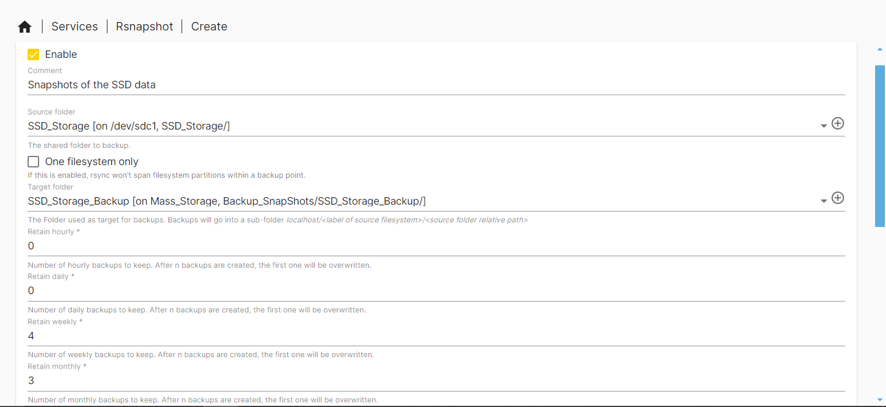
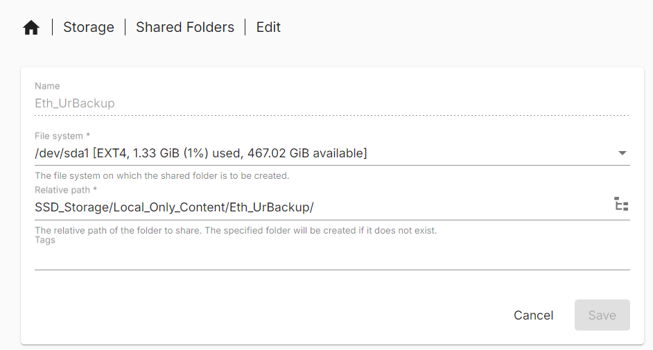
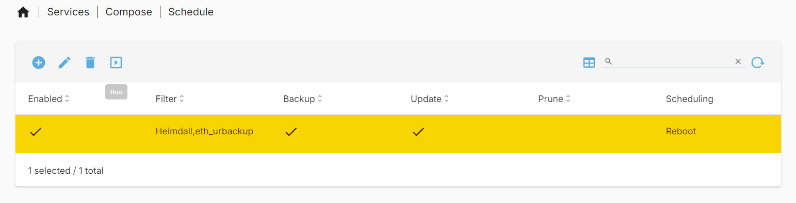
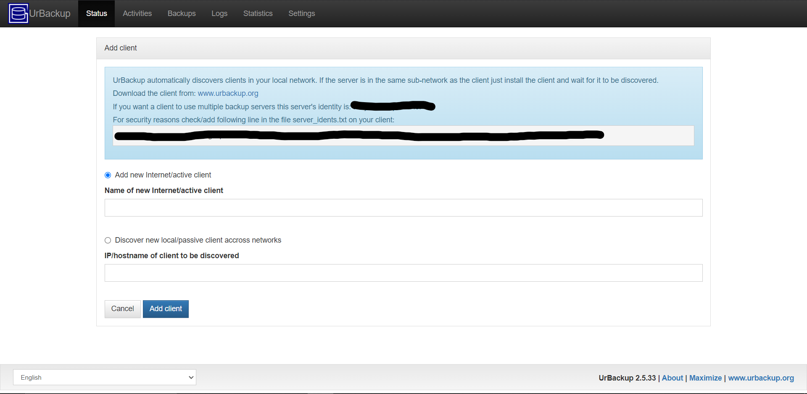
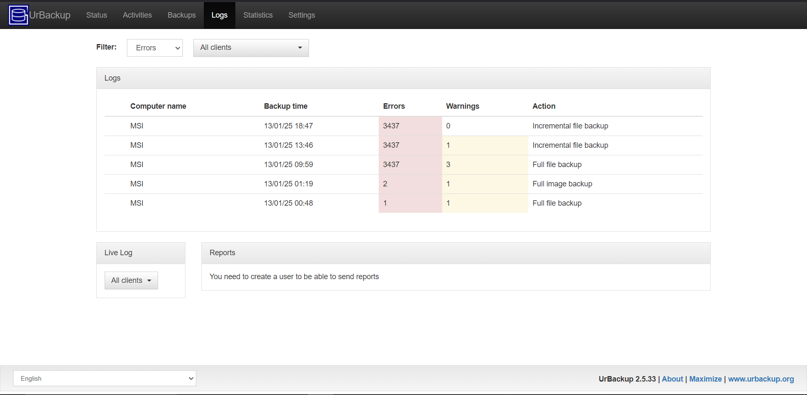
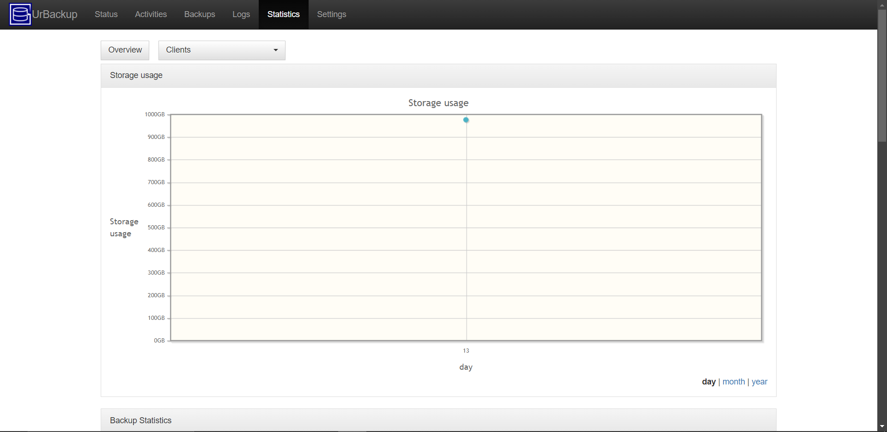
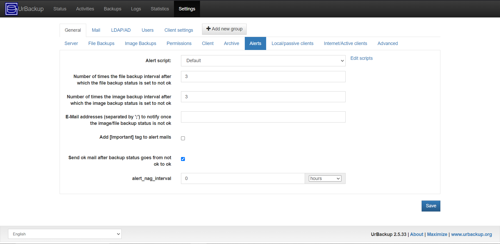
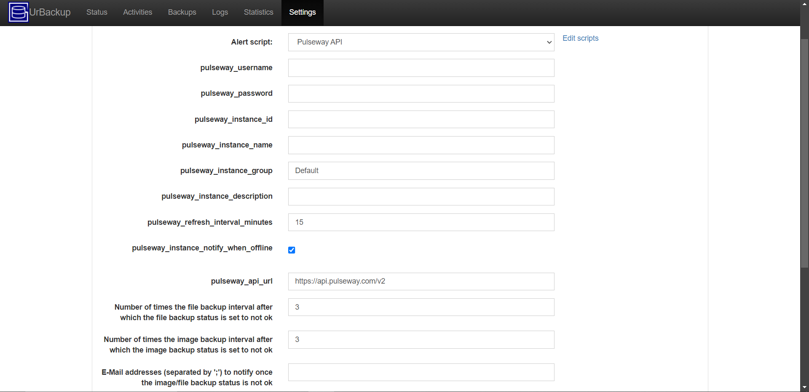
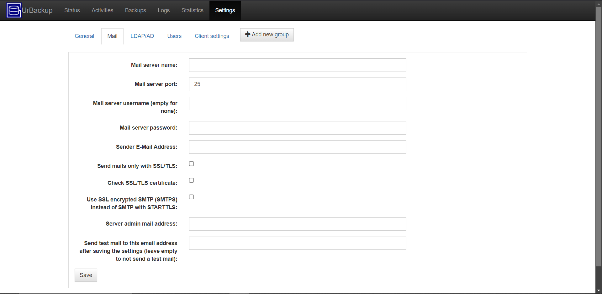

# Who is this guide For

This guide is the path I took to download and install services on my personal Network Attached Server (NAS). This guide is written from the perspective of someone who is somewhat tech literate with Linux and windows but by no means an expert. I am attempting to write these guides so that anyone somewhat tech literate can follow them. I acknowledge that not everyone will be able to follow these guides that i create due to a vast diversity of IT knowledge.

---

# The Server

In these guides I am using a HP Z240 server with

- E3-1245 V5 CPU

- 16 GB DDR4 2133 MHz RAM

- 1, 256 GB m.2 NVME SSD

- 1, 512 GB SATA SSD

- 2, 8TB SATA HDDs

---

_22/05/2024_

# Initial Install of Open Media Vault

This guide outlines the path to installing Open Media Vault (OMV) on to the boot drive of an X86 based computer. It must be noted that as of writing, arm platforms have a different install method which can be found on the [OMV Documentation Pages](https://docs.openmediavault.org/). More information not contained in this document can also be found in those pages.

## ISO Installer Setup

To install open media vault to a boot drive, the best method is to use an ISO image from the [OMV Webpage](https://www.openmediavault.org/). Enter the download sub page and download the latest stable ISO image. Save this in a known location.

### File Integrity Check

Although checking the ISO file is important, it can be difficult for some users. This section is optional but highly recommended.

It is important to check the file hash and PGP key are correct. These both verify that the installer file has been downloaded correctly and the creator of the file is as expected. As I used a windows PC this part of the guide is windows specific but a similar process should be available on MAC and Linux.

On windows the command to get the SHA256 string is to open the command prompt and type in `certutil -hashfile [file name] SHA256` where `[file name]` is fully replaced with the actual file name. It should be noted that this command assumes you have navigated to the folder in the command prompt already. An easier way to do this is to open the File Explore and drag the file into the command prompt. This replaces the  `[file name]` component with the full file path of the file. The overall output should look something like `certutil -hashfile C:\Users\Ethan\Downloads\ISO_OMV\openmediavault_7.0-32-amd64.iso SHA256`. The result of the SHA256 has string can then be checked against the SHA256 provided on the [OMV Webpage](https://www.openmediavault.org/). If they match the file has been downloaded correctly.

On windows to verify to PGP key, you must first install [GPG4WiN](https://gpg4win.org/). This program will help verify the PGP key so that we know the ISO downloaded came from the open media vault organization. When GPGWIN is installed, it also downloads a program called "Kleopatra". We will used this to verify the PGP key.

1) If not done already, create a new personal Key pair in Kleopatra. This should be found either in the certificates menu or under the file tool bar. Follow the prompts entering a name and/or email. If you want attach a secure pass phrase do that as well.

2) Next we will need the .asc and .key files for this specific ISO. These can be found linked in the [OMV Download Subpage](https://www.openmediavault.org/download.html). Sort through the [OMV source forge folders](https://sourceforge.net/projects/openmediavault/files/) finding the relevant ISO files folder. Once in the folder, download the .asc and .key files and save them to the same folder as the ISO file.

3) The .key file will then be imported into Kleopatra. Click the import button and select the .key file previously downloaded. You will be asked to certify the key file, accept this and select the open media vault option. In the certify certificate screen, the PGP fingerprint of which is also in the [OMV Download Subpage](https://www.openmediavault.org/download.html) can be found and compared.

4) To verify the ISO file, click the Decrypt/Verify button and through the file explorer, select the ISO file. After some time, a confirmation screen should appear confirming the validity of the signature.

### Flashing Drive

Once the ISO file integrity has been checked (optional but recommended), the ISO file must be flashed to a USB. A common flashing tool is [Balena Etcher](https://etcher.balena.io/) which can be downloaded on Windows, MAC and Linux. This is the tool I used with a windows PC.

1) Insert a USB stick into the computer the ISO file and Balena Etcher has been downloaded to.

2) Launch Balena Etcher and select the flash from file option. Choose the relevant ISO file in it's saved location using file explorer pop up.

3) Select the target USB that was inserted in step 1. **Be Warned,** double check you choose the correct target drive as selecting any of your PCs Drives will cause issues and/or break your PC. Etcher should warn you if you are about to this this.

4) Now just flash the drive. After some time, there should be a confirmation that the ISO has been flashed to the drive. Once that is the case. remove the drive.

## Installing on Server boot Drive

Now that the ISO USB drive has been setup, the OMV can be installed onto the Server. Plug the USB drive into one of the USB ports and turn on the server. During the boot process enter the BIOS/ Startup Menu of your system. This is typically done by spamming esc or delete on the keyboard but, check your motherboard or systems manual for details. Once in the menu, locate the boot menu and make sure the system will boot to the ISO USB inserted. This will typically be labeled USB Disk or something to that effect. To help locate the correct Drive, disconnecting all drives besides the boot and ISO USB may be helpful.

Once the USB drive boots, you will be presented with a Graphical User Interface (GUI) to take you through the install process. Follow the GUI to install OMV. The order of each menu is as follows. For what they look like it is recommended to read the latest [OMV installation instructions](https://docs.openmediavault.org/en/stable/installation/via_iso.html) in their documentation.

1) System Language Selection.

2) System Locale.

3) Keyboard Setup.

4) Host Name of system. Make it recognizable on the Network for later configuration (eg. HPZ240NAS).

5) Domain Name setup. Typically left as local for most users. Advance users can change this to something else.

6) Root Password setup. This password should be strong (see online about strong passwords) and kept in something like a password manager. [KeePassXC](https://keepassxc.org/) is a good option for this as it is self hostable and it what I personally use. There are many other options available and an investigation into the one best for you will be beneficial. Do not forget this password as you may have to login as root later on.

7) Select the boot drive. **be careful** selecting the incorrect drive will mean all data on that drive is wiped. It is recommended to select a SATA SSD or NVME as a boot drive due to their faster speeds. In my case I have an NVME which my system will boot from. If you cannot determine the correct drive to boot from, shut down the system, unplug all drives that are not boot drives and start the process over.

8) Package Manager configuration. It is best to choose a package manager archive geographically close to you. The deb.debian.org archive is normally a safe bet.

9) Proxy Config. For advanced users who use a proxy to access services on the public internet. Normally ok to leave it blank.

10) Reboot. Once the system starts to reboot. Remove the ISO USB to allow the system to boot in OMV.

## Basic System Configuration

### Network Setup

An IP Address is a numerical number that gives a network interface identification and location addressing for all computers in a network. This is how we can figure out how to connect to any computer in the world. In a typical home network, your router will assign an IP address randomly to any device that connects to it using DHCP. The IP address will change in set intervals if a device connects via DHCP. For our server we want it to keep the same IP address so that we always know where it is in the network and therefore gives us the ability to know how to connect to it. To do this we give our server a static IP Address.

To set a static IP address for this server there are two main ways:

1) Though the terminal/ command line and edit the network interface settings

2) Through the router setting an address reservation for the server.

I have opted to go through the router to set my static IP address. Therefore, the next section of this guide goes through that.

#### Router static IP Address setup

To set a static IP address for this server on your network through a router, you will first have to know how to connect to the router through the browser. Normally, a router is located at 192.168.0.1. However, this is not always the case depending on the network setup in your home. Some phones/ devices can detect the router of the network that they are connected to and allow the user to connect to it. This can help you to connect to the web User Interface (UI) of the router. There are also apps to help detect devices on the network. One of these apps is [Vernet](https://github.com/osociety/vernet). When you scan the network you are connected to, one of the devices will be called router/ gateway. The IP address of this device is what we want.

However you get the IP address of your router, type it into the address bar our your browser of choice. **make sure it is in the address bar and not the search bar**. A web UI should appear with a login prompt.

Login to your router using the password you previously set, the original admin password being user: admin, password: password, or the password possibly written on your router. If the password set is the default password set by your router manufacture, you should change it to a strong password and keep it in a password manager like [KeePassXC](https://keepassxc.org/). It must be noted there are many password managers out there and each choice is dependent on each individuals requirements.

It is best to read the router manual to help navigate your specific configuration. I will detail the process I took to set a static IP address for my server. Once login, find the DHCP page and open it. Find the list of connected clients. In the list of clients, you should see the name of your server. In the adjacent columns, there should be a column showing the MAC address of the client and the IP address of the server.

In the address reservation page, define the MAC address recorded from the previous client page of the server and assign it to an IP address of your choice (eg. 192.168.1.112). The IP address you assign could be the address it first got when connecting. I would recommend that approach. You can set another IP address if you desire but I leave that to advanced users. What ever Address you set remember it so you know what to connect to.

### Connecting for the first time

Now that you have selected the assigned IP address, go into your browser and enter it into the address bar **NOT THE SEARCH BAR**. You should enter a login screen.

The default login is User Name: admin, password: openmediavault. Double check the default login is still this by reading the [OMV Documentation Pages](https://docs.openmediavault.org/). When first login, you will be presented with the dashboard page. Before making any edits, the admin login password should change. To do this enter the user settings page by hovering on the person image on the top right. Then click the Change Password option to set a strong password.

Once in the page, set a strong admin password for the web UI. Preferably use a password manager (eg. [KeePassXC](https://keepassxc.org/)) to generate and store this password. Once completed, you will be sent to the home page of the web UI.

It is likely you will have to complete some software updates on your server. Luckily, OMV has a update tool that you can use. To access this tool on the left hand side on the web UI, you will see three lines. Click on it and then click the system option.

Once in that page you will see and Update Management Option. Open that page, then the Updates page option given. This page will allow you to update your server from the web UI.

In the updates page you will see all the available updates for your server and on the left there will be a download button to install the latest updates. Click that button and confirm to install the updates.

A pop up command line will appear showing the system logs taking place. Once the updates are complete, a close button will appear available.

Sometimes when performing updates, a Pending configuration changes panel will appear at the top of the screen. I would recommend applying these changes after applying updates. Just click on the check mark to apply. A pop up will appear of the logs and once complete, a close button will become available.

When performing updates to the server. It is best practice to reboot the server. Luckily, in the Web UI on the top right, there will be a power button option. when it drops down there will be a reboot option. Reboot the server.

### Dashboard

When logging in to the server web interface, you are first taken to the dashboard page. This page can be customized show the current state of the server. Some information you can include is system load, file system used and unused space, currently running services and many more. To edit the dashboard, click on the user settings button on the top right (icon of a person) and click on the dashboard option in the drop down. 

Once in the dashboard page, it will give you options to enable widgets that will detail various properties of the server. Enable the widgets that you want on your dashboard page.

Once all the relevant widgets have been chosen, click save at the bottom of the page. This will take you back to dashboard page and you will now see the widgets you choose to appear.

### System Settings Overview

_11/08/2024_

This section briefly goes over the system settings options and defines what I personally changed or added for my use case. When making changes, a Pending configuration changes panel will appear at the top of the screen. Just click on the check mark to apply.

The options are as follows:

- Workbench
  
  - Web UI Port - Default of 80 I personally changed to 2000 as I will have nginx proxy manager set to port 80 in the future. If changing make sure to connect via <IP address>:<Port Number>
  
  - Auto Logout - Default of 5 minutes, changed to 15 mins.
  
  - Secure Connection Options - This is to setup a https connection instead of a http connection. Https is a secure encrypted connection to the server. I currently do not have this enabled as this server is on a network with only  my devices. I may set it up in the future.
    
    - SSL/TLS enabled - Enable http connection
      
      - Certificate - Choosing which generated certificate to use. Allows you to create new one as well.
      
      - Port - port off Web UI - Port connection option to https connection.
    
    - Force SSL/TLS - Make https only available connection option.

- Date & Time
  
  - Time zone - set your time zone. Should be setup from initial install.
  
  - Use NTP server - NTP(Network Time protocol) are servers that connect to you server to keep the server time accurate.
    
    - Time Servers - Comma separated list of time servers. Should have been setup on initial install. I use `pool.ntp.org` which should work everywhere. research servers to choose what is best for you.
    
    - Allowed Clients - Client IP address/ host names that can connect to NTP server. I leave mine blank.

- Notification
  
  - Settings
    - Enabled - Enable email notifications from server. I do not have them enabled.
      - SMTP server - Server address to use
      - SMTP port - port number of server
      - Encryption Mode - Options of `None, SSL/TLS, STARTTLS, Auto` you should have some encryption enabled to help protect data during transit on the internet.
      - Sender email - User Email notification emails will be sent from.
      - Authentication Required - Does the email account need to be logged into.
        - User name
        - Password
      - Recipient - Email that will receive notification email.
        - Primary email
        - Secondary Email
      - Test Button - To send a test email out.
  - Events - Options of things that will send notification emails out.
    - CPU usage
    - File systems
    - Load Average
    - Memory usage
    - Process monitoring
    - S.M.A.R.T.

- Power Management
  
  - Settings
    
    - Monitoring - Enable monitoring of the system to specify CPU status and select appropriate level. I have it enabled.
    
    - Power Button - Specify what your systems power button does. options are `Nothing, power Off, Standby`. I set to power off.
    
    - Standby mode - specifies what your system should do when put in standby mode. Options are `Nothing, power Off, Standby`. i put mine to power off.
  
  - Scheduled Tasks - In this section you can create scheduled power based tasks. You can create a `standby, shutdown or reboot` task. These tasks can be executed at:
    
    - A specific date time down to minutes, 
    
    - Every N minute, hour, day of month.
    
    - Or Hourly, Daily, Weekly, Monthly, Yearly
    
    - I personally have a reboot task that runs monthly. This normally means my server reboots every first day on the month.

- Monitoring
  
  - Enabled - Specifies if performance stats are collected and graphed. I enable it to see performance over time.

- Scheduled Tasks - Here you can create cron tasks on your server. These are custom commands to do what ever you want. These tasks can be executed at:
  
  - A specific date time down to minutes,
  
  - Every N minute, hour, day of month.
  
  - Hourly, Daily, Weekly, Monthly, Yearly.
  
  - Or at reboot.
  
  - I personally do not run any cron tasks.

- Certificates
  
  - SSH - In this page you can create or import SSH certificates. This is used to secure SSH access. I do not have any SSH certificates.
  
  - SSL - In this page you can create or import SSL certificates. This is used to secure an https connection. I do not have any SSL certificates.

- Update Management
  
  - Updates - In this page you can check for new updates and Install them.
  
  - Settings
    
    - Pre-release updates - I do not have this enabled.
    
    - Community-maintained updates - I do not have this enabled.

- Plugins - Here you can install plugins to add functionality to you server. Have a look through it to see if any are interesting to you. There are more plugins in OMV extras which must be installed separately.

#### Plugins OMV Extras

There are extra plugins for OMV which are called [OMV extras](https://wiki.omv-extras.org/doku.php?id=start). These extras expand the functionality of OMV. I personally use it and it is simple to install. The instructions to install this are detailed below:

1) Connect to the server via SSH (Secure Shell) on an account with root/ sudo access. A common method is to use [PuTTY](https://putty.org/). You can also use things like the terminal or command prompt (name depends on platform). i will be using the windows command prompt.
   
   1) To do this I open the command prompt in windows and use the command `SSH <root/user account>@<IP Address/ Host Name>`. 
   
   2) It will ask you about a key finger print if you have not connected before. Type yes then enter to approve the connection to the server.
   
   3) It will then ask you for the password to the account you want to login to. Type the password out, it will not appear, then hit enter. You are now connected via SSH to your server.

2) You can install OMV extra via the command on the [OMV extras](https://wiki.omv-extras.org/doku.php?id=start) website. When I installed OMV extras on 11/08/2024 the command was as follows: `wget -O - https://github.com/OpenMediaVault-Plugin-Developers/packages/raw/master/install | bash`. For a non root account make sure you have `sudo` at the start of the command. Once you hit enter the install should run.

3) It is good practice to reboot your server when performing an install like this. You can reboot it from the OMV web interface or, you can reboot from the command line through the command `reboot`. Remember to use `sudo` for non root accounts.

OMV extras is now installed. You can now install more plugins and install docker under the omv-extras page in the system settings panel.

### Network Settings Overview

_11/08/2024_

This section briefly goes over the network settings options and what I personally changed or added for my use case. The options are as follows:

- General
  
  - Hostname - Name given to the server, setup on initial install but changeable here.
  
  - Domain Name - If you have a public domain e.g. google you can use that here. I do not and this server is local only so I use local.

- Interfaces - Here you can create or identify different network interfaces and see all their info. You can also set things like static IP addresses here as well. I have not changed the default options of my system.

- Proxy - Here you can enable a http, https or ftp proxy. I do not have any proxy setup.

- Firewall
  
  - Rules - Here you can setup firewall rules on IPV4 and IPV6 network interfaces. I do not have any firewall rules setup.

### Drive Setup/ Storage Page

Now that the server has the most basic setup completed, further drives can be mounted to the server. Mounting a drive allows the server to use the drive through the operating systems (Open Media Vault) file system to make files/ folders to store or run services.

In this guide, I have a single SATA Solid State Drive (SSD), which will be used for fast storage for the services run on the server. I also have 2, 8TB Hard Disk Drives (HDDs) which will be put in a [RAID](https://en.wikipedia.org/wiki/RAID) setup. For my use case, I will use a RAID 1 / mirrored setup using [ZFS](https://openzfs.org/wiki/Main_Page). This means that the data written on both drives will be identical. This means that if 1 drive fails, the server can still run with no loss in data as the other HDD contained all the data on the failed drive. It would is best practice to replace a failed drive as soon as possible but having [redundancy](https://en.wikipedia.org/wiki/Redundancy_(engineering)) in the server helps to keep it running. For more information on this check out the [RAID Wikipedia](https://en.wikipedia.org/wiki/RAID) page.

The first step of mounting these drives is to enter the storage settings page. To do this, you must first click on the three lines on the top left on the login OMV web interface. Then in the Navigation pane that appears you must click the "Storage" option.

Once you are in the storage panel you will see 4 options.

- Disks - Allows you to see and manage all the physically connected drives to the server normally through a SATA connection.
  
  - You can wipe the data off the drives from this page. It is best practice to wipe a drive before setting it up. Therefore you should wipe all drives that are not your boot drive. A quick wipe should suffice. A secure wipe should be used when the drive is no longer used and you maybe selling it. This makes it so that data cannot be recovered like it can on a quick wipe.
  
  - In this page you can also edit the drives power, acoustic, Spin down and write-cache settings.
    
    - As i want to reduce the power draw of my system for my 2 8Tb HDDs i enabled the `1 -Minimim power usage with standby (spindown)` option. This will spin the drives down reducing power consumption considerably. I will apply the `Minimum performance, minimum acoustic output` option for the acoustic management setting and set Spin down time to 20 minutes. I will be enabling write-cache to reduce writes to my drives.
    
    - For my NVME and SSD drives I will apply the option of `127 - Intermediate power usage with standby` for the power management setting. I will apply the `Maximum performance, maximum acoustic output` for acoustic option, spin down time set to 20 mins and enable write-cache.
    
    - Make sure to apply all these changes by clicking the tick on the yellow top banner.

- S.M.A.R.T.
  
  - Settings
    
    - Enabled - Enable the monitoring of the drives. This makes your server check the drives S.M.A.R.T. Data periodically for errors or warnings. I have this enabled to monitor my drive health on the dashboard.
    
    - Check interval - sets how often the drives health will be checked. In seconds. I set mine to 50 minutes which it 3000 seconds.
    
    - Power mode - This setting specifies when the drive should not have it's S.M.A.R.T. data checked. You can disable checking if the drive is in sleep, standby and idle. I choose the option `Standby` which does not check the drives data if the drive is in sleep and standby as I would like to keep my drives spun down if they are not in use.
    
    - Temperature monitoring
      
      - Difference - Report if temperature varies by more than the defined amount of degrees C. I disable this.
      
      - Maximum - Report if drive is greater than or equal to specified temperature. I set this to 60 degrees C as that is the environmental specifications of my drives.
  
  - Devices - Here you can see all the drive data and we can edit the drive and enable them for monitoring. I have enabled monitoring for all my drives and used the global settings for both temperature difference and maximum temperature.
  
  - Scheduled Tasks - Here we can create tasks to perform test on your drives. You can create: `Short self-test, Long self-test, Conveyance self-test, Offline immediate test`. You can set it to execute on certain hours, days in month, days of week or on certain months. I have 2 tests that are setup for all my drives.
    
    - The first is a weekly Short self-test performed on Sunday.
    
    - The second is a monthly Long self-test performed on the 2nd of every month.
    
    - These tests should help me monitor the heath of my drives and notice errors sooner.

#### Mounting File Systems

To use the extra drives on a server we must mount the drives to the server. You can mount the drives as single drives or as a RAID array.

##### Single Drive

I will be mounting my SSD as a single drive. This will be used for services that need fast read and/or write speeds. I will be using a EXT4 file system as it is a common file system used in Linux and it works well with small files which this drive is likely to hold in the future.

In the `File Systems` sub page of the storage page you can click on the plus button with a circle. Then click on the file system of choice (EXT4).

You will then be directed to a page where you can choose your drive. choose your drive of choice then click save. A pop up will appear of the drive mounting. Let it run, it may take a while depending on your drive size. Once completed click the close button.

You will now be in a mount page, select the drive you just setup and set a Usage warning Threshold. I set my Threshold to 85%. Make sure that a drive does not fill up 100% as if it does, you cannot write to the log file and you have to wipe the drive to work with it again.

Once you have clicked save and applied changes, you have mounted a drive to your server.

To use the drive in OMV you must create a Shared folder in the drive. To do this, go into the Shared Folders sub page in the Storage page and click on the circle with a plus in it. You will be taken to a create folder page.

In this page you can: name your folder, set which file system (drive in this case) it will be added to, the relative path of the folder on the drive and permissions of who can access the file.

For my SSD storage I will setup a folder named SSD_Storage with 2 folders in it named Remote_Content and Local_Only_Content. This will help me locate content from external machines and content that is only one the server. if you want to replicate this make sure your relative path is something along the lines of `<First Folder>/<Second Folder>/`, making sure a `/` is always at the end.

Once you have completed creating the shared folder, it can then be used on the server. It is best practice to create a new folder for each service so that you know exactly where all the data for that service is stored. 

##### RAID ZFS Array

_27/09/2024_

I will be mounting my 8TB hard drives in a mirrored ZFS array. To accomplish this  you first need to install the ZFS plugin for OMV. This can be found in the `System>Plugins` page.

Once installed, Navigate to the page `Storage>zfs>Pools` , here we will create our mirrored raid array. Click on the add pool button.

The options I will select in the create pool page are as follows:

- Name - `Mass_Storage`

- Pool type - `Mirror`

- Devices - I selected my 2 Hard drives which have an ID of `/dev/sda` and `/dev/sdb`.

All other settings I left as their default. I then clicked save. Once saved apply the changes through the prompt.

Now a ZFS mirrored array is mounted to the server. We can now make Shared folders that our services can use just like we did for the single SSD drive.

I will have a file system with the layout described in the image bellow to help organize my services so that it is easier to find via SSH. If you want to replicate this make sure your relative path is something along the lines of `<First Folder>/<Second Folder>/`, making sure a `/` is always at the end.

It is best practice to create a new folder for each service so that you know exactly where all the data for that service is stored. Once you have created all of your folders remember to apply all the changes.

### Services

_28/09/2024_

This page shows all the installed services that are running and allows you to change their settings. This is where the installed plugin settings will most likely be. For now I will leave it as it is until I am ready to setup my services.

### User Management

In this page we can setup new users on our server. The different page options are as follows:

- Settings - Allows you to enable the users home directory and specify a location.

- Users - This is where you can create, import, and edit users which can be used for certain tasks instead of using the admin user to run all tasks. When it is relevant I will create a new user.

- Groups - This is where you can create, Import and edit user groups. This is where you can group together users for specific tasks.

### Diagnostics

This page gives system information to understand why an issue maybe occurring on your server. There are many pages which are as follows:

- System Information - Describes Basic Information about your server.

- System Logs - View the system logs.

- Processes - Like Task manager for windows or top in the command line for Linux.

- Services - Status of services running.

- Report - Generate a report about your system.

- Performance statistics - Graphs to show how your system is performing hourly, daily, weekly, monthly and yearly.
  
  - CPU - CPU usage.
  
  - File System Usage - drive used and free storage.
  
  - Load Average - Power usage of system.
  
  - Memory Usage - Free and Used RAM.
  
  - Network Interface - Network Traffic.
  
  - Uptime - Server powered on Time.

# Docker Install

_06/10/2024_

Open media vault 7 has a built in [docker management interface](https://wiki.omv-extras.org/doku.php?id=omv7:docker_in_omv). I will personally be using this interface for my use case but you can use another management interface like [portainer](https://www.portainer.io/) which is another popular docker management system or just use the command line. Documentation on this docker plugin can be found [here](https://wiki.omv-extras.org/doku.php?id=omv7:docker_in_omv).

## Folder Setup

The first step in this process is to setup the folders that docker will install/ save to. This is to separate docker data from the operating system data. This helps with backups and helps maintain the life of the OS storage drive.

The following folders will be created:

- Compose_Files - Where the compose files created will be stored. This will be put on the SSD drive so that the OS has faster access to it compared to the HDD array.

- Container_Data - This folder will be where persistent container data will be held. As I want this to be accessed quickly I will keep this on the SSD drive. 

- Docker_Backup - OMV docker management plugin has the option to automatically backup container data. I will use this feature and will make this folder on the HDD array as i do not need fast access to that data.

- Docker_Storage - This folder will be the files that docker uses internally. I will run this on the SSD for fast file access. Note that the Absolute Path is required instead of clicking on the respective folder from a drop down like the rest of the folders.

On the SSD, I will organize the folders like the diagram bellow under the Local_Only_Content folder.

On the HDD array, I will just place the Docker_Backup folder under the `Local_Only_Content` folder on the HDD array.

 

For all the folders created I will have the permissions set to `Administrator: read/write, Users: read/write, Others: no access`. Remember to change the relative folder path and to apply the changes when completed.

## Installing Docker

Now that the folders have been setup, it is time to install docker onto the server. navigate to `System > omv-extras`. One this page tick the docker repo check box and hit save.

Now navigate to `System >Plugins` to install the compose plugin.

Now we can setup the install folders we set up earlier. Navigate to `Services > Compose > Settings`. Fill in the respective folders setup previously in the relevant areas. I left the compose files to be owned and edited only by the root/admin user so that only the admin account can access those files. Remember that the Docker storage path needs to be the absolute one so go into `Storage > Shared Folders` to find what it is. Once you are happy with your selections click save at the bottom, then hit apply changes on the yellow bar.

Once you have applied the changes you will see under docker that it is installed and running. It will also show your docker and docker compose versions.

## Creating a Docker User

I will create a docker user that will be used for only docker containers. In docker there is an important property called [PUID and PGID](https://docs.linuxserver.io/general/understanding-puid-and-pgid/#why-use-these) which is important for access to the file system, process management, etc. As I currently only have 1 user created, that being root, I do not want each of my docker containers to have full access to my system through the root account. I also do not want any folders or files created by the docker containers to be only owned by root. Therefore, by making a new user, I can access files and folders without having to login to root and it will also help reduce the risk of a container compromising my server.

To create a new user, login to the OMV web interface and navigate to `User Management > Users`. In this page click the plus button in the blue circle to create a new user.

I will give the user the following properties:

- Name - Name given to the user. I have used `DockerUser`

- Password - The password to the user account. Make sure this is a strong password and it is saved securely in something like a password manager.

- Confirm password - confirming password put in.

- Groups - This is the group permissions that the user has. By default the `users` group is added and it cannot be removed. For my use case I do no need it to have any other group permissions. Depending on your use case you may have to add the user to other groups depending on the docker containers you will run.

- Disallow account modification - I have enabled this to avoid the user being able to modify its account helping with security.

I am creating only 1 user as my system will only be available on my local network and my zero tier network which is only used by myself. If you are using this on a more public network I would recommend reading the [OMV docker documentation](https://wiki.omv-extras.org/doku.php?id=omv7:docker_in_omv) to understand how to make a more secure user for each container.

Once all relevant fields have been filled, save and apply the changes.

I want to restrict this docker users folder access so that it cannot modify the backup snapshots that I have created. To do this click on the docker user and click the folder with the key on it at the top.

You will be taken to a page where you can see all the shared folders created and change it's permissions. By default, the user can read and write to all the folders so I will take the Backup Folders and Set them to read only in case I use a docker container to sync the data. I also Set the compose files folder to read only so that i know they can only be edited by an admin.

Once folder permissions have been adjusted, save and apply the changes.

Now back at the users page make sure that you can see the UID and GID columns. Take note of the numbers for when you need them in docker.

## Overview of Plugin

Docker has now been fully setup on the server. Navigating to `Services>Compose` you can manage docker.

- Settings - Described in the install process above. Allows choosing where different docker elements will be installed/ saved.

- Files - Allows management of docker compose files. Create, Edit and delete compose files. Build from template. Check, Up, Stop, Down, Pull, Ps. Global environment variables, Prune, Tools, docs.

- Services - See what is running, monitor logs, restart, download logs.

- Stats - Like [top](https://www.geeksforgeeks.org/top-command-in-linux-with-examples/) but for all containers that are currently running. Name, CPU, Memory, Net, etc.

- Images - Manage docker images. Delete, Inspect, tag, push.

- Networks - Manage docker networks. Add, Delete, Inspect.

- Volumes - Manage docker volumes. Delete, inspect.

- Containers - See status of currently running containers. Name, Image, State, Status, Ports, Mounts. Restart, logs.

- Dockerfiles - Create and manage docker files. Create, edit, delete. Build, pull and build, tag.

- Schedule - Schedule backups, updates and prune to the docker containers that are installed on the system. Can be set on an automatic schedule.

- Restore - Restore a container from a backup.

# Remote Access Zero tier

_12/10/2024_

For remote access to my server, I will be using [ZeroTier](https://www.zerotier.com/). ZeroTier is a Virtual Private Network which allows direct connection to any devices you make part of it's network. This is just a simpler VPN solution where you do not have to have any of your own servers publicly accessible to the internet. ZeroTier offer a free tier which can be used by hobbyist and a self hostable option but i find the service amazing and recommend paying for their online service so you have none of your services publicly accessible to the wider internet.

## Account Setup

The first thing to do is to setup an account on the [ZeroTier central webpage](https://my.zerotier.com/). What ever password you use make sure it is strong and stored in something like a password manager. You could also sign in with your google, Microsoft or GitHub account, i do not recommend signing in through on of those accounts to distance yourself from data collecting companies and make it harder for a hacker to gain access to all your accounts.

Once your account is made, login to ZeroTier central. You will see all of your networks. You should have none so click on the create a network button.

You should now be able to name your network, see your network ID and all connected devices. You can also see all of your settings for that specific network. I leave most of them the same but advanced users may want to adjust some of them. I only add a description to my network and I set access control to `Private` so that an admin must approve you joining the network to access everything. This just makes the network more secure. Have a look at their [Documentation](https://docs.zerotier.com/central/) for further information.

You will need your network ID later on when ZeroTier is installed on your server and any devices you want to connect (eg. phone, windows, mac, Linux, etc).

For more information and configuration options of the ZeroTier network have a read of their [documentation](https://docs.zerotier.com/).

## Connecting to ZeroTier Network

### Server (Linux Debian)

Now to install onto the server, connect to a sudo/ root enabled account through SSH on the server. I recommend using something like [Putty](https://putty.org/) to use SSH but I will use the windows command prompt. Use the command `ssh <user account>@<IP address/ host name of server>` then insert your password for the account being used.

Once you are logged into your server, run `sudo apt update` and then `sudo apt upgrade` if you have packages to upgrade. Remember to run `sudo restart` if you upgraded a package. You may no have to but, `curl` is required to install zero tier. To make sure that it is on your system, run the command `sudo apt install curl`. Restart if it does install.

Looking at the [ZeroTier download page](https://www.zerotier.com/download/) we can run the command `curl -s https://install.zerotier.com | sudo bash` to install ZeroTier onto our system. Please double check the command when you install as it may have changed since this doc was written. If you have GPG installed as well you can use a more secure command found on the [download page](https://www.zerotier.com/download/). Make sure to restart your server after the install.

Now that ZeroTier is installed we can connect to our network with the following command `zerotier-cli join <Network ID>`.  Run the command `zerotier-cli info`. You will get a result similar to: `200 info <Device ID> 1.10.2 Status` This will tell you at least your Device ID. This will be important in a little bit. Running the command `zerotier-cli listnetworks`, we can see all the networks we are trying to connect to. we may see an `Access Denied` message besides the network we entered above. This will be because we set the Access control in the web interface to private. We have to enter the web panel and approve our server.

Thank you to the zero tier page for this picture instead of using a picture of my own network. We cab edit/ view a few of the device properties in this interface like Name, description, last seen, etc.

We have now officially added a device/ our server to our ZeroTier Network. Add all the devices you want.

### Windows/ Mac Install

One of the devices I will connect to my ZeroTier network is a windows and MAC computer. The process to connect these devices are very similar. To connect it to our network we can download the installer from the [ZeroTier download page](https://www.zerotier.com/download/) or we could use winget for windows and Homebrew for MAC.

- MAC Homebrew command = `brew install --cask zerotier-one`

- Windows winget command = `winget install --id ZeroTier.ZeroTierOne`

Once installed we should see a ZeroTier logo at the top of the screen for mac and on the bottom right for windows. Click that button to open it's settings.

You should be able to see a button to ask you to join a new network. Click that button and enter your network ID from your account setup. Thank you to ZeroTier for their screen shots.

once you have entered and joined the network you may not be connected to it yet, you must approve the device on the web interface if you set the Access control to Private. This is shown in the previous Linux install section.

### Android & iPhone

To Install ZeroTier download ZeroTier-one from either the [Google Play Store](https://play.google.com/store/apps/details?id=com.zerotier.one&hl=en_US) or the [App Store](https://apps.apple.com/us/app/zerotier-one/id1084101492). Once installed, open the app and click the add network button.

Enter the network ID in the setup menu and save it. When ready, activate the connection to connect the the ZeroTier network. Just like the windows/MAC/Linux setups you may have to approve the connection.

Note that ZeroTier acts like a VPN on mobile platforms so if you want to use another VPN you must disable ZeroTier to use it. I tend to only connect to to ZeroTier on mobile if i need to and tend not to keep it active.

# Heimdall

_13/10/2024_

One of the first docker containers I will setup is [Heimdall](https://heimdall.site/). Heimdall is a very simple and easy to setup start page/ dashboard. I use it to organize/ display links to all the web services I run. There are many other "nicer" looking dashboards for servers out there but I like the simplicity of Heimdall compared to those other options.

It must be noted that I will be using [Heimdalls Linux Server docker image](https://docs.linuxserver.io/images/docker-heimdall/) as it is easier to use in comparison to the normal docker install method.

## File Setup

For the Heimdall image, we need a folder for all of the config files of the container. I will create one on the SSD in the local only content folder so that it has fast access to those files. I will name it `Heimdall` for future reference. My folder setup is the image bellow:

Make sure to apply the change.

Now for the compose file, we will need the Absolute Path of the folder we just created. Navigate to `Storage > Shared Folders` to view the table of all the folders created. Find the Heimdall Folder created and copy the absolute path for later. Mine is `/srv/dev-disk-by-uuid-00337ac1-aca8-4dc6-b5d7-dfaf50835ac5/SSD_Storage/Local_Only_Content/Heimdall` for reference.

Note that you may have to show the Absolute path column if it is not appearing already using the table column option button.

1) Table column options

2) Absolute path column option

3) Absolute Path of the Docker_Backup Folder

## Making compose File

The first step is to know the [PUID and PGID](https://docs.linuxserver.io/general/understanding-puid-and-pgid/#why-use-these) of the docker user we set up when installing docker. We will need these in the compose file. My PUID is 1000 with a PGID of 100. If you go to `User Management > Users` you will see those properties of all users you have created.

To create the compose file we must navigate to `Services > Compose > Files` and click on the white plus in the blue circle. We will get options to:

- add a compose file

- Add from example

- etc

The important ones for us are:

- Add

- Add from Example

There are already tons of examples to use for many different things. Have a look at them for services you may want to run.

For use we can either use `Add` or `Add From Example`. I will be using add from Example. We will be taken to a page where we can select our example `Heimdall` in our case, give it a name. Do not use any spaces, as auto updates and backups will not work if you do. I named mine `Heimdall`. We can also provide a description of the container if we would like.

Click save, we will now see the container in or compose file page. It will show up as down for now as we have not turned it on (up) as we need to make a few edits. Ignore the pending configuration changes for now until we are done.

Click on the container and select the edit button (looks like a pencil).

We will now see our compose file and edit it. I will be making a few edits to this file:

- Firstly adjusting the image name to `lscr.io/linuxserver/heimdall:latest` to match the [Documentation](https://docs.linuxserver.io/images/docker-heimdall/#usage) on the Linux server page.

- Entering my PUID and PGID into the associated environment parameters.

- Enter my time zone based on the [TZ codes](https://en.wikipedia.org/wiki/List_of_tz_database_time_zones). UK is `Europe/London`.

- Enter my absolute path to my Heimdall config folder under volumes before the `:/config` part.

- Change the port `444` to `20001` before the `:443` This will be the https connection.

- Change the port `99:80` to `2002:80`

- Removed anything that was related to network configuration.
  
  - `networks:
     my-net:`
  
  - `networks:
     my-net:
     external: true`

- Everything else I left the same.

My final compose file looked like so:

`---`

`services:
  heimdall:
    image: lscr.io/linuxserver/heimdall:latest
    container_name: heimdall
    environment:
      - PUID=1000
      - PGID=100
      - TZ=Europe/London
    volumes:
      - /srv/dev-disk-by-uuid-00337ac1-aca8-4dc6-b5d7-dfaf50835ac5/SSD_Storage/Local_Only_Content/Heimdall:/config
    ports:
      - 2001:443
      - 2002:80 #optional
    restart: unless-stopped`

Yours should look similar. Click save once you are done. Make sure to apply any changes.

__Note that the part it has as optional in the compose file is not actually optional. You must run it if using the Linux server image__ If using the original image there are different options.

## Launching the Container

To launch the Heimdall container made in the previous chapter, navigate to `Services > Compose > Files`, select the Heimdall container and select the up button. It will be an arrow pointing up in a circle:

When we click that button a screen will appear with all of the log files.

Once it has completed, we will see the status column change to `up`.

We now have Heimdall running.

## Using Heimdall

Now that we have the Heimdall container running, we can connect to it by typing in our search bar in our browser a command similar to `<Host Name/ IP address>:<Network Port of choice>` so for me an example command would be `hpz240nas.local:2002` for an http connection to Heimdall.

When we first connect to Heimdall we will get this interface:

On the bottom right hand panel we will have the following options from top to bottom:

- Reorder and Pin Items - Used to organize the order of all the pins that you create.

- Home dashboard - go to the home page

- Users -  User management (set user passwords, admins, different permissions)

- Application List - List of available pins/ applications that have been added.

- Tag list - List of tags.

- Settings - Configuration Settings

### User Creation

The first thing that I will do is lock out anyone from the admin panels. To do that we go into the Users page. We will then click the edit button under the admin user and set a password. Make sure the password is strong and stored in a password manager.

Save when finished.

We also want to create a user that we normally use. Click the add button on the users page. Give the user :

- a name (eg. Ethan)

- an email address(can be fake)

- A Strong Password

- Set the `Allow public access to front` to off

We have now created an admin user for user creation and control and a general user for myself which I will normally use. In the admin user, I will add applications that pertain to managing my servers like the OMV web interface. In my general user i will add applications that I will use. This will be things like file access from the web interface.

With the current set up, you have to login to either account to access links as there are no publicly accessible ones. I want to keep it like this as I want to control who can use the dashboard. If I want a person to have access to the dashboard with links I will create one for them and add the links.

### Settings Overview

Now that we have created our users, we can adjust the settings for each user to our liking. When we open the settings panel we get the following options:

- System - provides system info
  
  - Version - Heimdall version
  
  - Language - Set language
  
  - Support - Links to support the Heimdall project
  
  - Donate - Donate the the Heimdall project.

- Appearance
  
  - Background Image - Upload a background image to the dashboard.
  
  - Trianglify - Unsure on use.
  
  - Trianglify Random Seed - Unsure on use
  
  - Treat Tags as - Options on how tags are handled. I leave it as folders as I will have a "folder/ tag" for ZeroTier ip address connections and one for local network I{ addresses. Other options include:
    
    - Tags
    
    - Categories

- Miscellaneous
  
  - Homepage Search - Enable search on the home page.
  
  - Default Search Provider - Search Engine that will be used on homepage search.
  
  - Link opens in - Behavior when you click on the application option. Options of:
    
    - Open in the this tab
    
    - Open in same tab
    
    - Open in new tab - this is the one I use.

- Advanced
  
  - Custom CSS - Use a custom CSS for your dashboard
  
  - Custom JavaScript - Use custom JavaScript in your dashboard.

### Tag Addition

Adding tags to the dashboard is very simple. You can use it as a way of categorizing applications (eg. server management, files, finance, etc). I will be using it so that I can distinguish between local IP address links and links over ZeroTier IPs.

I will go into the Tag List page and click the add button.

Here I can give the tag:

- A name

- A colour

- An Icon

- and pin it to the home page.

My ZeroTier tag setup can be seen above. I have also made one for local links.

### Adding Applications

To add applications to the dashboard is very simple. Navigate to the application page and click the add button. I will be adding the open media vault web interface link here for local connections. As this application is supported in Heimdall we can make our lives easier by click the application type button and selecting `openmediavault`. Doing this auto sets up many different properties for our application link.

we can see that may of the properties have been filled in. The only changes I personally made was changing the colour to `#7AE` as it matches OMV better than the black and the tag to be the local tag so it sits under it. I did have to add the URL of `<htttp/https depends on connection type>://<host name/ IP address>:<Port>` which is `http://hpz240nas.local:2000` for my local connection.

A cool feature that i do not use but is available is showing some sort of stat for some services. This is available for OMV. I have it disabled but you could enable it and configure it to display something like CPU stats.

All other properties should be self explanatory. I also made an application link for my ZeroTier IP address.

I would recommend bookmarking the dashboard into your browser so you do not have to remember the IP address and port.

__Important Note -__ If you use host names instead of IP addresses, you can have only one link to your service via `<htttp/https depends on connection type>://<host name>:<Port>`. I personally now just use the host names in my http/https link. I did keep the local and ZeroTier tags for some services which I have on PCs I do not know the host name of.

## Updates and backup

One thing that I want to setup for all docker containers including Heimdall is automatic backups and updates. The OMV plugin allows for this to be the case. To accomplish this, navigate to `Services > Compose > Schedule` and click on the white plus in a blue circle.

You will be taken to a page to create a scheduled task. I will be making the following changes:

- Make sure that the enabled check box is selected

- Select only the Heimdall compose file in the filter box

- Make sure that Backup and Update check boxes are selected

- Schedule is set to `At reboot` as i do not need Heimdall to update quickly after an update. You could set it more frequently and I will do that for some containers but not for Heimdall.

- All other settings I have left as they were.

At the end of the Schedule creation you should see something like the image bellow.

Once completed, save the task and apply the change.

We have now setup automatic backups and updates of the Heimdall container.

# Data Backup

_28/09/2024_

One of the first services I will setup is making sure that the data on my server is backed up. Backing up data is very important incase of server failure or corruption where data on the primary drives has been lost. This allows us to still have access to the data through our backups.

The recommended strategy for building a backup system is to take into account the [3-2-1 backup rule](https://www.seagate.com/gb/en/blog/what-is-a-3-2-1-backup-strategy/). This rule states there must be:

- 3 copies of your data

- 2 Different mediums

- 1 remote/ offsite backup.

The 1 remote/ offsite backup is one many people forget to implement. It is normally only used in disaster scenarios like the building your main and local backup servers are in have burned down. The remote backup will save you here. Your remote backup can be something like a cloud storage service or your own server at a friends house.

For 2 different mediums this can be something like SSDs vs HDDs or even tape storage but, the way I interpret it is to use 2 systems that do not share any components. So I use another completely separate server with a different power supply, motherboard, drives, etc. This is so that if my main server fails. My other server will have all the data backed up onto it.

For 3 different copies if you accomplish the 1 remote and 2 different mediums you should have 3 copies: one on the server running services, one on the local backup server and one remote copy.

# My server backup Plan

My Backup plan for my server involves creating snapshots of all my data on the local server and then syncing these files to my local backup server and my remote one.

I will use the [openmediavault-backup plugin](https://github.com/OpenMediaVault-Plugin-Developers/openmediavault-backup) to backup the Open Media Vault system it's self. I will then backup the data drives using the  [rsnapshot plugin](https://github.com/OpenMediaVault-Plugin-Developers/openmediavault-rsnapshot). All data snapshots will be saved to the 2, 8TB HDD mirrored array in a common folder which is then synced to both the local backup server and the remote backup server through likely something like [Syncthing](https://syncthing.net/). A diagram of how my server backup plan will work is shown bellow.

## Main Server OMV System Backup

To backup my OMV system data, I will first install the [openmediavault-backup plugin](https://github.com/OpenMediaVault-Plugin-Developers/openmediavault-backup) through the OMV plugin section.

Once installed, you can find the backup settings in `System > Backup` page. Here we can adjust the settings for the OMV system backup. Firstly, I will make a new shared folder in the main HDD_Storage space to locate the backed up disc images.

Remember to apply the pending configuration change.

Once that change has been made I will go back to the `System > Backup` page will apply the following settings:

- Settings - Page to adjust OMV system backup settings
  
  - Shared Folder - Target for where backups will be saved.
  
  - Method - I will be using `dd full disk` as it will clone my entire boot drive to a compressed image file which can be used if the boot drive fails. There are other options available like dd, fsachiver, borgbackup and rsync which maybe better for your use case.
  
  - Root device - I will not change this setting
  
  - Keep - Describes the number backup image snapshots it should keep. I will have 4 for my use case.

- Scheduled Backup - Page to adjust when backups will run.
  
  - I will enable Scheduled Backups to run Weekly.
  
  - Remember to apply the pending change.

## SSD and HDD storage Snapshots

I will be creating snapshots of all my data which will then be syncing to my local and remote backup servers. These snapshots will be of the SSD and HDD storage areas and stored on the HDDs. I will first install the rsnapshot plugin.

Once Installed I will navigate to the page `Services > Rsnapshot` to add rsnapshot jobs.

The first job will be for anything stored on the HDDs. The data on the HDDs will be more longer term files compared to the SSD based files. Therefore, I will keep 5 monthly snapshots which will translate to approximately one snapshot a week. All other settings I left as their defaults or set to zero.

Next I will create a snapshot job for the SSD data. As this data on the SSDs will update frequently in comparison to the HDDs, I will run 4 weekly snapshots and 3 monthly snapshots. This should give me a snapshot of the data nearly every other day. I will also gain some slightly longer term snapshots just incase i make a mistake in a file and the weekly snapshot gets over written before it is recovered. All other settings I left as their defaults or set to zero.

Remember to apply the configuration changes once the jobs have been created.

## Local and Remote snapshot copies

---

# Windows and Linux Based Backups (UrBackup)

_11/01/2025_

For my windows and Linux based systems I will be running full incremental system backups including all data drives. I do this incase I ever have an issue with my system drives or systems as a whole. This allows me to restore onto all new SSDs or systems (laptops, PCs, VMs) if required. These backups will be needed in a worse case scenario like: the loss of a laptop, hardware failure or a broken install of an OS.

For the backups of Windows and Linux systems I will be using a program called [UrBackup](https://www.urbackup.org/index.html). This program can do full system backups of Linux, MAC and Windows systems. I will use something else for any MACs which I have described in another section. For individual files/ folders I will run [Syncthing](https://syncthing.net/) on all platforms but, you could use UrBackup for this use case as well. I will discuss Syncthing in a different section when I set it up on this server.

## Folder Setup

To setup [UrBackup](https://www.urbackup.org/index.html), there are a few folders I want to set up first.

As I will eventually include an area for my families computers/ phones, I want to setup a folder in the HDD_Storage area for only myself. Due to how URbackup works this will require me to make a new UrBackup container for my families computers but, as I will use the docker method it should be ok. Some added configuration maybe needed when doing my families PCs.

As this is mass remote data, I will create an Ethan folder in the `HDD_Storage > Remote_Content` folder (named `Remote_Content_HDD` on my server). When i eventually add my families computers there will be a folder for them as well. The image bellow shows how the folder structure will look for UrBackup for both my family and myself for reference.

UrBackup also requires a database. In the docker container you specify the folder which this will be contained in. Therefore, I will also create a folder on the SSD for the database for fast access. I will name the folder `Eth_UrBackup` and it will sit under the Local_Only_Content folder. When I setup my families backup content I will do the same.

Making folders is that same as previously discussed in this README.md through OMV shared folders. Just remember:

- Typing in the correct Relative path including the `/` at the end.

- Giving it the permissions Admin and Users read/write but others no access.

- Apply the pending configuration changes when completed.

An example of the database folder setup is shown bellow:

Through hind sight with this in future I would have named this folder something along the lines of `Eth_UrBackup_Database` or something similar to help with names.

Make sure to copy the absolute path of both folders created for the compose file.

Note that you may have to show the Absolute path column if it is not appearing already using the table column option button.

## Making Compose File

For now i will be using the recommended compose file to setup my personal UrBackup target. When I setup my families UrBackup server i will write about the changes made but as of writing I am unsure of the compose file setup.

The [recommend compose file](https://hub.docker.com/r/uroni/urbackup-server) is as of follows:

`version: '2'`

`services:
  urbackup:
    image: uroni/urbackup-server:latest
    container_name: urbackup
    restart: unless-stopped
    environment:
      - PUID=1000 # Enter the UID of the user who should own the files here
      - PGID=100  # Enter the GID of the user who should own the files here
      - TZ=Europe/Berlin # Enter your timezone
    volumes:
      - /path/to/your/database/folder:/var/urbackup
      - /path/to/your/backup/folder:/backups
      # Uncomment the next line if you want to bind-mount the www-folder
      #- /path/to/wwwfolder:/usr/share/urbackup
    network_mode: "host"
    # Uncomment the following two lines if you're using BTRFS support
    #cap_add:
    #  - SYS_ADMIN
    # Uncomment the following two lines if you're using ZFS support
    #devices:
    #  - /dev/zfs:/dev/zfs`

The changes I will make are as of follows:

- Changing the `container_name` to `eth_urbackup`.

- `PUID` to `1000` and `PGID` to `100` for my docker user setup in a separate section.

- Enter my time zone based on the [TZ codes](https://en.wikipedia.org/wiki/List_of_tz_database_time_zones). UK is `Europe/London`.

- Volumes changed to:
  
  - From `/path/to/your/database/folder:/var/urbackup` to the absolute path of the `Eth_Backup` folder setup in the folder set up section. `/srv/dev-disk-by-uuid-00337ac1-aca8-4dc6-b5d7-dfaf50835ac5/SSD_Storage/Local_Only_Content/Eth_UrBackup:/var/urbackup`
  
  - From `/path/to/your/backup/folder:/backups`  to the database folder absolute path. `/Mass_Storage/HDD_Storage/Remote_Content_HDD/Ethan_Files/Eth_Full_PC_Backups/Eth_UrBackup_Backups:/backups`

- I have also changed the port numbers by commenting out the `network_mode: "host"` line and adding the following underneath:
  
  - `ports:` in line with where the network_mode line was
  
  - Tabbed in the following required port numbers based on the [UrBackup manual](https://www.urbackup.org/administration_manual.html#x1-9000010.3). Remember that the one on the left is what is externally seen while the ones on the right are internally seen by the container and are not to be changed.
    
    - `- 2003:55413` for the FastCGI bit for the web interface.
    
    - `- 2004:55414` for the http web UI interface. This is the address you will type in when managing the server side settings (the `2004` number).
    
    - `- 2005:55415` the port that internet clients will connect to. This port `2005` remember it for later as you will need it on your clients.
    
    - `- 2006:35623` the UDP broadcast port for discovery ( i likely have messed up discovery by doing this but it is required if I am to have multiple instances of this container for different use cases.)
  
  - I have only done this to allow me to setup multiple container instances. To do that it involves using different port numbers. This does complicate the setup on the clients however. If you are just having one instance i recommend keeping the port numbers as their default but i thought i would include this incase someone else wants to replicate it.

- I will uncomment the ZFS lines as my Hard drives are a ZFS mirrored array. You can probably not include this and it will be fine.

So the full compose file for me will look like the following:

`version: '2'`

`services:
  urbackup:
    image: uroni/urbackup-server:latest
    container_name: eth_urbackup
    restart: unless-stopped
    environment:
      - PUID=1000 # Enter the UID of the user who should own the files here
      - PGID=100  # Enter the GID of the user who should own the files here
      - TZ=Europe/London # Enter your timezone
    volumes:
      - /srv/dev-disk-by-uuid-00337ac1-aca8-4dc6-b5d7-dfaf50835ac5/SSD_Storage/Local_Only_Content/Eth_UrBackup:/var/urbackup
      - /Mass_Storage/HDD_Storage/Remote_Content_HDD/Ethan_Files/Eth_Full_PC_Backups/Eth_UrBackup_Backups:/backups
      # Uncomment the next line if you want to bind-mount the www-folder
      #- /path/to/wwwfolder:/usr/share/urbackup
    #network_mode: "host"
    ports:
      - 2003:55413
      - 2004:55414
      - 2005:55415
      - 2006:35623
    # Uncomment the following two lines if you're using BTRFS support
    #cap_add:
    #  - SYS_ADMIN
    # Uncomment the following two lines if you're using ZFS support
    devices:
      - /dev/zfs:/dev/zfs`

Modify the compose file as you see fit.

### Launching, auto Backups and auto update container image

To launch the UrBackup container it will be the same as the Heimdall container, navigate to `Services > Compose > Files`, select the UrBackup container and select the up button. It will be an arrow pointing up in a circle:

A screen with log commands will appear. Close this when you are done and you will see that the status has changed from `Down` to `Up`. The container is now running.

If like me you have set custom ports it will also show the port numbers. If you have not that will not show.

To automatically backup and update this container image, I will include it in the scheduled task i created for Heimdall. I will navigate to `Services > Compose > Schedule` and click on the scheduled task that at reboot updates and backups containers that it is filtered for. I will then click the pen like icon to edit the task.

Once in the interface you will manually need to type in the filter as the web UI does not make it easy to select multiple containers. It must be noted that all container names must not include spaces. My filter I have to type `Heimdall,eth_urbackup` using commas (`,`) to separate out each container. You could also use `*` to do all containers but i do not as some later containers I add will update more frequently then only at reboot which happens once a month for me.

You can check this works by selecting the scheduled task and clicking the run button. A prompt will come up asking you to start the task. Start the task. Log text will appear and at the end will say done.

Now if you navigate to `Services > Compose > Restore` you should see all your containers backed up in the page.

## Server Side Overview

_13/01/2025_

Now that the container is running. We can connect to it via a browser. Type in the following: `http://<host name/ Ip address>:<Port (your custom one or 55414 which is the default)>`. Therefore, for me I type in `http://hpz240nas.local:2004`. You can add this to your dashboard like [Heimdall](https://heimdall.site/) if required.

On the home page we will be greeted by the backup status of all our clients. I have a client setup already but you will likely not have any. Here we are able to add our clients and check up on the status of all the client backups.

If you have setup with the default ports you will not have to manually add a new client if they are on the same local network. If you have used custom ports like myself you will have to add a new client in the status page and change a setting of the web UI which i will discuss later in this section.

To add a new client, click the add new client button on the Status page.

You will be taken to a page where you can add a new internet/active client or discover a client on a new network. Due to me using custom ports I have to select the `Add new internet/active client` option and type in the name i gave to my client then click the `Add client` button for my client to appear.

If you have a client on your local network you could also type in the IP address or host name but, if you have used custom ports like me it may not work.

On the activities page you will see the currently active tasks that UrBackup is running. It will show something like the image bellow. This page can be nice to give an overview of the tasks currently running if you are experiencing issues.

On the backups page you will see an overview of off the clients and when the last backups occurred. This is useful to check if all clients have a semi recent backup. If you click on a client you will see the file and/or image backup history.

In the logs page you can see the logs from the activities of the UrBackup server with each client. You can filter by warnings or errors, see the live log for a specific client and when a user is created (done later in my write up) create a report to send of all the logs.

In the statistics page you are able to see how much storage UrBackup as a whole is taking up over time and specific clients. You will also be able to see how much storage each client is taking up for file backups and image backups and the totals of each.

Lastly you can see how much storage each client is taking up compared to each other.

### Settings Page

In the settings page you are able to change may aspects of the UrBackup Server. For all the settings there is a save button at the bottom. Make sure to click it and see the save settings successfully message appear to apply any changes made.

A great thing about the settings pages is that any confusing settings have a question next to them which will take you to an FAQ page on your server describing the setting to you. The [UrBackup admin manual](https://www.urbackup.org/administration_manual.html) also contains great detail about all the [server settings](https://www.urbackup.org/administration_manual.html#x1-410008).

These settings are as follows:

- General
  
  - Server ([Global Server Settings admin Manual](https://www.urbackup.org/administration_manual.html#x1-420008.1)).
    
    - Backup storage path - the default is `/backups` i have left mine as that.
    
    - Server URL for client file/backup access/browsing - This is where if you have used custom port numbers you need to use those. If you have not used custom port numbers like myself use the default http port of 55414. Enter `http://<Host name/ IP address>:<port number of http page (default is 55414)>` for completeness mine is `http://hpz240nas.local:2004`. Make sure you set this up to allow access to restoring backups.
    
    - Do not do image backups - You could out right disable image backups to this specific server if you wanted to i have not as i want to do image backups.
    
    - Do not do file backups  - You could out right disable file backups to this specific server if you wanted to i have not as i want to do file backups.
    
    - Automatically shut down server - You can can let your server automatically shut down if you like. I do not have this enabled as I always want it online running backups of my various systems.
    
    - Download client from update server - Default is on, i just left it.
    
    - Show when a new server version is available - I leave this enabled as it can help me make sure that the container is auto updating.
    
    - Auto update clients - This allows the server to tell the clients to automatically update. I leave this enabled so that my clients are always up to date.
    
    - Max simultaneous backups - Set a maximum number or backups that can be running at one time. Default is 100. To reduce load on my server i have lowered it to 2.
    
    - Max recently active clients - Set a maximum client count. Default is 10000 and I will leave it like that.
    
    - Cleanup time window - Here you are able to set when the server will perform its cleanup operation. By default, it is able to do this every day Monday (1) to Sunday (7) between 3 am and 4am with the input `1-7/3-4`. The syntax description can be found in the [admin manual](https://www.urbackup.org/administration_manual.html#x1-610008.3.1) on the UrBackup webpage or by clicking the question mark on your server. I have left the default setting for myself.
    
    - Automatically backup UrBackup database - I recommend keeping this active just incase you have an issue with the data base or where it is stored. This will help with recovery in the event of a parts failure.
    
    - Total max backup speed for local network - Set a max speed limit for backing up clients on your local network. This maybe needed if you want to reduce the load on your network and your server. I have limited this to 500 MBit/ s. Complex configuration possible please see the [manual section on it](https://www.urbackup.org/administration_manual.html#x1-550008.1.13).
    
    - Global soft filesystem quota - Determines when UrBackup starts to remove old backups of clients based on the total space used in the drive. I have changed mine to 90%. Read the [manual section](https://www.urbackup.org/administration_manual.html#x1-560008.1.14) for more info/ a better description of how this works.
  
  - File Backups - global settings for file backups to the specific server. Individual clients you can change but this sets the defaults for new clients.
    
    - Interval for incremental file backups - I have set mine to 12 hours up from the default of 5 to reduce load on running these backups frequently.
    - Interval for full backups - I have set mine to 60 days up from the 30 day default to reduce network and server load spike frequency.
    - Maximal number of incremental file backups - Max number of file backups, default of 100 but i have reduced it to 50 to reduce storage space taken up by the client backups. Make sure that the value you set is greater than the Minimal value.
    - Minimal number of incremental file backups - I have set mine to 20 from a default of 40 to reduce storage space taken up.
    - Maximal number of full file backups - I have set mine to 4 from a default to 10 to reduce the storage space taken up by clients.
    - Minimal number of fill file backups - I have left mine as the default of 2 just to avoid possible corruption issues that could occur.
    - Excluded files - I have left blank but if you want to exclude files read the section in the [manual](https://www.urbackup.org/administration_manual.html#x1-630008.3.3) or read the FAQ page that your server can take you to.
    - Included files - I have left blank but if you want to make sure some files are included then click and read the FAQ section on your server.
    - Default directories to backup -  I have changed from a blank setting to `D:\|D_Drive/follow_symlinks,symlinks_optional,share_hashes,optional;C:\|C_Drive/follow_symlinks,symlinks_optional,share_hashes,optional;/|Linux_Root_Drive/follow_symlinks,symlinks_optional,share_hashes,optional`. The directories are separated by `;`. The `C:\` directory is the boot drive for windows. The `D:\` directory is what i typically use when adding a drive to windows. The `|<Name>` is what allows us to name the drive differently and add the directory flags. The `/follow_symlinks,symlinks_optional,share_hashes,optional` is the directory flags to make sure the backup does not fail if the directory does not exist. The `/` before the `|Linux_Root_Drive` is the root directory for Linux. If you want to learn more, click and read the FAQ section on your server and read the [admin manual](https://www.urbackup.org/administration_manual.html#x1-640008.3.4).
    - Directories to backup are optional be default - check box to make the global default directory's optional.
  
  - Image Backups - global settings for image backups to the specific server. Individual clients you can change but this sets the defaults for new clients.
    
    - Interval for incremental image backups - I kept mine at 7 days to keep load on my server low enough while still getting image backups. There is a check box to disable this as well.
    
    - Interval for full image backups - I have increased this to 90 days to reduce load on my network and server. There is a check box to disable this as well.
    
    - Maximal number of incremental image backups - I reduced mine to 20 to reduce storage usage on my server.
    
    - Minimal number of incremental image backups - I have kept mine at 4 to keep decent image backups.
    
    - Maximal number of full image backups - I reduced mine to 4 to reduce storage usage on my server.
    
    - Minimal number of full image backups - I kept mine at 2 to keep storage usage low and to make sure I have 2 image backups incase 1 gets corrupted.
    
    - Volumes to backup - I have changed mine to `ALL_NONUSB` to by default backup all volumes on a pc that are not connected via USB. This is slightly different to the default of C drive for the windows boot drive.
    
    - Image backup file format - I have left this as the default of `Compressed VHD (Compressed non-standard Virtual HardDisk)` to save storage space on my server compared to the other main option `VHD (Virtual HardDisk)`. There are V2 versions as well but as they are in beta at the time of writing I have not used them. If V2 is available without beta I will likely use them to get the newest features.
  
  - Permissions - All of these settings are about allowing the client to do various things they are as follows. I have left most enabled but disabled a few. In a business environment you may want to disable certain permissions to stop employees from changing settings.
    
    - Changing of the directories to backup - Disabled as i want all directory's to be backed up and I do not want clients the ability to disable some directories. An admin on the serer side is the only person able to add directories to backup for odd configurations which should be rare in my use case.
    - Starting of
      - full file backups
      - incremental file backups
      - full image backups
      - incremental image backups
    - Viewing of backup logs
    - pausing of backups
    - changing of settings - Disabled as I only want the server side to be able to change settings just incase my client side gets hacked. Any custom settings I will get an admin on the server to change.
    - quit the tray icon
    - start file restores
    - configure components to backup
    - start component restores
  
  - Client
    
    - Delay after system startup - I have increased mine to 5 mins from the default of 0 to allow the client to come fully online before checking backup status.
    
    - Backup window - I have left the default backup window to be 24/7 using the input 1-7/0-24. 1-7 is days of week (Monday = 1 Sunday = 7). Hours are 0-24. You can set custom ones but, I have left as 24/7 for my laptops which are sometimes shutdown. Read the [admin manual](https://www.urbackup.org/administration_manual.html#x1-610008.3.1) for more info.
    
    - Perform auto updates silently - Enabled so that i do not have to manually update UrBackup on my clients and i get the latest security updates.
    
    - Soft client quota - Default is set to none but, you could want to set this to limit the storage space taken up by clients. It is similar to the server Global soft filesystem quota but client specific. As my clients storage space varies a lot. I have left as blank.
  
  - Archive - This is where you can set Archive rules on your server. I will not use this but here is what the page looks like in case you want to use it.

-   General
  
  - Alerts - If you want to setup alerts to send to you about your clients backups. There are 2 types as of writing, email based and pulse way based. As I will not be using this I have not changed anything. You can also edit the alert scripts if you wanted too. The following images are what the pages look like:

- General
  
  - Local/passive clients
    
    - Max backup speed for Local/passive transfers - I have changed this to 100 MBit/s to reduce network load and allow other clients to backup at the same time if required without reaching the max backup speed for local network.
    
    - Encrypt local/passive transfers - Enabled and should always be so that if your network was compromised the data flowing through it is not encrypted.
    
    - Compress local/ passive transfers - Enabled to reduce network load.
  
  - Internet/Active clients - every setting bellow is as an Internet/active client
    
    - Clients try to connect via Internet - Enabled
    
    - Server URL clients connect to - This is where you have to remember your custom port numbers if used. The default port is `55415` which is the port for internet clients. Here you have to enter `urbackup://<hostname / IP Address>:<port number seen by external computers>` for reference i have typed `urbackup://hpz240nas.local:2005`.
    
    - Connect via HTTP(S) proxy - I have left blank as i do not want to connect via a proxy.
    
    - Do image backups - enabled
    
    - Do full file backups - enabled
    
    - Max backup speed - I have set to 100000 KBit/s as my connection to my server maxes out at apx 100 MBit/s when not on my local network but on my local network it maxes out at 1 GBit/s. Therefore, as my clients will connect via and internet link, this value allows multiple internet clients to backup simultaneously without saturating my local network. As i am unlikely to run continuously at 100 MBit/s away from my server I am not worried about external connections saturating my network.
    
    - Total max backup speed - I have set to 500000 KBit/s as my connection maxes out at 1000 MBit/s (= 1000000 KBit/s) on my local network. As my clients connect via an internet connection due to custom port numbers I have set this equal to my global limit. Although my external network connection maxes out at apx 100 MBit/s (= 100000 KBit/s) I am not worried about fully saturating when running backups as i am unlikely to be able to maintain 100 MBit/s to my server anyway on an external network.
    
    - Encrypted transfer - Enabled to make sure data cannot be seen in transit
    
    - Compressed transfer - Enabled to reduce network load needed.
    
    - Beta: Calculate file hashes on client in parallel - Disabled as is a beta feature. When not in Beta will likely enable.
    
    - Connect as Internet/active client if connected to as local/passive client - Disabled.
    
    - Do not start file backups if current estimated data usage limit per month is smaller than - This is for metered networks which i am not on so i left at the default of 5000 MB.
    
    - Do not start image backups if current estimated data usage limit per month is smaller than - This is for metered networks which i am not on so i left at the default of 20000 MB.
    
    - Update data limit estimation database - I left enabled.
    
    - Restore authentication key - used to help with restoring data. Keep careful note of this.
  
  - Advanced - I have left everything on this page as the default. I do not fully understand it so I leave it to you to read up on it and change the settings if you require.

- Mail - This is where you would setup a mail smtp server for things like reports and notifications. As i do no have this i will not run it but please read the [Mail section in the manual](https://www.urbackup.org/administration_manual.html#x1-570008.2). The Settings page looks like the bellow:

- LDAP/AD - Unsure about these settings but they are under under development and testing so may not work. I do not recommend changing these unless you know what you are doing. I have left these settings alone.

- Users - 

---

## Windows/ Linux Setup

---

## Restoring from image backup

---

# MAC backups (Time machine)

For my MAC I will use a slightly different approach compared to my other systems as MAC devices have the built in system called "time machine". I will be using this application for backups of any MACs.

## Folder Setup

---

## User Account Setup

---

## SMB Setup

---

## Setup on MAC

---
