# Who is this guide For

This guide is the path I took to download and install services on my personal Network Attached Server (NAS). This guide is written from the perspective of someone who is somewhat tech literate with Linux and windows but by no means an expert. I am attempting to write these guides so that anyone somewhat tech literate can follow them. I acknowledge that not everyone will be able to follow these guides that i create due to a vast diversity of IT knowledge.

---

# The Server

In these guides I am using a HP Z240 server with

- E3-1245 V5 CPU

- 16 GB DDR4 2133 MHz RAM

- 1, 256 GB m.2 NVME SSD

- 1, 512 GB SATA SSD

- 2, 8TB SATA HDDs

---

_22/05/2024_

# Initial Install of Open Media Vault

This guide outlines the path to installing Open Media Vault (OMV) on to the boot drive of an X86 based computer. It must be noted that as of writing, arm platforms have a different install method which can be found on the [OMV Documentation Pages](https://docs.openmediavault.org/). More information not contained in this document can also be found in those pages.

## ISO Installer Setup

To install open media vault to a boot drive, the best method is to use an ISO image from the [OMV Webpage](https://www.openmediavault.org/). Enter the download sub page and download the latest stable ISO image. Save this in a known location.

### File Integrity Check

Although checking the ISO file is important, it can be difficult for some users. This section is optional but highly recommended.

It is important to check the file hash and PGP key are correct. These both verify that the installer file has been downloaded correctly and the creator of the file is as expected. As I used a windows PC this part of the guide is windows specific but a similar process should be available on MAC and Linux.

On windows the command to get the SHA256 string is to open the command prompt and type in `certutil -hashfile [file name] SHA256` where `[file name]` is fully replaced with the actual file name. It should be noted that this command assumes you have navigated to the folder in the command prompt already. An easier way to do this is to open the File Explore and drag the file into the command prompt. This replaces the  `[file name]` component with the full file path of the file. The overall output should look something like `certutil -hashfile C:\Users\Ethan\Downloads\ISO_OMV\openmediavault_7.0-32-amd64.iso SHA256`. The result of the SHA256 has string can then be checked against the SHA256 provided on the [OMV Webpage](https://www.openmediavault.org/). If they match the file has been downloaded correctly.

On windows to verify to PGP key, you must first install [GPG4WiN](https://gpg4win.org/). This program will help verify the PGP key so that we know the ISO downloaded came from the open media vault organisation. When GPGWIN is installed, it also downloads a program called "Kleopatra". We will used this to verify the PGP key.

1) If not done already, create a new personal Key pair in Kleopatra. This should be found either in the certificates menu or under the file tool bar. Follow the prompts entering a name and/or email. If you want attach a secure pass phrase do that as well.


2) Next we will need the .asc and .key files for this specific ISO. These can be found linked in the [OMV Download Subpage](https://www.openmediavault.org/download.html). Sort through the [OMV source forge folders](https://sourceforge.net/projects/openmediavault/files/) finding the relevant ISO files folder. Once in the folder, download the .asc and .key files and save them to the same folder as the ISO file.

3) The .key file will then be imported into Kleopatra. Click the import button and select the .key file previously downloaded. You will be asked to certify the key file, accept this and select the open media vault option. In the certify certificate screen, the PGP fingerprint of which is also in the [OMV Download Subpage](https://www.openmediavault.org/download.html) can be found and compared.


4) To verify the ISO file, click the Decrypt/Verify button and through the file explorer, select the ISO file. After some time, a confirmation screen should appear confirming the validity of the signature.


### Flashing Drive

Once the ISO file integrity has been checked (optional but recommended), the ISO file must be flashed to a USB. A common flashing tool is [Balena Etcher](https://etcher.balena.io/) which can be downloaded on Windows, MAC and Linux. This is the tool I used with a windows PC.

1) Insert a USB stick into the computer the ISO file and Balena Etcher has been downloaded to.

2) Launch Balena Etcher and select the flash from file option. Choose the relevant ISO file in it's saved location using file explorer pop up.


3) Select the target USB that was inserted in step 1. **Be Warned,** double check you choose the correct target drive as selecting any of your PCs Drives will cause issues and/or break your PC. Etcher should warn you if you are about to this this.


4) Now just flash the drive. After some time, there should be a confirmation that the ISO has been flashed to the drive. Once that is the case. remove the drive.

## Installing on Server boot Drive

Now that the ISO USB drive has been setup, the OMV can be installed onto the Server. Plug the USB drive into one of the USB ports and turn on the server. During the boot process enter the BIOS/ Startup Menu of your system. This is typically done by spamming esc or delete on the keyboard but, check your motherboard or systems manual for details. Once in the menu, locate the boot menu and make sure the system will boot to the ISO USB inserted. This will typically be labeled USB Disk or something to that effect. To help locate the correct Drive, disconnecting all drives besides the boot and ISO USB may be helpful.

Once the USB drive boots, you will be presented with a Graphical User Interface (GUI) to take you through the install process. Follow the GUI to install OMV. The order of each menu is as follows. For what they look like it is recommended to read the latest [OMV installation instructions](https://docs.openmediavault.org/en/stable/installation/via_iso.html) in their documentation.

1) System Language Selection.

2) System Locale.

3) Keyboard Setup.

4) Host Name of system. Make it recognizable on the Network for later configuration (eg. HPZ240NAS).

5) Domain Name setup. Typically left as local for most users. Advance users can change this to something else.

6) Root Password setup. This password should be strong (see online about strong passwords) and kept in something like a password manager. [KeePassXC](https://keepassxc.org/) is a good option for this as it is self hostable and it what I personally use. There are many other options available and an investigation into the one best for you will be beneficial. Do not forget this password as you may have to login as root later on.

7) Select the boot drive. **be careful** selecting the incorrect drive will mean all data on that drive is wiped. It is recommended to select a SATA SSD or NVME as a boot drive due to their faster speeds. In my case I have an NVME which my system will boot from. If you cannot determine the correct drive to boot from, shut down the system, unplug all drives that are not boot drives and start the process over.

8) Package Manager configuration. It is best to choose a package manager archive geographically close to you. The deb.debian.org archive is normally a safe bet.

9) Proxy Config. For advanced users who use a proxy to access services on the public internet. Normally ok to leave it blank.

10) Reboot. Once the system starts to reboot. Remove the ISO USB to allow the system to boot in OMV.

## Basic System Configuration

### Network Setup

An IP Address is a numerical number that gives a network interface identification and location addressing for all computers in a network. This is how we can figure out how to connect to any computer in the world. In a typical home network, your router will assign an IP address randomly to any device that connects to it using DHCP. The IP address will change in set intervals if a device connects via DHCP. For our server we want it to keep the same IP address so that we always know where it is in the network and therefore gives us the ability to know how to connect to it. To do this we give our server a static IP Address.

To set a static IP address for this server there are two main ways:

1) Though the terminal/ command line and edit the network interface settings

2) Through the router setting an address reservation for the server.

I have opted to go through the router to set my static IP address. Therefore, the next section of this guide goes through that.

#### Router static IP Address setup

To set a static IP address for this server on your network through a router, you will first have to know how to connect to the router through the browser. Normally, a router is located at 192.168.0.1. However, this is not always the case depending on the network setup in your home. Some phones/ devices can detect the router of the network that they are connected to and allow the user to connect to it. This can help you to connect to the web User Interface (UI) of the router. There are also apps to help detect devices on the network. One of these apps is [Vernet](https://github.com/osociety/vernet). When you scan the network you are connected to, one of the devices will be called router/ gateway. The IP address of this device is what we want.

However you get the IP address of your router, type it into the address bar our your browser of choice. **make sure it is in the address bar and not the search bar**. A web UI should appear with a login prompt.

Login to your router using the password you previously set, the original admin password being user: admin, password: password, or the password possibly written on your router. If the password set is the default password set by your router manufacture, you should change it to a strong password and keep it in a password manager like [KeePassXC](https://keepassxc.org/). It must be noted there are many password managers out there and each choice is dependent on each individuals requirements.

It is best to read the router manual to help navigate your specific configuration. I will detail the process I took to set a static IP address for my server. Once login, find the DHCP page and open it. Find the list of connected clients. In the list of clients, you should see the name of your server. In the adjacent columns, there should be a column showing the MAC address of the client and the IP address of the server.


In the address reservation page, define the MAC address recorded from the previous client page of the server and assign it to an IP address of your choice (eg. 192.168.1.112). The IP address you assign could be the address it first got when connecting. I would recommend that approach. You can set another IP address if you desire but I leave that to advanced users. What ever Address you set remember it so you know what to connect to.


### Connecting for the first time

Now that you have selected the assigned IP address, go into your browser and enter it into the address bar **NOT THE SEARCH BAR**. You should enter a login screen.

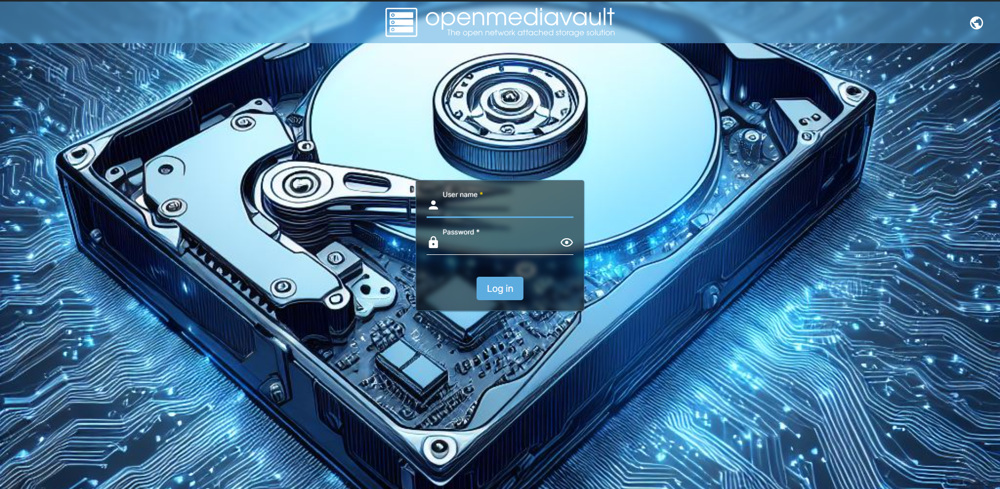

The default login is User Name: admin, password: openmediavault. Double check the default login is still this by reading the [OMV Documentation Pages](https://docs.openmediavault.org/). When first login, you will be presented with the dashboard page. Before making any edits, the admin login password should change. To do this enter the user settings page by hovering on the person image on the top right. Then click the Change Password option to set a strong password.


Once in the page, set a strong admin password for the web UI. Preferably use a password manager (eg. [KeePassXC](https://keepassxc.org/)) to generate and store this password. Once completed, you will be sent to the home page of the web UI.

It is likely you will have to complete some software updates on your server. Luckily, OMV has a update tool that you can use. To access this tool on the left hand side on the web UI, you will see three lines. Click on it and then click the system option.


Once in that page you will see and Update Management Option. Open that page, then the Updates page option given. This page will allow you to update your server from the web UI.


In the updates page you will see all the available updates for your server and on the left there will be a download button to install the latest updates. Click that button and confirm to install the updates.


A pop up command line will appear showing the system logs taking place. Once the updates are complete, a close button will appear available.


Sometimes when performing updates, a Pending configuration changes panel will appear at the top of the screen. I would recommend applying these changes after applying updates. Just click on the check mark to apply. A pop up will appear of the logs and once complete, a close button will become available.


When performing updates to the server. It is best practice to reboot the server. Luckily, in the Web UI on the top right, there will be a power button option. when it drops down there will be a reboot option. Reboot the server.

### Dashboard

When logging in to the server web interface, you are first taken to the dashboard page. This page can be customized show the current state of the server. Some information you can include is system load, file system used and unused space, currently running services and many more. To edit the dashboard, click on the user settings button on the top right (icon of a person) and click on the dashboard option in the drop down. 


Once in the dashboard page, it will give you options to enable widgets that will detail various properties of the server. Enable the widgets that you want on your dashboard page.


Once all the relevant widgets have been chosen, click save at the bottom of the page. This will take you back to dashboard page and you will now see the widgets you choose to appear.


### System Settings Overview

_11/08/2024_

This section briefly goes over the system settings options and defines what I personally changed or added for my use case. When making changes, a Pending configuration changes panel will appear at the top of the screen. Just click on the check mark to apply.


The options are as follows:

- Workbench
  
  - Web UI Port - Default of 80 I personally changed to 2000 as I will have nginx proxy manager set to port 80 in the future. If changing make sure to connect via <IP address>:<Port Number>
  
  - Auto Logout - Default of 5 minutes, changed to 15 mins.
  
  - Secure Connection Options - This is to setup a https connection instead of a http connection. Https is a secure encrypted connection to the server. I currently do not have this enabled as this server is on a network with only  my devices. I may set it up in the future.
    
    - SSL/TLS enabled - Enable http connection
      
      - Certificate - Choosing which generated certificate to use. Allows you to create new one as well.
      
      - Port - port off Web UI - Port connection option to https connection.
    
    - Force SSL/TLS - Make https only available connection option.

- Date & Time
  
  - Time zone - set your time zone. Should be setup from initial install.
  
  - Use NTP server - NTP(Network Time protocol) are servers that connect to you server to keep the server time accurate.
    
    - Time Servers - Comma separated list of time servers. Should have been setup on initial install. I use `pool.ntp.org` which should work everywhere. research servers to choose what is best for you.
    
    - Allowed Clients - Client IP address/ host names that can connect to NTP server. I leave mine blank.

- Notification
  
  - Settings
    - Enabled - Enable email notifications from server. I do not have them enabled.
      - SMTP server - Server address to use
      - SMTP port - port number of server
      - Encryption Mode - Options of `None, SSL/TLS, STARTTLS, Auto` you should have some encryption enabled to help protect data during transit on the internet.
      - Sender email - User Email notification emails will be sent from.
      - Authentication Required - Does the email account need to be logged into.
        - User name
        - Password
      - Recipient - Email that will receive notification email.
        - Primary email
        - Secondary Email
      - Test Button - To send a test email out.
  - Events - Options of things that will send notification emails out.
    - CPU usage
    - File systems
    - Load Average
    - Memory usage
    - Process monitoring
    - S.M.A.R.T.

- Power Management
  
  - Settings
    
    - Monitoring - Enable monitoring of the system to specify CPU status and select appropriate level. I have it enabled.
    
    - Power Button - Specify what your systems power button does. options are `Nothing, power Off, Standby`. I set to power off.
    
    - Standby mode - specifies what your system should do when put in standby mode. Options are `Nothing, power Off, Standby`. i put mine to power off.
  
  - Scheduled Tasks - In this section you can create scheduled power based tasks. You can create a `standby, shutdown or reboot` task. These tasks can be executed at:
    
    - A specific date time down to minutes, 
    
    - Every N minute, hour, day of month.
    
    - Or Hourly, Daily, Weekly, Monthly, Yearly
    
    - I personally have a reboot task that runs monthly. This normally means my server reboots every first day on the month.

- Monitoring
  
  - Enabled - Specifies if performance stats are collected and graphed. I enable it to see performance over time.

- Scheduled Tasks - Here you can create cron tasks on your server. These are custom commands to do what ever you want. These tasks can be executed at:
  
  - A specific date time down to minutes,
  
  - Every N minute, hour, day of month.
  
  - Hourly, Daily, Weekly, Monthly, Yearly.
  
  - Or at reboot.
  
  - I personally do not run any cron tasks.

- Certificates
  
  - SSH - In this page you can create or import SSH certificates. This is used to secure SSH access. I do not have any SSH certificates.
  
  - SSL - In this page you can create or import SSL certificates. This is used to secure an https connection. I do not have any SSL certificates.

- Update Management
  
  - Updates - In this page you can check for new updates and Install them.
  
  - Settings
    
    - Pre-release updates - I do not have this enabled.
    
    - Community-maintained updates - I do not have this enabled.

- Plugins - Here you can install plugins to add functionality to you server. Have a look through it to see if any are interesting to you. There are more plugins in OMV extras which must be installed separately.

#### Plugins OMV Extras

There are extra plugins for OMV which are called [OMV extras](https://wiki.omv-extras.org/doku.php?id=start). These extras expand the functionality of OMV. I personally use it and it is simple to install. The instructions to install this are detailed below:

1) Connect to the server via SSH (Secure Shell) on an account with root/ sudo access. A common method is to use [PuTTY](https://putty.org/). You can also use things like the terminal or command prompt (name depends on platform). i will be using the windows command prompt.
   
   1) To do this I open the command prompt in windows and use the command `SSH <root/user account>@<IP Address/ Host Name>`. 
   
   2) It will ask you about a key finger print if you have not connected before. Type yes then enter to approve the connection to the server.
   
   3) It will then ask you for the password to the account you want to login to. Type the password out, it will not appear, then hit enter. You are now connected via SSH to your server.

2) You can install OMV extra via the command on the [OMV extras](https://wiki.omv-extras.org/doku.php?id=start) website. When I installed OMV extras on 11/08/2024 the command was as follows: `wget -O - https://github.com/OpenMediaVault-Plugin-Developers/packages/raw/master/install | bash`. For a non root account make sure you have `sudo` at the start of the command. Once you hit enter the install should run.

3) It is good practice to reboot your server when performing an install like this. You can reboot it from the OMV web interface or, you can reboot from the command line through the command `reboot`. Remember to use `sudo` for non root accounts.

OMV extras is now installed. You can now install more plugins and install docker under the omv-extras page in the system settings panel.

### Network Settings Overview

_11/08/2024_

This section briefly goes over the network settings options and what I personally changed or added for my use case. The options are as follows:

- General
  
  - Hostname - Name given to the server, setup on initial install but changeable here.
  
  - Domain Name - If you have a public domain e.g. google you can use that here. I do not and this server is local only so I use local.

- Interfaces - Here you can create or identify different network interfaces and see all their info. You can also set things like static IP addresses here as well. I have not changed the default options of my system.

- Proxy - Here you can enable a http, https or ftp proxy. I do not have any proxy setup.

- Firewall
  
  - Rules - Here you can setup firewall rules on IPV4 and IPV6 network interfaces. I do not have any firewall rules setup.

### Drive Setup/ Storage Page

Now that the server has the most basic setup completed, further drives can be mounted to the server. Mounting a drive allows the server to use the drive through the operating systems (Open Media Vault) file system to make files/ folders to store or run services.

In this guide, I have a single SATA Solid State Drive (SSD), which will be used for fast storage for the services run on the server. I also have 2, 8TB Hard Disk Drives (HDDs) which will be put in a [RAID](https://en.wikipedia.org/wiki/RAID) setup. For my use case, I will use a RAID 1 / mirrored setup using [ZFS](https://openzfs.org/wiki/Main_Page). This means that the data written on both drives will be identical. This means that if 1 drive fails, the server can still run with no loss in data as the other HDD contained all the data on the failed drive. It would is best practice to replace a failed drive as soon as possible but having [redundancy](https://en.wikipedia.org/wiki/Redundancy_(engineering)) in the server helps to keep it running. For more information on this check out the [RAID Wikipedia](https://en.wikipedia.org/wiki/RAID) page.

The first step of mounting these drives is to enter the storage settings page. To do this, you must first click on the three lines on the top left on the login OMV web interface. Then in the Navigation pane that appears you must click the "Storage" option.


Once you are in the storage panel you will see 4 options.


- Disks - Allows you to see and manage all the physically connected drives to the server normally through a SATA connection.
  
  - You can wipe the data off the drives from this page. It is best practice to wipe a drive before setting it up. Therefore you should wipe all drives that are not your boot drive. A quick wipe should suffice. A secure wipe should be used when the drive is no longer used and you maybe selling it. This makes it so that data cannot be recovered like it can on a quick wipe.
  
  - In this page you can also edit the drives power, acoustic, Spin down and write-cache settings.
    
    - As i want to reduce the power draw of my system for my 2 8Tb HDDs i enabled the `1 -Minimim power usage with standby (spindown)` option. This will spin the drives down reducing power consumption considerably. I will apply the `Minimum performance, minimum acoustic output` option for the acoustic management setting and set Spin down time to 20 minutes. I will be enabling write-cache to reduce writes to my drives.
    
    - For my NVME and SSD drives I will apply the option of `127 - Intermediate power usage with standby` for the power management setting. I will apply the `Maximum performance, maximum acoustic output` for acoustic option, spin down time set to 20 mins and enable write-cache.
    
    - Make sure to apply all these changes by clicking the tick on the yellow top banner.

- S.M.A.R.T.
  
  - Settings
    
    - Enabled - Enable the monitoring of the drives. This makes your server check the drives S.M.A.R.T. Data periodically for errors or warnings. I have this enabled to monitor my drive health on the dashboard.
    
    - Check interval - sets how often the drives health will be checked. In seconds. I set mine to 50 minutes which it 3000 seconds.
    
    - Power mode - This setting specifies when the drive should not have it's S.M.A.R.T. data checked. You can disable checking if the drive is in sleep, standby and idle. I choose the option `Standby` which does not check the drives data if the drive is in sleep and standby as I would like to keep my drives spun down if they are not in use.
    
    - Temperature monitoring
      
      - Difference - Report if temperature varies by more than the defined amount of degrees C. I disable this.
      
      - Maximum - Report if drive is greater than or equal to specified temperature. I set this to 60 degrees C as that is the environmental specifications of my drives.
  
  - Devices - Here you can see all the drive data and we can edit the drive and enable them for monitoring. I have enabled monitoring for all my drives and used the global settings for both temperature difference and maximum temperature.
  
  - Scheduled Tasks - Here we can create tasks to perform test on your drives. You can create: `Short self-test, Long self-test, Conveyance self-test, Offline immediate test`. You can set it to execute on certain hours, days in month, days of week or on certain months. I have 2 tests that are setup for all my drives.
    
    - The first is a weekly Short self-test performed on Sunday.
    
    - The second is a monthly Long self-test performed on the 2nd of every month.
    
    - These tests should help me monitor the heath of my drives and notice errors sooner.

#### Mounting File Systems

To use the extra drives on a server we must mount the drives to the server. You can mount the drives as single drives or as a RAID array.

##### Single Drive

I will be mounting my SSD as a single drive. This will be used for services that need fast read and/or write speeds. I will be using a EXT4 file system as it is a common file system used in Linux and it works well with small files which this drive is likely to hold in the future.

In the `File Systems` sub page of the storage page you can click on the plus button with a circle. Then click on the file system of choice (EXT4).


You will then be directed to a page where you can choose your drive. choose your drive of choice then click save. A pop up will appear of the drive mounting. Let it run, it may take a while depending on your drive size. Once completed click the close button.

You will now be in a mount page, select the drive you just setup and set a Usage warning Threshold. I set my Threshold to 85%. Make sure that a drive does not fill up 100% as if it does, you cannot write to the log file and you have to wipe the drive to work with it again.

Once you have clicked save and applied changes, you have mounted a drive to your server.

To use the drive in OMV you must create a Shared folder in the drive. To do this, go into the Shared Folders sub page in the Storage page and click on the circle with a plus in it. You will be taken to a create folder page.


In this page you can: name your folder, set which file system (drive in this case) it will be added to, the relative path of the folder on the drive and permissions of who can access the file.

For my SSD storage I will setup a folder named SSD_Storage with 2 folders in it named Remote_Content and Local_Only_Content. This will help me locate content from external machines and content that is only one the server. if you want to replicate this make sure your relative path is something along the lines of `<First Folder>/<Second Folder>/`, making sure a `/` is always at the end.


Once you have completed creating the shared folder, it can then be used on the server. It is best practice to create a new folder for each service so that you know exactly where all the data for that service is stored. 

##### RAID ZFS Array

_27/09/2024_

I will be mounting my 8TB hard drives in a mirrored ZFS array. To accomplish this  you first need to install the ZFS plugin for OMV. This can be found in the `System>Plugins` page.


Once installed, Navigate to the page `Storage>zfs>Pools` , here we will create our mirrored raid array. Click on the add pool button.

The options I will select in the create pool page are as follows:

- Name - `Mass_Storage`

- Pool type - `Mirror`

- Devices - I selected my 2 Hard drives which have an ID of `/dev/sda` and `/dev/sdb`.

All other settings I left as their default. I then clicked save. Once saved apply the changes through the prompt.

Now a ZFS mirrored array is mounted to the server. We can now make Shared folders that our services can use just like we did for the single SSD drive.

I will have a file system with the layout described in the image bellow to help organize my services so that it is easier to find via SSH. If you want to replicate this make sure your relative path is something along the lines of `<First Folder>/<Second Folder>/`, making sure a `/` is always at the end.


It is best practice to create a new folder for each service so that you know exactly where all the data for that service is stored. Once you have created all of your folders remember to apply all the changes.

#### Disk Stats

(Start of 24/03/2025 edit)

OMV by default only tracks the storage usage of drives/ volumes mounted. To track the read and write operations in the OMV web management UI, you must install a plugin called `openmediavault-diskstats`. It can be found in the `System>Plugins` page.


Once installed if you navigate to `Diagnostics>Performance Statistics > Disk I/O` you will be able to see disk IO stats for all your drives (as of writing, any drive in a ZFS array does not show up in this page). You can see the following properties over an hour, day, month and year:

- Disk Traffic

- Operations

- Time per operation


(End of 24/03/2025 edit)

### Services

_28/09/2024_

This page shows all the installed services that are running and allows you to change their settings. This is where the installed plugin settings will most likely be. For now I will leave it as it is until I am ready to setup my services.

### User Management

In this page we can setup new users on our server. The different page options are as follows:

- Settings - Allows you to enable the users home directory and specify a location.

- Users - This is where you can create, import, and edit users which can be used for certain tasks instead of using the admin user to run all tasks. When it is relevant I will create a new user.

- Groups - This is where you can create, Import and edit user groups. This is where you can group together users for specific tasks.

### Diagnostics

This page gives system information to understand why an issue maybe occurring on your server. There are many pages which are as follows:

- System Information - Describes Basic Information about your server.

- System Logs - View the system logs.

- Processes - Like Task manager for windows or top in the command line for Linux.

- Services - Status of services running.

- Report - Generate a report about your system.

- Performance statistics - Graphs to show how your system is performing hourly, daily, weekly, monthly and yearly.
  
  - CPU - CPU usage.
  
  - File System Usage - drive used and free storage.
  
  - Load Average - Power usage of system.
  
  - Memory Usage - Free and Used RAM.
  
  - Network Interface - Network Traffic.
  
  - Uptime - Server powered on Time.

# Docker Install

_06/10/2024_

Open media vault 7 has a built in [docker management interface](https://wiki.omv-extras.org/doku.php?id=omv7:docker_in_omv). I will personally be using this interface for my use case but you can use another management interface like [portainer](https://www.portainer.io/) which is another popular docker management system or just use the command line. Documentation on this docker plugin can be found [here](https://wiki.omv-extras.org/doku.php?id=omv7:docker_in_omv).

## Folder Setup

The first step in this process is to setup the folders that docker will install/ save to. This is to separate docker data from the operating system data. This helps with backups and helps maintain the life of the OS storage drive.

The following folders will be created:

- Compose_Files - Where the compose files created will be stored. This will be put on the SSD drive so that the OS has faster access to it compared to the HDD array.

- Container_Data - This folder will be where persistent container data will be held. As I want this to be accessed quickly I will keep this on the SSD drive. 

- Docker_Backup - OMV docker management plugin has the option to automatically backup container data. I will use this feature and will make this folder on the HDD array as i do not need fast access to that data.

- Docker_Storage - This folder will be the files that docker uses internally. I will run this on the SSD for fast file access. Note that the Absolute Path is required instead of clicking on the respective folder from a drop down like the rest of the folders.

On the SSD, I will organize the folders like the diagram bellow under the Local_Only_Content folder.


On the HDD array, I will just place the Docker_Backup folder under the `Local_Only_Content` folder on the HDD array.

 

For all the folders created I will have the permissions set to `Administrator: read/write, Users: read/write, Others: no access`. Remember to change the relative folder path and to apply the changes when completed.


## Installing Docker

Now that the folders have been setup, it is time to install docker onto the server. navigate to `System > omv-extras`. One this page tick the docker repo check box and hit save.


Now navigate to `System >Plugins` to install the compose plugin.


Now we can setup the install folders we set up earlier. Navigate to `Services > Compose > Settings`. Fill in the respective folders setup previously in the relevant areas. I left the compose files to be owned and edited only by the root/admin user so that only the admin account can access those files. Remember that the Docker storage path needs to be the absolute one so go into `Storage > Shared Folders` to find what it is. Once you are happy with your selections click save at the bottom, then hit apply changes on the yellow bar.


Once you have applied the changes you will see under docker that it is installed and running. It will also show your docker and docker compose versions.


## Creating a Docker User

I will create a docker user that will be used for only docker containers. In docker there is an important property called [PUID and PGID](https://docs.linuxserver.io/general/understanding-puid-and-pgid/#why-use-these) which is important for access to the file system, process management, etc. As I currently only have 1 user created, that being root, I do not want each of my docker containers to have full access to my system through the root account. I also do not want any folders or files created by the docker containers to be only owned by root. Therefore, by making a new user, I can access files and folders without having to login to root and it will also help reduce the risk of a container compromising my server.

To create a new user, login to the OMV web interface and navigate to `User Management > Users`. In this page click the plus button in the blue circle to create a new user.

I will give the user the following properties:

- Name - Name given to the user. I have used `DockerUser`

- Password - The password to the user account. Make sure this is a strong password and it is saved securely in something like a password manager.

- Confirm password - confirming password put in.

- Groups - This is the group permissions that the user has. By default the `users` group is added and it cannot be removed. For my use case I do no need it to have any other group permissions (_05/06/2025_ After using this server more i have added the `_ssh` group to this user so that it has ssh access which is occasionally needed.). Depending on your use case you may have to add the user to other groups depending on the docker containers you will run.

- Disallow account modification - I have enabled this to avoid the user being able to modify its account helping with security.

- (_05/06/2025_ I would also make sure the home directories are enabled for the users and have it direct to a folder in the SSD space found in `Users > Settings`)

I am creating only 1 user as my system will only be available on my local network and my zero tier network which is only used by myself. If you are using this on a more public network I would recommend reading the [OMV docker documentation](https://wiki.omv-extras.org/doku.php?id=omv7:docker_in_omv) to understand how to make a more secure user for each container.


Once all relevant fields have been filled, save and apply the changes.

I want to restrict this docker users folder access so that it cannot modify the backup snapshots that I have created. To do this click on the docker user and click the folder with the key on it at the top.


You will be taken to a page where you can see all the shared folders created and change it's permissions. By default, the user can read and write to all the folders so I will take the Backup Folders and Set them to read only in case I use a docker container to sync the data. I also Set the compose files folder to read only so that i know they can only be edited by an admin.


Once folder permissions have been adjusted, save and apply the changes.

Now back at the users page make sure that you can see the UID and GID columns. Take note of the numbers for when you need them in docker.


## Overview of Plugin

Docker has now been fully setup on the server. Navigating to `Services>Compose` you can manage docker.

- Settings - Described in the install process above. Allows choosing where different docker elements will be installed/ saved.

- Files - Allows management of docker compose files. Create, Edit and delete compose files. Build from template. Check, Up, Stop, Down, Pull, Ps. Global environment variables, Prune, Tools, docs.

- Services - See what is running, monitor logs, restart, download logs.

- Stats - Like [top](https://www.geeksforgeeks.org/top-command-in-linux-with-examples/) but for all containers that are currently running. Name, CPU, Memory, Net, etc.

- Images - Manage docker images. Delete, Inspect, tag, push.

- Networks - Manage docker networks. Add, Delete, Inspect.

- Volumes - Manage docker volumes. Delete, inspect.

- Containers - See status of currently running containers. Name, Image, State, Status, Ports, Mounts. Restart, logs.

- Dockerfiles - Create and manage docker files. Create, edit, delete. Build, pull and build, tag.

- Schedule - Schedule backups, updates and prune to the docker containers that are installed on the system. Can be set on an automatic schedule.

- Restore - Restore a container from a backup.

# Remote Access Zero tier

_12/10/2024_

For remote access to my server, I will be using [ZeroTier](https://www.zerotier.com/). ZeroTier is a Virtual Private Network which allows direct connection to any devices you make part of it's network. This is just a simpler VPN solution where you do not have to have any of your own servers publicly accessible to the internet. ZeroTier offer a free tier which can be used by hobbyist and a self hostable option but i find the service amazing and recommend paying for their online service so you have none of your services publicly accessible to the wider internet.

## Account Setup

The first thing to do is to setup an account on the [ZeroTier central webpage](https://my.zerotier.com/). What ever password you use make sure it is strong and stored in something like a password manager. You could also sign in with your google, Microsoft or GitHub account, i do not recommend signing in through on of those accounts to distance yourself from data collecting companies and make it harder for a hacker to gain access to all your accounts.

Once your account is made, login to ZeroTier central. You will see all of your networks. You should have none so click on the create a network button.


You should now be able to name your network, see your network ID and all connected devices. You can also see all of your settings for that specific network. I leave most of them the same but advanced users may want to adjust some of them. I only add a description to my network and I set access control to `Private` so that an admin must approve you joining the network to access everything. This just makes the network more secure. Have a look at their [Documentation](https://docs.zerotier.com/central/) for further information.

You will need your network ID later on when ZeroTier is installed on your server and any devices you want to connect (eg. phone, windows, mac, Linux, etc).

For more information and configuration options of the ZeroTier network have a read of their [documentation](https://docs.zerotier.com/).

## Connecting to ZeroTier Network

### Server (Linux Debian)

Now to install onto the server, connect to a sudo/ root enabled account through SSH on the server. I recommend using something like [Putty](https://putty.org/) to use SSH but I will use the windows command prompt. Use the command `ssh <user account>@<IP address/ host name of server>` then insert your password for the account being used.

Once you are logged into your server, run `sudo apt update` and then `sudo apt upgrade` if you have packages to upgrade. Remember to run `sudo restart` if you upgraded a package. You may no have to but, `curl` is required to install zero tier. To make sure that it is on your system, run the command `sudo apt install curl`. Restart if it does install.

Looking at the [ZeroTier download page](https://www.zerotier.com/download/) we can run the command `curl -s https://install.zerotier.com | sudo bash` to install ZeroTier onto our system. Please double check the command when you install as it may have changed since this doc was written. If you have GPG installed as well you can use a more secure command found on the [download page](https://www.zerotier.com/download/). Make sure to restart your server after the install.

Now that ZeroTier is installed we can connect to our network with the following command `zerotier-cli join <Network ID>`.  Run the command `zerotier-cli info`. You will get a result similar to: `200 info <Device ID> 1.10.2 Status` This will tell you at least your Device ID. This will be important in a little bit. Running the command `zerotier-cli listnetworks`, we can see all the networks we are trying to connect to. we may see an `Access Denied` message besides the network we entered above. This will be because we set the Access control in the web interface to private. We have to enter the web panel and approve our server.


Thank you to the zero tier page for this picture instead of using a picture of my own network. We cab edit/ view a few of the device properties in this interface like Name, description, last seen, etc.

We have now officially added a device/ our server to our ZeroTier Network. Add all the devices you want.

### Windows/ Mac Install

One of the devices I will connect to my ZeroTier network is a windows and MAC computer. The process to connect these devices are very similar. To connect it to our network we can download the installer from the [ZeroTier download page](https://www.zerotier.com/download/) or we could use winget for windows and Homebrew for MAC.

- MAC Homebrew command = `brew install --cask zerotier-one`

- Windows winget command = `winget install --id ZeroTier.ZeroTierOne`

Once installed we should see a ZeroTier logo at the top of the screen for mac and on the bottom right for windows. Click that button to open it's settings.


You should be able to see a button to ask you to join a new network. Click that button and enter your network ID from your account setup. Thank you to ZeroTier for their screen shots.


once you have entered and joined the network you may not be connected to it yet, you must approve the device on the web interface if you set the Access control to Private. This is shown in the previous Linux install section.

### Android & iPhone

To Install ZeroTier download ZeroTier-one from either the [Google Play Store](https://play.google.com/store/apps/details?id=com.zerotier.one&hl=en_US) or the [App Store](https://apps.apple.com/us/app/zerotier-one/id1084101492). Once installed, open the app and click the add network button.

Enter the network ID in the setup menu and save it. When ready, activate the connection to connect the the ZeroTier network. Just like the windows/MAC/Linux setups you may have to approve the connection.

Note that ZeroTier acts like a VPN on mobile platforms so if you want to use another VPN you must disable ZeroTier to use it. I tend to only connect to to ZeroTier on mobile if i need to and tend not to keep it active.

# Heimdall

_13/10/2024_

One of the first docker containers I will setup is [Heimdall](https://heimdall.site/). Heimdall is a very simple and easy to setup start page/ dashboard. I use it to organize/ display links to all the web services I run. There are many other "nicer" looking dashboards for servers out there but I like the simplicity of Heimdall compared to those other options.

It must be noted that I will be using [Heimdalls Linux Server docker image](https://docs.linuxserver.io/images/docker-heimdall/) as it is easier to use in comparison to the normal docker install method.

## File Setup

For the Heimdall image, we need a folder for all of the config files of the container. I will create one on the SSD in the local only content folder so that it has fast access to those files. I will name it `Heimdall` for future reference. My folder setup is the image bellow:


Make sure to apply the change.

Now for the compose file, we will need the Absolute Path of the folder we just created. Navigate to `Storage > Shared Folders` to view the table of all the folders created. Find the Heimdall Folder created and copy the absolute path for later. Mine is `/srv/dev-disk-by-uuid-00337ac1-aca8-4dc6-b5d7-dfaf50835ac5/SSD_Storage/Local_Only_Content/Heimdall` for reference.

Note that you may have to show the Absolute path column if it is not appearing already using the table column option button.


1) Table column options

2) Absolute path column option

3) Absolute Path of the Docker_Backup Folder

## Making compose File

The first step is to know the [PUID and PGID](https://docs.linuxserver.io/general/understanding-puid-and-pgid/#why-use-these) of the docker user we set up when installing docker. We will need these in the compose file. My PUID is 1000 with a PGID of 100. If you go to `User Management > Users` you will see those properties of all users you have created.

To create the compose file we must navigate to `Services > Compose > Files` and click on the white plus in the blue circle. We will get options to:

- add a compose file

- Add from example

- etc


The important ones for us are:

- Add

- Add from Example

There are already tons of examples to use for many different things. Have a look at them for services you may want to run.

For use we can either use `Add` or `Add From Example`. I will be using add from Example. We will be taken to a page where we can select our example `Heimdall` in our case, give it a name. Do not use any spaces, as auto updates and backups will not work if you do. I named mine `Heimdall`. We can also provide a description of the container if we would like.


Click save, we will now see the container in or compose file page. It will show up as down for now as we have not turned it on (up) as we need to make a few edits. Ignore the pending configuration changes for now until we are done.


Click on the container and select the edit button (looks like a pencil).


We will now see our compose file and edit it. I will be making a few edits to this file:

- Firstly adjusting the image name to `lscr.io/linuxserver/heimdall:latest` to match the [Documentation](https://docs.linuxserver.io/images/docker-heimdall/#usage) on the Linux server page.

- Entering my PUID and PGID into the associated environment parameters.

- Enter my time zone based on the [TZ codes](https://en.wikipedia.org/wiki/List_of_tz_database_time_zones). UK is `Europe/London`.

- Enter my absolute path to my Heimdall config folder under volumes before the `:/config` part.

- Change the port `444` to `20001` before the `:443` This will be the https connection.

- Change the port `99:80` to `2002:80`

- Removed anything that was related to network configuration.
  
  - `networks:
     my-net:`
  
  - `networks:
     my-net:
     external: true`

- Everything else I left the same.

My final compose file looked like so:

```yaml
---

services:
  heimdall:
    image: lscr.io/linuxserver/heimdall:latest
    container_name: heimdall
    environment:
      - PUID=1000
      - PGID=100
      - TZ=Europe/London
    volumes:
      - /srv/dev-disk-by-uuid-00337ac1-aca8-4dc6-b5d7-dfaf50835ac5/SSD_Storage/Local_Only_Content/Heimdall:/config
    ports:
      - 2001:443
      - 2002:80 #optional
    restart: unless-stopped
```

Yours should look similar. Click save once you are done. Make sure to apply any changes.

__Note that the part it has as optional in the compose file is not actually optional. You must run it if using the Linux server image__ If using the original image there are different options.

## Launching the Container

To launch the Heimdall container made in the previous chapter, navigate to `Services > Compose > Files`, select the Heimdall container and select the up button. It will be an arrow pointing up in a circle:


When we click that button a screen will appear with all of the log files.


Once it has completed, we will see the status column change to `up`.


We now have Heimdall running.

## Using Heimdall

Now that we have the Heimdall container running, we can connect to it by typing in our search bar in our browser a command similar to `<Host Name/ IP address>:<Network Port of choice>` so for me an example command would be `hpz240nas.local:2002` for an http connection to Heimdall.

When we first connect to Heimdall we will get this interface:


On the bottom right hand panel we will have the following options from top to bottom:

- Reorder and Pin Items - Used to organize the order of all the pins that you create.

- Home dashboard - go to the home page

- Users -  User management (set user passwords, admins, different permissions)

- Application List - List of available pins/ applications that have been added.

- Tag list - List of tags.

- Settings - Configuration Settings

### User Creation

The first thing that I will do is lock out anyone from the admin panels. To do that we go into the Users page. We will then click the edit button under the admin user and set a password. Make sure the password is strong and stored in a password manager.


Save when finished.

We also want to create a user that we normally use. Click the add button on the users page. Give the user :

- a name (eg. Ethan)

- an email address(can be fake)

- A Strong Password

- Set the `Allow public access to front` to off

We have now created an admin user for user creation and control and a general user for myself which I will normally use. In the admin user, I will add applications that pertain to managing my servers like the OMV web interface. In my general user i will add applications that I will use. This will be things like file access from the web interface.

With the current set up, you have to login to either account to access links as there are no publicly accessible ones. I want to keep it like this as I want to control who can use the dashboard. If I want a person to have access to the dashboard with links I will create one for them and add the links.

### Settings Overview

Now that we have created our users, we can adjust the settings for each user to our liking. When we open the settings panel we get the following options:

- System - provides system info
  
  - Version - Heimdall version
  
  - Language - Set language
  
  - Support - Links to support the Heimdall project
  
  - Donate - Donate the the Heimdall project.

- Appearance
  
  - Background Image - Upload a background image to the dashboard.
  
  - Trianglify - Unsure on use.
  
  - Trianglify Random Seed - Unsure on use
  
  - Treat Tags as - Options on how tags are handled. I leave it as folders as I will have a "folder/ tag" for ZeroTier ip address connections and one for local network I{ addresses. Other options include:
    
    - Tags
    
    - Categories

- Miscellaneous
  
  - Homepage Search - Enable search on the home page.
  
  - Default Search Provider - Search Engine that will be used on homepage search.
  
  - Link opens in - Behavior when you click on the application option. Options of:
    
    - Open in the this tab
    
    - Open in same tab
    
    - Open in new tab - this is the one I use.

- Advanced
  
  - Custom CSS - Use a custom CSS for your dashboard
  
  - Custom JavaScript - Use custom JavaScript in your dashboard.

### Tag Addition

Adding tags to the dashboard is very simple. You can use it as a way of categorizing applications (eg. server management, files, finance, etc). I will be using it so that I can distinguish between local IP address links and links over ZeroTier IPs.

I will go into the Tag List page and click the add button.

Here I can give the tag:

- A name

- A colour

- An Icon

- and pin it to the home page.

My ZeroTier tag setup can be seen above. I have also made one for local links.

### Adding Applications

To add applications to the dashboard is very simple. Navigate to the application page and click the add button. I will be adding the open media vault web interface link here for local connections. As this application is supported in Heimdall we can make our lives easier by click the application type button and selecting `openmediavault`. Doing this auto sets up many different properties for our application link.


we can see that may of the properties have been filled in. The only changes I personally made was changing the colour to `#7AE` as it matches OMV better than the black and the tag to be the local tag so it sits under it. I did have to add the URL of `<htttp/https depends on connection type>://<host name/ IP address>:<Port>` which is `http://hpz240nas.local:2000` for my local connection.

A cool feature that i do not use but is available is showing some sort of stat for some services. This is available for OMV. I have it disabled but you could enable it and configure it to display something like CPU stats.

All other properties should be self explanatory. I also made an application link for my ZeroTier IP address.

I would recommend bookmarking the dashboard into your browser so you do not have to remember the IP address and port.

__Important Note -__ If you use host names instead of IP addresses, you can have only one link to your service via `<htttp/https depends on connection type>://<host name>:<Port>`. I personally now just use the host names in my http/https link. I did keep the local and ZeroTier tags for some services which I have on PCs I do not know the host name of.

## Updates and backup

One thing that I want to setup for all docker containers including Heimdall is automatic backups and updates. The OMV plugin allows for this to be the case. To accomplish this, navigate to `Services > Compose > Schedule` and click on the white plus in a blue circle.

You will be taken to a page to create a scheduled task. I will be making the following changes:

- Make sure that the enabled check box is selected

- Select only the Heimdall compose file in the filter box

- Make sure that Backup and Update check boxes are selected

- Schedule is set to `At reboot` as i do not need Heimdall to update quickly after an update. You could set it more frequently and I will do that for some containers but not for Heimdall.

- All other settings I have left as they were.

At the end of the Schedule creation you should see something like the image bellow.


Once completed, save the task and apply the change.

We have now setup automatic backups and updates of the Heimdall container.

# Data Backup

_28/09/2024_

One of the first services I will setup is making sure that the data on my server is backed up. Backing up data is very important incase of server failure or corruption where data on the primary drives has been lost. This allows us to still have access to the data through our backups.

The recommended strategy for building a backup system is to take into account the [3-2-1 backup rule](https://www.seagate.com/gb/en/blog/what-is-a-3-2-1-backup-strategy/). This rule states there must be:

- 3 copies of your data

- 2 Different mediums

- 1 remote/ offsite backup.

The 1 remote/ offsite backup is one many people forget to implement. It is normally only used in disaster scenarios like the building your main and local backup servers are in have burned down. The remote backup will save you here. Your remote backup can be something like a cloud storage service or your own server at a friends house.

For 2 different mediums this can be something like SSDs vs HDDs or even tape storage but, the way I interpret it is to use 2 systems that do not share any components. So I use another completely separate server with a different power supply, motherboard, drives, etc. This is so that if my main server fails. My other server will have all the data backed up onto it.

For 3 different copies if you accomplish the 1 remote and 2 different mediums you should have 3 copies: one on the server running services, one on the local backup server and one remote copy.

# My server backup Plan

My Backup plan for my server involves creating snapshots of all my data on the local server and then syncing these files to my local backup server and my remote one.

I will use the [openmediavault-backup plugin](https://github.com/OpenMediaVault-Plugin-Developers/openmediavault-backup) to backup the Open Media Vault system it's self. I will then backup the data drives using the  [rsnapshot plugin](https://github.com/OpenMediaVault-Plugin-Developers/openmediavault-rsnapshot). All data snapshots will be saved to the 2, 8TB HDD mirrored array in a common folder which is then synced to both the local backup server and the remote backup server through likely something like [Syncthing](https://syncthing.net/). A diagram of how my server backup plan will work is shown bellow.


## Main Server OMV System Backup

To backup my OMV system data, I will first install the [openmediavault-backup plugin](https://github.com/OpenMediaVault-Plugin-Developers/openmediavault-backup) through the OMV plugin section.


Once installed, you can find the backup settings in `System > Backup` page. Here we can adjust the settings for the OMV system backup. Firstly, I will make a new shared folder in the main HDD_Storage space to locate the backed up disc images.

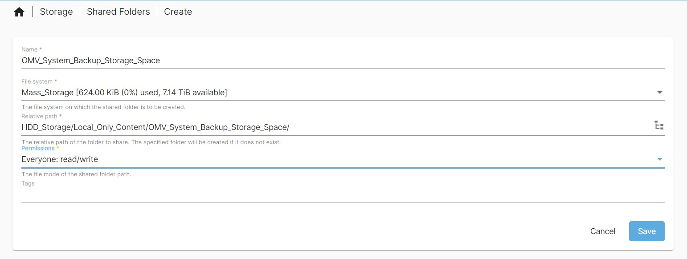

Remember to apply the pending configuration change.

Once that change has been made I will go back to the `System > Backup` page will apply the following settings:

- Settings - Page to adjust OMV system backup settings
  
  - Shared Folder - Target for where backups will be saved.
  
  - Method - I will be using `dd full disk` as it will clone my entire boot drive to a compressed image file which can be used if the boot drive fails. There are other options available like dd, fsachiver, borgbackup and rsync which maybe better for your use case.
  
  - Root device - I will not change this setting
  
  - Keep - Describes the number backup image snapshots it should keep. I will have 4 for my use case.

- Scheduled Backup - Page to adjust when backups will run.
  
  - I will enable Scheduled Backups to run Weekly.
  
  - Remember to apply the pending change.

## SSD and HDD storage Snapshots

I will be creating snapshots of all my data which will then be syncing to my local and remote backup servers. These snapshots will be of the SSD and HDD storage areas and stored on the HDDs. I will first install the rsnapshot plugin.


Once Installed I will navigate to the page `Services > Rsnapshot` to add rsnapshot jobs.

The first job will be for anything stored on the HDDs. The data on the HDDs will be more longer term files compared to the SSD based files. Therefore, I will keep 5 monthly snapshots which will translate to approximately one snapshot a week. All other settings I left as their defaults or set to zero.

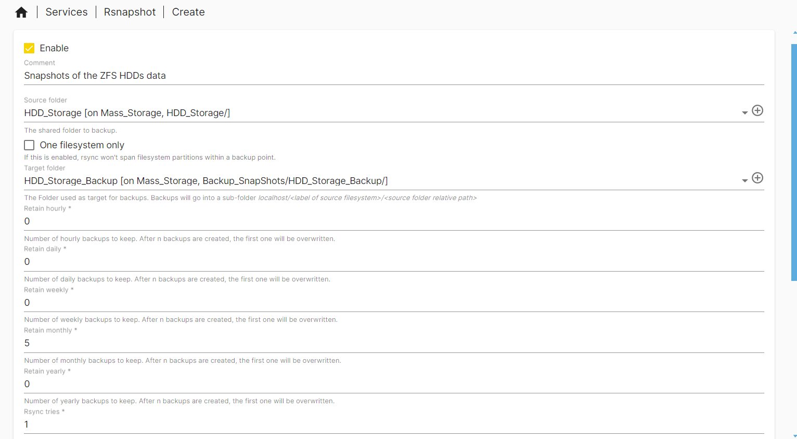

Next I will create a snapshot job for the SSD data. As this data on the SSDs will update frequently in comparison to the HDDs, I will run 4 weekly snapshots and 3 monthly snapshots. This should give me a snapshot of the data nearly every other day. I will also gain some slightly longer term snapshots just incase i make a mistake in a file and the weekly snapshot gets over written before it is recovered. All other settings I left as their defaults or set to zero.


Remember to apply the configuration changes once the jobs have been created.

## Local and Remote snapshot copies

---

# Windows and Linux Based Backups (UrBackup)

_11/01/2025_

For my windows and Linux based systems I will be running full incremental system backups including all data drives. I do this in case I ever have an issue with my system drives or systems as a whole. This allows me to restore onto all new SSDs or systems (laptops, PCs, VMs) if required. These backups will be needed in a worse case scenario like: the loss of a laptop, hardware failure or a broken install of an OS.

For the backups of Windows and Linux systems I will be using a program called [UrBackup](https://www.urbackup.org/index.html). This program can do full system backups of Linux, MAC and Windows systems. I will use something else for any MACs which I have described in another section. For individual files/ folders I will run [Syncthing](https://syncthing.net/) on all platforms but, you could use UrBackup for this use case as well. I will discuss Syncthing in a different section when I set it up on this server.

## Folder Setup

To setup [UrBackup](https://www.urbackup.org/index.html), there are a few folders I want to set up first.

As I will eventually include an area for my families computers/ phones, I want to setup a folder in the HDD_Storage area for only myself. Due to how UrBackup works this will require me to make a new UrBackup container for my families computers but, as I will use the docker method it should be ok. Some added configuration maybe needed when doing my families PCs.

As this is mass remote data, I will create an Ethan folder in the `HDD_Storage > Remote_Content` folder (named `Remote_Content_HDD` on my server). When i eventually add my families computers there will be a folder for them as well. The image bellow shows how the folder structure will look for UrBackup for both my family and myself for reference.


UrBackup also requires a database. In the docker container you specify the folder which this will be contained in. Therefore, I will also create a folder on the SSD for the database for fast access. I will name the folder `Eth_UrBackup` and it will sit under the Local_Only_Content folder. When I setup my families backup content I will do the same.

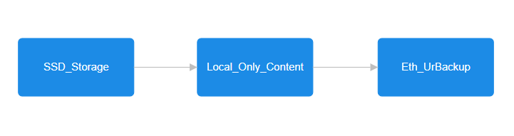

Making folders is that same as previously discussed in this README.md through OMV shared folders. Just remember:

- Typing in the correct Relative path including the `/` at the end.

- Giving it the permissions Admin and Users read/write but others no access.

- Apply the pending configuration changes when completed.

An example of the database folder setup is shown bellow:


Through hind sight with this in future I would have named this folder something along the lines of `Eth_UrBackup_Database` or something similar to help with names.

Make sure to copy the absolute path of both folders created for the compose file.

Note that you may have to show the Absolute path column if it is not appearing already using the table column option button.


## Making Compose File

For now i will be using the recommended compose file to setup my personal UrBackup target. When I setup my families UrBackup server i will write about the changes made but as of writing I am unsure of the compose file setup.

The [recommend compose file](https://hub.docker.com/r/uroni/urbackup-server) is as of follows:

```yaml
version: '2'

services:
  urbackup:
    image: uroni/urbackup-server:latest
    container_name: urbackup
    restart: unless-stopped
    environment:
      - PUID=1000 # Enter the UID of the user who should own the files here
      - PGID=100  # Enter the GID of the user who should own the files here
      - TZ=Europe/Berlin # Enter your timezone
    volumes:
      - /path/to/your/database/folder:/var/urbackup
      - /path/to/your/backup/folder:/backups
      # Uncomment the next line if you want to bind-mount the www-folder
      #- /path/to/wwwfolder:/usr/share/urbackup
    network_mode: "host"
    # Uncomment the following two lines if you're using BTRFS support
    #cap_add:
    #  - SYS_ADMIN
    # Uncomment the following two lines if you're using ZFS support
    #devices:
    #  - /dev/zfs:/dev/zfs
```

The changes I will make are as of follows:

- Changing the `container_name` to `eth_urbackup`.

- `PUID` to `1000` and `PGID` to `100` for my docker user setup in a separate section.

- Enter my time zone based on the [TZ codes](https://en.wikipedia.org/wiki/List_of_tz_database_time_zones). UK is `Europe/London`.

- Volumes changed to:
  
  - From `/path/to/your/database/folder:/var/urbackup` to the absolute path of the `Eth_Backup` folder setup in the folder set up section. `/srv/dev-disk-by-uuid-00337ac1-aca8-4dc6-b5d7-dfaf50835ac5/SSD_Storage/Local_Only_Content/Eth_UrBackup:/var/urbackup`
  
  - From `/path/to/your/backup/folder:/backups`  to the database folder absolute path. `/Mass_Storage/HDD_Storage/Remote_Content_HDD/Ethan_Files/Eth_Full_PC_Backups/Eth_UrBackup_Backups:/backups`

- I have also changed the port numbers by commenting out the `network_mode: "host"` line and adding the following underneath:
  
  - `ports:` in line with where the network_mode line was
  
  - Tabbed in the following required port numbers based on the [UrBackup manual](https://www.urbackup.org/administration_manual.html#x1-9000010.3). Remember that the one on the left is what is externally seen while the ones on the right are internally seen by the container and are not to be changed.
    
    - `- 2003:55413` for the FastCGI bit for the web interface.
    
    - `- 2004:55414` for the http web UI interface. This is the address you will type in when managing the server side settings (the `2004` number).
    
    - `- 2005:55415` the port that internet clients will connect to. This port `2005` remember it for later as you will need it on your clients.
    
    - `- 2006:35623` the UDP broadcast port for discovery ( i likely have messed up discovery by doing this but it is required if I am to have multiple instances of this container for different use cases.)
  
  - I have only done this to allow me to setup multiple container instances. To do that it involves using different port numbers. This does complicate the setup on the clients however. If you are just having one instance i recommend keeping the port numbers as their default but i thought i would include this incase someone else wants to replicate it.

- I will uncomment the ZFS lines as my Hard drives are a ZFS mirrored array. You can probably not include this and it will be fine.

So the full compose file for me will look like the following:

```yaml
version: '2'

services:
  urbackup:
    image: uroni/urbackup-server:latest
    container_name: eth_urbackup
    restart: unless-stopped
    environment:
      - PUID=1000 # Enter the UID of the user who should own the files here
      - PGID=100  # Enter the GID of the user who should own the files here
      - TZ=Europe/London # Enter your timezone
    volumes:
      - /srv/dev-disk-by-uuid-00337ac1-aca8-4dc6-b5d7-dfaf50835ac5/SSD_Storage/Local_Only_Content/Eth_UrBackup:/var/urbackup
      - /Mass_Storage/HDD_Storage/Remote_Content_HDD/Ethan_Files/Eth_Full_PC_Backups/Eth_UrBackup_Backups:/backups
      # Uncomment the next line if you want to bind-mount the www-folder
      #- /path/to/wwwfolder:/usr/share/urbackup
    #network_mode: "host"
    ports:
      - 2003:55413
      - 2004:55414
      - 2005:55415
      - 2006:35623
    # Uncomment the following two lines if you're using BTRFS support
    #cap_add:
    #  - SYS_ADMIN
    # Uncomment the following two lines if you're using ZFS support
    devices:
      - /dev/zfs:/dev/zfs
```

Modify the compose file as you see fit.

### Launching, auto Backups and auto update container image

To launch the UrBackup container it will be the same as the Heimdall container, navigate to `Services > Compose > Files`, select the UrBackup container and select the up button. It will be an arrow pointing up in a circle:


A screen with log commands will appear. Close this when you are done and you will see that the status has changed from `Down` to `Up`. The container is now running.


If like me you have set custom ports it will also show the port numbers. If you have not that will not show.

To automatically backup and update this container image, I will include it in the scheduled task i created for Heimdall. I will navigate to `Services > Compose > Schedule` and click on the scheduled task that at reboot updates and backups containers that it is filtered for. I will then click the pen like icon to edit the task.


Once in the interface you will manually need to type in the filter as the web UI does not make it easy to select multiple containers. It must be noted that all container names must not include spaces. My filter I have to type `Heimdall,eth_urbackup` using commas (`,`) to separate out each container. You could also use `*` to do all containers but i do not as some later containers I add will update more frequently then only at reboot which happens once a month for me.

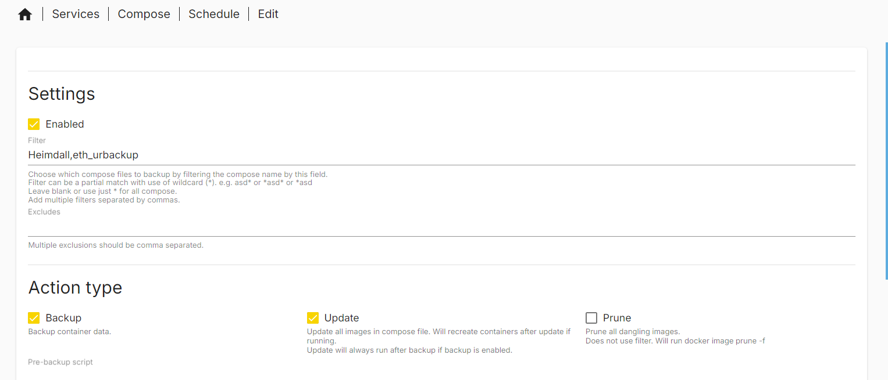

You can check this works by selecting the scheduled task and clicking the run button. A prompt will come up asking you to start the task. Start the task. Log text will appear and at the end will say done.


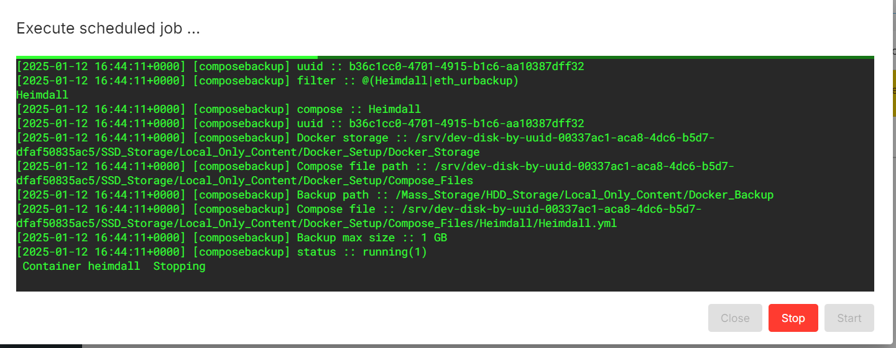

Now if you navigate to `Services > Compose > Restore` you should see all your containers backed up in the page.

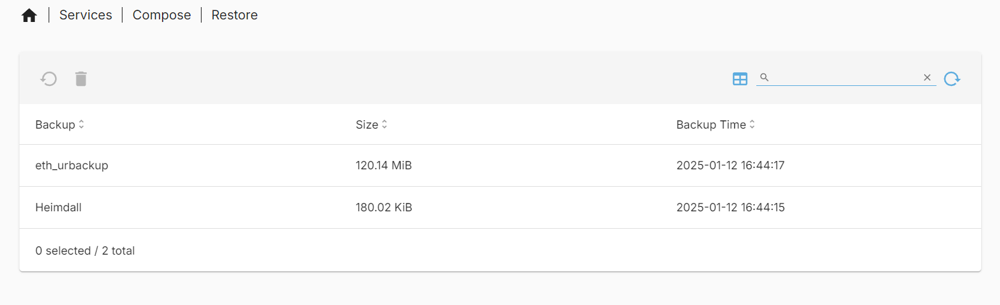

## Server Side Overview

_13/01/2025_

Now that the container is running. We can connect to it via a browser. Type in the following: `http://<host name/ Ip address>:<Port (your custom one or 55414 which is the default)>`. Therefore, for me I type in `http://hpz240nas.local:2004`. You can add this to your dashboard like [Heimdall](https://heimdall.site/) if required.

On the home page we will be greeted by the backup status of all our clients. I have a client setup already but you will likely not have any. Here we are able to add our clients and check up on the status of all the client backups.


If you have setup with the default ports you will not have to manually add a new client if they are on the same local network. If you have used custom ports like myself you will have to add a new client in the status page and change a setting of the web UI which i will discuss later in this section.

To add a new client, click the add new client button on the Status page.


You will be taken to a page where you can add a new internet/active client or discover a client on a new network. Due to me using custom ports I have to select the `Add new internet/active client` option and type in the name i gave to my client then click the `Add client` button for my client to appear.

If you have a client on your local network you could also type in the IP address or host name but, if you have used custom ports like me it may not work.

On the activities page you will see the currently active tasks that UrBackup is running. It will show something like the image bellow. This page can be nice to give an overview of the tasks currently running if you are experiencing issues.

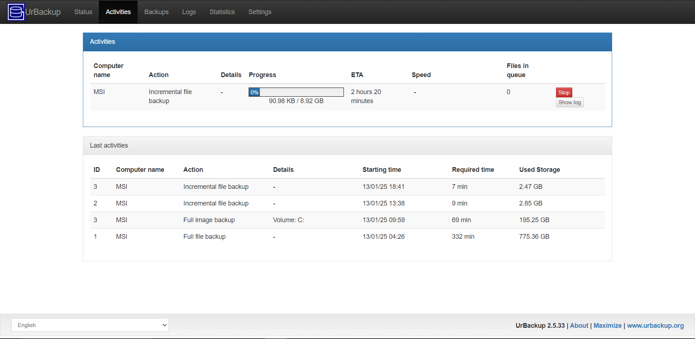

On the backups page you will see an overview of off the clients and when the last backups occurred. This is useful to check if all clients have a semi recent backup. If you click on a client you will see the file and/or image backup history.

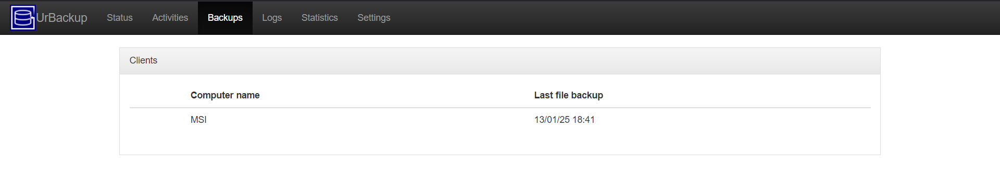

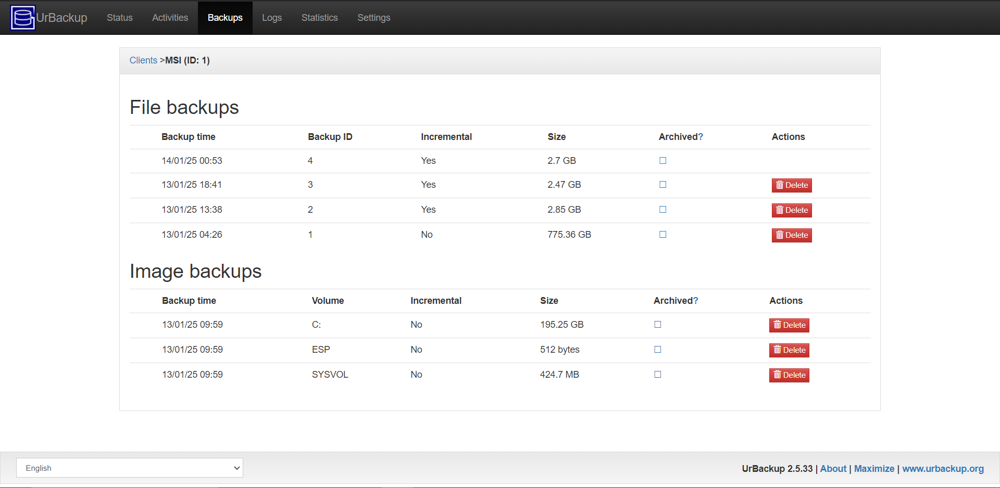

In the logs page you can see the logs from the activities of the UrBackup server with each client. You can filter by warnings or errors, see the live log for a specific client and when a user is created (done later in my write up) create a report to send of all the logs.


In the statistics page you are able to see how much storage UrBackup as a whole is taking up over time and specific clients. You will also be able to see how much storage each client is taking up for file backups and image backups and the totals of each.

Lastly you can see how much storage each client is taking up compared to each other.


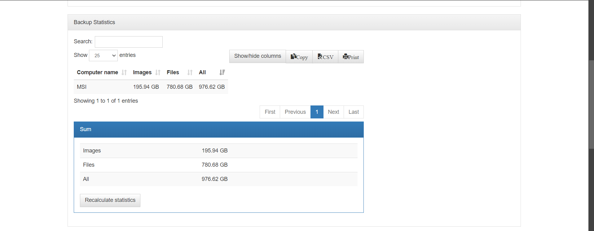


### Settings Page

In the settings page you are able to change may aspects of the UrBackup Server. For all the settings there is a save button at the bottom. Make sure to click it and see the save settings successfully message appear to apply any changes made.


A great thing about the settings pages is that any confusing settings have a question next to them which will take you to an FAQ page on your server describing the setting to you. The [UrBackup admin manual](https://www.urbackup.org/administration_manual.html) also contains great detail about all the [server settings](https://www.urbackup.org/administration_manual.html#x1-410008).

These settings are as follows:

- General
  
  - Server ([Global Server Settings admin Manual](https://www.urbackup.org/administration_manual.html#x1-420008.1)).
    
    - Backup storage path - the default is `/backups` i have left mine as that.
    
    - Server URL for client file/backup access/browsing - This is where if you have used custom port numbers you need to use those. If you have not used custom port numbers like myself use the default http port of 55414. Enter `http://<Host name/ IP address>:<port number of http page (default is 55414)>` for completeness mine is `http://hpz240nas.local:2004`. Make sure you set this up to allow access to restoring backups.
    
    - Do not do image backups - You could out right disable image backups to this specific server if you wanted to i have not as i want to do image backups.
    
    - Do not do file backups  - You could out right disable file backups to this specific server if you wanted to i have not as i want to do file backups.
    
    - Automatically shut down server - You can can let your server automatically shut down if you like. I do not have this enabled as I always want it online running backups of my various systems.
    
    - Download client from update server - Default is on, i just left it.
    
    - Show when a new server version is available - I leave this enabled as it can help me make sure that the container is auto updating.
    
    - Auto update clients - This allows the server to tell the clients to automatically update. I leave this enabled so that my clients are always up to date.
    
    - Max simultaneous backups - Set a maximum number or backups that can be running at one time. Default is 100. To reduce load on my server i have lowered it to 2.
    
    - Max recently active clients - Set a maximum client count. Default is 10000 and I will leave it like that.
    
    - Cleanup time window - Here you are able to set when the server will perform its cleanup operation. By default, it is able to do this every day Monday (1) to Sunday (7) between 3 am and 4am with the input `1-7/3-4`. The syntax description can be found in the [admin manual](https://www.urbackup.org/administration_manual.html#x1-610008.3.1) on the UrBackup webpage or by clicking the question mark on your server. I have left the default setting for myself.
    
    - Automatically backup UrBackup database - I recommend keeping this active just in case you have an issue with the data base or where it is stored. This will help with recovery in the event of a parts failure.
    
    - Total max backup speed for local network - Set a max speed limit for backing up clients on your local network. This maybe needed if you want to reduce the load on your network and your server. I have limited this to 500 MBit/ s. Complex configuration possible please see the [manual section on it](https://www.urbackup.org/administration_manual.html#x1-550008.1.13).
    
    - Global soft file system quota - Determines when UrBackup starts to remove old backups of clients based on the total space used in the drive. I have changed mine to 90%. Read the [manual section](https://www.urbackup.org/administration_manual.html#x1-560008.1.14) for more info/ a better description of how this works.
  
  - File Backups - global settings for file backups to the specific server. Individual clients you can change but this sets the defaults for new clients.
    
    - Interval for incremental file backups - I have set mine to 20 hours up from the default of 5 to reduce load on running these backups frequently.
    - Interval for full backups - I have set mine to 60 days up from the 30 day default to reduce network and server load spike frequency.
    - Maximal number of incremental file backups - Max number of file backups, default of 100 but i have reduced it to 10 to reduce storage space taken up by the client backups. Make sure that the value you set is greater than the Minimal value.
    - Minimal number of incremental file backups - I have set mine to 2 from a default of 40 to reduce storage space taken up.
    - Maximal number of full file backups - I have set mine to 3 from a default to 10 to reduce the storage space taken up by clients.
    - Minimal number of fill file backups - I have left mine as the default of 2 just to avoid possible corruption issues that could occur.
    - Excluded files - I have left blank but if you want to exclude files read the section in the [manual](https://www.urbackup.org/administration_manual.html#x1-630008.3.3) or read the FAQ page that your server can take you to.
    - Included files - I have left blank but if you want to make sure some files are included then click and read the FAQ section on your server.
    - Default directories to backup -  I have changed from a blank setting to `D:\|D_Drive/follow_symlinks,symlinks_optional,share_hashes,optional;C:\|C_Drive/follow_symlinks,symlinks_optional,share_hashes,optional;/|Linux_Root_Drive/follow_symlinks,symlinks_optional,share_hashes,optional`. The directories are separated by `;`. The `C:\` directory is the boot drive for windows. The `D:\` directory is what i typically use when adding a drive to windows. The `|<Name>` is what allows us to name the drive differently and add the directory flags. The `/follow_symlinks,symlinks_optional,share_hashes,optional` is the directory flags to make sure the backup does not fail if the directory does not exist. The `/` before the `|Linux_Root_Drive` is the root directory for Linux. If you want to learn more, click and read the FAQ section on your server and read the [admin manual](https://www.urbackup.org/administration_manual.html#x1-640008.3.4). (06/03/2025) I made a change to my setup where for my main computer, I set the user directory as the folder to file back up as file backing up all of C and D drives took a lot of storage. However, I  have left this as the global default to to make sure everything gets backed up and will make client specific changes where appropriate. the image backups do the full drives with great compression so they should save me in a complete system data loss.(See client specific settings later on in this doc) (end 06/03/2025 adjustment to doc)
    - Directories to backup are optional be default - check box to make the global default directory's optional.
  
  - Image Backups - global settings for image backups to the specific server. Individual clients you can change but this sets the defaults for new clients.
    
    - Interval for incremental image backups - I kept mine at 7 days to keep load on my server low enough while still getting image backups. There is a check box to disable this as well.
    
    - Interval for full image backups - I have increased this to 90 days to reduce load on my network and server. There is a check box to disable this as well.
    
    - Maximal number of incremental image backups - I reduced mine to 5 to reduce storage usage on my server.
    
    - Minimal number of incremental image backups - I have reduced mine at 2 to reduce storage requirements.
    
    - Maximal number of full image backups - I reduced mine to 3 to reduce storage usage on my server.
    
    - Minimal number of full image backups - I kept mine at 2 to keep storage usage low and to make sure I have 2 image backups in case 1 gets corrupted.
    
    - Volumes to backup - I have changed mine to `ALL_NONUSB` to by default backup all volumes on a PC that are not connected via USB. This is slightly different to the default of C drive for the windows boot drive.
    
    - Image backup file format - I have left this as the default of `Compressed VHD (Compressed non-standard Virtual HardDisk)` to save storage space on my server compared to the other main option `VHD (Virtual HardDisk)`. There are V2 versions as well but as they are in beta at the time of writing I have not used them. If V2 is available without beta I will likely use them to get the newest features.
  
  - Permissions - All of these settings are about allowing the client to do various things they are as follows. I have left most enabled but disabled a few. In a business environment you may want to disable certain permissions to stop employees from changing settings.
    
    - Changing of the directories to backup - Disabled as i want all directory's to be backed up and I do not want clients the ability to disable some directories. An admin on the serer side is the only person able to add directories to backup for odd configurations which should be rare in my use case.
    - Starting of
      - full file backups
      - incremental file backups
      - full image backups
      - incremental image backups
    - Viewing of backup logs
    - pausing of backups
    - changing of settings - Disabled as I only want the server side to be able to change settings just in case my client side gets hacked. Any custom settings I will get an admin on the server to change.
    - quit the tray icon
    - start file restores
    - configure components to backup
    - start component restores
  
  - Client
    
    - Delay after system startup - I have increased mine to 5 mins from the default of 0 to allow the client to come fully online before checking backup status.
    
    - Backup window - I have left the default backup window to be 24/7 using the input 1-7/0-24. 1-7 is days of week (Monday = 1 Sunday = 7). Hours are 0-24. You can set custom ones but, I have left as 24/7 for my laptops which are sometimes shutdown. Read the [admin manual](https://www.urbackup.org/administration_manual.html#x1-610008.3.1) for more info.
    
    - Perform auto updates silently - Enabled so that i do not have to manually update UrBackup on my clients and i get the latest security updates.
    
    - Soft client quota - Default is set to none but, you could want to set this to limit the storage space taken up by clients. It is similar to the server Global soft file system quota but client specific. As my clients storage space varies a lot. I have left as blank.
  
  - Archive - This is where you can set Archive rules on your server. I will not use this but here is what the page looks like in case you want to use it.


-   General
  
  - Alerts - If you want to setup alerts to send to you about your clients backups. There are 2 types as of writing, email based and pulse way based. As I will not be using this I have not changed anything. You can also edit the alert scripts if you wanted too. The following images are what the pages look like:


- General
  
  - Local/passive clients
    
    - Max backup speed for Local/passive transfers - I have changed this to 100 MBit/s to reduce network load and allow other clients to backup at the same time if required without reaching the max backup speed for local network.
    
    - Encrypt local/passive transfers - Enabled and should always be so that if your network was compromised the data flowing through it is not encrypted.
    
    - Compress local/ passive transfers - Enabled to reduce network load.
  
  - Internet/Active clients - every setting bellow is as an Internet/active client
    
    - Clients try to connect via Internet - Enabled
    
    - Server URL clients connect to - This is where you have to remember your custom port numbers if used. The default port is `55415` which is the port for internet clients. Here you have to enter `urbackup://<hostname / IP Address>:<port number seen by external computers>` for reference i have typed `urbackup://hpz240nas.local:2005`.
    
    - Connect via HTTP(S) proxy - I have left blank as i do not want to connect via a proxy.
    
    - Do image backups - enabled
    
    - Do full file backups - enabled
    
    - Max backup speed - I have set to 100000 KBit/s as my connection to my server maxes out at apx 100 MBit/s when not on my local network but on my local network it maxes out at 1 GBit/s. Therefore, as my clients will connect via and internet link, this value allows multiple internet clients to backup simultaneously without saturating my local network. As i am unlikely to run continuously at 100 MBit/s away from my server I am not worried about external connections saturating my network.
    
    - Total max backup speed - I have set to 500000 KBit/s as my connection maxes out at 1000 MBit/s (= 1000000 KBit/s) on my local network. As my clients connect via an internet connection due to custom port numbers I have set this equal to my global limit. Although my external network connection maxes out at apx 100 MBit/s (= 100000 KBit/s) I am not worried about fully saturating when running backups as i am unlikely to be able to maintain 100 MBit/s to my server anyway on an external network.
    
    - Encrypted transfer - Enabled to make sure data cannot be seen in transit
    
    - Compressed transfer - Enabled to reduce network load needed.
    
    - Beta: Calculate file hashes on client in parallel - Disabled as is a beta feature. When not in Beta will likely enable.
    
    - Connect as Internet/active client if connected to as local/passive client - Disabled.
    
    - Do not start file backups if current estimated data usage limit per month is smaller than - This is for metered networks which i am not on so i left at the default of 5000 MB.
    
    - Do not start image backups if current estimated data usage limit per month is smaller than - This is for metered networks which i am not on so i left at the default of 20000 MB.
    
    - Update data limit estimation database - I left enabled.
    
    - Restore authentication key - used to help with restoring data. Keep careful note of this.
  
  - Advanced - I have left everything on this page as the default. I do not fully understand it so I leave it to you to read up on it and change the settings if you require.

- Mail - This is where you would setup a mail SMTP server for things like reports and notifications. As i do no have this i will not run it but please read the [Mail section in the manual](https://www.urbackup.org/administration_manual.html#x1-570008.2). The Settings page looks like the bellow:


- LDAP/AD - Unsure about these settings but they are under under development and testing so may not work. I do not recommend changing these unless you know what you are doing. I have left these settings alone.

- Users - __This part is very important__. As a default, there are no users setup, meaning that there is no login to manage the server side backup interface. It is very important that you setup an admin user as soon as possible so that only you are able to manage your server side backup settings. This is in case your network gets compromised having a login reduces the chance that a hacker could destroy your backups.  On the page create a new user by clicking the button to `Create User`. For the first user created, it will be a default of an admin user. Set a strong password for this admin user saving it in a password manager. Then hit create to create the user.


Now that you have setup an admin user, every time you try to connect to your server you will get a login prompt. This makes your UrBackup server much more secure meaning that only someone with an admin password is able to change the settings.

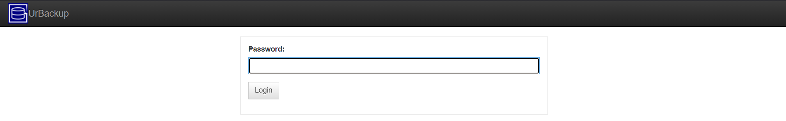

You can create more admin users if you like which can be very useful in a business environment where you have many IT managers who may need to login to the server and make changes.

You can also make users with admin rights to only control the settings of one client. So an admin is able to change settings for all clients which use the server but a client specific admin is only able to change settings with regards to specific clients. This could be useful in a business environment where you may only want limited access from IT managers to manage only certain clients or as a more secure way to manage clients as you will need multiple passwords to change the settings for all clients.

- Client Settings - Lastly, the last page is client settings. Here you are able to change client specific settings for the clients connected to the server. This is useful if you want to make specific settings for a client that may not be the global setting set under the general tab. (Start of 06/03/2025 Edit ) I did make it so that my main computer only file backups the user directory. This PC is windows and the file format to write in the field is `C:\Users\<Your User name>|<Name to give folder>/follow_symlinks,symlinks_optional,share_hashes,optional;` (End of 06/03/2025 edit).

## Windows Client Setup

_11/10/2025_

Now that the server side of the UrBackup system is setup we now need to setup the clients on our systems. There is a windows and Linux Client. Mac does exist but it is in beta and is not recommended due to [Time Machine](https://en.wikipedia.org/wiki/Time_Machine_(macOS)) being built into MACs. See the Section titled "Linux Client Setup" for the Linux setup, this section is windows specific.

To get the windows client installed you have a few options. You can go to the [UrBackup download page](https://www.urbackup.org/download.html) and download the version with the tray icon, and executable without the tray icon and an MSI installer of both as well. You can also use the [chocolatey](https://chocolatey.org/) package manager with the command `choco install urbackup-client`. I personally used [Winget](https://winget.run/pkg/UrBackup/UrBackup.Client) the built in package manager for windows with the command `winget install -e --id UrBackup.UrBackup.Client`. This will be a tray icon version. Install the client with your method of choice. I would recommend using a version with a tray icon as that is how we will interface with everything at the start. 

Once the client is installed with the tray icon you should see a database icon in your tray like the one bellow. It could be red, yellow or white. If you setup yours like me yours is likely red as it does not see the server yet.


To adjust the settings right click on this icon and the options shown bellow are avaliable.


Most of these options are self explanitory like starting full or incremental backups. One main option I change is `Configure components to backup`, I open this settting and select everything to backup. The other main option is `Settings`. In here you can change any setting that you have seen before on the Server management side of things. You do how ever need to configure the client to point to the server first. You can do this by:

1) Go into the settings page and navigate to the Client Settings section. Once there give the client a name.


2) Once the name is setup go back to your UrBackup Server page and add a new internet client using the name in step 1 in the client name field.

3) Once you click on add client. You will be given installation instructions for Linux and windows and a `default authentication key`. Take note of this key as we will need it for the client side connection.

4) Now go back to your client settings and go into the `internet` page. In the relevent fields, type your `authentication key` from step 3 into the field `Internet Server Password`. Also make sure the check mark for `Enable backup via internet` is checked. Finally type in your server URL with the correct port number.  


Once you click OK if you have it setup like me and the client cannot adjust their settings this settings option will disappear. It should also show as connected to the server instance soon after. This can either be seen in the tray icon or the on the server web UI.

Make sure you configure your file backups correctly through the client or server interfaces. I do mine through the server interface as I do not allow clients to edit settings. I backed up just the user directory.

### Windows Client Trouble Shooting

One major issue that gets encounted on the windows side is errors with Onedrive. Even if you have Onedrive fully disabled, there are left over files in the folder which cause issues. The best way to handle this is the disable the one drive folder entirly by adding the wildcard `*\OneDrive\*` to the `Exclude from backup` setting under `File backups`. This stops file backups into the one drive folder eliminating warnings and errors commonly seen in the backup logs.

## Linux Client Setup

_02/10/2025_

Unfortunately, unlike the windows client which contains a GUI, the Linux client is command line only. To get the Linux client installed you can either install it from source by compiling it yourself or you can install the binary directly through a command. For this guide the binary command will be used as it automatic update from the UrBackup server compatible. Please see the [UrBackup Downloads page](https://www.urbackup.org/download.html) for the most up to date download instructions.

To download the binary open the terminal on your Linux machine while being logged in with a sudo enabled account and run the following command:

```bash
TF=$(mktemp) && wget "https://hndl.urbackup.org/Client/2.5.26/UrBackup%20Client%20Linux%202.5.26.sh" -O $TF && sudo sh $TF; rm -f $TF
```

This will install the UrBackup Linux binary. You need to select a snapshot mechanism as part of the install. I recommend the LVM option so that you can get image backups. You may have to restart to finish installation.

Now that the UrBackup client is installed we can interface with it through the terminal with a Sudo enabled account through a variety of commands. The first command to type is `urbackupclientctl -help`. If everything is installed correctly the following message should appear in your terminal:

```bash
USAGE:

    urbackupclientctl [--help] [--version] <command> [<args>]

Get specific command help with urbackupclientctl <command> --help

    urbackupclientctl start
        Start an incremental/full image/file backup

    urbackupclientctl status
        Get current backup status

    urbackupclientctl browse
        Browse backups and files/folders in backups

    urbackupclientctl restore-start
        Restore files/folders from backup

    urbackupclientctl set-settings
        Set backup settings

    urbackupclientctl reset-keep
        Reset keeping files during incremental backups

    urbackupclientctl add-backupdir
        Add new directory to backup set

    urbackupclientctl list-backupdirs
        List directories that are being backed up

    urbackupclientctl remove-backupdir
        Remove directory from backup set
```

This shows all the commands available. Running `-help` after any of these commands will detail how to use each to adjust any UrBackup setting you like. I prefer to adjust everything from the main server GUI as I do not allow client PCs to adjust their settings once connected. These commands however allow you to make client specific settings on the client if you wish. Please note you must use `sudo` to adjust any of the settings.

If you installed UrBackup with the normal port configurations then your server has likely detected your client if they are on the same net. If however you are like me and used a unique install setup then you must configure an internet client on the server and point the client towards the server.

1) The first step in this is to set the clients name. We do this using the command: `sudo urbackupclientctl set-settings --name <Desired Client Name>`. 

2) Once the name is setup go back to your UrBackup Server page and add a new internet client using the name in step 1 in the client name field.

3) Once you click on add client. You will be given installation instructions for Linux and windows and a `default authentication key`. Take note of this key as we will need it for the client side connection.

4) Go back to your client terminal and set the UrBackup server address. We do this through the command `sudo urbackupclientctl set-settings --server-url urbackup://<IP address/ DNS name><:Port Number if using custom ports>`. Make sure the correct port number is used.

5) Our UrBackup client is now pointing to our server. We however are not getting any backups to our server. This is because we still have to use the authentication key retrieved in step 3. If you forgot this you can go into your client specific settings to retrieve it. To save this key for usage we must run the command `sudo urbackupclientctl set-settings --authkey <Unique auth key>`.

6) It may take some time to connect but after some time on the Server UI you should see the client connect and you should see the client showing a message saying connected if you run the following command on the client `sudo urbackupclientctl status`.

The client is now connected. Adjust settings as you see fit. I would recommend checking the file backup directories as the difference between windows and Linux is drastic.

### Linux Client Trouble shooting

When setting up the Linux client you may come across issues with the client connecting to the  like myself here are a few things you could try.

1) You could try editing the settings file to make sure the internet server URL is correct. To do this us a text editor with sudo to access the file stored in `/usr/local/var/urbackup/data/settings.cfg`. Set the internet server to the correct IP address/ URL and set the correct port number in the separate field. Full command = `sudo nano /usr/local/var/urbackup/data/settings.cfg`.

2) Put the server ID in the server settings file. When creating a new client the server will show it's ID. Copy the line given on that page. Then using a text editor like sudo place it in the text file located at `/usr/local/var/urbackup/server_idents.txt`. Full command = `sudo nano /usr/local/var/urbackup/server_idents.txt`.

3) Reset the service by running the command `sudo systemctl stop urbackupclientbackend` waiting a few moments then running `sudo systemctl stop urbackupclientbackend`.

This is what fixed my issues so hopefully it fixes yours as well. Any other issues look into the [FAQ](https://www.urbackup.org/faq.html) or [admin manual](https://www.urbackup.org/administration_manual.html#x1-90002.1.5).

## Restoring from image backup (Windows)

---

# MAC backups (Time machine)

_30/10/2025_

For my MAC I will use a slightly different approach compared to my other systems as MAC devices have the built in system called "time machine". This built in backup solution will be what I use to backup my MAC.

## User Account Setup

It is recommended to setup a user that only has access to the time machine folder and preferably no other folders. This helps to keep your server secure as if the user that is used for time machine is compromised your whole NAS system is not compromised.

To setup a user navigate to the Users page in OMV `User Management > Users`. In this page, use the blue circle button with a white plus in it to create a new user. GIve the user at least the following details:

- Name - Give the user a recognisable name.

- Password - Make a secure password using a password manager and input this into the password field. This will be important for later when logging in from may MAC.

- Confirm Password - Use the same password as above to confirm it.

- Shell - Could be changed to something else if you are going to SSH into the server using this account. I will not so have ignored it.

- Groups - The user must be added to the `sambashare` group as it will be important for later. You can add other groups as you wish but i have ignored it.

Other details can be added like Email and SSH keys but I have not added it as it is not needed for me.

Make sure you apply the change. Now we have a Mac TIme machine Share User.

## Folder Setup

I want to setup a specific folder to hold my time machine data. As it will be a large portion of data that will not be accessed/ used often, It will sit in the HDD Mass storage space.

Create a shared folder by navigating to the Shared Folders page `Storage > Shared Folders`. Create a new folder giving your desired file path. I have mine in my Mass Storage folder in my computer backups section (Folder path: /Mass_Storage/HDD_Storage/Remote_Content_HDD/Ethan_Files/Eth_Full_PC_Backups/Eth_MAC_Backups). Make sure to set the correct access control list. Block access from certain users if relevant.


Make sure to apply the change. You now have a dedicated folder for time machine. Remember what you named it because you will need it in the SMB setup section.

### Setting User File System Quota

I want to limit how much data can be allocated to the time machine backup. Therefore, I will be setting a storage quota. My MAC has a 128GB drive in it. Therefore, I will be limiting my Time machine backup to 500GB which is sufficient for my use case. I would recommend adjusting and setting a file system quota for your time machine backups as well to limit how much storage can be used.

#### Non ZFS Method

Normally if you use an EXT4 storage setup or the built in OMV Software raid system you can easily set quotas by navigating to the File Systems page `Storage > File Systems`. Select the Relevant file system of your time machine folder. There is a pie chart looking symbol named quota (Shown bellow), click on that symbol.


Once you are in this page you can see all the users you have setup. Click on a user and click the edit at the top of the page to edit the user quota. You will be taken to a page where you can set a data quota for the specified user. `0` Is an unlimited data quota. You can adjust the units to one of the following:

- KiB

- MiB

- GiB

- TiB


Once you have saved. You have set a file system quota for a user for a non ZFS based file system.

#### ZFS Method

As I am using ZFS for my HDD space which is holding my time machine folder, I must set the quota in a different manner. Big thanks to cabrio_leo on the OMV form for his [guide on setting up a quota for a ZFS file system](https://forum.openmediavault.org/index.php?thread%2F38333-how-to-set-quota-with-a-zfs-pool%2F=).

The first step is to navigate to your ZFS pools page `Storage > zfs > pools`. In this page, select the pool you have added your folder to. Now click on the computer looking Icon (bellow) to adjust the pool properties.


Once in this page, you will see all the pool properties. In this page, click on the white plus in a blue circle. This is where we will add our property. In the Name field, type `userquota@<User Name>` with the Value field containing the storage size allowed for that user. Remember to include the suffix for data (eg. `G` for Gigabyte, `M` for Megabyte, etc). for me I have typed `userquota@MacTimeMachineUser` in the Name field and `500G` for the value field to limit it to 500 GB. More information on quotas and how they could also be done in the command line can be found on the [Oracale ZFS doc pages](https://docs.oracle.com/cd/E19253-01/819-5461/gitfx/index.html).

Make sure to save the properties once you have made your change. You have now added a file system quota to your user.

If you want to verify that the quota has been implemented correctly as if like me it does not show up in the property table. SSH into your server with a sudo enabled account. Type in the command `sudo zfs userspace <Pool name>`. This will show the amount of storage used by each user and the quota they have if relevant. See bellow for what mine looked like:

```bash
TYPE        NAME                 USED  QUOTA  OBJUSED  OBJQUOTA
POSIX User  DockerUser          6.33T   none    20.8M      none
POSIX User  MacTimeMachineUser     0B   500G        -         -
POSIX User  _apt                   2K   none        4      none
POSIX User  _chrony               71K   none       46      none
POSIX User  messagebus          5.50K   none       11      none
POSIX User  root                9.52G   none     119K      none
```

It is clear that my `MacTimeMachineUser` has a quota set unlike the other users.

## SMB Setup

Now to setup the actual time machine share that your MAC will connect to, we have to setup an SMB share and enable the time machine option.

 The first step of this process is to enter the SMB settings page `Services > SMB/CIFS > Settings` of your server. In here we can set the SMB settings. My settings are as follows:

- Enabled - Make sure this is ticked off to enable SMB shares on your server.

- Workgroup - I have left as the default (default is `WORKGROUP)`

- Description - I have left as the default (default is `%h server`)

- Time server - I have left this unchecked but if you wanted your server to act as a time server this is where you would enable it.

- Home Directories - This section gives and overview of all the home directory settings available. If you want to have user home directories accessible via SMB this is where you do it. I have left this disabled as I manage data differently.

- Advanced settings - I made some minor changes to this section to improve security. I left everything as the default besides the minimum protocol version. I set this to `SMB3` over the default `SMB2` to have improved security as every device I have can use `SMB3`. If you have older systems you may have to use `SMB2`.

Make sure to apply the configuration change once you have saved the changes. We are now ready to make a share.

Navigate to the SMB shares page `Services > SMB/CIFS > Shares` and click the white plus in a blue circle icon. You will be presented with a page to create a share. The following changes are the settings I made.:

- Enabled - Ticked to enable the specific folder

- Shared folder - This is the folder we setup in the folder setup section, click the drop down and select the appropriate folder.

- Comment - The name given to the share that you will be able to see when connecting

- Pubic - Make sure this is set to No so that only the user we specified can access the folder. This also means the folder will require a login to use.

- Time Machine support - Make sure to have this ticked off to enable support for time machine.

- Transport Encryption - I have this ticked so that when data is transferred it is encrypted to avoid potential man in the middle attacks.

- Inherit ACLs - I have this checked to make sure the ACLs I set on the server side exits for all files and folders created by time machine during it's backup process.

- Hide dot files - I make sure this is unchecked personally but you do not have to.

There are other options that may be of interest to you. Have a read of them and adjust as necessary. An example of this could be the hosts allow or deny list.

Please read the [Samba OMV documentation](https://docs.openmediavault.org/en/stable/administration/services/samba.html) for more information on settings and shares.

Once you have saved and applied the change you have now created and SMB share that you can connect to.

## Setup on MAC

Now that the share has been setup, we can now go to the MAC to set everything up.

The first step is to navigate to the time machine settings page shown bellow. It can be found in MAC setting in general. Yours will likely look different as I have one setup already which i will be replacing.


Once in this page we will likely want to adjust the options for backups:

- Backup Frequency - Can adjust to every hour, day, week or set to manual. I would recommend automatically because you are likely to forget and you are always able to manually make backups.

- Backup on Battery - I have this disabled to save battery.

- Folders to exclude - You can exclude folders if you want but I just left it as the default.


Now we are able to add our SMB share. Click the plus Icon to add a time machine backup. If you are on the same network as your server it will appear in the list with the server name and share name you gave it. Click on it and click setup Disk.


Time machine will start to be setup. You will be prompted to login to the share. Make sure you use the username and password set for the user made in the "user account setup" section. You will then be asked to encrypt your backup. You should do this if you are using a server you do not control remember to use a secure password from something like a password manager. I decided against this as all data stays within my servers. It does become problematic if the data in my server gets hacked however. Decide at your own risk.

Once you have setup the disk. The backup will soon begin. The first one will be long due to it having to get everything for the first time. Once it is done the first time, each following backup is incremental so takes less time. IF you want to manually backup everything, select the disk and right click. You will be presented by an option to backup to the drive instantly.

congratulations. You have now setup a time machine backup. To restore these backups, please follow the  [Apple support page restore guide](https://support.apple.com/en-gb/102551).

# File browser

_05/06/2025_

Another docker container I will use is [File Browser](https://filebrowser.org/). This docker container will allow me to access the files on my server through a Web UI. Thus, allowing me to access files from any device on my network (local or ZeroTier). This becomes more useful to easily see the folder layout and files on the SSD and HDD storage spaces instead of using SSH. This also becomes more useful when i sync files to my server from my laptops/ desktops in the future.

## File setup

The first stage to getting this docker container installed it to setup the config files and database discussed in [their installation instructions](https://filebrowser.org/installation). My first step is setting up a folder in the `local only content folder` space on the SSD. I will call it `File_Browser` for future reference. My initial file setup is the image bellow:


Make sure to apply the change.

Due to the requirement for a database and a config file i will make specific folders for both of these to more closely follow the installation setup shown in the [File browser install guide](https://filebrowser.org/installation). The process is the same as the one above just inside the folder made.

Make sure to apply the changes.

For the compose file we will need the absolute paths for the database and the config folders/files (we will also need this in a moment for file setup). This can be found by looking at the absolute paths of the shared folders in the web GUI.

For me I have:

- Config Folder = `/srv/dev-disk-by-uuid-00337ac1-aca8-4dc6-b5d7-dfaf50835ac5/SSD_Storage/Local_Only_Content/File_Browser/File_Broswer_Config`

- Database Folder = `/srv/dev-disk-by-uuid-00337ac1-aca8-4dc6-b5d7-dfaf50835ac5/SSD_Storage/Local_Only_Content/File_Browser/File_Broswer_Config_DataBase`

Now we need to SSH into our server and navigate to these folders to add some files(Make sure you are using a user account with SSH access)..

Starting with the config folder, navigate to it then, using the text editor of choice (I will discuss Nano usage) make a file named `settings.json` containing the [baseline config data found on the File Browser GitHub page](https://github.com/filebrowser/filebrowser/blob/master/docker/root/defaults/settings.json). My config is bellow.

```json
{
  "port": 80,
  "baseURL": "",
  "address": "",
  "log": "stdout",
  "database": "/database/filebrowser.db",
  "root": "/srv"
}
```

Commands are as follows:

1) `cd <directory path>`

2) `nano settings.json`

3) Past in config file

4) Save file `CTRL + X`, `Y`, Enter or `CTRL + S`, `CTRL + X`

Now make a plain file named `filebrowser.db` in the database folder using the same technique. Do not type anything into it. Will need to use `CTRL + S` to save the file

Keep note of the absolute paths as you will need it for the compose file

## Making Compose File

The file browser install tutorial does not provide a compose installation method directly but you can convert the docker run command to a compose instruction using a service like [composerize](https://www.composerize.com/) OMV also has an example compose file you can start with. Make sure you have your PUID and PGID numbers of your docker user. You can view these in the page `User Management > Users`.  I have a unique compose file due to how my HDD space and SSD space is separated [this reddit thread](https://www.reddit.com/r/selfhosted/comments/vxo7ga/filebrowser_multiple_directories/) helped me make mine. if you just want one folder remove the extra folder lines in my compose file.

My final compose file can be found bellow:

```yaml
services:
  filebrowser:
    image: filebrowser/filebrowser:latest
    container_name: filebrowser
    environment:
      - PUID=1000
      - PGID=100
    ports:
      - 2007:80
    volumes:
      - /srv/dev-disk-by-uuid-00337ac1-aca8-4dc6-b5d7-dfaf50835ac5/SSD_Storage/Local_Only_Content/File_Browser/srv:/srv # files will be stored here in root folder
      - /srv/dev-disk-by-uuid-00337ac1-aca8-4dc6-b5d7-dfaf50835ac5/SSD_Storage:/srv/SSD_Storage # Extra folder 1 here (SSD space)
      - /Mass_Storage/HDD_Storage:/srv/HDD_Storage # Extra folder 2 here (HDD space)
      - /srv/dev-disk-by-uuid-00337ac1-aca8-4dc6-b5d7-dfaf50835ac5/SSD_Storage/Local_Only_Content/File_Browser/File_Broswer_Config_DataBase/filebrowser.db:/database/filebrowser.db # users info/settings will be stored here
      - /srv/dev-disk-by-uuid-00337ac1-aca8-4dc6-b5d7-dfaf50835ac5/SSD_Storage/Local_Only_Content/File_Browser/File_Broswer_Config/settings.json:/config/settings.json # config file
    restart: unless-stopped
```

The container is ready to launch. Go into the compose files page and click the up button. You should now be able to see the container up and you should be able to navigate the the webpage on the port you have specified.

## Launching, auto Backups and auto update container image

To launch the File Browser container it will be the same as the Heimdall  and UrBackup container, navigate to `Services > Compose > Files`, select the File browser container and select the up button. It will be an arrow pointing up in a circle.

A screen with log commands will appear. Close this when you are done and you will see that the status has changed from `Down` to `Up`. The container is now running.

If like me you have set custom ports it will also show the port numbers. If you have not that will not show.

To automatically backup and update this container image, I will include it in the scheduled task i created for Heimdall. I will navigate to `Services > Compose > Schedule` and click on the scheduled task that at reboot updates and backups containers that it is filtered for. I will then click the pen like icon to edit the task.

Once in the interface you will manually need to type in the filter as the web UI does not make it easy to select multiple containers. It must be noted that all container names must not include spaces. My filter I have to type `Heimdall,eth_urbackup,filebrowser` using commas (`,`) to separate out each container. You could also use `*` to do all containers but i do not as some later containers I add will update more frequently then only at reboot which happens once a month for me.

You can check this works by selecting the scheduled task and clicking the run button. A prompt will come up asking you to start the task. Start the task. Log text will appear and at the end will say done.

Now if you navigate to `Services > Compose > Restore` you should see all your containers backed up in the page.

## Using File Browser

When you first navigate to the file browser web page you will be presented with a login prompt. If you have not already you will need to login with the default admin login of Username = `admin` Password = `admin`.


Please immediately change this password to something strong using a password manager. To do this on the left hand side click the settings icon.


Once in the settings page go into the profile settings page (should already be there).

On this page you should see the area to change your password. Please do this here. You can also see in this profile settings page that you can set:

- to see hidden files (dot files),

- single click to open files and folders,

- set and exact date format,

- set a language.

On the main page you can navigate folders like a normal folder browser. You can add new folders and files on the left hand plane. On the top right options you can:

- enable a shell for shell commands `<>`,

- switch to the different view types,

- Download a file or folder selected (arrow pointing down),

- Upload a file or folder (arrow pointing up),

- get info on a file (i in a circle),

- Toggle multi folder/ file selection
  
  

In the global setting page you can set a few things based on your needs. You can:

- Allow users to signup (I disable this),

- set a user home directory a base path (I disable this),

- Make custom rules,

- Set your preferred theming of the interface,

- adjust chunked upload settings

- user default settings for users

- specific command runner to run after an operation like: copy. delete, etc.

### Creating Normal User

You should not use the admin account when accessing this interface normally. You should make users that access only specific folder spaces depending on what they need. For example, an admin may need access to config files for containers to modify them but, a normal user just trying to access files which sync between their PC/ Laptop and the server only needs access to those files. Therefore, I will make users that can only access certain parts of the SSD or HDD storage spaces.

For now, i will create a folder named `Ethan_SSD_Files` which will eventually contain laptop and PC files. This sits in `SSD_Storage > Remote_Content`. The process to make these users is all the same so my example should apply to any user you may make. Please note however scope can only be applied to one folder so if you were to have an Ethan space in both SSD and HDD then you would have to create two users instead of just one.

Firstly take note of the path to the folder the user should have access to in my case the path is `SSD_Storage/Remote_Content/Ethan_SSD_Files/`. Now from an admin account go into the settings under the User management page. Click on New to add a new user. Here you will set a username and a password. Set a strong password. If you wanted your user to have access to everything then leave scope as a `.`. I prefer to stop a user from being able to change their password requiring admin rights to do so. Therefore, I tick the box to prevent user from changing their password.

I leave everything else the same besides Execute commands i make sure is disabled personally.

The important bit is defining scope. You need to use a file path based on the File Browser setup. So an example which is what i used would be `SSD_Storage/Remote_Content/Ethan_SSD_Files/`. The first folder has no `/` in front of it and the last folder ends with a `/`. Double check everything is spelled correctly in the path and then save the user.

Once this is done you will see your user added to the list with their scope and if they are an admin or not.


Now, if you log out and attempt to login with the user you created, you should see  only the contents of the folder in scope and no other files/ folders.

# Pi-hole with Unbound

_07/06/2025_

To make my network more secure and to block ads. I will be using [Pi-hole](https://pi-hole.net/) which is a caching [DNS server](https://www.cloudflare.com/en-gb/learning/dns/what-is-a-dns-server/) typically used for making network wide ad blockers. When you type in a web address (eg. Google.com) you actually need the IP address of the server running the service (eg. 8.8.8.8 for googles DNS service). [Pi-hole](https://pi-hole.net/) acts as this DNS server on your network and gives you the ability to block access to certain DNS queries.

[Unbound](unbound.net) is a recursive DNS server in simple terms, it finds the authoritative DNS server (kind of like the master server that tell everyone else) for any particular domain name and gets the IP address from there. The Pi-hole docs have a good [write up](https://docs.pi-hole.net/guides/dns/unbound/) on Unbound.

I will be setting up two containers for this, one for Unbound and one for Pi-hole which will work together to accomplish this goal.

## File Setup

The first step is to setup the config folders and files for unbound and Pi-hole. I will first make two folders in the `local only content folder` space on the SSD. I will call them `Pihole` and `Unbound` for future reference. An example of me setting up the `Pihole` folder can be seen bellow.


Make sure to apply the changes.

For the compose files we will need the absolute paths for the database and the config folders/files (we will also need this in a moment for unbound config file setup). This can be found by looking at the absolute paths of the shared folders in the web GUI.

For me I have:

- Pi-hole folder = `/srv/dev-disk-by-uuid-00337ac1-aca8-4dc6-b5d7-dfaf50835ac5/SSD_Storage/Local_Only_Content/Pihole`

- Unbound folder = `/srv/dev-disk-by-uuid-00337ac1-aca8-4dc6-b5d7-dfaf50835ac5/SSD_Storage/Local_Only_Content/Unbound`

Unbound requires a config file to be setup in the unbound folder made above before the container is started. This file is called `unbound.conf` which in my case will contain the config data found in the [Pi-Hole Documentation pages](https://docs.pi-hole.net/guides/dns/unbound/) with minor adjustments and some additional config options bellow:

Credit to [JamesTurland](https://github.com/JamesTurland) for his [youtube video](https://www.youtube.com/watch?v=Y3nm519xHfw) and [GitHub file](https://github.com/JamesTurland/JimsGarage/blob/main/Unbound/unbound.conf) for help with this config file and the compose file discussed later.

```yaml
    ### Options to addjust:
    interface: 0.0.0.0@5335
    port: 53

    ### Additional options to add
    # Logging options 0 is minium logs but if encountering issues increase to find potenial isses
    logfile: /var/log/unbound/unbound.log
    verbosity: 0
    directory: "/opt/unbound/etc/unbound"

    username: "_unbound"

    # Access control options. Allows the pihole instance to connect to the Unbound instance
    # If not used Pihole will not be able to use Unbound as upstream server. 
    access-control: 127.0.0.1/32 allow
    access-control: 192.168.0.0/16 allow
    access-control: 172.16.0.0/12 allow
    access-control: 10.0.0.0/8 allow
    access-control: fc00::/7 allow
    access-control: ::1/128 allow
```

To do this we need to:

1) SSH into the server

2) Navigate to the directory we created (absolute path found above)

3) Create a file named `unbound.conf` with the info from the [Pi-Hole Documentation pages](https://docs.pi-hole.net/guides/dns/unbound/). (eg. `nano unbound.conf`)

4) Save the file (eg. `CTRL + S` then `CTRL + X`)

Please note the absolute paths as you will need them for the compose file.

## Making Compose file

I will be combining my docker compose files into one file as both containers are intended to be used together. We will have to configure the docker network so that the pihole container knows where the unbound container is located.

I will be using the [Matthew Vance unbound docker Image](https://hub.docker.com/r/mvance/unbound). In the [README.md](https://github.com/MatthewVance/unbound-docker) there is an example compose file i have slightly modified as i do not need the `forward-records.conf` and `a-record.conf` files. You may want them so have a read of them. My unbound compose file is as follows, note my changes to the port numbers and volumes. This is mainly due to pi hole using the port 53 therefore unbound will be using 5335 which we defined in the config file.

```yaml
version: '3'
services:
  unbound:
    container_name: unbound
    image: "mvance/unbound:latest"
    ports:
      - "5335:53/tcp"
      - "5335:53/udp"
    volumes:
      - "/srv/dev-disk-by-uuid-00337ac1-aca8-4dc6-b5d7-dfaf50835ac5/SSD_Storage/Local_Only_Content/Unbound:/opt/unbound/etc/unbound/"
    restart: unless-stopped
```

Pi-hole provides a compose file that you can use in their [documentation](https://docs.pi-hole.net/docker/) with further information provided in their [Pi-hole docker README.md](https://github.com/pi-hole/docker-pi-hole). Using this information i have modified their default compose file to work for me. I have not put my actual password for security reasons. You should use a strong password as well I have just left an example in. Have a read of their documentation to add anything you may need. Note my addition of the `FTLCONF_dns_upstreams` environment variable. My compose file is bellow:

```yaml
# More info at https://github.com/pi-hole/docker-pi-hole/ and https://docs.pi-hole.net/
services:
  pihole:
    container_name: pihole
    image: pihole/pihole:latest
    ports:
      # DNS Ports
      - "53:53/tcp"
      - "53:53/udp"
      # Default HTTP Port
      - "2008:80/tcp"
      # Default HTTPs Port. FTL will generate a self-signed certificate
      #- "443:443/tcp"
      # Uncomment the below if using Pi-hole as your DHCP Server
      #- "67:67/udp"
      # Uncomment the line below if you are using Pi-hole as your NTP server
      #- "123:123/udp"
    environment:
      # Set the appropriate timezone for your location from
      # https://en.wikipedia.org/wiki/List_of_tz_database_time_zones, e.g:
      TZ: 'Europe/London'
      # Set a password to access the web interface. Not setting one will result in a random password being assigned
      FTLCONF_webserver_api_password: 'correct horse battery staple'
      # If using Docker's default `bridge` network setting the dns listening mode should be set to 'all'
      FTLCONF_dns_listeningMode: 'all'
      # For linking to unbound dns container as dns upstream.
      FTLCONF_dns_upstreams: "127.0.0.1#5335"
    # Volumes store your data between container upgrades
    volumes:
      # For persisting Pi-hole's databases and common configuration file
      - '/srv/dev-disk-by-uuid-00337ac1-aca8-4dc6-b5d7-dfaf50835ac5/SSD_Storage/Local_Only_Content/Pihole:/etc/pihole'
      # Uncomment the below if you have custom dnsmasq config files that you want to persist. Not needed for most starting fresh with Pi-hole v6. If you're upgrading from v5 you and have used this directory before, you should keep it enabled for the first v6 container start to allow for a complete migration. It can be removed afterwards. Needs environment variable FTLCONF_misc_etc_dnsmasq_d: 'true'
      #- './etc-dnsmasq.d:/etc/dnsmasq.d'
    #cap_add:
      # See https://github.com/pi-hole/docker-pi-hole#note-on-capabilities
      # Required if you are using Pi-hole as your DHCP server, else not needed
      #- NET_ADMIN
      # Required if you are using Pi-hole as your NTP client to be able to set the host's system time
      #- SYS_TIME
      # Optional, if Pi-hole should get some more processing time
      #- SYS_NICE
    restart: unless-stopped
```

Now that we have both compose files I will combine them. We must make a few edits to them so that they have a consistant internal docker network and Pihole is able to reach Unbound.

Credit to [JamesTurland](https://github.com/JamesTurland) for his [youtube video](https://www.youtube.com/watch?v=Y3nm519xHfw) and [GitHub file](https://github.com/JamesTurland/JimsGarage/blob/main/Unbound/docker-compose.yaml) for help with this compose file.

The following parameters need to be added to the respective compose files to make it all work:

```yaml
## For creating a docker bridge network to be used by containers
networks:
  dns_net:
    driver: bridge
    ipam:
      config:
      - subnet: 172.27.0.0/16 # Subnet number (specifically the 27) may need to change depending on already running containers. Just increase untill no errors are present.

## In the unbound Service:
# Used to set a consitant internal network for pihole mainly.
    networks:
      dns_net:
        ipv4_address: 172.27.0.8

## In the Pihole service:
# Used to set a consistant pi_hole network address
    networks:
      dns_net:
        ipv4_address: 172.27.0.7

# Adjusted from the default in the environment section to get pihole connected to unbound consistantly.
        FTLCONF_dns_upstreams: "172.27.0.8#5335"
```

Once all the adjustmnets have been made, the compose file should look something like:

```yaml
networks:
  dns_net:
    driver: bridge
    ipam:
      config:
      - subnet: 172.27.0.0/16

services:
  unbound:
    container_name: unbound
    image: "mvance/unbound:latest"
    networks:
      dns_net:
        ipv4_address: 172.27.0.8
    ports:
      - "5335:53/tcp"
      - "5335:53/udp"
    volumes:
      - "/srv/dev-disk-by-uuid-00337ac1-aca8-4dc6-b5d7-dfaf50835ac5/SSD_Storage/Local_Only_Content/Unbound:/opt/unbound/etc/unbound/"
    restart: unless-stopped
  pihole:
    container_name: pihole
    image: pihole/pihole:latest
    networks:
      dns_net:
        ipv4_address: 172.27.0.7
    ports:
      # DNS Ports
      - "53:53/tcp"
      - "53:53/udp"
      # Default HTTP Port
      - "2008:80/tcp"
      # Default HTTPs Port. FTL will generate a self-signed certificate
      #- "443:443/tcp"
      # Uncomment the below if using Pi-hole as your DHCP Server
      #- "67:67/udp"
      # Uncomment the line below if you are using Pi-hole as your NTP server
      #- "123:123/udp"
    environment:
      # Set the appropriate timezone for your location from
      # https://en.wikipedia.org/wiki/List_of_tz_database_time_zones, e.g:
      TZ: 'Europe/London'
      # Set a password to access the web interface. Not setting one will result in a random password being assigned
      FTLCONF_webserver_api_password: 'correct horse battery staple'
      # If using Docker's default `bridge` network setting the dns listening mode should be set to 'all'
      FTLCONF_dns_listeningMode: 'all'
      # For linking to unbound dns container as dns upstream.
      FTLCONF_dns_upstreams: "172.27.0.8#5335"
    # Volumes store your data between container upgrades
    volumes:
      # For persisting Pi-hole's databases and common configuration file
      - '/srv/dev-disk-by-uuid-00337ac1-aca8-4dc6-b5d7-dfaf50835ac5/SSD_Storage/Local_Only_Content/Pihole:/etc/pihole'
      # Uncomment the below if you have custom dnsmasq config files that you want to persist. Not needed for most starting fresh with Pi-hole v6. If you're upgrading from v5 you and have used this directory before, you should keep it enabled for the first v6 container start to allow for a complete migration. It can be removed afterwards. Needs environment variable FTLCONF_misc_etc_dnsmasq_d: 'true'
      #- './etc-dnsmasq.d:/etc/dnsmasq.d'
    #cap_add:
      # See https://github.com/pi-hole/docker-pi-hole#note-on-capabilities
      # Required if you are using Pi-hole as your DHCP server, else not needed
      #- NET_ADMIN
      # Required if you are using Pi-hole as your NTP client to be able to set the host's system time
      #- SYS_TIME
      # Optional, if Pi-hole should get some more processing time
      #- SYS_NICE
    restart: unless-stopped
```

## Launching, auto Backups and auto update container image

Before we can launch our containers we will encounter an issue with Pi-hole starting as port 53 is used by our OS. Normally by a service called `systemd-resolved`. I found a fix for this from Zopyrus on the [Pi-hole forum](https://discourse.pi-hole.net/t/update-what-to-do-if-port-53-is-already-in-use/52033). To fix this:

1) SSH into your server from a sudo enabled account

2) Stop the service with the command `sudo systemctl stop systemd-resolved` as we make adjustments.

3) edit the file `/etc/systemd/resolved.conf` uncommenting the DNSStubListener line and setting it to no `DNSStubListener=no`.

4) Restart the service using the command `sudo service systemd-resolved restart`

5) Make sure when you restart the server the Pi-hole and unbound container launch correctly as it may not due to this issue.

To launch the Pi-hole and Unbound containers, it will be the same as the previous containers in this guide. Navigate to `Services > Compose > Files`, select the container and select the up button. It will be an arrow pointing up in a circle.

A screen with log commands will appear. Close this when you are done and you will see that the status has changed from `Down` to `Up`. The container is now running.

If like me you have set custom ports it will also show the port numbers.

To automatically backup and update this container image, I will include it in the scheduled task i created for updating containers on reboot. I will navigate to `Services > Compose > Schedule` and click on the scheduled task that at reboot, updates and backups containers that it is filtered for. I will then click the pen like icon to edit the task.

Once in the interface you will manually need to type in the filter as the web UI does not make it easy to select multiple containers. It must be noted that all container names must not include spaces. My filter I have to type `Heimdall,Pi_Hole_Unbound,eth_urbackup,filebrowser` using commas (`,`) to separate out each container. You could also use `*` to do all containers but i do not as some later containers I add will update more frequently then only at reboot which happens once a month for me.

You can check this works by selecting the scheduled task and clicking the run button. A prompt will come up asking you to start the task. Start the task. Log text will appear and at the end will say done.

Now if you navigate to `Services > Compose > Restore` you should see all your containers backed up in the page.

## Using/ Setting up Pi hole

Unbound has been configured already thus we only need to go over Pi-holes settings and configuration in it's web GUI. When you first attempt to login to Pi-hole you must type in `/admin` after the host name and port fields. If not you will not see the admin panel. So my http link is `http://hpz240nas.local:2008/admin`. Login with the password you set for Pi-hole in the compose file. You should now see the Pi-hole home page.


So far we do not see anything going though pi hole. To get our whole network to use this Pi-hole instance we will need to change some router settings. You could also do it on a per device basis but this guide will not go over that.

All routers are different so I would recommend looking up how to change the DNS server on your router. However, the process i will take is likely to be similar to what you would have to do.

Find your router IP address or access method (likely 192.168.1.1) a helpful guide can be found at [Security.org](https://www.security.org/vpn/find-router-ip-address/). I know some routers do not have web interfaces directly accessible. If your router is one where you need an app to connect to it use that. Login to the router using the password you have set, the default one (normally `password`) or the one written on it.

Once in the interface, navigate to your DHCP settings/ DNS settings for me it's under the DHCP settings. Once there type in the IP address for your server (my case 192.168.1.112) running Pi-hole as the primary/ first DNS server. I would highly recommend adding a secondary DNS as a fail over that you are not hosting incase something goes wrong with your Pi-hole/ servers (ie if router can not connect to pihole it fails over to another DNS server). I have set mine to the cloud flare `1.1.1.1` DNS servers but there are others like googles `8.8.8.8` and many more. I would hesitate against google personally as they are an ad company but i leave what you use up to you. I Noticed my router does not have fail over when it does not see pihole and will fail over if it does not get a DNS query response. Thus, I have elected to only use Pihole as my DNS server option and leave the secondary option blank. This does create an issue where if Pihole is down, there is no DNS resolution for your network which can take the network effectivly offline.

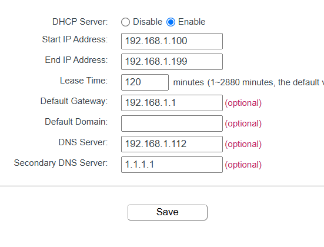

Please note that if you used to have another DNS service running on your router before changing it to your Pi-hole instance you will not see any queries for a while until the device reconnects (At least that is what happened with me).

Once everything is seup there are a few tools you should test your setup with:

1) The first of which is the `nslookup` command in linux, Mac and Windows. This will tell you the IP address of a website name (eg. `google.com`) and the DNS server who answered. The firse bit tells you the server IP address that responded to the DNS query. A similar tool can be found in google chrome but entering ` chrome://net-internals/#dns` the URL bar.


2) The secound is a [DNSSEC Resolver Test](https://wander.science/projects/dns/dnssec-resolver-test/). Just run it in your browser. If it is a sucess then everything is working correctly.

3) Lastly a [DNS leak test](https://www.dnsleaktest.com/) should be run to confirm that the only DNS server being used is the one on your computer. You can do this by running one of the tests in your browser. If the only IP address that appears is your own public IP address then it is likely everything is configured correctly.

An issue i encountered was the Unbound container logging some errors similar to `[1626249031] unbound[110586:0] warning: so-rcvbuf 1048576 was not granted. Got 425984. To fix: start with root permissions(linux) or sysctl bigger net.core.rmem_max(linux) or kern.ipc.maxsockbuf`.

To fix this i found some people discussing it on [Pi-hole github issues](https://github.com/pi-hole/docs/issues/539), and [a raspberry Pi Unbound docker issue](https://github.com/MatthewVance/unbound-docker-rpi/issues/4). The fix appears to be changing a parameter in the `/etc/sysctl.conf` file or running a command to change it temporarily. The fix instructions can be found bellow.

1) Login in to your server via SSH with a sudo enabled account.

2) Using a text editor (Nano in my example) open the file `/etc/sysctl.conf`.

3) Add the line `net.core.rmem_max=1048576`.

4) Save and exit the file (`CTRL+S`then`CTRL+X` for Nano)

5) Reboot the server or run the command `sysctl -w net.core.rmem_max=1048576`.

6) Relaunch the Pi-hole docker compose file (down then up)

That should fix the error message.

Another error that I encountered is a TCP error along the lines of `Connection error (127.0.0.1#5335): TCP connection failed (Connection refused)` in Pi-hole. As of the time of writing, this seems to be an on going issue in [Unbound](https://github.com/NLnetLabs/unbound/issues/1237) and [Pi-hole](https://github.com/pi-hole/pi-hole/issues/6079). It appears to be a Pi-hole issue and I would expect it to maybe, be fixed in a future version of the Unbound config file or Pi-hole version. Just make sure you use the most up to date version of each to try and avoid this issue. From reading the issue discussions it appears to not be a major issue and can be ignored.

### Basic Overview of Pi-hole

Before adding some ad lists we need to do a quick overview of the Pi-hole interface.

- On the home screen/ dashboard you will see:


- - The total client queries (clicking on it jumps you to the network tools page)
  
  - The total client queries block (Clicking on it jumps you to the query logs of everything that was blocked)
  
  - The Percentage client queries blocked (Clicking it jumps you to the query log)
  
  - Domains on your lists (Clicking on it jumps you to your lists setting page)
  
  - A chart of all the client queries over 24 hours. Details the amount and the upstream server type (Should mostly be localhost#5335 if you followed my steps.)
  
  - Client activity chart over 24 hours showing the amount of queries by IP address.
  
  - Bellow the charts you have two Pi charts on [Query types](https://en.m.wikipedia.org/wiki/List_of_DNS_record_types) and Upstream server usage.
  
  - Under the pi charts you have Lists of the:
    
    - Top permitted domains
    
    - Top Blocked domains
    
    - Top clients (total)
    
    - Top clients (Blocked only)

- The Next main page is the __Query log__. This page shows all the network queries that have been made to the Pi-hole instance. There are filtering tools if you are curious with specific things. 

- The next main page is the __Group management__ page. This is where you can make groups where you can assign specific block or allow lists to. For example, you could have a default group where you have all your block lists and a personal group with a reduced number of block lists. I will discuss this further in the Section Adding Lists (Block and White).


- __Client management__. This is where you can basically assign an IP address a name/ description and change the groups it is assigned to instead of that specific IP address assigned to the default group. This allows you to tailor your devices block lists (eg. child computer has more block lists than adult computer)


- __Domain Management__. This is where you can set whole domains (eg. google.com) to allow or block. I personally do not use this so i recommend doing your own research on it.


- __Subscribed Lists group Management__. This is where you add in you block/ allow lists and assign them to groups. I will discuss this in the Adding Lists (Block and White Section bellow)


- __Disable blocking__. This option on the left hand panel disables all block lists on your network. This can be very helpful when you are trying to determine if it is the service you are trying to reach with an issue or your Pi-hole instance blocking access for you. Various time lengths available.
- __Settings__. These pages are a collection of setting options. Note you can have Basic or Expert mode on. I do not understand many of these options and recommend you to do your own reasurch
  - System - Shows details on your system running Pi-hole like ip address.
  - DNS Settings - Should be configured in the docker YAML file already, you should see the Unbound 127.0.0.1#5335 field here.
  - DHCP - You can run a DHCP server from Pi-hole, unused in my use case.
  - Web interface/ API settings - Settings related to the web interface of Pi-hole
  - Privacy - Logging options. I log everything cause it helps with bug/ error finding but if you want to be very secure you should not log anything.
  - Teleporter - Import/ export Pi-hole config files to another instance.
  - Local DNS Records - Tell Pi-hole the domain name given to certain IP address. Useful if you want to call a device that only works from IP address by a name. I added my NAS host name as the domain name and attached it's static IP address.
  - All - See all setting above in one page.
- Tools - Some tools available in Pi-hole for updating and testing setup.
  - Pi-hole diagnosis - errors will appear here.
  - Tail log files - A viewer for the log files.
  - Update Gravity - A very important tool used to grab the most up to date date from the block/ allow lists you add. If you ever click the update button do not navigate away from the page until it is finished.
  - Search lists
  - Interfaces - shows the available interfaces on the Pi-hole instance.
  - Network - shows the First and last query made by different IP addresses.
- Donate - A link to the Pi-hole donate page. If you like this software and use it a lot you should consider donating to help fund development on Pi-hole updates and fixes.

### Adding lists (Block and White)

One of the biggest uses of Pi-hole is adding in lists of domains/ IP addresses that are blocked on your network.  I like to use the [Fire bog](https://firebog.net/) block lists.  This website contains links for lists with specific things like Ad lists, Tracking and Telemetry, etc. I will be adding the green lists to my Pi-hole instance under the default group. This lists can sometimes have false positives and block things you actually want. This will require some testing from yourself. There is a thread on Pi-hole about [commonly whitelisted domains](https://discourse.pi-hole.net/t/commonly-whitelisted-domains/212) which i recommend you have a read through.

 To add a list to Pi-hole, get a http link of a list (eg. https://adaway.org/hosts.txt ) go into the lists page from the left hand panel in pi hole. Paste the link into the address field, add a comment so you know what the list is about. And assign it to a specific group/s. Once completed click the add to block list/ add to allow list to add the lists. You have now successfully added a list. A tip is to highlight and copy all the links and paste it into Pi-hole instead of 1 by 1. This will give them all the same comment but that is fine for me at least.


Add as many lists as you see fit.

__Gravity Update:__

Once you have added all the lists you want. Go into `Tools > Update Gravity` and click the update button to pull the lists data into Pi-hole for usage. Once this button is clicked do not navigate away from the page as it will cause issues. Every once in a while you should come back and run and update gravity to be sure your lists are all up to date.


### Adding specific group/s to specific client

Sometimes you may want some device with less lists assigned to them or have certain white lists applied to them. We can accomplish this by adding a client via their IP address and adding specific groups to them.

First we may want to make a group for white listing certain domain for yourself. I have named mine `Eth_White`.


Next we have to add a client (please note the client must have a static IP address How i did it for this NAS can be found under the __Router static IP Address setup__ section under the OMV initial install.) For me I know my phone is `192.168.1.106`. Therefore, I will add that as a client in the client setting menu by selecting the IP address, giving it a name/ comment then assigning the Default group to it and the Eth_Whitelist group.

 

Now, any domains/ lists i add to my White lists will contain addresses that I can access on my phone but no other device will have access.

# Libre Speed Test

_09/06/2025_

Sometimes, you want to know the connection speed from your working computer to your server. This can help with debugging server networking issues or predicting roughly how long a file transfer could take. To do this i use a [Libre Speed](https://github.com/librespeed/speedtest), specifically the [Linuxserver.io docker image](https://docs.linuxserver.io/images/docker-librespeed/).

## Folder Creation

The first step is to setup the config folders for the container. I will first make a folder in the `local only content folder` space on the SSD. I will call it `LibreSpeed` for future reference.


Make sure to apply the change.

For the compose files we will need the absolute path. Mine is `/srv/dev-disk-by-uuid-00337ac1-aca8-4dc6-b5d7-dfaf50835ac5/SSD_Storage/Local_Only_Content/LibreSpeed`.

We are now ready to make our compose file.

## Compose file

I will be using the [Librespeed.io image](https://docs.linuxserver.io/images/docker-librespeed/#usage) for my container. In this image there is the option to use a `mysql` or `postgressql` database. I will be using the  default `sqlite` database. There are also custom configuration options which are beyond the scope of this tutorial.

The compose file we need to create requires the following properties.

- PUID and GUID of your docker user. You can find this under in the page `User Management > Users`.
  
  - PUID = 1000 for me
  
  - GUID = 100 for me

- Your time zone code. My is `Europe/London` see [TZ identifier table](https://en.wikipedia.org/wiki/List_of_tz_database_time_zones#List) for yours.

- A strong password (Use a password manager)

- The folder for the config files

My compose file minus the Password can be seen bellow:

```yaml
---
services:
  librespeed:
    image: lscr.io/linuxserver/librespeed:latest
    container_name: librespeed
    environment:
      - PUID=1000
      - PGID=100
      - TZ=Europe/London
      - PASSWORD=PASSWORD
    volumes:
      - /srv/dev-disk-by-uuid-00337ac1-aca8-4dc6-b5d7-dfaf50835ac5/SSD_Storage/Local_Only_Content/LibreSpeed:/config
    ports:
      - 2009:80
    restart: unless-stopped
```

Make sure you have your PUID and PGID numbers of your docker user. You can view these in the page `User Management > Users`.

## Launching, auto Backups and auto update container image

To launch the Libre Speed container, it will be the same as the previous containers in this guide. Navigate to `Services > Compose > Files`, select the container and select the up button. It will be an arrow pointing up in a circle.

A screen with log commands will appear. Close this when it is done and you will see that the status has changed from `Down` to `Up`. The container is now running.

If like me you have set custom ports it will also show the port numbers.

To automatically backup and update this container image, I will include it in the scheduled task i created for updating containers on reboot. I will navigate to `Services > Compose > Schedule` and click on the scheduled task that at reboot, updates and backups containers that it is filtered for. I will then click the pen like icon to edit the task.

Once in the interface you will manually need to type in the filter as the web UI does not make it easy to select multiple containers. It must be noted that all container names must not include spaces. My filter I have to type `Heimdall,Pi_Hole_Unbound,Libre_Speed,eth_urbackup,filebrowser` using commas (`,`) to separate out each container. You could also use `*` to do all containers but i do not as some later containers I add will update more frequently then only at reboot which happens once a month for me.

You can check this works by selecting the scheduled task and clicking the run button. A prompt will come up asking you to start the task. Start the task. Log text will appear and at the end will say done.

Now if you navigate to `Services > Compose > Restore` you should see all your containers backed up in the page.

## Using Libre Speed

Once the container is up and running, we can access the webpage at the address of our server with the port number we configured. For me I have `http://hpz240nas.local:2009/`. This brings us to the testing page, here we can start a test.


Once you hit the start button a network speed test between the device you are on and you server will start. The test will occur in the order:

1) Ping

2) Jitter

3) Download

4) Upload.


Once the test is complete you will be presented with your speed test results. It must be noted that your storage can become a bottle neck. I have mine setup in the SSD storage space. However, if i were to set it up in the HDD storage space i would expect slower speeds due to the HDD not being able to saturate my 1 gigabit link between my computer and the server.


### The speed test logs

Another feature of this container is saving log files of all the speed tests completed. This is where that password in the compose file is used. To access these log files you need to type: `http://<server host name or IP address>:<configured port number>/results/stats.php`. For me i have `http://hpz240nas.local:2009/results/stats.php`. You will first be brought to a login page. Use the password you set in the compose file.

Once login you are able to see the logs of all the speed tests done to your server. This can be useful for debugging network issues.


# Syncthing

It is important to sync important or working files between devices and to a external server so that files are automatically backed up when created. To sync important files between my computers, phones and servers like iCloud, One Drive, google drive etc. I will be using an open source alternative called [Syncthing](https://syncthing.net/). "Syncthing is a continuous file synchronization program. It synchronizes files between two or more computers in real time, safely protected from prying eyes"([From Syncthing website](https://syncthing.net/)).

I will be using this to primarily sync my password database between all my devices, working files between all my computers, photos from my phone/ computers to the server. There are many more uses of this software but this is my use case. I use this as an instantaneous backup solution as well as my traditional backup solution discussed in the URbackup section.

## Folder Creation

The first step is to setup the config folder for the container. I will first make a folder in the `local only content folder` space on the SSD. I will call it `Syncthing` for future reference.


Make sure to apply the change.

For the compose files we will need the absolute path. Mine is `/srv/dev-disk-by-uuid-00337ac1-aca8-4dc6-b5d7-dfaf50835ac5/SSD_Storage/Local_Only_Content/Syncthing`.

We will also need to know the absolute paths to our data folders. This container images allows two folders to be passed to it. There are likely ways to make more available but this guide will not go over it. I will use the data folders:

- `SSD_Storage` to be able to sync any files/folders to any location in the SSD space. Absolute path = `/srv/dev-disk-by-uuid-00337ac1-aca8-4dc6-b5d7-dfaf50835ac5/SSD_Storage`

- `HDD_Storage` to be able to sync any files/ folders to any location in the HDD space. Absolute path = `/Mass_Storage/HDD_Storage`

You can choose any two folders you like. This just makes sense for my use case.

We are now ready to make our compose file.

## Compose file

[Linuxserver.io](https://www.linuxserver.io/) has a [Syncthing docker image](https://docs.linuxserver.io/images/docker-syncthing/) which i will be using on the server.

The compose file we need to create requires the following properties.

- PUID and GUID of your docker user. You can find this under in the page `User Management > Users`.
  
  - PUID = 1000 for me
  
  - GUID = 100 for me

- Your time zone code. My is `Europe/London` see [TZ identifier table](https://en.wikipedia.org/wiki/List_of_tz_database_time_zones#List) for yours.

- The config folder location

- The two data folder locations.

My compose file can be found bellow:

```yaml
---
services:
  syncthing:
    image: lscr.io/linuxserver/syncthing:latest
    container_name: syncthing
    hostname: syncthing #optional
    environment:
      - PUID=1000
      - PGID=100
      - TZ=Europe/London
    volumes:
      - /srv/dev-disk-by-uuid-00337ac1-aca8-4dc6-b5d7-dfaf50835ac5/SSD_Storage/Local_Only_Content/Syncthing:/config
      - /srv/dev-disk-by-uuid-00337ac1-aca8-4dc6-b5d7-dfaf50835ac5/SSD_Storage:/data1
      - /Mass_Storage/HDD_Storage:/data2
    ports:
      - 2010:8384
      - 22000:22000/tcp
      - 22000:22000/udp
      - 21027:21027/udp
    restart: unless-stopped
```

I have changed the `8384` port number for the web UI to be more in line with my other containers. I have left the rest the same to keep the ports constant across all my devices and to leave the discovery functions working.

Take note of what is considered `data1` and `data2` as it will become more important later on.

## Launching, auto Backups and auto update container image

To launch the Syncthing container, it will be the same as the previous containers in this guide. Navigate to `Services > Compose > Files`, select the container and select the up button. It will be an arrow pointing up in a circle.

A screen with log commands will appear. Close this when it is done and you will see that the status has changed from `Down` to `Up`. The container is now running.

If like me you have set custom ports it will also show the port numbers.

To automatically backup and update this container image, I will include it in the scheduled task i created for updating containers on reboot. I will navigate to `Services > Compose > Schedule` and click on the scheduled task that at reboot, updates and backups containers that it is filtered for. I will then click the pen like icon to edit the task.

Once in the interface you will manually need to type in the filter as the web UI does not make it easy to select multiple containers. It must be noted that all container names must not include spaces. My filter I have to type `Heimdall,Pi_Hole_Unbound,Libre_Speed,syncthing,eth_urbackup,filebrowser` using commas (`,`) to separate out each container. You could also use `*` to do all containers but i do not as some later containers I add will update more frequently then only at reboot which happens once a month for me.

You can check this works by selecting the scheduled task and clicking the run button. A prompt will come up asking you to start the task. Start the task. Log text will appear and at the end will say done.

Now if you navigate to `Services > Compose > Restore` you should see all your containers backed up in the page.

## Syncthing Overview

Before we setup our Syncthing on devices like our phone, laptop or computer. Lets have a look at the Server side interface.

When we first access our web interface (mine at `http://hpz240nas.local:2010`) we will see the current status of of Syncthing instance and two prompts urging us to add an admin password to the interface.


I also urge you to setup a GUI login admin to stop any malicious users on your network.  We can do this through the settings panel.

To access the settings panel click on the actions button (gear like button) on the top right and click on the settings option. You will be taken to the settings panel specifically the general page. In this page you will be able to see:

- Your device a name

- Minimum Free Disk Space - please always have more than zero so that you do not completely fill the drive making you unable to write to log files.

- API key

- Usage reporting setting

- Automatic updates - as using docker can be ignored as you need to update docker image

- Default Configuration settings


The next page is the GUI settings. This is where you should set a strong admin password and a username of choice. You should not change listening address as this may break the container.


The next page is connections settings. Here you can set an incoming and/or outgoing data rate limit. You can also adjust network discovery settings like NAT traversal, Global discovery, Local Discovery and Relaying. For my use case, I disable all these settings as I give my devices the ZeroTier address or local address of the server/ device. For easier setup of new devices keeping these settings active is ideal as you will not have to tell your devices/ server where to find each other.


The final two pages are what folders or devices to ignore. I do this on a per client/ folder setup so I leave them blank.

There is an advanced settings panel available but this guide will not go over it. Do not change anything there unless you are an experienced user.

Once we have setup a admin login we can go back to the home page. In the home page we are presented with:

- The Instance Name (top left `HP_Z240_NAS` for me)

- The shared folders under "Folders"

- Language (top right)

- help drop down linking to Syncthing help areas (main page, form, documentation)

- Actions button showing your device ID code and QR code, settings and logs.

- Details on the device the instance is on:
  
  - Current download and upload rate
  
  - Local folders state
  
  - Listeners (the ports where the instance transmits/ receives data)
  
  - Discovery (connections to discovery servers if active)
  
  - Uptime (of instance)
  
  - Identification (device ID use to connect devices)
  
  - version

- Remote devices the the instance can connect to.


An example of what it may look like populated is bellow from my old server:


### Connected Remote device

[The Syncthing documentation](https://docs.syncthing.net/v1.29.7/intro/getting-started.html).

To connect a device we first must install Syncthing to an external device. You can find most downloads on the [Syncthing download page](https://syncthing.net/downloads/) note that there are not official android or iPhone apps at the time of writing. There are well made 3rd party apps for interfacing for Syncthing however. You can also use things like [winget](https://winget.run/pkg/SyncTrayzor/SyncTrayzor) for windows and [homebrew](https://formulae.brew.sh/formula/syncthing#default).

Once installed you will need the Device ID. You can find your device ID by clicking on the Identification link under the `This device` section or by clicking the actions button and selecting the show QR code button.

This device ID of you remote device will then be added to your server so remember it.

To add a remote device, click on the `Add Remote Device` button. You will be presented with a variety of settings:

In the General tab:

- Input the device ID

- And give the Remote Device a name. Preferably the one you gave it in the Syncthing GUI on the device.

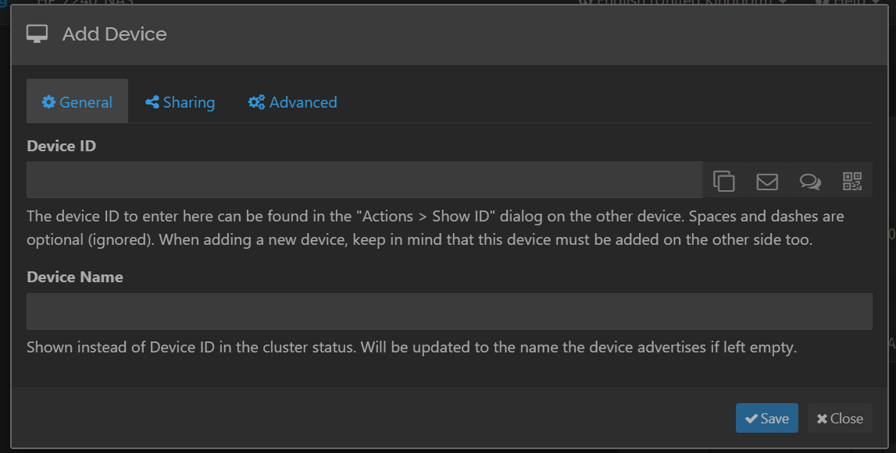

The sharing tab is where you make options related to the shared folder that gets shared with the remote device. You can setup if auto accept if you like but i will not.


Lastly the advanced tab is where you can:

- Provide the ip address of your device (leave as dynamic if using discovery)

- Adjust connection settings

- Setup untrusted folders

- Adjust compression settings

- Adjust data rates.


Once a remote device is added we are able to add a folder to our server.

Make sure to accept the remote connection.

### Adding a folder

To add a folder to share to a remote device you first need to add a folder to your instance. Click on the add folder button under the Shared folders section in the GUI. You will be presented with a variety of settings.

In the General tab you will be able to:

- label the folder in the GUI

- Adjust the folder ID

- Adjust the folder path.  For the instance we have setup on our server make sure to start with `/data1` or `/data2` to access the right folder we setup in the compose file.


In the sharing tab we are able to adjust which connected devices we are able to share the folder to. We will need to configure this device once it is all confirmed.  

In the File Versioning tab we are able to enable and adjust settings related to the file versioning method. Please read the [Syncthing documentation section](https://docs.syncthing.net/v1.29.7/users/versioning.html) on this to choose what is best for you. The basic overview is:

- Rubbish bin = File is placed in `.stversions` folder when deleted overwriting the file in it if it shares the same name.

- Simple = Same as rubbish bin but you are able to configure how many versions to keep and how often it checks for version count over set cap.

- Staggered = Same as simple but in set time frames instead of in all time.

- External = use of an external command of what to do.


In ignoring patterns, we are able to change what folders/files are ignored in syncing.


In advanced we are able to:

- Set notifications

- Define the folder type
  
  - Send & Receive - Device and remote are able to send data back and forth
  
  - Send Only - Device is only able to send data it will not receive anything
  
  - Receive Only - Device will only be able to receive data from

- Minimum free disk space (folder specific)

- Full rescan Interval

- File pull order adjustment

- Ignoring permissions possible

- Ownership adjustment settings

- Extended attributes adjustment


Now that we have created our folder. We are able to add it to the remote device. For a sake of example i have added a shared folder to my Windows PC and have shared it with the NAS.

When we go to the device we have just added a shared folder to (NAS in example case) we must set the folder path for the shared folder to be added.

You have now shared a folder between devices and are using Syncthing. A tip for the HDD space or folders that do not change often is to set the scanning interval very high to reduce on time of the HDDs and compute time of each device.

# Photo Prism Photos App

All of my pictures from my families computers and phones get synced to this server. To view them i like to use [Photo Prism](https://www.photoprism.app/) a web UI to view and organize your photos. This app does have some limitations which will mean i setup two different instances. One for my family (`photoprism_fam`) and one for myself to help separate personal photos from family ones. This app does use [web dav](https://docs.photoprism.app/user-guide/sync/webdav/) to upload/ sync files from your device to you instance but i just sync all my files to my server using Syncthing instead. There is a downloadable plugin to run Photo Prism on Open Media Vault. I however prefer to manage it through docker.

## Folder Creation

The first step is to setup a few folders for the database and the config files of the container. These should run on fast storage. I will first make two folders in the `local only content folder` space on the SSD. I will call them `Photo_Prism_Eth`  and `Maria_DB_Photo_Eth` for future reference.


The `Eth` part is due to me wanted to run two instances. The `Photo_Prism` part is for the photo prism container and the `Maria_DB` part is for the Maria data base  container required for photo prism.

The last folder we need to define is the Originals folder. I have previously defined mine when i synced all my photos using Syncthing. I have defined the file path in the bullet points bellow. This is on my HDD space due to not requiring high speed data access or transfer.

For the compose files we will need the absolute paths for the database and the config folders/files. This can be found by looking at the absolute paths of the shared folders in the web GUI.

For me I have:

- `Photo_Prism_Eth` = `/srv/dev-disk-by-uuid-00337ac1-aca8-4dc6-b5d7-dfaf50835ac5/SSD_Storage/Local_Only_Content/Photo_Prism_Eth`

- `Maria_DB_Photo_Eth` = `/srv/dev-disk-by-uuid-00337ac1-aca8-4dc6-b5d7-dfaf50835ac5/SSD_Storage/Local_Only_Content/Maria_DB_Photo_Eth`

- Originals Folder = `/Mass_Storage/HDD_Storage/Remote_Content_HDD/Ethan_Files/Eth_Pics`

We are now ready to start putting together our compose file.

## Compose File

Photo Prism provides a docker compose file and instructions in the [Photo Prism Docker Compose documentation page](https://docs.photoprism.app/getting-started/docker-compose/#__tabbed_1_1) This [compose file](https://dl.photoprism.app/docker/compose.yaml) is the base template that needs to be adjusted depending on your use case. There are a variety of [config options](https://docs.photoprism.app/getting-started/config-options/) that maybe relevant to you so have a read of it.

The most important fields for me will be detailed in the bullet points bellow:

- `restart: unless-stopped` You may want this disabled at first for bug testing purposes and you will want to enable it once all the bugs have been removed.

- `Depends_on: mariadb` this line is very important to tell the server that it needs the Maria DB container being run which is part of the compose file we are writing.

- `Ports:` you may want to change the default port of 2342 that photo prism uses like me but if it is not being used by the host OS you can leave it as is.

- `PHOTOPRISM_ADMIN_USER`/`_PASSWORD` make sure you change this to something secure through something like a password manager.

- `PHOTOPRISM_SITE_URL` Change to match what you want/ have

- `PHOTOPRISM_Originals_LIMIT` May want to change (increase) if you have very large files. default should be good enough for most people however.

- `PHOTOPRISM_READONLY` I have set this to `true` as i do not want the files being modified in the originals folder. This does lead to reduced functionality by not allowing you to use the upload files button in the UI or through the Web Dav functions but, it avoids potential deletion of my files. I also have alternatives to this that i will use.

- `PHOTOPRISM_DISABLE_WEBDAV` I have set this to true as i will not be using any of the web Dav features. You however can change this if you wish to use theses features.

- Disabling features, i do not disable any features beside the web Dav one as i want the face detection and classification to run on my photos.

- `Backup` options. I changed the backup database to weekly as i do not add that many photos on a daily basis. It is in cron format so could be more specific but weekly is frequent enough for me.

- `PHOTOPRISM_INDEX_SCHEDULE` photo prism needs to index all the images before they are visible. By default you have to do this manually. You can however make it run as little or often as you like automatically. I run it weekly so that new photos get indexed by the time i next look through photo prism.

- Database options: 
  
  - You can change the driver to SQL lite which makes the compose file simpler but your instance will not be as performant or scalable to multiple users.  I recommend staying with the recommended MariaDB
  
  - The database server make sure it it the ip/ host name of your system and the port you will specify for your database.
  
  - change the name of your data base if multiple instances will be used.
  
  - Make a secure password that matches the one you gave to the data base portion of the compose file. Use a password manager.

- Using hardware/ software transcoding [doc page](https://docs.photoprism.app/getting-started/advanced/transcoding/).
  
  - there are a few options to use hardware/ software video transcoding. This will reduce network load on your system as the transferred files will be smaller.
  
  - I specifically have an Intel CPU with QSV (Quick Sync video [Intel® Xeon® Processor E3-1245 v5](https://www.intel.com/content/www/us/en/products/sku/88173/intel-xeon-processor-e31245-v5-8m-cache-3-50-ghz/specifications.html)) which means i can use my in built in GPU on the CPU to help encode.
  
  - I would recommend using this if you have a compatible device. As of the time of writing. There appears to be only a few options:
    
    - Intel
    
    - Nvidia
    
    - raspberry pi
    
    - Mac
    
    - software
  
  - There is also a software version available but that puts a lot of load on your CPU which may hard performance of other containers/ tasks on your NAS.
  
  - I recommend having a read of it and make your own decision on it.

- Volumes: This is where you use the absolute paths we found/ setup in the folder setup section. You can add additional original folders instead of just one but i have mine setup in a way where i have it all in one folder. This also applies to the volume set for the MARIA DB container section of the compose file.

- Make sure you change your database name if relevant to you

- Make sure the user and password for the user matches that set in the photo prism environment section.

- Set a strong Maria DB root password using a root password.

- I have removed the watchtower integration for auto updates as i run my own solution but if you want that have a read on it.

My full compose file (ignoring actual passwords) is as follows:

```yaml
services:
  photoprism_eth:
    image: photoprism/photoprism:latest
    restart: unless-stopped
    stop_grace_period: 10s
    depends_on:
      - mariadb_Photo_Eth
    security_opt:
      - seccomp:unconfined
      - apparmor:unconfined
    ports:
      - "2011:2342"
    environment:
      PHOTOPRISM_ADMIN_USER: "admin"                 # admin login username
      PHOTOPRISM_ADMIN_PASSWORD: "insecure"          # initial admin password (8-72 characters)
      PHOTOPRISM_AUTH_MODE: "password"               # authentication mode (public, password)
      PHOTOPRISM_SITE_URL: "http://hpz240nas.local:2011/"  # server URL in the format "http(s)://domain.name(:port)/(path)"
      PHOTOPRISM_DISABLE_TLS: "false"                # disables HTTPS/TLS even if the site URL starts with https:// and a certificate is available
      PHOTOPRISM_DEFAULT_TLS: "true"                 # defaults to a self-signed HTTPS/TLS certificate if no other certificate is available
      PHOTOPRISM_ORIGINALS_LIMIT: 5000               # file size limit for originals in MB (increase for high-res video)
      PHOTOPRISM_HTTP_COMPRESSION: "gzip"            # improves transfer speed and bandwidth utilization (none or gzip)
      PHOTOPRISM_LOG_LEVEL: "info"                   # log level: trace, debug, info, warning, or error
      PHOTOPRISM_READONLY: "true"                   # do not modify originals directory (reduced functionality)
      PHOTOPRISM_EXPERIMENTAL: "false"               # enables experimental features
      PHOTOPRISM_DISABLE_CHOWN: "false"              # disables updating storage permissions via chmod and chown on startup
      PHOTOPRISM_DISABLE_WEBDAV: "true"            # disables built-in WebDAV server
      PHOTOPRISM_DISABLE_SETTINGS: "false"           # disables settings UI and API
      PHOTOPRISM_DISABLE_TENSORFLOW: "false"         # disables all features depending on TensorFlow
      PHOTOPRISM_DISABLE_FACES: "false"              # disables face detection and recognition (requires TensorFlow)
      PHOTOPRISM_DISABLE_CLASSIFICATION: "false"     # disables image classification (requires TensorFlow)
      PHOTOPRISM_DISABLE_VECTORS: "false"            # disables vector graphics support
      PHOTOPRISM_DISABLE_RAW: "false"                # disables indexing and conversion of RAW images
      PHOTOPRISM_RAW_PRESETS: "false"                # enables applying user presets when converting RAW images (reduces performance)
      PHOTOPRISM_SIDECAR_YAML: "true"                # creates YAML sidecar files to back up picture metadata
      PHOTOPRISM_BACKUP_ALBUMS: "true"               # creates YAML files to back up album metadata
      PHOTOPRISM_BACKUP_DATABASE: "true"             # creates regular backups based on the configured schedule
      PHOTOPRISM_BACKUP_SCHEDULE: "weekly"            # backup SCHEDULE in cron format (e.g. "0 12 * * *" for daily at noon) or at a random time (daily, weekly)
      PHOTOPRISM_INDEX_SCHEDULE: "weekly"                  # indexing SCHEDULE in cron format (e.g. "@every 3h" for every 3 hours; "" to disable)
      PHOTOPRISM_AUTO_INDEX: 300                     # delay before automatically indexing files in SECONDS when uploading via WebDAV (-1 to disable)
      PHOTOPRISM_AUTO_IMPORT: -1                     # delay before automatically importing files in SECONDS when uploading via WebDAV (-1 to disable)
      PHOTOPRISM_DETECT_NSFW: "false"                # automatically flags photos as private that MAY be offensive (requires TensorFlow)
      PHOTOPRISM_UPLOAD_NSFW: "true"                 # allows uploads that MAY be offensive (no effect without TensorFlow)
      PHOTOPRISM_UPLOAD_ALLOW: ""                    # restricts uploads to these file types (comma-separated list of EXTENSIONS; leave blank to allow all)
      PHOTOPRISM_UPLOAD_ARCHIVES: "true"             # allows upload of zip archives (will be extracted before import)
      # PHOTOPRISM_DATABASE_DRIVER: "sqlite"         # SQLite is an embedded database that does not require a separate database server
      PHOTOPRISM_DATABASE_DRIVER: "mysql"            # MariaDB 10.5.12+ (MySQL successor) offers significantly better performance compared to SQLite
      PHOTOPRISM_DATABASE_SERVER: "mariadb_Photo_Eth:3306"     # MariaDB database server (hostname:port)
      PHOTOPRISM_DATABASE_NAME: "photoprism_eth"         # MariaDB database, see MARIADB_DATABASE in the mariadb service
      PHOTOPRISM_DATABASE_USER: "photoprism"         # MariaDB database username, must be the same as MARIADB_USER
      PHOTOPRISM_DATABASE_PASSWORD: "insecure"       # MariaDB database password, must be the same as MARIADB_PASSWORD
      PHOTOPRISM_SITE_CAPTION: "AI-Powered Photos App"
      PHOTOPRISM_SITE_DESCRIPTION: ""                # meta site description
      PHOTOPRISM_SITE_AUTHOR: ""                     # meta site author
      PHOTOPRISM_INIT: "intel"            # common options: update https tensorflow tensorflow-gpu intel gpu davfs
      ## Video Transcoding (https://docs.photoprism.app/getting-started/advanced/transcoding/):
      PHOTOPRISM_FFMPEG_ENCODER: "intel"        # H.264/AVC encoder (software, intel, nvidia, apple, raspberry, or vaapi)
      PHOTOPRISM_FFMPEG_SIZE: "3840"               # video size limit in pixels (720-7680) (default: 3840)
      PHOTOPRISM_FFMPEG_BITRATE: "32"              # video bitrate limit in Mbps (default: 60)
      ## Run as a non-root user after initialization (supported: 0, 33, 50-99, 500-600, and 900-1200):
      PHOTOPRISM_UID: 1000
      PHOTOPRISM_GID: 100
      # PHOTOPRISM_UMASK: 0000
    ## Share hardware devices with FFmpeg and TensorFlow (optional):
    devices:
      - "/dev/dri:/dev/dri"                         # Intel QSV
    #  - "/dev/nvidia0:/dev/nvidia0"                 # Nvidia CUDA
    #  - "/dev/nvidiactl:/dev/nvidiactl"
    #  - "/dev/nvidia-modeset:/dev/nvidia-modeset"
    #  - "/dev/nvidia-nvswitchctl:/dev/nvidia-nvswitchctl"
    #  - "/dev/nvidia-uvm:/dev/nvidia-uvm"
    #  - "/dev/nvidia-uvm-tools:/dev/nvidia-uvm-tools"
    #  - "/dev/video11:/dev/video11"                 # Video4Linux Video Encode Device (h264_v4l2m2m)
    working_dir: "/photoprism" # do not change or remove
    ## Storage Folders: "~" is a shortcut for your home directory, "." for the current directory
    volumes:
      # "/host/folder:/photoprism/folder"                # Example
      - "/Mass_Storage/HDD_Storage/Remote_Content_HDD/Ethan_Files/Eth_Pics:/photoprism/originals"               # Original media files (DO NOT REMOVE)
      # - "/example/family:/photoprism/originals/family" # *Additional* media folders can be mounted like this
      # - "~/Import:/photoprism/import"                  # *Optional* base folder from which files can be imported to originals
      - "/srv/dev-disk-by-uuid-00337ac1-aca8-4dc6-b5d7-dfaf50835ac5/SSD_Storage/Local_Only_Content/Photo_Prism_Eth:/photoprism/storage"                  # *Writable* storage folder for cache, database, and sidecar files (DO NOT REMOVE)

  ## MariaDB Database Server (recommended)
  ## see https://docs.photoprism.app/getting-started/faq/#should-i-use-sqlite-mariadb-or-mysql
  mariadb_Photo_Eth:
    image: mariadb:11
    ## If MariaDB gets stuck in a restart loop, this points to a memory or filesystem issue:
    ## https://docs.photoprism.app/getting-started/troubleshooting/#fatal-server-errors
    restart: unless-stopped
    stop_grace_period: 5s
    security_opt: # see https://github.com/MariaDB/mariadb-docker/issues/434#issuecomment-1136151239
      - seccomp:unconfined
      - apparmor:unconfined
    command: --innodb-buffer-pool-size=512M --transaction-isolation=READ-COMMITTED --character-set-server=utf8mb4 --collation-server=utf8mb4_unicode_ci --max-connections=512 --innodb-rollback-on-timeout=OFF --innodb-lock-wait-timeout=120
    ## Never store database files on an unreliable device such as a USB flash drive, an SD card, or a shared network folder:
    volumes:
      - "/srv/dev-disk-by-uuid-00337ac1-aca8-4dc6-b5d7-dfaf50835ac5/SSD_Storage/Local_Only_Content/Maria_DB_Photo_Eth:/var/lib/mysql" # DO NOT REMOVE
    environment:
      MARIADB_AUTO_UPGRADE: "1"
      MARIADB_INITDB_SKIP_TZINFO: "1"
      MARIADB_DATABASE: "photoprism_eth"
      MARIADB_USER: "photoprism"
      MARIADB_PASSWORD: "insecure"
      MARIADB_ROOT_PASSWORD: "insecure"
```

The container is now ready to be deployed.

For a second instance like me make sure you change the folder paths, names and ports of everything to something different/ the target folders. 

## Launching, auto Backups and auto update container image

To launch the Photo Prism container, it will be the same as the previous containers in this guide. Navigate to `Services > Compose > Files`, select the container and select the up button. It will be an arrow pointing up in a circle.

A screen with log commands will appear. Close this when it is done and you will see that the status has changed from `Down` to `Up`. The container is now running.

If like me you have set custom ports it will also show the port numbers.

To automatically backup and update this container image, I will include it in the scheduled task i created for updating containers on reboot. I will navigate to `Services > Compose > Schedule` and click on the scheduled task that at reboot, updates and backups containers that it is filtered for. I will then click the pen like icon to edit the task.

Once in the interface you will manually need to type in the filter as the web UI does not make it easy to select multiple containers. It must be noted that all container names must not include spaces. My filter I have to type `Heimdall,Pi_Hole_Unbound,Libre_Speed,syncthing,PhotoPrism_eth,eth_urbackup,filebrowser` using commas (`,`) to separate out each container. You could also use `*` to do all containers but i do not as some later containers I add will update more frequently then only at reboot which happens once a month for me.

You can check this works by selecting the scheduled task and clicking the run button. A prompt will come up asking you to start the task. Start the task. Log text will appear and at the end will say done.

Now if you navigate to `Services > Compose > Restore` you should see all your containers backed up in the page.

## Photo Prism Overview

When you first login to your Photo Prism instance, you will not see anything in any of the categories.


You will need to first index all your photos. This takes up a lot of compute and can take a long time to complete. I recommend running it over night and coming back to it.

To do this, navigate to the Library option on the left hand panel. In here you will see the Index sub panel and the Logs sub panel.  The logs sub panel is as explained and shows all the logs from indexing operations. The first index page is the more important one to look at. In this page you can choose to index all the files in the originals folder set or you could select specific folders. We can also choose to do a complete rescan (useful when cleaning up files) or just new files. Click the start button when ready to index everything.


For privacy reasons i will not be using images of my own instance thank you to the Photo Prism team for their [demo page](https://demo.photoprism.app) which these have been taken from. Once everything has been indexed you will see that on the left hand panel there will be all your photos in the search panel like the image bellow. You will also notice in the  left hand panel different categories with different numbers.


The next page is the album page. You are able to make custom albums comprising or specific folders/ images on your instance. This is useful if you want to collect certain types of images together for example a project.


The next page is the media page. This is basically like the search page but for only video like content.


The page after than is the people page. This is the most important page for me. This page is the collection of the all faces detected and the pictures/ videos that contain them. You have two pages. One of named faces that you define and one of faces detected that are not named. This is great if you are looking for pictures of a particular individual.


After that you have a page of you favorite media which you have defined using the star next to any piece of media you come across.


The next page is places. Any geotagged image will be placed on a map which you can navigate and look around in.


The next page is the calendar page where the date time of the media file is used to organize it by date.


The next two pages named Moments and Labels are very similar. They attempt to group images together with a common theme like. This is things like nature a region in a specific year, etc.


The last important page is the folders page. This page is the folders in your originals folder.


